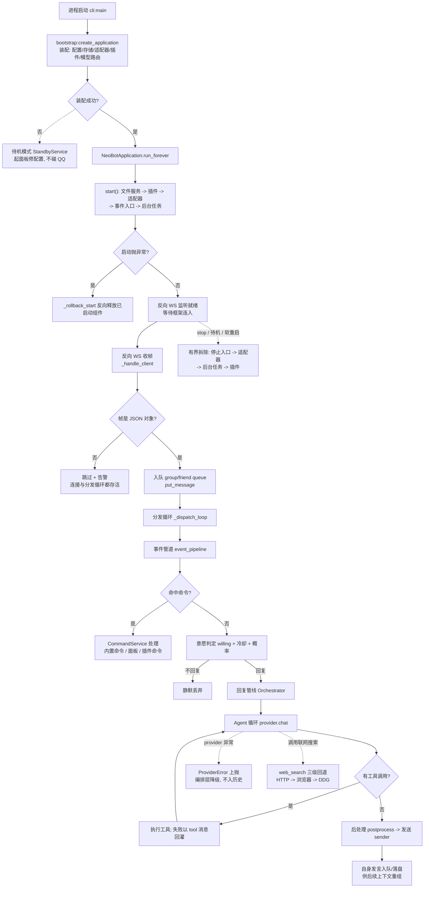
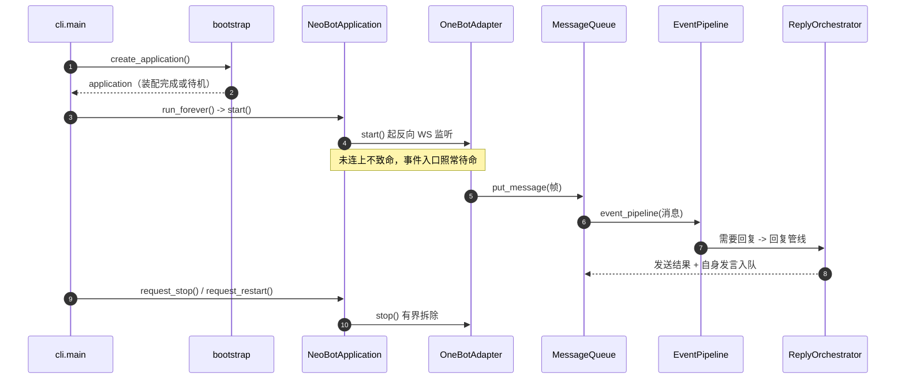

# 00 全局视图：进程启动 -> 入站 -> 处理 -> 出站 -> 停机

## 范围

这是**跨模块的一张总图**：从 `cli.main` 装配进程，到一条 QQ 消息进来、被判定、走回复管线、
把结果发出去，最后遇到停机信号如何有界拆除。单模块细节不在这张图里，分别见：

* 启动装配与停机细分 -> `01-startup-shutdown.md`
* 适配器入站与队列 -> `02-inbound-message.md`
* 回复管线状态机与看门狗 -> `03-reply-pipeline.md`
* Agent 循环与工具迭代 -> `04-agent-loop.md`
* 模型路由与降级计费 -> `05-llm-routing.md`
* 联网搜索三级回退 -> `10-web-search.md`

## 流程

## 时序

## 细节

> 下面每一块都是**默认折叠**的细节图：主链路看不懂时再展开。折叠块用 Markdown 的
> \`
\` + \`### 小节\` 写法，GitHub 上同样可折叠，本地查看器会渲染成可点击卡片。

### 装配顺序：create_application 里谁先谁后

\`\`\`mermaid
flowchart LR
    A["loguru / logger_factory"] --> B["config: _load_config_for_reuse"]
    B --> C["sync_data_files + sync_default_prompts"]
    C --> D["PromptStore / ChatFlowRegistry / SleepService / StandbyService"]
    D --> E{"_REUSE_ENABLED ?"}
    E -- 是 --> F["_reuse_or 复用上一代实例"]
    E -- 否 --> G["全部新建"]
    F --> H["storage: _engine + uow_factory"]
    G --> H
    H --> I["usage / billing / AvatarStore"]
    I --> J["build_message_queues -> group_queue, friend_queue"]
    J --> K["adapter + HotReloadRegistry(AdapterSupervisor)"]
    K --> L["memory / vision_provider / main provider"]
    L --> M["emoji / file_server / 运行时组件 / sandbox"]
    M --> N["commands / skills / 插件宿主"]
    N --> O["ReplyOrchestrator + 各 manager.set_orchestrator"]
    O --> P["build_pipelines_and_app -> NeoBotApplication"]
\`\`\`

顺序就是生效顺序：**存储先于业务**、**适配器先于管线**，因为入站事件一旦开始流动，
下游组件必须已经就绪（\`bootstrap/__init__.py:655 create_application\`）。

### 启动顺序：NeoBotApplication.start 的 13 步

\`\`\`mermaid
flowchart TD
    S1["file_server.start"] --> S2["tts.initialize"]
    S2 --> S3["plugin.load_registered"]
    S3 --> S4["adapter.start 反向 WS 开始监听"]
    S4 --> S5["connection_probe.observe 最多 30s, 永不抛"]
    S5 --> S6["bot_detector.refresh"]
    S6 --> S7["plugin.start_all"]
    S7 --> S8["chat_stream.initialize"]
    S8 --> S9["emoji.start"]
    S9 --> S10["background_coros: sleep ticker / help 预渲染 / 沙箱维护"]
    S10 --> S11["browser_lifecycle.start"]
    S11 --> S12["event_ingress.start 事件入口开通"]
    S12 --> S13["scheduled_task_manager / markdown_image / report 循环"]
    S13 --> OK["_started = True"]
    S0 -.standalone 路径.-> S3
    S1 -.任一步抛异常.-> RB["_rollback_start(started) 反向释放"]
\`\`\`

注意 \`started.append(...)\` 的顺序就是回滚顺序的逆序：回滚只释放**已经成功启动**的组件，
半启动状态不会留在内存里（\`runtime/application.py:138\`）。

### 入站收帧：AdapterCore._handle_client 的两道守卫

\`\`\`mermaid
flowchart TD
    A["websockets.serve 回调 _handle_client"] --> B["加入 active_connections + 置 _connection_established 闩锁"]
    B --> C["async for message in websocket"]
    C --> D{"json.loads 成功?"}
    D -- 否 --> D1["告警 + continue 连接不死"]
    D -- 是 --> E{"isinstance(data, dict)?"}
    E -- 否 --> E1["告警 + continue 数组/字符串帧不再打死分发循环"]
    E -- 是 --> F{"data 里有 echo 字段?"}
    F -- 是 --> G["_fulfill_echo 幂等兑现回执"]
    F -- 否 --> H["_handle_event"]
    H --> I{"第二道 dict 守卫"}
    I -- 否 --> I1["丢弃"]
    I -- 是 --> J["message_queue.put_nowait（满则丢弃并打印）"]
    J --> K["_handle_meta_event 心跳等"]
\`\`\`

闩锁（\`_connection_established\`）与活跃连接集合是**两条独立判据**：
\`wait_for_connection\` 必须两者同时成立，只看闩锁会把「刚断开」误报成「已连接」
（\`packages/adapter/src/neobot_adapter/onebot/receiver/core.py:155\`）。

### 事件入口：EventGateway 订阅 -> EventPipeline 分派

\`\`\`mermaid
flowchart TD
    A["adapter._dispatch_loop 取队列"] --> B["EventDispatcher.publish 按 priority 派发"]
    B --> C["EventGateway.handle 组装 EventContext"]
    C --> D["hook_bus.dispatch 插件钩子（异常只记日志）"]
    D --> E{"ctx.consumed ?"}
    E -- 是 --> E1["插件已接管, 到此为止"]
    E -- 否 --> F{"post_type"}
    F -- message --> G["EventPipeline.handle_*_message_event"]
    F -- notice --> H["NoticeHandler.handle 撤回/表情回应/戳一戳"]
    F -- request --> I["OneBotRequestHandler.handle"]
    F -- meta_event --> J["LifecycleHandler.handle 心跳/生命周期"]
    G --> K["去重 -> 工具输入短路 -> 命令 -> 入队 -> 画像 -> 意愿"]
\`\`\`

订阅只有 \`EventGateway.start\` 一处（\`runtime/gateway.py:51\`），
\`EventPipeline\` 不再自订阅 —— 曾经两处都订阅导致同一事件被处理两次（\`event_pipeline.py:130\`）。

### 别把「队列」当成分发器

\`\`\`mermaid
flowchart LR
    subgraph 真实结构
      A["OneBotAdapter._dispatch_loop adapter.py:384"] --> B["MessageQueue 纯数据结构, 按 queue_key 分桶"]
      B --> C["EventPipeline 消费"]
    end
    subgraph 常见误解
      X["以为 queue.py 里有 _dispatch_loop"] -.-> Y["queue.py:115 只有 MessageQueue 没有循环、没有异常保护"]
    end
\`\`\`

\`app/src/neobot_app/message/queue.py\` 只负责容量、权重、时间戳与渲染成文本；
**分发循环在适配器包内**（\`packages/adapter/src/neobot_adapter/onebot/adapter.py:384\`），
异常保护也在那里（单个事件处理失败只记 ERROR 并继续）。
另有一个线程版 \`listener/manager.py:246 _dispatch_loop\` 是**遗留实现**，现行适配器不引用。

### 停机与软重启：有界拆除

\`\`\`mermaid
flowchart TD
    A["SIGINT/SIGTERM 或面板/命令 (面板退出走核心 process_stop 信号)"] --> B{"是软重启?"}
    B -- 否 --> C["request_stop -> _shutdown_event.set"]
    B -- 是 --> D["request_restart -> 额外置 _restart_requested"]
    C --> E["run_forever 退出 -> stop()"]
    D --> E
    E --> F["_stop_components 逐个 shield 执行"]
    F --> G["self_heal/problem_solver/report 先停"]
    G --> H["event_ingress.stop 关入口"]
    H --> I["reply_orchestrator.shutdown 取消在途回复"]
    I --> J["flush_pending_summaries 落摘要"]
    J --> K["plugin stop_all -> adapter stop(12s 先报错, 再 shield 等)"]
    K --> L["tts / file_server / engine.dispose"]
    L --> M{"restart_requested ?"}
    M -- 是 --> N["cli.cmd_run: os.execv 原地换进程"]
    M -- 否 --> O["进程正常退出"]
\`\`\`

超时只用于**报告**：\`_drain_shutdown_task\` 打印「仍在等待、不会启动新进程」后继续 shield 等，
取消不等于停止（\`cli.py:131\`、\`application.py:535\`）。
两个**核心持有的信号**并列：`process_restart`（换一代运行时）与 `process_stop`（让进程退出，后加）。
面板的 `POST /api/admin/shutdown` 走后者 —— 只接受本机来源并要求管理权限，请求立即返回，
调用方须按进程存活轮询。`cli.py` 的 `stop_watcher` 收到后调用的仍是 `request_stop()`，
**与 SIGINT/SIGTERM 同一个汇点**，所以上面这条停机顺序不受入口影响。

## 关键状态

| 状态 | 谁置位 | 谁清理 | 失败时停在哪 |
|---|---|---|---|
| 应用已启动 `_started` | `NeoBotApplication.start()` | `stop()` / `dispose()` | 启动异常 -> `_rollback_start` 反向释放，`_started=False` |
| 关闭事件 `_shutdown_event` | `request_stop()` / `request_restart()` | `start()`（非重启时 clear） | 超时只打印报告，绝不提前 exec 新进程 |
| 待机模式 `StandbyService` | 配置缺失 `_CONFIG_ERROR` 或面板按钮 | 面板/命令恢复运行 | 待机时只留面板与命令，运行时不启动 |
| 适配器连接 | 收到首个框架连接 | 停止/重建/线程收尾 | 探针只观察不致命，面板与管线照常启动 |
| 回复管线状态机 | 事件管道 | 发送完成/取消/失败 | 终态 COMPLETED / FAILED / CANCELLED 无出边 |

## 易错点

* **入站帧必须先判 `dict`**：数组/字符串帧若直接入队会打死分发循环（见 `fix(13)`）；
  连接存活与分发循环存活是两条独立判据，别只看其中一条。
* **适配器没连上不代表启动失败**：`start()` 里连接探针只观察不致命，启动流程与面板不因
  「框架还没连上」被回滚。
* **provider 异常不再降级成 assistant 文本**：历史里不能出现 `Error: ...`
  （见 `fix(12) §4.2`），失败要在编排层显式处理。
* **自身发言必须入队**：否则管线重组后丢失，表现为重复回复（见 `fix(2)`）。
* **停机超时是报告，不是许可**：`_drain_shutdown_task` 超时只提示，不会提前启动新进程。
* 本图只画主链路；搜索回退、记忆摘要、插件热重载等分支各自有专图，改动时请落到对应文件。
