# 01 启动装配 / 停机 / 软重启 / 待机

## 范围

这张图回答四个问题：**进程怎么起来**（CLI 入口 + 装配顺序）、**每一步失败停在哪**
（启动 13 步 + 回滚清单）、**怎么在不换进程的前提换一代运行时**（待机 + 软重启），
**怎么停才算停**（停机顺序与「超时只是报告」）。

覆盖：`cli.py` 的入口/信号/入口循环、`bootstrap.create_application` 的装配顺序与
核心对象复用、`app/src/neobot_app/bootstrap/_pipeline.py` 的管线与应用组装、
`NeoBotApplication.start/stop`、`ConnectionReadinessProbe`、
`StandbyService` 状态机、`StandbyController` 代际编排、`ProcessRestartSignal`、
`AdapterSupervisor` 监听热重载。

**不画**（各自成图，避免重复）：

* 配置加载/校验/热重载分类本身 → `01b-config-system.md`（待补）
* 入站收帧与队列 → `02-inbound-message.md`；事件网关之后的分派 → `02c-event-pipeline.md`（待补）
* 插件运行时的 `load_registered/start_all` 内部 → `08b-plugin-runtime.md`（待补）
* 面板路由与鉴权 → `09-dashboard.md`（待补）；QQ 命令表 → `17-commands.md`（待补）

**核对时发现的、与直觉或历史记录不符的事实（先读这条再看图）**：

1. **待机期 QQ 命令不可达**。待机的唯一动作是 `NeoBotApplication.stop()`，而
   `_stop_components` **无条件**执行 `event_ingress.stop`
   （`runtime/application.py:457`）；`EventGateway.stop` 会把四个订阅全部退订
   （`runtime/gateway.py:63`）。订阅没了，框架连得再稳也到不了命令服务。于是
   `standby_service.py:274` 的「面板与命令仍可用，/reboot 可软重启运行」与
   `bugfixes/README.md` 里 fix(3) 的「已修复，待真机验证」在 `dfe5416` 上**都不成立**：
   保留入站通道的实现（`retain_ingress`）只在分支 `feat/wip-followups`
   （commit 921cb5b，2026-09-16）上，**不是 HEAD 的祖先**。当前待机只能从面板
   `POST /api/admin/reboot` 恢复。
2. `StandbyController.request_process_restart`（`_standby_runtime.py:285`）除测试外
   **没有任何生产调用方** —— 它不是进程重启入口，真正的入口是宿主服务 `process_restart`
   （面板 `/api/admin/restart` 直接拿它）。
3. `ConnectionTimeoutError`（`runtime/application.py:27`）**已不再被抛出**，
   只保留类型兼容旧 `except` 分支；`cmd_run` 里那个 `except` 是死分支。
4. 「启动 13 步」是 `NeoBotApplication.start` 的阶段计数口径（与 `00-overview.md` 一致）。
   源码没有编号注释：`started.append` 只有 11 个标记，另有 4 个不带标记的阶段
   （连接探针、bot_detector、plugin.start_all、chat_stream）。
5. Windows 上 `signal.SIGTERM` **不会被处理**：`add_signal_handler` 抛
   `NotImplementedError` 时只对 `SIGINT` 回退（`cli.py:51`）。

## 流程

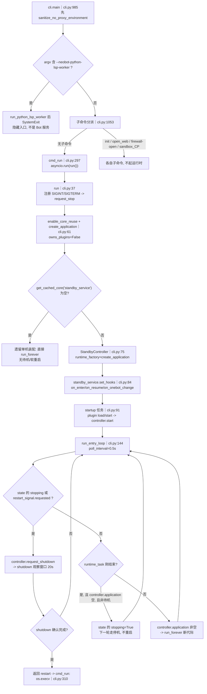

主干只有三个分叉：**要不要停机**（`stopping` / 重启信号）、**停机算不算完成**
（`controller.shutdown()` 的返回值）、**运行时是正常退休还是异常退出**
（`standby_service.is_standby()` 是唯一判据）。

## 时序

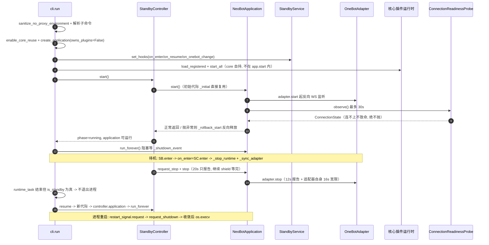

谁等谁：CLI 等 `controller` 的代际切换，`controller` 等 `app.stop()`（20s 后只是
报告，仍继续等），`StandbyService` 等 hook（20s / 120s）。**没有一处把超时当成功**。

## 细节

### 启动 13 步：每一步失败会怎样

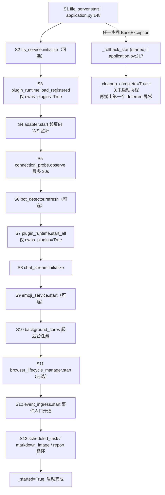

每一步的失败语义（`started` 列表是回滚依据，`application.py:145`）：

| 步 | 阶段 | 失败后果 |
|---|---|---|
| S1 | file_server.start | OSError 直接抛；file_server 已在 started（append 在 await 之前），回滚 stop 幂等 |
| S2 | tts.initialize | 抛；tts 在 started 内，回滚 close |
| S3 | plugin.load_registered | 抛；回滚 stop_all（**仅** standalone 路径；CLI 传 owns_plugins=False，此步与 S7 都被跳过，插件由 cli.py:94 启动） |
| S4 | adapter.start | 端口占用/接收器拒绝重建时抛；OneBotAdapter.start 失败会先 unbind_core + _stopping.set 再抛（adapter.py:154），不会留半启动状态 |
| S5 | connection_probe.observe | **不会失败**：内部 except 转 warning 后按未连接继续（connection_readiness.py:102） |
| S6 | bot_detector.refresh | 抛；无 started 标记，靠回滚里的无条件项（无）——refresh 不持有资源 |
| S7 | plugin.start_all | 抛；回滚 stop_all |
| S8 | chat_stream.initialize | 抛；无显式释放步骤（依赖引擎与存储层清理） |
| S9 | emoji_service.start | 抛；emoji 在 started 内，回滚 stop |
| S10 | background_coros | create_task 本身不抛；异常发生在新任务内，只进日志 |
| S11 | browser_lifecycle.start | 抛；browser 在 started 内，且 browser_instance 与截图/录屏产物是无条件清理项 |
| S12 | event_ingress.start | 同步函数、只做订阅，无 IO 不抛 |
| S13 | scheduled_task_manager / markdown_image_converter / report 循环 | 抛；回滚顺序里 report_task 排第 1，markdown_image 排第 3 |
| OK | _started=True | 之后 stop 才有意义；`dispose` 靠 _started 与 _cleanup_complete 两个标志决定走 stop 还是空回滚 |

失败最终落到哪：`start()` 重新抛出 → `controller._start_runtime` 的
`_wait_stage` 记 `phase=failed` → CLI `startup` 任务捕获异常 →
`standby_service.record_failure` 置 STANDBY（面板仍可用，可修配置后软重启）。

### 装配顺序即生效顺序：create_application 的对象顺序表

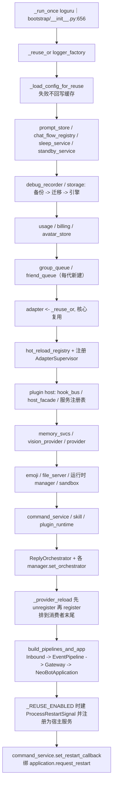

为什么顺序不能改：**存储先于业务**（usage/avatar 要用引擎）、**适配器先于管线**
（事件一流动，下游必须就绪）、**编排器先于 provider 热重载消费者**（挂载点要齐）。

`_reuse_or` 键（软重启代际之间**复用**，`bootstrap/__init__.py:588`）：
`logger_factory`、`config`、`prompt_store`、`chat_flow_registry`、
`sleep_service`、`standby_service`、`debug_recorder`、`storage`、
`usage`、`avatar_store`、`adapter`、`hot_reload_registry`、
`plugin`、`file_server`、`command_service`、`plugin_runtime`、
`process_restart`；`loguru` 走 `_run_once`（只配置一次）。
复用清单之外的一切（队列、memory_svcs、provider、emoji、编排器、管线、应用本身）**每代重建** ——
这就是「软重启能生效」与「面板不断线」同时成立的原因。

热重载消费者按**注册顺序**生效（`runtime/hot_reload_registry.py:113` 注释「先注册先生效」）：
`AdapterSupervisor` 在 :784 先注册，`_provider_reload` 在 :1182 先 unregister 再
register，所以顺序永远是「适配器先重连 → provider 再重建」。

### 连接探针：只观察、不致命，闩锁还要再验活跃连接

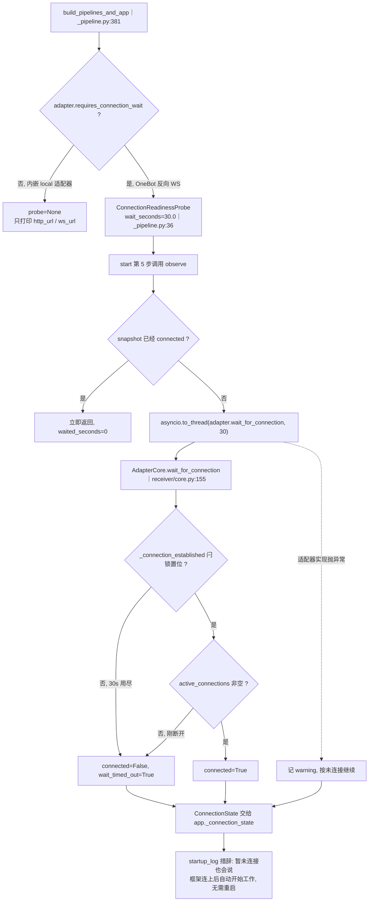

三个反直觉点：

1. **超时不是失败**。`observe` 永不抛（`connection_readiness.py:91`）；`wait_seconds`
   被 `max(0.0, ...)` 夹住，传 0 表示「无限等」（`:96` 把 0 转成 `None`）。
   启动流程与已启动组件（面板等）**绝不因为框架还没连上而回滚**（`application.py:159-164`）。
2. **闩锁 + 活跃连接是两条判据**。只看 `_connection_established` 会在「刚断开」或
   「接收器已被放弃」时误报已连接，于是探针会打印「事件管线就绪」而实际收不到事件
   （`receiver/core.py:164-171` 注释）。
3. **状态会清**：`stop()` 把 `_connection_state` 置 `None`
   （`application.py:440`）；`connection_state` 属性在未启动时返回 `None`。
   `describe_requirements`（`:117`）是给面板/日志的诊断出口：address + wait_seconds。

### 待机状态机：enter / resume / reboot / set_connect_onebot 与 hook 超时

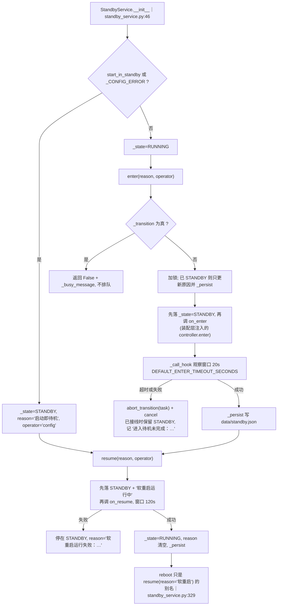

* `_transition`（`:92`）是「本服务忙 + hook 任务未结束 + 控制器 pending」三者取或：
  任一为真就拒绝新迁移，返回 `_busy_message`，**不排队**（排队会连续重建运行时代际）。
* `_call_hook`（`:107`）超时时做三件事：通知 `abort_transition`（撤销一个
  即将被提交的结果）、`task.cancel()`、返回失败文案；`finished` 回调只负责消费异常，
  **绝不把超时的操作提升成 running**，也不会让旧完成清掉新代际。
* 谁置位谁清理：`_transition_active` 在 `try/finally` 里清；`_state` 只有
  `resume` 成功、`record_failure` 才改写；`_persist` 每次状态变更都落盘，
  `_restore`（`:359`）只恢复 `connect_onebot` —— **待机状态不跨进程恢复**。
* `set_connect_onebot`（`:333`）只有当值与现值不同（或上次失败）才调 hook，
  hook 成功后才提交 `_connect_onebot` 并落盘；hook 用时是 `enter_timeout`（20s）。

### StandbyController._perform：谁拥有「正在切换的那一代」

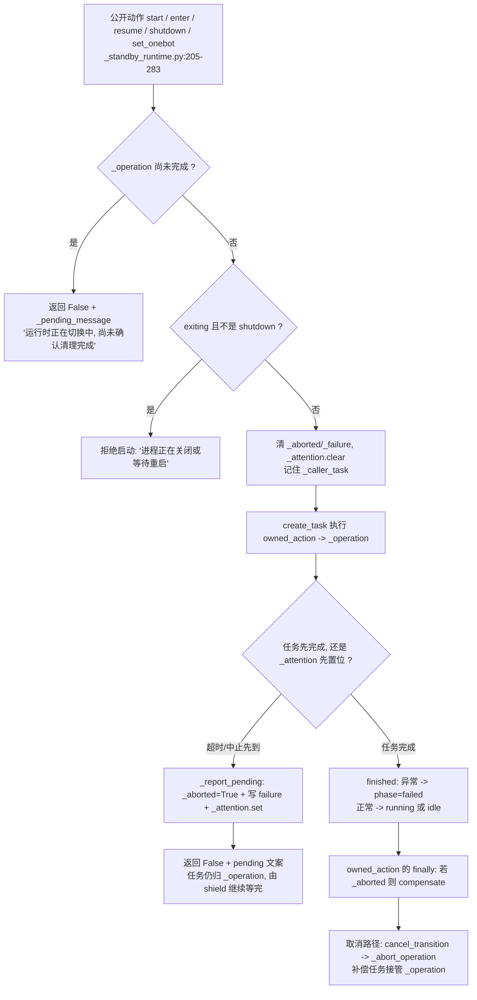

* 观察窗口只有两个数：停机类 `STOP_TIMEOUT_SECONDS=20.0`，启动类
  `START_TIMEOUT_SECONDS=120.0`（`_standby_runtime.py:17-18`）。
  `_wait_stage`（`:195`）超时后调 `_report_pending` 再
  `await asyncio.shield(task)` —— 注释原话：这个无界等待归 `_operation` 所有，
  调用方已经拿到有界失败，取消不能丢弃资源。
* `application` 属性（`:53`）是**唯一**的代际发布口：只有
  `phase == "running"` 且未 `exiting`、未 `_aborted` 才把 app 交给 CLI；
  `_start_runtime` 成功后才写 `_app`，`_stop_runtime` 抛异常时**保留**
  `_app` 以便显式重试，不发布第二个运行时。
* `abort_transition`（`:102`）用「调用方任务同一性」防止旧完成/旧取消去撤销新迁移：
  仅当 `_caller_task is caller` 才生效。
* `request_shutdown` 是同步投递、总是解析当前代际（`:97`）；`_abort_operation`
  对 `_app` 与 `_starting_app` 都发 `request_stop` 并取消启动任务。

### 软重启两条路：重建运行时代际 与 换进程（os.execv）

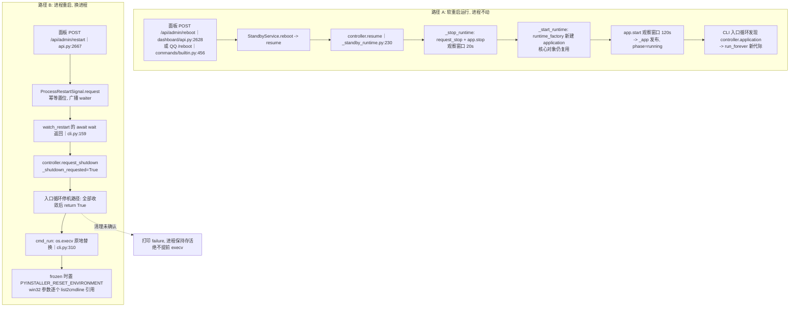

| 维度 | 路径 A 软重启 | 路径 B 进程重启 |
|---|---|---|
| 触发 | `StandbyService.reboot/resume` | `ProcessRestartSignal.request`（面板；`request_process_restart` 无生产调用方） |
| 面板 | 不断线（面板属核心插件运行时） | 断线，进程换掉后重连 |
| 重建范围 | 每代重建 bot 侧对象；15 个核心对象复用 | 全部重来（含日志、数据库引擎、插件） |
| 收敛判据 | `controller.resume` 返回 True 且 `application` 非空 | `controller.shutdown` 返回 True 且 `runtime_task` 已结束 |
| 失败停在哪 | 停在 STANDBY，reason='软重启运行失败：…' | 停在原进程，打印 failure 并 0.5s 后重试；不 execv |
| 出口 | 无（继续跑） | `os.execv`（`cli.py:325`），解释器 flags 经 `sys.orig_argv` 保留 |

`ProcessRestartSignal` 的三个语义（`runtime/process_restart.py`）：请求**先于** waiter
也保留（`:44` 先查 `_requested`）、重复请求合并（`:26` 已置位直接返回）、
取消 waiter 不清除意图（`:53` 只从集合移除）。所以「先点重启、再等 0.5s 的延迟回调」
不会漏，也不会重。

### 入口循环 run_entry_loop：判据、0.5s 心跳 与 finally 兜底

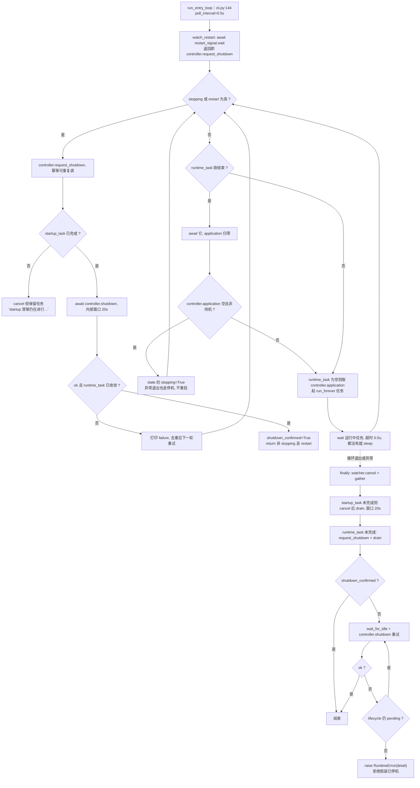

* `engine 退出的三个判据` 是分开的：`legacy_restart`（无重启信号时的
  `application.restart_requested`）、`restart_signal.requested`、`state 的 stopping`。
  前两者都收敛到 `controller.request_shutdown`，**正常停止永远优先**（`cli.py:42` 注释）。
* 待机之所以不会被误判成退出：运行时退休后 `controller.application` 为空，但
  `standby_service.is_standby()` 为真，于是 `state 的 stopping` 不被置位，
  循环继续等下一代的 `run_forever`（`cli.py:201`）。**这是「软重启不掉进程」的全部机制**。
* `finally` 的 `while True` 只在拿不到 `shutdown_confirmed` 时进入；若
  `controller.shutdown` 失败且 `lifecycle_status()["pending"]` 为假，说明**没有在途清理
  却仍失败**，此时 `raise RuntimeError` 比「安静退出」正确。

### 停机顺序：超时只是报告，不是停止的许可

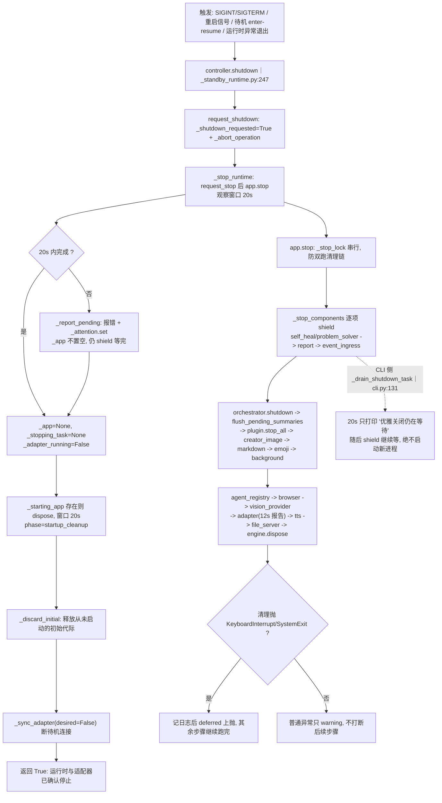

三层超时全部同构（**先报错、再无限期等**）：

| 位置 | 阈值 | 超时后的行为 |
|---|---|---|
| `cli._drain_shutdown_task` | `STOP_TIMEOUT_SECONDS=20.0` | 往 stderr 打印「不会启动新进程」，然后 `shield` 继续等 |
| `StandbyController._wait_stage` | 20s / 120s | `_report_pending` 置 `_aborted` 并写 failure，调用方拿到有界失败；任务仍被拥有 |
| `NeoBotApplication._stop_adapter_with_timeout` | `_ADAPTER_STOP_TIMEOUT_SECONDS=12.0` | 记 ERROR，然后 `shield` 等同一个 task；`_adapter_stop_task` 复用，避免重复 stop |

适配器自身还有限：`OneBotAdapter.stop` 先 `wait_for(task, 2.0)` 停止分发循环
（从分发循环内部调用时直接跳过等待，`adapter.py:170`），再以
`_STOP_TOTAL_GRACE_SECONDS=16.0` 为宽限反复 `_core.stop(8.0)`，用尽即放弃等待并
报告「接收器未停止」，端口已由 `server.close()` 释放。**12s + 4s 的搭配**就是让上层
最多再等约 4s 就能拿到结果，不会永久卡住（`application.py:36-39` 注释）。

### 启动失败的回滚：_rollback_start 的 started 列表与顺序偏差

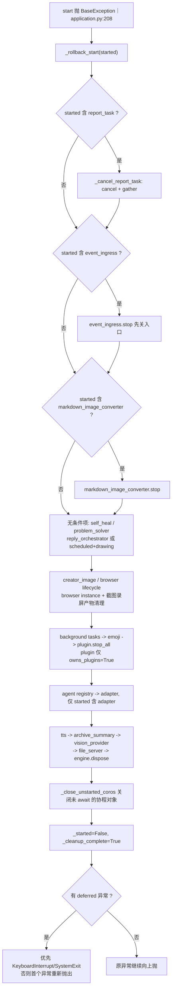

**回滚顺序不是 `started` 的严格逆序**（`00-overview.md` 的「逆序」说法只是近似）。
两处刻意提前/推后：

* `event_ingress.stop` 排第 2（在 `markdown_image_converter` 之前）—— 先关入口，
  再拆下游，避免拆除期间还有新事件进来。
* `plugin.stop_all` 排在 `adapter` 之前 —— 插件退出时可能还要用适配器发消息；
  而且 `plugin` 只在 `owns_plugins=True` 时才回滚（CLI 路径由 cli.py 自己管）。

另外三件容易漏的事：

1. **无 started 标记也回滚**：self_heal / problem_solver / reply_orchestrator / creator_image /
   archive_summary / vision_provider / engine 这些对象在 `start()` 之前就创建并持有
   provider/agent，所以必须显式关闭（`application.py:229-247` 注释）。
2. **单个清理失败不跳过后续**：`_run_cleanup_steps` 逐个跑，只把第一个非取消异常留作
   `deferred`；`_run_cleanup_step` 对每个 await 都用 `shield` 包住，
   调用方取消不会丢掉清理。
3. `dispose()` 走的是同一条回滚路径但传空 `started`：用于「构建了却从未 start」的
   初始待机代际（`application.py:405`），且用 `_cleanup_complete` 保证**恰好一次**；
   `run_forever` 开头也据此拒绝复活一个已释放的代际（`:375`）。

### 配置缺失 = 强制待机：把面板拉起来让用户就地修

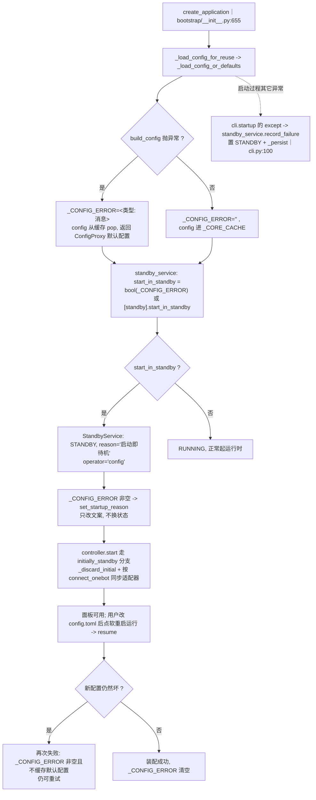

* 为什么不直接退出：`_load_config_or_defaults` 的注释写得很明确 —— 用默认配置把核心服务
  （面板、配置编辑、命令、数据库）拉起来并进入待机，用户就地修，不必重启进程
  （`bootstrap/__init__.py:543`）。
* 兜底也返回 `ConfigProxy`：配置坏掉时面板/QQ 的「配置重载」仍要能跑，否则这条恢复路径
  会抛 `AttributeError`，用户再没有别的恢复手段。
* **默认配置绝不进缓存**：`_load_config_for_reuse`（`:598`）在 `_CONFIG_ERROR`
  非空时把 `config` 从缓存 pop —— 否则用户修好文件后，每次软重启都会复用这份空配置，
  `_CONFIG_ERROR` 永远清不掉，恢复路径形同虚设。
* `record_failure`（`standby_service.py:152`）与 `set_startup_reason` 的分工：
  前者**改状态**（置 STANDBY + 落盘 + ERROR 日志），后者**只改文案**（非 STANDBY 时直接返回）。

### 待机期 OneBot 连接切换：set_onebot 与 _sync_adapter 的补偿

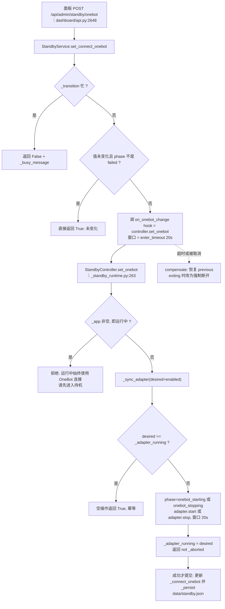

* `_adapter_running` 是控制器自己记账的连接状态，不读适配器 `connected`：
  `_sync_adapter` 在 `adapter is None` 或目标值等于现值时直接返回 True（空操作）。
* `set_onebot` 用 `on_abort=compensate`：服务在取消/超时后**没有提交**这次切换，
  迟到的 IO 完成必须把旧偏好恢复（`_standby_runtime.py:266`）。
* `_start_runtime` 在启动新代际前会先把待机连接交还（`:338`）：避免双重启动，
  也避免早期启动失败时留下一个回滚路径够不着的核心适配器。
* 运行中改监听设置走的是另一条路：`AdapterSupervisor`（`adapter_supervisor.py:87`）
  停→改→启，新设置启动失败则 `reconfigure(previous)` 再启动并抛出；它只依赖
  `AdapterReconfigurable` 能力协议，`config_paths=("adapter",)`，
  `hot_reload_policies` 声明 `adapter.*` 运行期可生效。

## 关键状态

| 状态 | 谁置位 | 谁清理 | 失败时停在哪 |
|---|---|---|---|
| `NeoBotApplication._started` | `start()` 末尾 | `stop()` / 回滚 `:210` | 回滚后为 False，`_cleanup_complete=True` |
| `_cleanup_complete` | `stop()` 或回滚结束 | 不清理（防复活标志） | `run_forever` 直接 return，`dispose` 幂等返回 |
| `_shutdown_event` | `request_stop/request_restart/stop` | `start()` 且未请求重启时 clear | 置位后 `run_forever` 退出并进入 `stop()` |
| `_restart_requested` | `request_restart`（/reboot 命令回调） | `request_stop(clear_restart=True)`；进程结束 | CLI 读它决定是否 `execv`（无重启信号时的遗留路径） |
| `ProcessRestartSignal._requested` | `request()`，幂等 | 无清理，进程换掉即消失 | 置位后不可撤销：清理卡住就停在原进程 |
| `StandbyService._state` | `enter/resume/record_failure/初始化` | `resume` 成功回 RUNNING | 停在 STANDBY（enter 失败已接线时不回滚 RUNNING） |
| `StandbyService._transition_active` | `enter/resume/set_connect_onebot` | `try/finally` | 忙时新请求返回 `_busy_message`，不排队 |
| `StandbyController._operation` | 每个 `_perform` | 任务 done 后不再替换；补偿任务可接管 | `pending=True` 时后续动作一律拒绝并给 failure 文案 |
| `StandbyController._phase` | `start/stopping/starting/onebot_*` | 每次迁移开头重置 | `failed` 时 `application` 返回 None，CLI 不发布新代际 |
| `StandbyController._adapter_running` | `_sync_adapter`；`_start_runtime` 成功后置 True | 停机路径置 False | 切换失败仍按旧值记账，由 compensate 恢复 |
| `StandbyController._aborted` | `_report_pending/abort_transition` | `_perform` 开头清 | 置位即拒绝发布代际，并触发 compensate |
| `app._connection_state` | 第 5 步探针 | `stop()` 置 None | 未连接也只是状态，不影响启动成败 |
| `_CONFIG_ERROR` | `_load_config_or_defaults` 失败 | 下一次加载成功 | 非空即强制 `start_in_standby`，且默认配置不进缓存 |

## 易错点

* **超时不是许可**。`_drain_shutdown_task` / `_wait_stage` /
  `_stop_adapter_with_timeout` 三处都是「先报错、再继续等」；取消或超时都不代表组件已停，
  更不代表可以 `execv`。改动这三处前先读它们的注释（`cli.py:117-118` 写着
  「a timeout is a report, NEVER permission to exec early」）。
* **待机期 QQ 命令是断的**（见「范围」第 1 条）。写「/reboot 在待机能用」的文档或测试前，
  先确认 `retain_ingress` 是否已合入当前分支；`fix(3)` 的记录文件也只有
  `description.md`，没有 fix-plan，也没有对应提交。
* **`request_process_restart` 是死链路**，别拿它当重启入口（只有测试引用）。真入口是
  宿主服务 `process_restart`；`/reboot` 命令绑的是 `application.request_restart`
  —— 两者语义完全不同：前者换进程，后者软重启运行时代际。
* **Windows 收不到 SIGTERM**：`add_signal_handler` 抛 `NotImplementedError` 时只给
  SIGINT 装了 `signal.signal` + `call_soon_threadsafe`（`cli.py:51-59`）。
  在 Windows 上 `taskkill`（不带 /F 的优雅语义）不会触发这套停机。
* **`ConnectionTimeoutError` 已不再抛**（`application.py:27-32`）：保留类型只为兼容旧
  `except` 分支；如果你在等它出现，说明对照的是旧实现。
* **隐藏入口**：``--neobot-python-lsp-worker`` 在导入 bootstrap **之前**被拦截并
  `SystemExit`（`cli.py:15-23`）。打包后的可执行文件同时是 LSP worker 与 Bot 服务，
  调试启动失败时先确认走的是哪条分支。
* **回滚顺序是「近似逆序 + 两处刻意调整」**（event_ingress 提前、plugin 先于 adapter）。要新增
  启动步骤时，必须同时在 `_rollback_start` 里给出对应的释放位置，并想清楚它相对
  `event_ingress` / `plugin` / `adapter` 的先后。
* **`_adapter_running` 是记账不是探测**：`_start_runtime` 成功后直接置 True
  （`_standby_runtime.py:352`），前提是 `app.start()` 里的第 4 步确实起了适配器。
  若把 `adapter.start` 挪到更靠后或改成不抛异常，这里的记账会失真。
* **待机状态不跨进程恢复**：`_restore` 只读 `connect_onebot`（`standby_service.py:359`），
  想开箱待机必须配置 `[standby].start_in_standby = true`，不要指望重启后自动回到待机。
* **配置兜底对象不进缓存**：`_load_config_for_reuse` 的 `pop("config")` 是恢复路径的
  命门，删掉它会造成「修好配置也永远复用空配置」的静默哑火。
* **改 `StandbyController` 的动作集合时要同时改三处**：`_perform` 的 `exiting` 判据、
  `cli.set_hooks` 注入的三个回调、以及 `StandbyService` 里对应 hook 的超时值
  （enter 20s / resume 120s），否则会出现「面板点了没反应」或「超时后状态与文件不一致」。
