# 01b 配置系统：schema 分层 · 加载校验 · 默认值回落 · 热重载边界

## 范围

本图覆盖 config.toml 的一生：**schema 声明**（`config/schemas/`）、**加载与类型校验**
（`config/loader/`）、**默认值与回落**、**写回与备份**、**版本迁移**，以及
「改完之后怎么生效」的两套语义（`config/hot_reload.py` 分类表 +
`runtime/hot_reload_registry.py` 分发）。

画什么：

* `Config.load` 的完整链路与三处 `ConfigLoadError`；
* `bootstrap/_config.py:14 _load_config`（.env + 官方插件配置迁移 + 加载）与
  `bootstrap/__init__.py:543 _load_config_or_defaults`（失败 → 默认配置 + 强制待机）；
* 热重载三层：分类表 `RULES` → 消费者注册表 `HotReloadRegistry` → 具体消费者；
* 写入侧（`chat_writer`、dashboard `config_manager`）与它们的读盘语义。

**不画什么**（避免与相邻图重叠）：

* 模型注册之后的 provider 路由、原生视觉降级、计费统计 → 见 `05-llm-routing.md`；
* 插件配置（`plugins_data/<插件名>/config.toml`）的原地生效通道
  `runtime/plugin_config_reload.py` → 见 `08-plugins.md`；本图只画分界线：
  `plugin.<插件名>.*` 这个命名空间**不写进本体分类表**；
* `.env` 的逐字段清单与各平台解析 → 只在「敏感项」折叠块里标位置。

规格与现实的差异（先记三条，细节见折叠块）：

1. 「缺少必须项」**不是致命错误**：默认值补全 + 备份后写回 + 日志 warning
   （`loader/manager.py:606`），进程照常启动。
2. 缺 Key 的模型默认**全部降级**（`DegradeEverythingPolicy`），而「必需角色缺配置即致命」的
   严格策略在**生产路径没有任何调用点**（只有测试用）。
3. 面板既能「每请求读盘」（旁路），也能走 `config.reload`（正路），
   两条路径的生效语义不同，且分类表不校验旁路。

## 流程

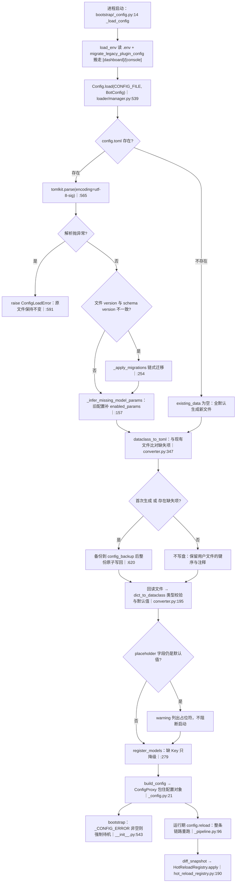

主干只有一条：**读盘 → 迁移 → 比对缺失 → 写回补全 → 回读建对象 → 注册模型**。
三个分叉决定成败：解析失败（唯一常见的致命路径）、版本不一致（迁移）、
缺失项（触发整份重写，见易错点）。

## 时序

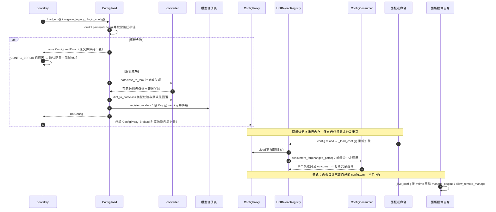

两条「不致命」的线：**单个热重载消费者失败**只影响它自己（写进报告 failed）；
**面板读盘失败**回落到已加载快照。唯一会打断启动的是解析失败。

## 细节

### schema 分层：BotConfig 的 17 个分区加 version，与两处名字重绑

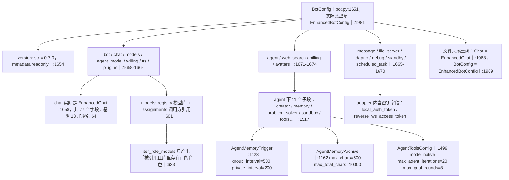

`Chat` 与 `BotConfig` 在文件末尾被**重新赋值**成增强版：任何
`from ...schemas.bot import BotConfig` 拿到的都是 `EnhancedBotConfig`，
所以 `[chat]` 段里能写 `reply_mode`、`agent_max_iterations` 这些基础 `Chat` 没有的键。
`KeyWordRule` 是 `TypedDict`（`bot.py:15`），不是 dataclass：
它走 `_validate_type` 的 TypedDict 分支校验，字段缺失不报错。
`ModelAssignments.SINGLE_ROLES` 用 `ClassVar` 声明，因此**不是配置字段**，
不会被写进 TOML（`bot.py:574`）。

### 加载链路与三处 ConfigLoadError：哪一步失败会怎样

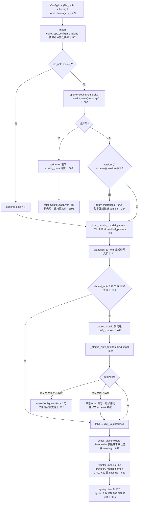

三处 `ConfigLoadError` 的触发条件：

| 行号 | 触发条件 | 生产路径可达性 |
|---|---|---|
| `manager.py:591` | 文件存在但 TOML 解析失败 | **可达**：手改坏、BOM 之外的编码错误 |
| `manager.py:632` | 文件不存在且写盘失败（无权限/只读目录） | **可达**：首次部署权限问题 |
| `manager.py:489` | 严格策略下必需模型角色缺配置 | **不可达**：没有生产调用点传策略 |

排序细节：解析失败**立即**抛错，绝不进入「补全缺失项 → 写回」——
否则 `dataclass_to_toml` 会把 schema 的全部字段当成缺失项，
用默认值整份覆盖用户配置（`manager.py:588` 注释写明）。

### 默认值与回落优先级：TOML 值 → 类型强转 → 默认值 → 类型占位符

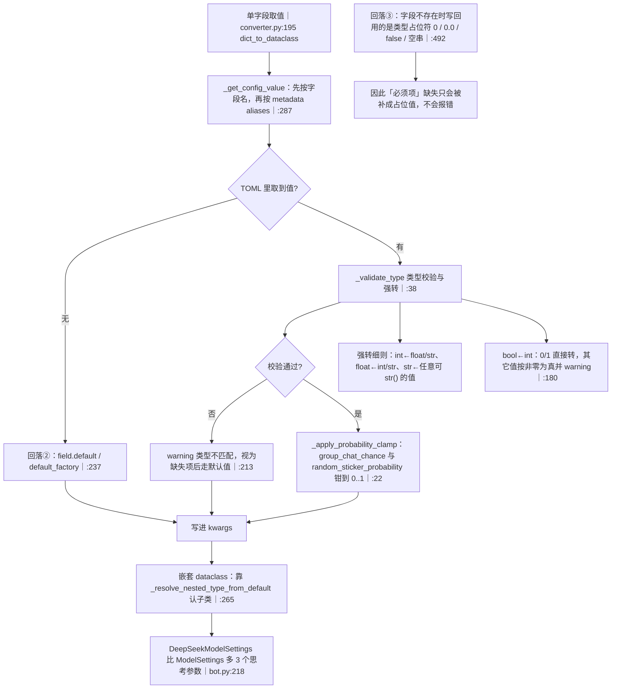

优先级只有三级，且**没有第四级**（没有环境变量覆盖 config.toml 的机制）：
文件值（类型校验通过）> dataclass 默认值 > 类型占位符。
概率钳位只覆盖两个字段（`converter.py:16`），其余数值越界原样保留 ——
「配了 3.0 的概率却没被拦」不是 bug，是只有这两个字段登记了范围检查。
别名机制是历史兼容口：`chat.group_Response_coefficient` 是
`group_response_coefficient` 的别名（`bot.py:75`），规范名优先。

### 配置项到消费者的映射：谁声明 config_paths，谁真的 apply_config

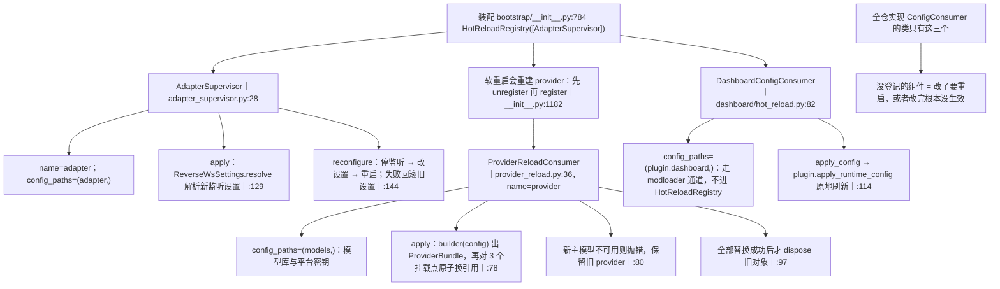

三个挂载点（`bootstrap/__init__.py:290`）：`reply` → 编排器、
`image_parse` → 图片解析、`archive_summary` → 档案总结。
只有 `reply` 与 `image_parse` 有关闭旧 provider 的拆卸函数，
`archive_summary` 的 dispose 是空操作（它不持有需关闭的资源）。

### 热重载分类表：最长前缀优先、未登记即需重启、后登记可翻案

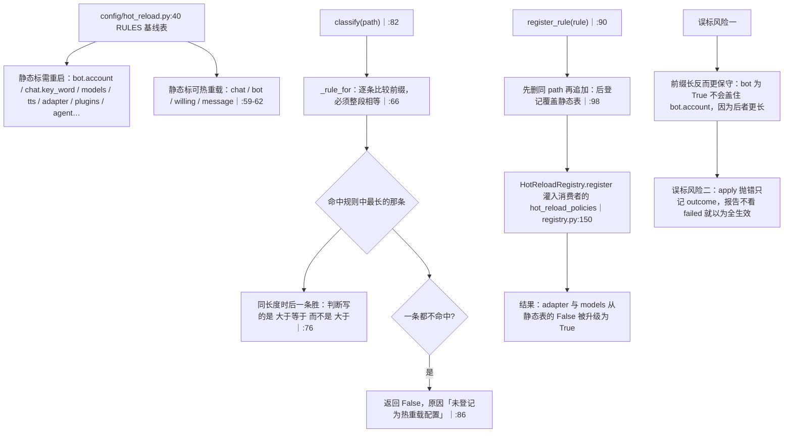

分类表回答的是「**改完这项要不要重启**」，它**不是**调用闸门（见下一块）。
前缀匹配按点分段（`registry.py:181`），所以 `adapter` 不会命中 `adapter_x`；
但 `_rule_for` 用的是「段数组前缀」比较，`bot` 同样不会命中 `bot_data`。

### 面板即时读盘 与 热重载声明：两条语义在同两个键上打架

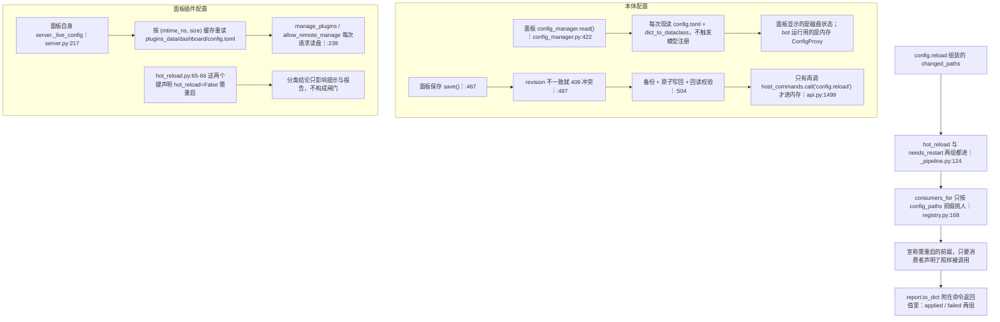

同一个「立即生效」在本仓库有**三种互不校验的实现**：命令入口的消费分发（`adapter`
`models`）、面板对自己插件配置的每请求读盘（`manage_plugins`、
`allow_remote_manage`）、以及插件配置的原地生效通道（`08-plugins.md`）。
排查「改了为什么生效/不生效」时，先确定改的是哪一个文件：本体 `config.toml`、
面板插件 `plugins_data/dashboard/config.toml`、还是其它插件目录。

### 死配置与弱契约清单：配了不生效的那些键

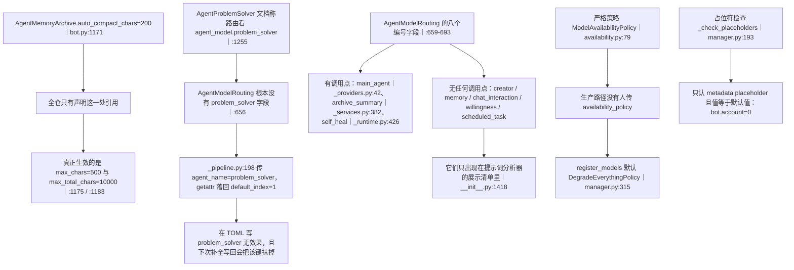

编号字段的真实语义：`resolve_agent_model_name`（`assembly/agents.py:38`）读
`config.agent_model.〈角色〉` 得到 0-3 的编号，再经 `AGENT_ROLE_NAMES`
（0→`primary_chat_model`、1→`agent_model_1`…）转成 `assignments` 里的角色名，
最后查模型库拿 model_ref。角色查不到就**回落到角色名本身**（`:62`），
那是给尚未迁移的旧配置留的兼容口，面板上会看到模型名是一串角色名。

### 敏感项位置与脱敏链路（只标位置，不列任何真实值）

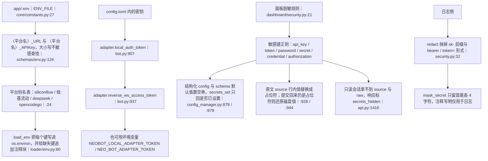

密钥**不在 config.toml 里**（模型 API Key 全在 `.env`），config.toml 里只有适配器 token。
三条脱敏路径互相独立，任何一条漏了都会明文出网：
接口响应（`read()` 的 config/raw/schema 三份副本）、TOML 原文
（`_mask_toml_source`）、日志（`redact`）。
表单提交的空串不能当「用户清空」——`_restore_masked_secrets` 会还原成磁盘现值，
想真正清空必须用 TOML 原文模式。

### 三个写入者：保真度从高到低，各有各的丢键风险

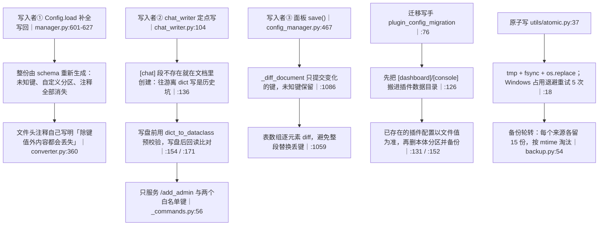

保真度排序：面板保存（只改变动键，注释与未知键都在）> chat_writer（文档级原地改）>
`Config.load` 补全（整份重建）。三者都走原子写，写前都备份到 `config_backup`，
但**只有 `Config.load` 的整份重写是无人值守自动发生的** ——
它是「面板里加的自定义分区在重启后消失」这类现象的第一嫌疑。

## 关键状态

| 状态 | 谁置位 | 谁清理 | 失败时停在哪 |
|---|---|---|---|
| `bootstrap._CONFIG_ERROR` | `_load_config_or_defaults` 捕获异常时写原因｜`__init__.py:553` | 下一次加载成功时清空｜`:563` | 非空即强制 `start_in_standby`｜`:698`，并写入待机原因文案｜`:703`；兜底配置不进复用缓存｜`:607` |
| 磁盘 config.toml | 三个写入者（loader 补全 / chat_writer 定点 / 面板整份） | 用户手改或面板 TOML 模式 | 解析失败一律不改文件并抛 `ConfigLoadError`；写失败只有「文件原本不存在」是致命的 |
| `version` 字段 | schema 默认 0.7.0；迁移链每步强制推进｜`manager.py:275` | 无 | 找不到迁移链：warning 后用旧数据继续，下次启动再试 |
| `ConfigProxy._config` | `build_config` 构造；`reload(new)` 原地替换｜`proxy.py:15` | 进程重启 | 兜底对象同样包成 ConfigProxy，否则面板与命令的重载入口会 AttributeError｜`__init__.py:562` |
| `HotReloadRegistry._consumers` | `register`：同名忽略，先注册者胜｜`registry.py:146` | `unregister`（软重启前）｜`:156` | 一个都不命中 → 报告写「没有组件声明关心本次改动的配置项」｜`:96` |
| `config.hot_reload.RULES` | 模块常量 + `register_rule` 追加覆盖 | 只有测试调 `unregister_rule` | 未登记路径默认「需要重启」，不会静默生效 |
| `dashboard._config_cache` | `_live_config` 按 (mtime_ns, size) 更新｜`server.py:228` | 文件被删则返回空字典 | 读盘失败按空字典处理，调用点回落到启动时的快照值 |
| `model_params._inferred_keys` | `_infer_missing_model_params` 调 `mark_inferred`｜`model_params.py:486` | `clear_inferred`（测试） | 只用于面板提示「已按旧配置推断，请复核」 |
| `data/config_backup` | 每次写盘前 `backup_config` | 超过 15 份按 mtime 淘汰｜`backup.py:54` | 备份失败只记 error 日志，写盘照常进行｜`backup.py:38` |
| 面板表单里的密钥空串 | 面板 `read()` 掩码后回传 | `_restore_masked_secrets` 在保存时还原｜`config_manager.py:1002` | 用户以为清空了其实没清；要清空只能用 TOML 原文模式 |

## 易错点

* **「必须项缺失」不会拦启动**：missing_required 只打 warning，随后被默认值/类型占位符补全并写回
  （`manager.py:606`）。配置里少写一整段，结果是「用默认值悄悄跑起来」。
* **缺 Key 不是错误**：默认 `DegradeEverythingPolicy`（`manager.py:315`），缺 Key 只让该功能降级；
  「严格致命」策略（`availability.py:79`）在生产路径无人调用，看到它别以为会拦。
* **只有三处 `ConfigLoadError`**，且只有前两处可达：解析失败（`:591`）、
  无法生成文件（`:632`）、严格策略下的模型缺配置（`:489`）。
  「配置缺失 → 强制待机」这条线实际由**解析失败**触发。
* **补全写回是整份重写**：只有 schema 认识的键会被写出去，用户自定义分区、更新版本留下的新字段、
  以及全部注释都会消失（有备份）。面板保存路径不会（`_diff_document`），
  所以「面板里加的东西重启后没了」优先怀疑这条。
* **面板显示磁盘，bot 用内存**：面板配完不点重载/不调 `config.reload`，
  运行中的 bot 仍按旧配置跑；反之手改文件不重载也一样。
* **分类表不是闸门**：`changed_paths` 把 hot 与 needs_restart 两组都送进
  `consumers_for`（`_pipeline.py:124`），命中只看 `config_paths` 前缀。
  静态表写着 `models` 需重启，实际因为 `ProviderReloadConsumer` 登记了
  `hot_reload_policies` 而变成立即生效——报告里的 hot/needs_restart 计数来自分类表，
  才是一致的口径。
* **`_live_config` 绕过整套机制**：`manage_plugins`、`allow_remote_manage`
  标着「需重启」（`dashboard/hot_reload.py:65`），实际每次请求读盘。
  安全开关「改了没重启也生效」是这里的刻意设计（避免把管理员锁在门外），
  别据此推断其它键也这样。
* **迁移链断了不报错**：`_resolve_migration_chain` 返回空只 warning，然后拿旧结构走补全写回
  （`manager.py:262`）。改 schema `version` 前必须先补上迁移函数。
* **`Chat` / `BotConfig` 是文件末尾的重绑**（`bot.py:1968`）：
  读 schema 时看到基类 `Chat` 的定义不要以为生效的是它。
* **编号路由只对三个角色生效**（`main_agent` / `archive_summary` / `self_heal`），
  另外五个编号字段（`creator`、`memory`、`chat_interaction`、
  `willingness`、`scheduled_task`）**没有任何读取点**；解题 Agent 想要的
  `agent_model.problem_solver` 字段根本不存在，永远回落到编号 1。
* **`auto_compact_chars` 是死配置**（`bot.py:1171`）：写它没有任何效果，
  档案长度相关行为由 `max_chars` 与 `max_total_chars` 决定。
* **概率钳位只覆盖两个字段**（`converter.py:16`）：其它数值字段越界原样保留，
  不要以为加载期做了全量范围校验。
* **表单清空密钥是无效操作**：掩码空串会被还原成磁盘现值；要清空得用 TOML 原文模式。
