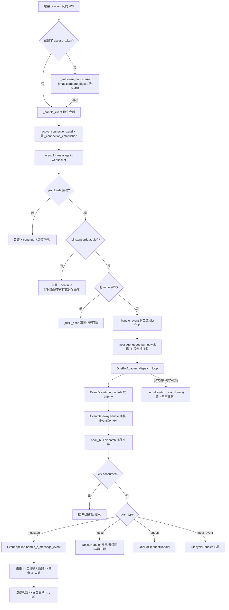
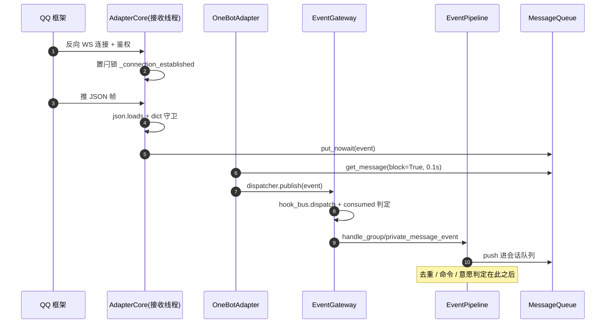
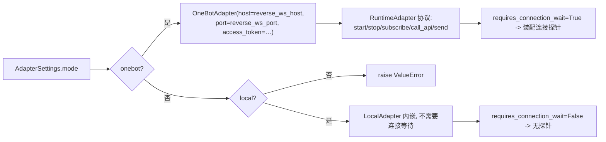
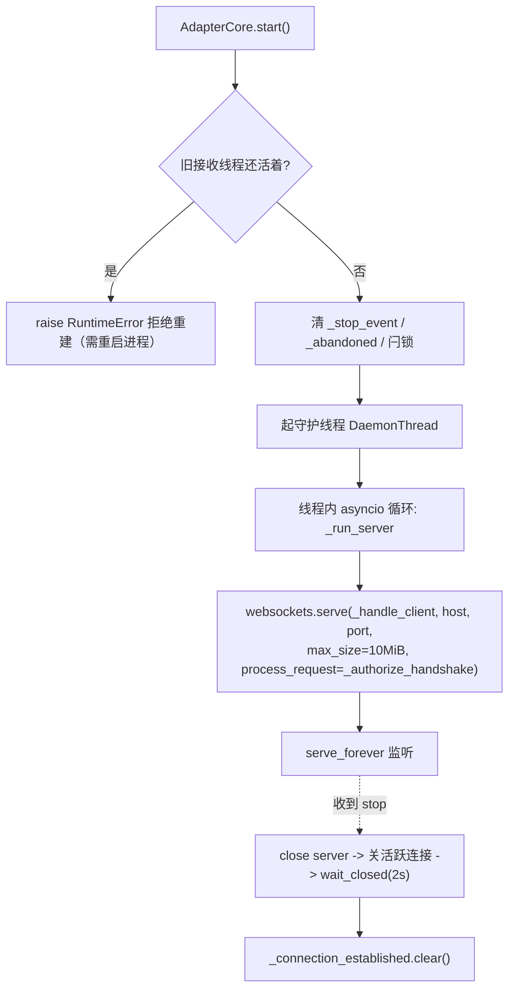
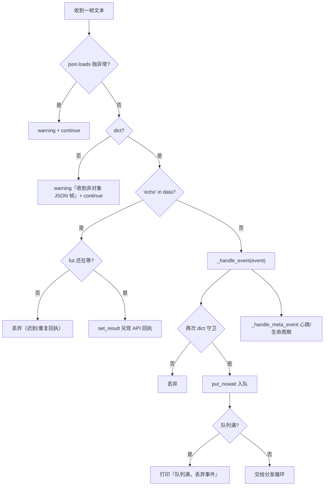
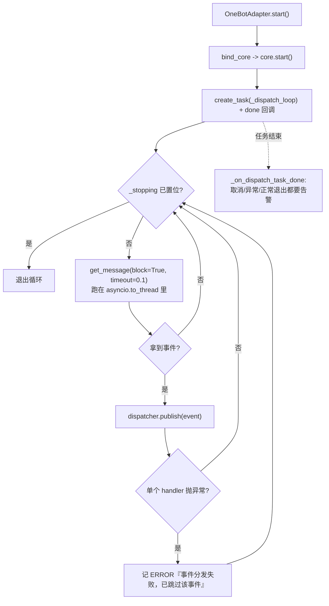
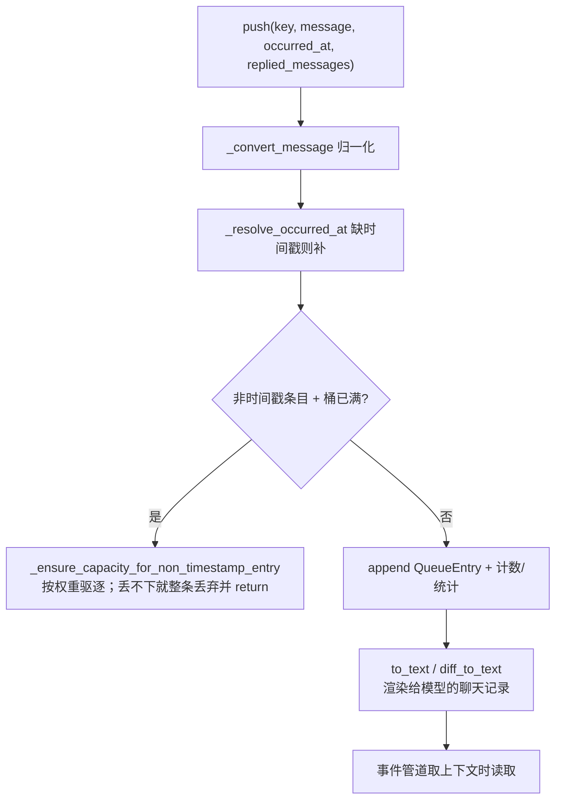
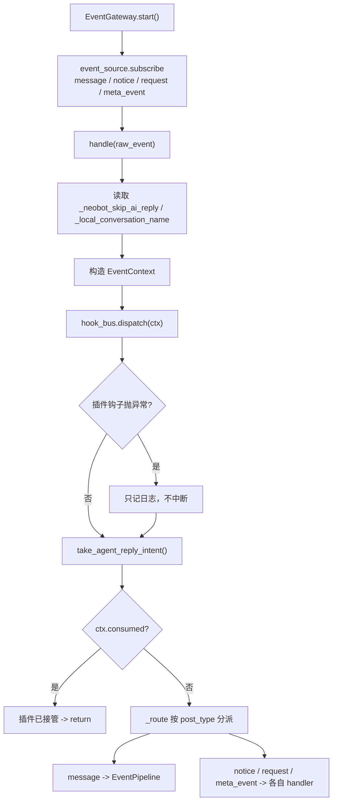
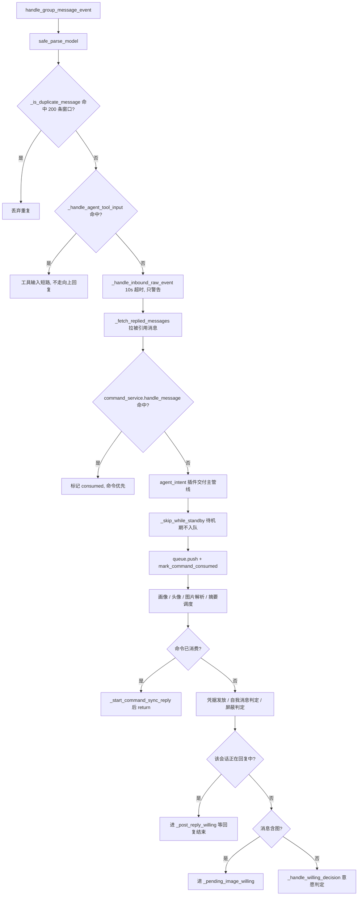
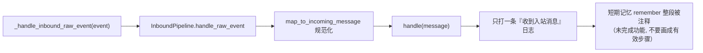

# 02 适配器入站：反向 WS -> 事件网关 -> 队列 -> 事件管道

## 范围

从「QQ 框架把一帧 JSON 推进反向 WebSocket」到「消息进入事件管道、准备做意愿判定」的全过程。
覆盖 `packages/adapter/src/neobot_adapter/`、`app/src/neobot_app/message/queue.py`、
`app/src/neobot_app/runtime/gateway.py`。回复怎么产生见 `03-reply-pipeline.md`，
概率怎么算见 `02b 细节` 与 `03-reply-pipeline.md` 的细节块。

## 流程

## 时序

## 细节

> 默认折叠；按需展开。每一块都能单独截图给评审。

### 适配器工厂：mode 决定实例

`packages/adapter/src/neobot_adapter/factory.py:29 create_adapter`；
契约在 `interfaces.py:31 RuntimeAdapter`，热重载能力由 `AdapterReconfigurable``（`:79`）判定，
装配层用 `isinstance` 而不是 `hasattr`（`runtime/adapter_supervisor.py:87`）。

### 反向 WS 服务端：起在接收线程自己的事件循环里

这里是**反向** WS：bot 当服务端、QQ 框架主动连进来，所以「启动成功」只代表端口在听，
不代表框架已连上（见 `01-startup-shutdown.md` 的连接探针细节）。

### _handle_client：一帧数据要过几道闸

**两道 dict 守卫**（`core.py:546` 与 `:613`）是 `fix(13)` 的直接产物：
数组/字符串帧继续下传会在 `'"echo" in data'` 处抛 TypeError，把整条连接拆掉。

### 分发循环与「队列不是分发器」

`app/src/neobot_app/message/queue.py:115 MessageQueue` 只是**数据结构**（分桶 + 容量 + 权重 +
渲染成文本），**没有循环**。真正的分发循环在
`packages/adapter/src/neobot_adapter/onebot/adapter.py:384`。
`listener/manager.py:246` 里的线程版 `_dispatch_loop` 是遗留实现，现行适配器不引用。

### 消息队列：容量、权重与时间戳

队列类型是私有/群两套（`MessageQueueType`），条目类型见 `QueueEntryType`：
MESSAGE / NOTICE / REACTION / POKE / NOTIFICATION。
命令消费标记（`mark_command_consumed` / `is_command_consumed`）用来避免
「挂起管线增量收集」把已回复过的 `/help` 再回一遍。

### 事件网关：唯一的订阅入口

订阅只此一处（`runtime/gateway.py:51`）。`EventPipeline` 不再自订阅：
历史上两处都订阅会让同一条消息被处理两次（`event_pipeline.py:130` 有明确注释）。

### 群聊分派的判据顺序（代码顺序即优先级）

私聊同序，但没有「@ 要求」与「回复中队列」两段（`event_pipeline.py:306` vs `:502`）。

### InboundPipeline 目前是 NO-OP

判定要看代码注释：`runtime/inbound_pipeline.py:39-51` 明确写了
「短期记忆为未完成功能，recall 无使用者，暂不启用」。改这块代码时同步更新本小节。

## 关键状态

| 状态 | 谁置位 | 谁清理 | 失败时停在哪 |
|---|---|---|---|
| 连接闩锁 `_connection_established` | 首个客户端连入 `_handle_client` | 服务端收尾 `_run_server` | 只看闩锁会误报「已连接」，判定必须带 `active_connections` |
| 活跃连接集合 `active_connections` | 连接建立 | `_remove_connection` | 连接断开时挂起的 echo 以 `ConnectionClosed` 结束 |
| 分发任务 `_dispatch_task` | `OneBotAdapter.start()` | `stop()`（先等 2s 再 cancel） | 退出必告警：取消/异常/正常三种都要能看见 |
| 适配器入站队列 `message_queue` | 接收线程入队 | 分发循环取走 | 满则丢弃并打印，不阻塞收帧 |
| 命令消费标记 | `event_pipeline` 命中命令时 | 条目出队时 | 已消费的命令不再触发二次回复 |
| 事件钩子 `ctx.consumed` | 插件 `hook_bus.dispatch` | 每个事件新建 `EventContext` | 插件接管后主链路直接结束（不算失败） |

## 易错点

* **非 dict 帧是历史事故现场**：数组/字符串帧必须在入站处丢弃（两道守卫都在
  `receiver/core.py`），否则 `'"echo" in data'` 抛 TypeError 把连接拆了（`fix(13)`）。
* **别把 MessageQueue 当分发器**：`queue.py` 没有循环、没有异常保护，入队失败直接向上抛；
  分发与异常保护在 `adapter.py:384 _dispatch_loop`。
* **分发任务退出必须可观测**：`_on_dispatch_task_done` 是「事件入口静默死亡」的补丁，
  改动 `start()/stop()` 时要保留它。
* **订阅只能有一处**：`EventGateway`。任何在 `EventPipeline` 里重新 subscribe 的改动
  都会让事件被处理两遍。
* **入站处理有 10s 依赖超时**：`_handle_inbound_raw_event` 超时只 warning，不阻断主链路。
* **遗留实现别当现行链路**：`listener/manager.py` 的线程版分发循环已不被引用。
