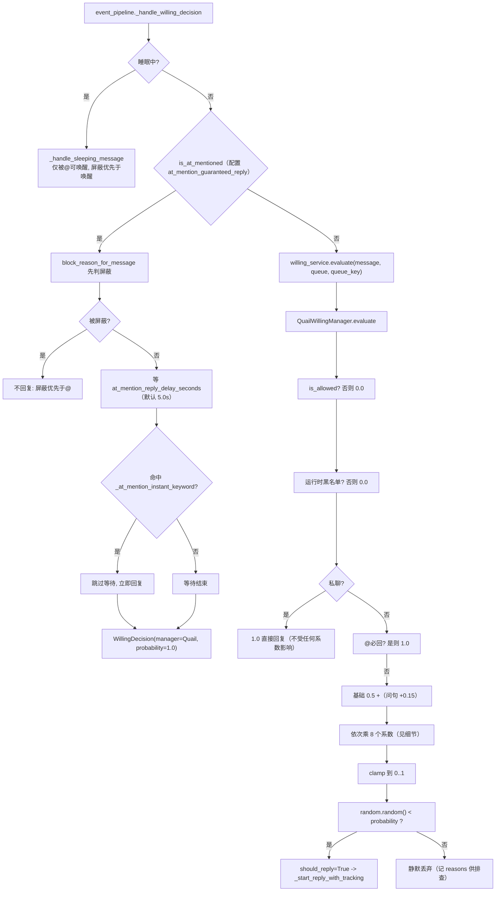
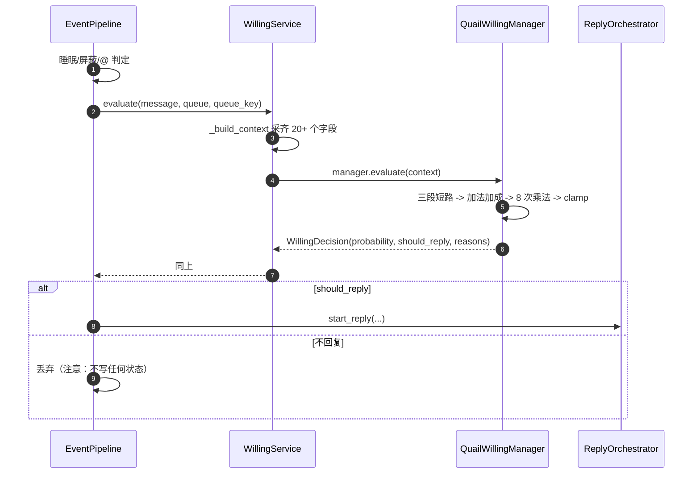
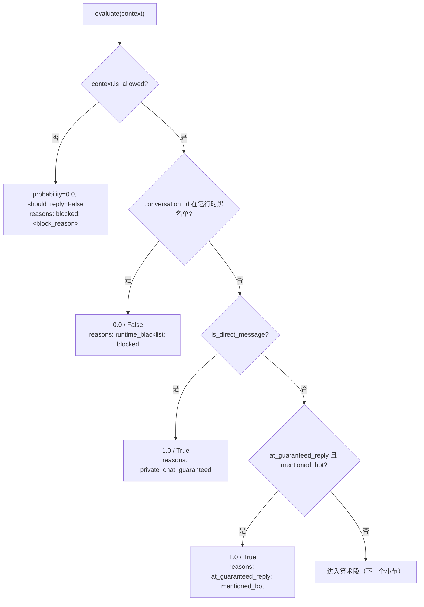
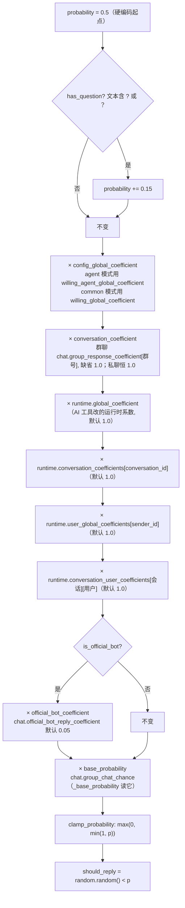
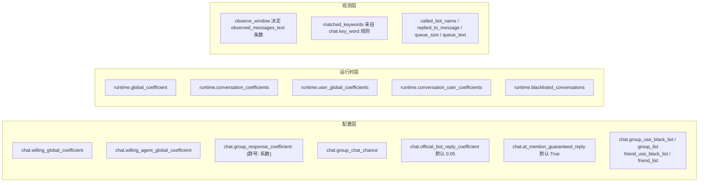
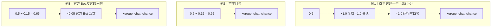
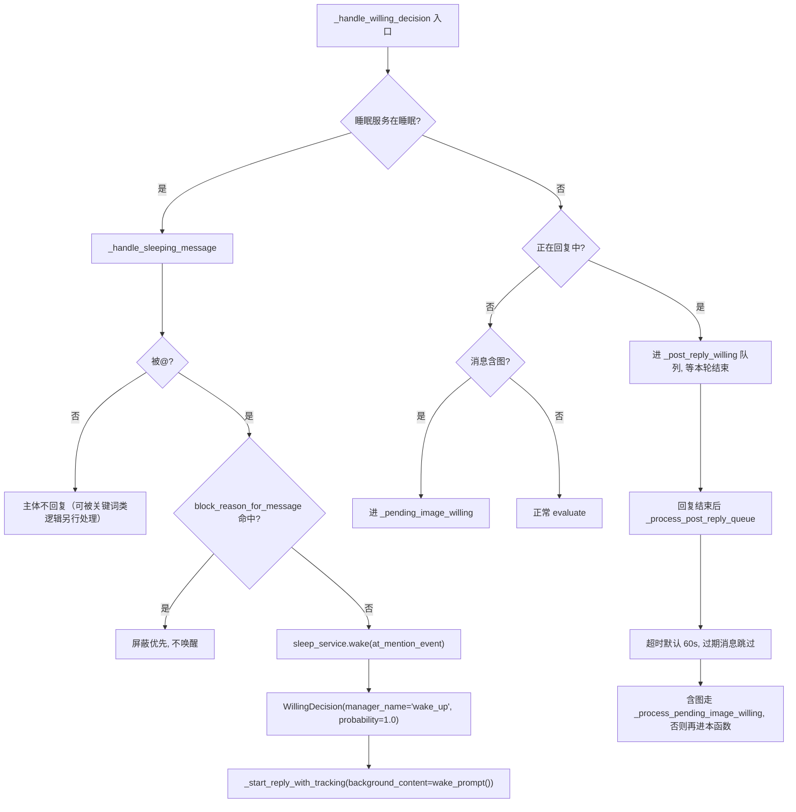
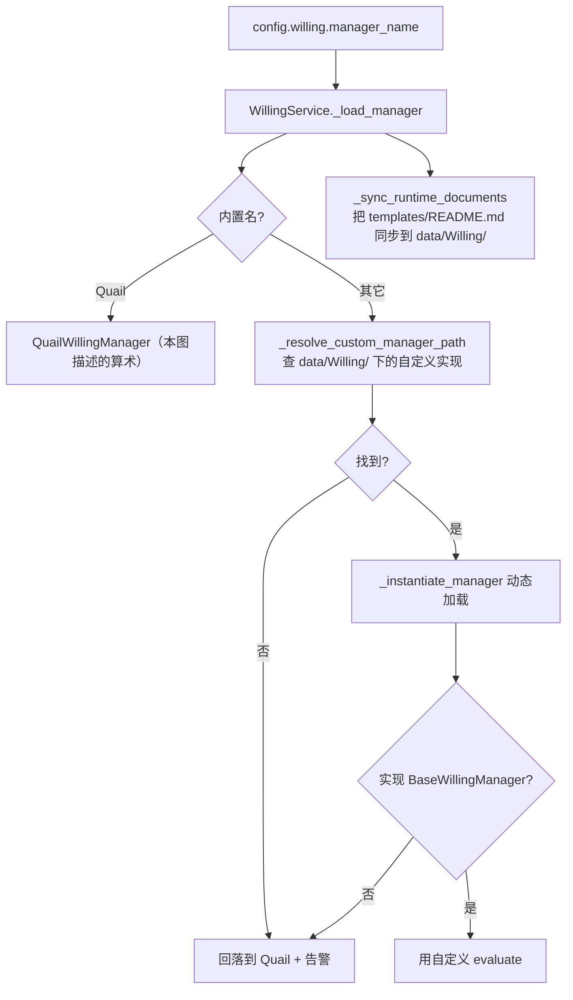
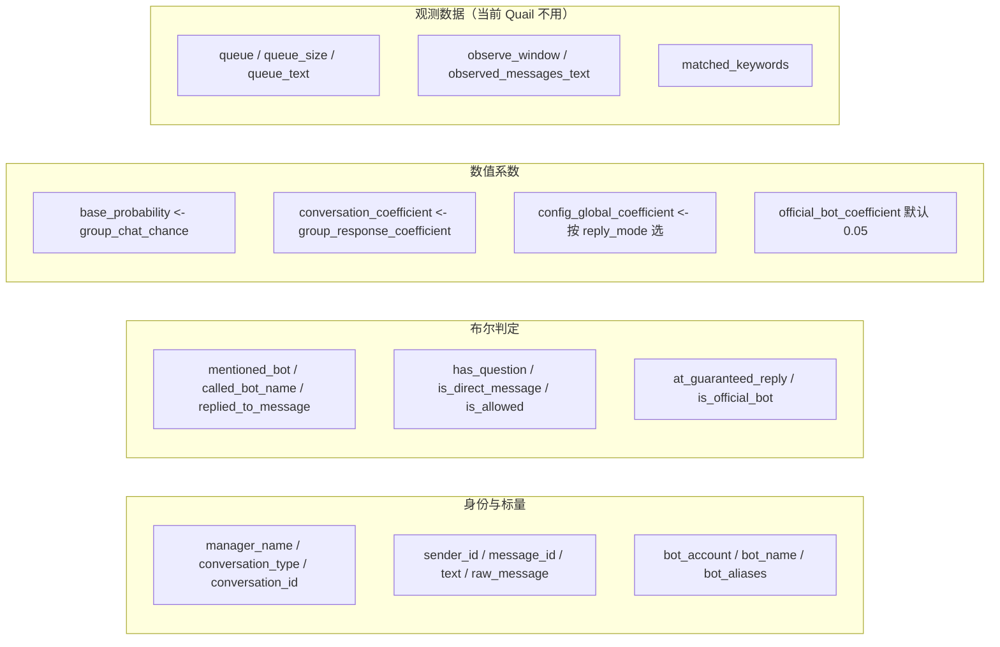

# 02b 回复意愿：概率到底怎么算出来的（逐步精确）

## 范围

`WillingService.evaluate` 组装 `WillingContext`，`QuailWillingManager.evaluate` 出
`WillingDecision(probability, should_reply, reasons)` 的**完整算术**，以及事件管道在调用前后
做了什么（睡眠拦截、屏蔽优先、@ 必回的等待与关键词短路、回复中队列、回复后积压处理）。
配置项默认值以 `config/schemas/bot.py` 当前实现为准；本图逐字对齐
`willing/builtin.py:15` 的求值顺序。

## 流程

## 时序

## 细节

### 三段短路：返回 0.0 / 1.0 的六种情况

`is_allowed` 由 `service.py:350 _is_conversation_allowed` 算出，取值来源：
群聊 `message.enable_group=False` -> `group_disabled`；否则
`chat.group_use_black_list` + `chat.group_list` -> `group_blacklisted` / `group_not_in_whitelist`。
私聊同理（`enable_private` / `friend_list`）。
**列表为空时一律放行**（`_check_list_rule` 第一行就 return True）。

### 算术段：加一次、乘八次，顺序不能换

**乘法顺序不影响数值**（都是乘法），但**起点是 0.5 且没有单独的基础概率加法**：
`chat.group_chat_chance` 是被当作**乘法系数**乘进去的，不是「基础概率」。
这个命名容易误导：它是最终乘数之一，默认值直接决定量级。

### 每个系数的来源与默认值

运行时层由 AI 工具/面板调用 setter 修改（`service.py:92-172`）：
`set_runtime_global_coefficient`、`set_runtime_conversation_coefficient`、
`set_runtime_user_global_coefficient`、`set_runtime_conversation_user_coefficient`、
`add_runtime_blacklist` 等，全部 `clamp_probability` 到 0..1 且**不落盘**（重启即回默认）。
`get_runtime_config_summary`（`:174`）是给模型看的当前值摘要。

### 算一遍：三种典型输入

以 `group_chat_chance = 0.5` 为例（实际值看当前配置）：

| 输入 | 计算 | 最终概率 |
|---|---|---|
| 群聊普通句 | 0.5 × 0.5 | 0.25 |
| 群聊问句 | (0.5+0.15) × 0.5 | 0.325 |
| 官方 Bot 问句 | (0.5+0.15) × 0.05 × 0.5 | 0.01625 |
| 群里 @ 了 bot | 短路 | 1.0 |
| 私聊任意消息 | 短路 | 1.0 |
| 会话在临时黑名单 | 短路 | 0.0 |

`reasons` 会把这些步骤逐条记下来（`起始概率=0.500`、`问句加成=+0.150`、`加成后=0.650`、
`全局系数=…`、`最终概率=…`），排查「为什么这条没回」时先看它。

### 事件管道侧的加减项（不属于概率）

这些是**排队与唤醒**，不改概率：`probability=1.0` 的三处短路（@必回、私聊、唤醒）
都是显式构造的 `WillingDecision(manager_name=...)`，与 `QuailWillingManager` 的算术无关。
`fix` 记录里的坑：屏蔽判定必须在唤醒与@之前，否则拉黑的人还能靠 @ 把 bot 叫醒。

### 自定义 manager：换了实现就换了算术

自定义 manager 也可以返回任意 `WillingDecision`：`BaseWillingManager` 只要求
`evaluate(context) -> WillingDecision`（`models.py:69`）。换 manager 时，
`probability` 与 `should_reply` 的语义（谁决定要不要回复）由实现方负责，
事件管道只看 `should_reply`。

### WillingContext 全字段（_build_context 采什么、谁用）

`queue_text` 是**整段聊天记录渲染**，`observed_messages_text` 是最近 `observe_window` 条：
这两个字段是给「上下文感知型 manager」预留的，Quail 读了但没参与计算 ——
自研 manager 可以直接用它们做语义判定，不用再自己取队列。

## 关键状态

| 状态 | 谁置位 | 谁清理 | 失败时停在哪 |
|---|---|---|---|
| 运行时系数（四项） | AI 工具/面板 setter | 进程重启（纯内存） | `clamp_probability` 到 0..1，非法值不会越界 |
| 运行时黑名单 | `add_runtime_blacklist` | `remove_runtime_blacklist` 或重启 | 命中即 0.0，不进入算术 |
| 睡眠状态 | `SleepService` / `/sleep` | 被@唤醒或 `/awake` | 睡眠期只有屏蔽优先的 @ 能唤醒 |
| 回复中标记 | `_start_reply_with_tracking` 成功后 | `on_reply_done` | 期间消息进 `_post_reply_willing`，不丢 |
| 图片待决 | 含图消息进 `_pending_image_willing` | 图片解析完成或超时 60s | 过期消息直接跳过，不补回复 |

## 易错点

* **起点是 0.5 不是 0**，`group_chat_chance` 是乘数不是「基础概率」；调参时先确认目标量级。
* **加项只有问句 +0.15**：被叫昵称（`called_bot_name`）、关键词、被回复等字段被算出来了但
  **当前 Quail 没用**。想看「叫了名字也不回」的原因，答案在算术里，不在字段里。
* **乘法顺序会体现在 reasons 顺序上**，但数值与顺序无关；改顺序只影响日志可读性。
* **三处 1.0 短路绕过所有系数**：@ 必回、私聊、睡眠唤醒。用户抱怨「系数调了没用」时先看是否是这三种。
* **屏蔽优先于一切**：`block_reason_for_message` 必须排在 @ 判定与唤醒之前。
* **运行时系数不落盘**：重启回默认值，别把它当成持久配置。
