# 02c 事件管道：去重 · 命令 · 入队 · 挂起 · 通知

## 范围

从 `EventGateway` 把 `raw_event` 交给 `EventPipeline.handle_group_message_event` /
`handle_private_message_event` 那一刻起，到「消息落进 `MessageQueue` 并决定要不要起回复
管线」为止的全部分派、去重、命令拦截、挂起排队与通知入队逻辑。

* **画**：17 步群聊分派顺序、私聊/群聊差异、`message_id` 去重窗口、
  `handle_agent_tool_input` 短路、命令 consumed 标记、`_replying_queues` /
  `_post_reply_willing` / `_pending_image_willing` 三条挂起状态、待机与睡眠拦截、
  凭据签发短路、三类通知入队、后台任务登记与停机 flush。
* **不画**：WS 收帧、鉴权、`EventDispatcher` 优先级、`EventGateway` 的插件钩子
  （见 `02-inbound-message.md`）；`WillingService` 的概率算术（见
  `02b-willing-probability.md`）；回复管线内部状态机、冷却、看门狗
  （见 `03-reply-pipeline.md`）；命令的解析与权限树（见 17-commands，待补）。
* **spec 与现实的差异**：本模块不自己订阅事件。旧实现的 `start()` 会再注册一套
  `message`/`notice`/`request` 订阅，同一事件会被投递两次，且它**从来没有被调用过** ——
  唯一入口是 `EventGateway`（`event_pipeline.py:130-139` 的注释即为此事留档）。

## 流程

主干 + 四条 `return` 闸；17 步的行号与逐步判据见 `## 细节` 第一块。

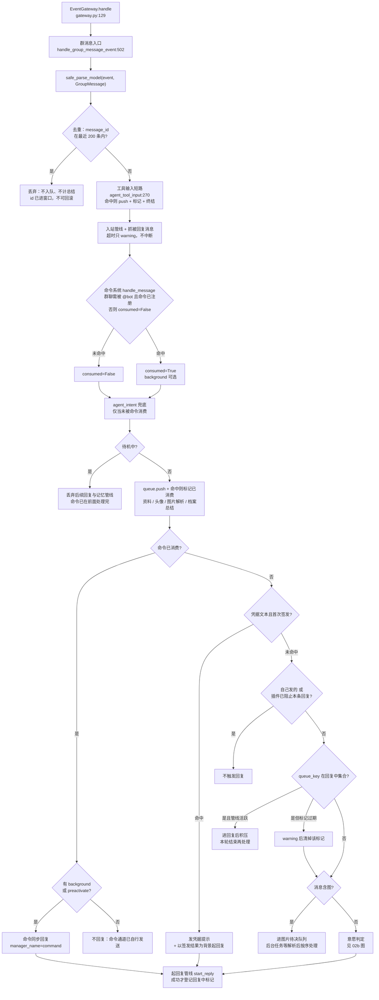

## 时序

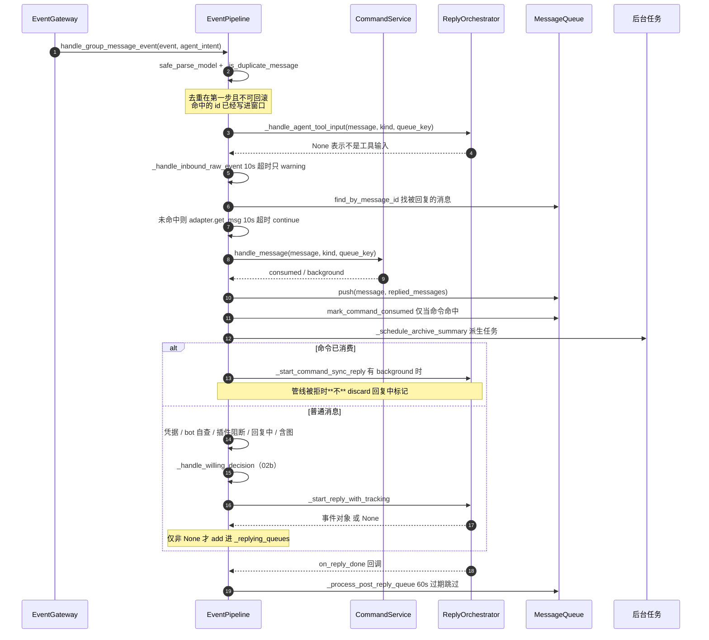

## 细节

### 群聊 17 步分派顺序：少一步或多一步都会改变短路范围

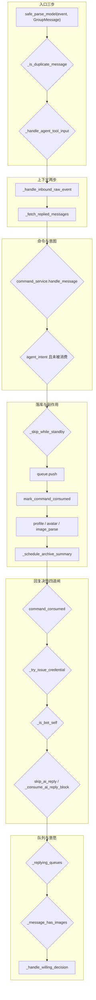

行号逐条对应（`event_pipeline.py`）：510 解析 → 511 去重 → 519 工具输入 → 521 入站管线 →
522 被回复消息 → 530 命令 → 542 agent_intent → 546 待机 → 553 入队 → 554 命令标记 →
559 资料 → 560 头像 → 561 图片解析 → 564 档案总结 → 575 命令闸 → 585 凭据 →
592 bot 自查 → 595 插件阻断 → 603 回复中 → 615 含图 → 625 意愿。

三条**副作用早于回复决策**的步骤必须记住：`push`、`mark_command_consumed` 与
`_schedule_archive_summary` 都在「是否回复」之前执行 —— 后面任何一步 `return` 都不会
撤销这三件事（消息已经进队列、已经进总结计数）。

### 私聊与群聊的 7 处差异：不是「同一函数换个 queue」

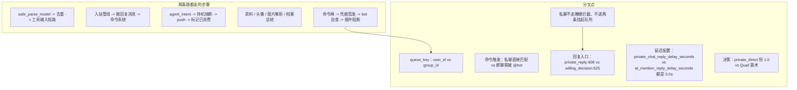

* 私聊在 `event_pipeline.py:408` 直接调 `_handle_private_reply`，看不到
  `_replying_queues` / `_pending_image_willing` 两段 —— 这两段只在群聊分支
  （`:603`/`:615`）里。私聊消息**永远**会触发一次回复（`skip_ai_reply`、插件阻断、
  bot 自查、凭据、命令五种情况除外）。
* 私聊延迟用的是 `chat.private_chat_reply_delay_seconds`（`config/schemas/bot.py:1875`，
  默认 5.0），**不是** `at_mention_reply_delay_seconds`；两处默认值相同，改错配置项
  时表现为「私聊没延迟」。
* 私聊的 `WillingDecision` 在函数内部现场构造（`:484`，`manager_name="private_direct"`），
  概率恒 1.0，`reasons=("私聊直接回复（跳过意愿管理器）",)` —— 面板里看到这个 manager
  名就说明走的是私聊直通。

### 去重窗口：`_recent_message_ids` 是 200 条不可回滚的滑动窗口

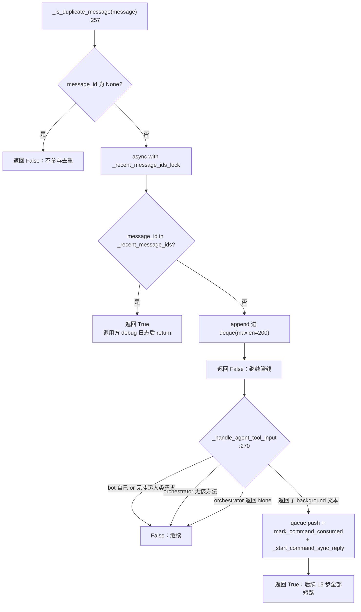

* 窗口是**硬编码 200**（`:124`），与 `max_group_chat_observations` 无关；队列配置成 2000
  也是 200。窗口只按条数淘汰，没有时间维度。
* `append` 发生在**判定之后、后续任何步骤之前**：如果 519~625 任一步抛异常，这条
  `message_id` 已经留在窗口里，同一消息重投会被当重复丢弃（重试不回来）。
* `_handle_agent_tool_input` 排在去重之后，是 17 步里最靠前的「整条事件终结者」：
  它自己会 `push` 并 `mark_command_consumed`（`:279-280`），所以消息不会丢上下文，
  但 `_handle_inbound_raw_event`、命令系统、档案总结都不会执行。
* 工具输入的三道门（`orchestrator.py:550-567`）：`CURRENT_HUMAN_MESSAGE` 必为真
  （只有 `@human_message_entry` 装饰的真实消息入口才置位）、`queue_key` 必须是纯数字、
  必须拿到 `agent_tools` 技能包；任一不满足返回 `None` 即正常管线。

### 命令优先级与 consumed 标记：谁置位、谁必须不清理

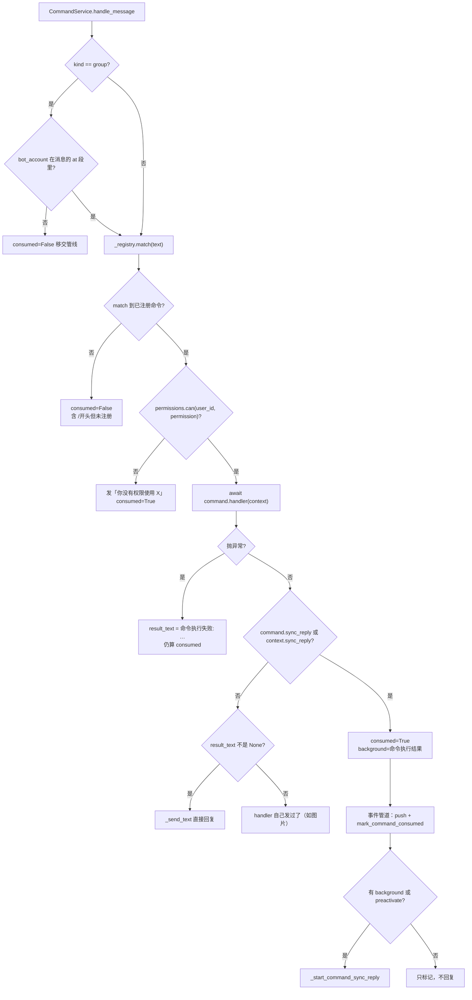

* **被拒也 consumed=True**：权限不足（`commands/service.py:175-182`）与 handler 抛异常
  （`:197-199`）都返回 `consumed=True`。设计意图是「命令消息不再交给 AI 自由发挥」，
  后果是**用户发错命令时 AI 不会兜底解释**，只会收到固定文案或报错文本。
* 命令消息**照常入队**（`:553`，注释：作为上下文保留），另加 `mark_command_consumed`。
  挂起中的回复管线收集新条目时会跳过它但仍写进快照
  （`reply/orchestrator.py:3774-3789`），避免反复拾取。
* 标记桶是 `deque(maxlen=max_size * 2)`（`queue.py:169`，默认配置 = 400），
  `is_command_consumed` 只查 membership；桶满会静默挤掉最旧的 id。
* **易错的坑：管线被拒时不能 `discard` 标记**（`:1406-1414`、`:949-952` 两处同款注释）。
  `start_reply` 返回 `None`（编排器已关闭／同会话管线在跑／冷却中）时，标记可能属于
  另一条**正在运行**的管线；删掉它会让后续消息走意愿路径，破坏分流守卫。现在的写法是
  「启动成功后才 `add`」，失败路径什么都不做。

### 三条挂起状态：回复中、含图、回复后积压

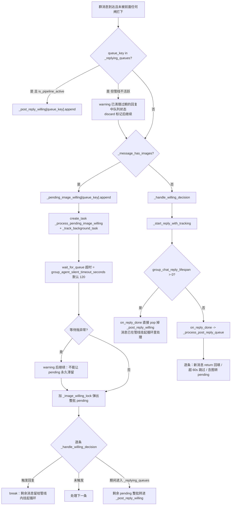

* 三条状态的**归属**：`_replying_queues` 由 `_start_reply_with_tracking`（`:953`）与
  `_start_command_sync_reply`（`:1415`）**成功启动后**才 add；由 `on_reply_done` 回调
  discard。`_post_reply_willing` 与 `_pending_image_willing` 都是 `dict[str, list]`，
  按 queue_key 分桶，弹出即删（`pop`）。
* **60s 过期判定**：`_process_post_reply_queue` 读 `chat.post_reply_message_timeout_seconds`
  （`config/schemas/bot.py:1879`，默认 60.0），`_is_message_stale` 用
  `epoch_seconds() - message.time > timeout`；`message.time` 为 `None` 时**永不判定过期**
  （`:1530-1535`）。过期消息 `continue` 跳过 —— 不补回复、不重排，直接丢。
* `_process_post_reply_queue` 的「已在回复中」分支用的是 `pending.index(msg)`（`:1056`）——
  同一条消息对象出现两次时会取到第一个下标，回填范围可能偏大（等价消息对象不常见，
  但这是线性 `index` 而非 `enumerate` 的代价）。
* 图片批处理锁 `_image_willing_lock`（`:956-973`）只保护「取列表 + 清理」这段；
  逐条意愿判定在锁外执行，所以同会话可能有并发判定。

### 待机与睡眠：两种「不回复」的语义完全不同

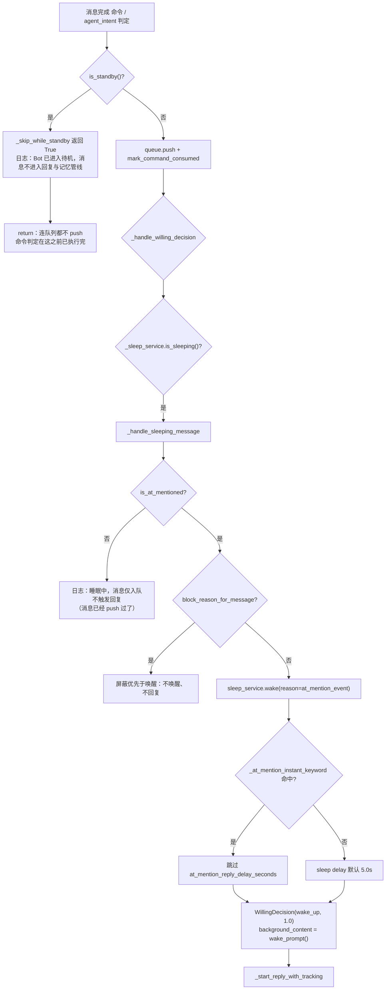

* 待机是**在 push 之前**熔断（`:350-353`/`:546-549`，注释明确要求「必须在 push/档案总结
  之前返回，否则待机期间仍会积压记忆总结任务」）；睡眠是**在 push 之后**只掐回复。
  两者都「不回复」，但待机期间该会话的队列长度不增长，睡眠期间照常增长。
* 唤醒响应（`wake_prompt()`）通过 `background_content` 注入 —— 与命令 sync_reply、
  凭据签发共用同一个参数，这是「非概率触发的三种 1.0 回复」的统一实现方式。
* 凭据签发（`:1417-1472`）：`issuer_id == bot_account` 直接放过（防自我签发）；
  匹配用的是 `_credential_message_text`（纯 text 段拼接，**不含** `event_message__to_text`
  的「发送者: 」前缀，`:1570-1575` 有专门注释）；只有 `permission_denied` 才当「已处理」
  并回绝，`not_found`/`expired` 一律交回正常管线；只有 `newly_issued`（pending → active）
  才发提示并触发回复，重复发送静默但返回 True。

### 三类通知怎么进队列：撤回 / 表情回应 / 戳一戳（外加后台通知）

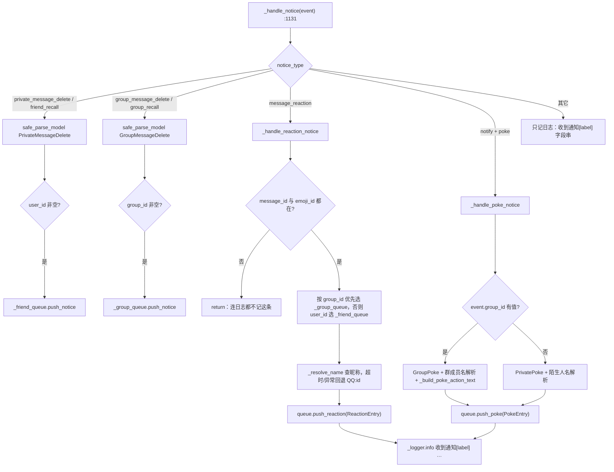

入队前的**容量口径**（`message/queue.py`）：

| 方法 | 条目 kind | 权重 | 额外判定 |
|---|---|---|---|
| `push`/`push_history` | MESSAGE | `self_sent_weight` 0.1（自己）/ `forward_weight` 2（合并转发）/ 1.0 | 无 |
| `push_notice` | RECALL | 1.0 | 先 `find_by_message_id` 深拷贝原消息，找不到也入队 |
| `push_reaction` | REACTION | `reaction_weight` 默认 0.2 | **目标消息不在队列里直接 return，静默丢弃**（`queue.py:410-412`） |
| `push_poke` | POKE | `poke_weight` 默认 0.2 | 无 |
| `push_notification` | NOTIFICATION | `self_sent_weight` 0.1 | 永不抛异常 |

还有第六个入口不经过 `_handle_notice`：后台通知由
`ReplyOrchestrator.record_notification`（`reply/orchestrator.py:4712-4738`）写入
`NotificationEntry(source, content)`，**投递与入队是两件事** —— 投递仍归
`BackgroundNotificationHub`，入队只为让 agent 下一轮 transcript 里能看到。

### 队列容量与驱逐：权重账本必须与入队用同一个值

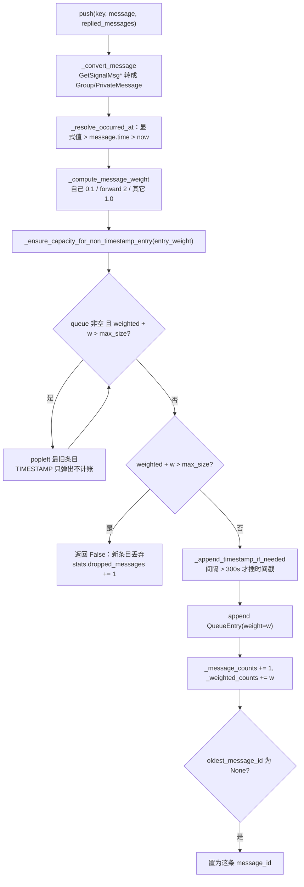

* 容量是**按权重而非按条数**：默认 `max_group_chat_observations` 与
  `max_friend_chat_observations` 都是 200（`config/schemas/bot.py:57/81`），
  `weighted_counts + entry_weight > max_size` 才驱逐（`queue.py:279`），
  时间戳条目权重 0 且不占账。
* `QueueEntry.weight` 是**入队时固化**的（`queue.py:108-112` 的注释记录了一个真实 bug）：
  旧实现驱逐时按 kind 重算（MESSAGE 恒 1.0），入队按内容算（合并转发 2.0），
  于是权重账本单调虚高、队列提前丢弃真实消息。**驱逐与「按权重取最近消息」
  （`iterate_entries_from_newest_weighted`）必须读同一个字段。**
* 单条权重本身超过 `max_size` 时（例如 `forward_weight` 被配成大于观测上限），
  `_ensure_capacity` 返回 False，调用方**放弃插入**并计入 `dropped_messages` →
  `push` 静默无操作，消息在队列里完全不存在。
* `to_text`（`:673`）把 `last_reply_message_id` 当作分隔点，找不到分隔点时补
  `<当前均为新消息，没有上次回复过的内容>`；最后一条消息 @ 了 bot 时追加
  `<最新消息为@你的内容，请回复这句话>`（`:687-688`，判据 `_should_request_reply` 只看
  **最后一条**、且发送者在 `reply_blacklist` 时直接返回 False）。

### 后台任务登记与停机 flush：`_stopping` 之后不再派生新任务

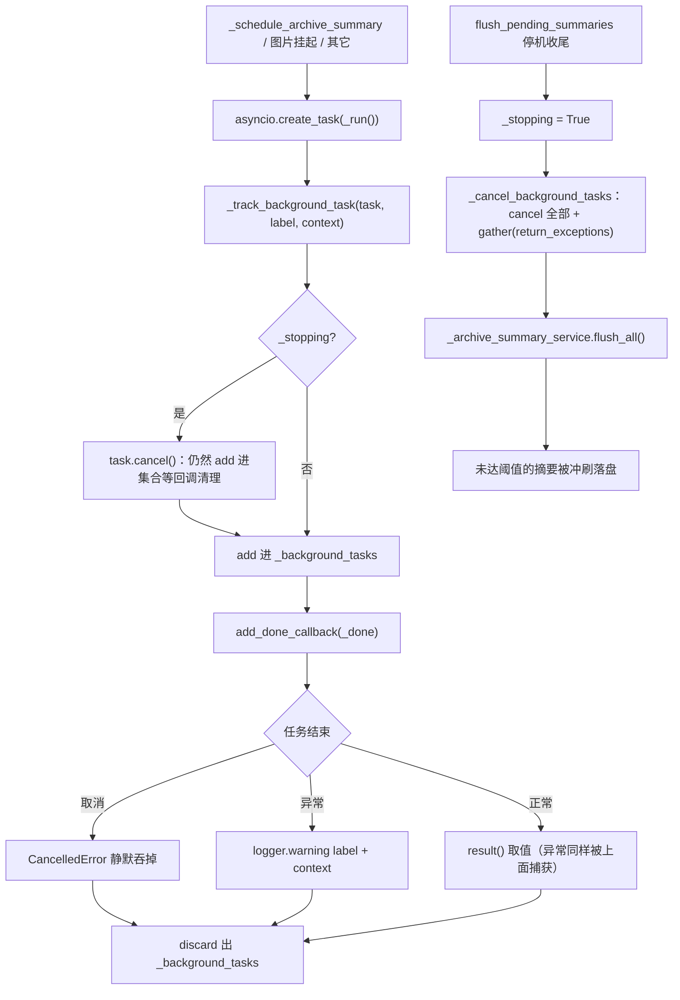

* `_schedule_archive_summary` 的三条前置短路（`:231-236`）：`_stopping` 为真、
  服务未注入、`conversation_id` 为空 —— 任一命中直接 return，**不创建任务**。
* `flush_pending_summaries` 只在关闭流程调用一次，所以 `_stopping` 是一次性置位
  （`:137-139` 注释）；它**不重新订阅事件**（旧 `start()` 的重复订阅已删除）。
* 后台任务异常只 warning，不影响消息路径 —— 档案总结失败不会让用户收不到回复。
  这是刻意的：整个 `_schedule_archive_summary` 与 `_record_archive_summary` 都吞异常
  （`:648-654`）。
* 关停顺序上，`EventGateway.stop()`（退订全部 subscription）由上游负责；
  `EventPipeline.flush_pending_summaries` 只负责「停止派生 + 取消在途 + 冲刷摘要」。

## 关键状态

| 状态 | 谁置位 | 谁清理 | 失败时停在哪 |
|---|---|---|---|
| `_recent_message_ids`（deque maxlen=200） | `_is_duplicate_message` 判定为「新」时 append | 只按条数淘汰（自己滚出窗口），无显式清理 | 判定与 append 都成功后才继续；后续步骤抛异常**不回滚**，重投被当重复丢弃 |
| `_replying_queues`（set） | `_start_reply_with_tracking:953`、`_start_command_sync_reply:1415`，**仅当 `start_reply` 返回非 None** | `on_reply_done` 回调 discard；分派时发现标记在但 `is_pipeline_active` 为假则 warning + discard | 管线被拒（返回 None）时**什么都不做**；误 discard 会破坏同会话另一条运行中管线的分流守卫 |
| `_post_reply_willing`（dict） | 回复中收到的新消息（`:605`）、图片挂起批处理中途转存（`:1014`）、回复后队列自回填（`:1055`） | `_process_post_reply_queue` 开头 `pop`；寿命机制下 `on_reply_done` 直接 `pop` 丢弃 | 弹出后逐条处理；早于 `pop` 的异常会让这批消息滞留到下一次回复结束 |
| `_pending_image_willing`（dict） | 含图消息（`:616`）、回复后队列里的含图消息（`:1069`） | `_process_pending_image_willing` 在 `_image_willing_lock` 内 `pop` | `wait_for_queue` 超时/异常只 warning 后继续处理（旧实现直接抛出会让列表永久滞留） |
| `_image_willing_locks`（dict[str, Lock]） | `_image_willing_lock` 首次进入时创建 | `finally` 里 `del`（仍持有同一把锁才删） | 只保护弹出阶段；逐条意愿判定在锁外，同会话可并发 |
| `_command_consumed`（queue.py，deque maxlen=max_size*2） | `mark_command_consumed`：命令命中、工具输入命中 | `clear(key)` / `clear()`；桶满自动挤掉最旧 id | 只做 membership 查询；桶满后旧标记失效 → 老命令消息可能被挂起管线再次拾取 |
| `_background_tasks`（set） | `_track_background_task`；`_stopping` 为真时先 cancel 再 add | `_done` 回调 discard；`_cancel_background_tasks` 整体清空 | 任务异常只 warning（label + context），不影响消息路径 |
| `_stopping`（bool） | `flush_pending_summaries` 一次性置 True | 无（进程生命周期内不再复位） | 置位后 `_schedule_archive_summary` 直接 return，不再派生新任务 |
| `_warmed_up_friends`（set） | `_maybe_warmup_friend_chat` 成功灌完历史后 add | 无（进程内存，重启清空） | 预热超时/失败 return 且**不加入集合** → 下一条私聊会再试一次 |
| 睡眠状态 | `SleepService`（`/sleep`、定时） | `sleep_service.wake(at_mention_event)` 或 `/awake` | 睡眠中消息照常入队，只是不触发回复；唤醒后回复带 `wake_prompt()` 背景 |

## 易错点

* **命令消息在队列里没丢**：`push` 与 `mark_command_consumed` 都执行（`:553-557`），
  标记只影响挂起管线的增量收集（`orchestrator.py:3774-3789` 跳过但写快照）。
  排查「命令之后 AI 又答了一遍」要看挂起收集，而不是看入队。
* **`discard(_replying_queues)` 必须只在启动成功后**：`:949-952` 与 `:1406-1414` 两处
  同款注释说明这是被踩过的坑 —— 管线被拒时删标记会连带删掉同会话另一条运行中管线的
  标记，让后续消息走意愿路径并在同样被拒时丢失。
* **`post_reply_message_timeout_seconds` 只对「回复后队列」生效**：默认 60.0s，
  `message.time` 为 `None` 时永不判过期；超时消息 `continue`，不补回复也不重排。
  改小它等于主动丢消息，改大它会让陈旧消息挤进下一轮上下文。
* **`group_chat_reply_lifespan > 0` 时回复后队列被整批丢弃**（`:934-937`）：
  默认配置 `group_chat_reply_lifespan = 5`（`config/schemas/bot.py:1899`），
  所以**默认路径下 `_process_post_reply_queue` 不会被 `on_reply_done` 调用** ——
  消息由回复管线内部的挂起循环处理。要验证回复后队列逻辑必须先关掉寿命机制。
* **待机与睡眠是两种语义**：待机在 `push` 之前熔断（队列不增长、记忆总结不积压），
  睡眠在 `push` 之后只掐回复（队列照常增长）。两者都「不回复」但排查入口不同。
* **去重窗口硬编码 200**，与 `max_*_chat_observations` 无关；窗口内只看 `message_id`，
  没有时间维度与来源维度 —— 不同会话里出现同一个 `message_id` 会被误判为重复。
* **`_fetch_replied_messages` 是阻塞式的**：队列里找不到被回复消息就同步等 `get_msg`，
  单条 10s 超时（`_get_dependency_timeout_seconds` 硬编码，`:196-197`），
  超时 `continue` 下一条；这会直接拖慢整个事件的入队时间。
* **`reply_blacklist` 命中会让「@ 提醒」整段失效**：`_should_request_reply` 先看发送者
  是否在黑名单，命中直接返回 False，`to_text` 不会追加「最新消息为@你的内容」。
* **`_maybe_cleanup_credentials` 用 `getattr(self, "_last_credential_cleanup", 0.0)`**：
  属性不在 `__init__` 里初始化，靠 `getattr` 默认值兜底；清理间隔 60s，异常静默。
* **图片解析等待超时用的是 `group_agent_silent_timeout_seconds`**（默认 120.0，
  `config/schemas/bot.py:1736`）而不是 `_get_dependency_timeout_seconds()` 的 10s ——
  改「依赖超时」时不要以为图片等待也跟着变。
* **旧 `start()` 的双重订阅已删除**（`:130-139` 注释）：不要再往 `EventPipeline` 加
  事件订阅，唯一入口是 `EventGateway`；否则同一条事件会被投递两次。
* **整条事件链是串行的，`await asyncio.sleep(delay)` 会占住分发循环**：
  `OneBotAdapter._dispatch_loop`（`packages/adapter/src/neobot_adapter/onebot/adapter.py:384-399`）
  与 `EventDispatcher.publish`（`eventing.py:83-122`）都是逐事件 `await`，
  `handle_*_message_event` 返回前下一条事件不会开始处理。私聊 `delay`、@ 提及
  `delay`（都默认 5.0s）因此是**全局**的 5 秒停顿，不是「每个会话各自等 5 秒」；
  事件量大时表现为整体延迟。要改这个语义必须动分发层，不是在管道里加 task。
* **自身发言的过滤在管道里太靠后**（`fix(6)` 的结论）：`_is_bot_self` 在
  `:592`/`:398`，而插件钩子总线在 `gateway.py:89-96` 更早执行 —— 插件一定能看到 bot
  自己发的消息，自我触发只能靠插件侧 `ignore_self=True` 兜。当前 HEAD 的
  `_is_bot_self` 仍在**命令处理之后**：bot 自己发的文本命中命令（如 `/help`）时会真的
  执行命令（`fix(6)` 只修了插件侧，宿主这一半是设计如此，别当 bug 去「修」）。
