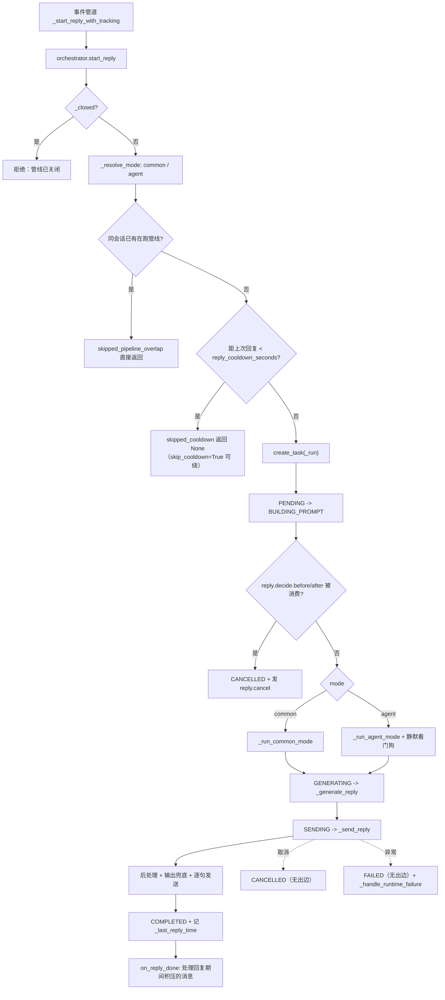
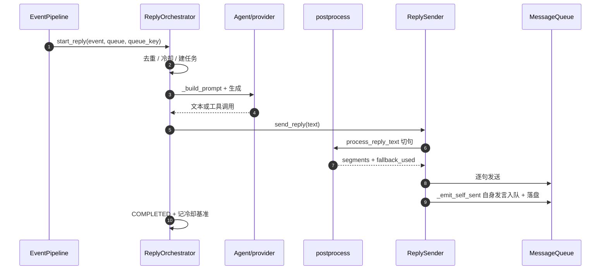
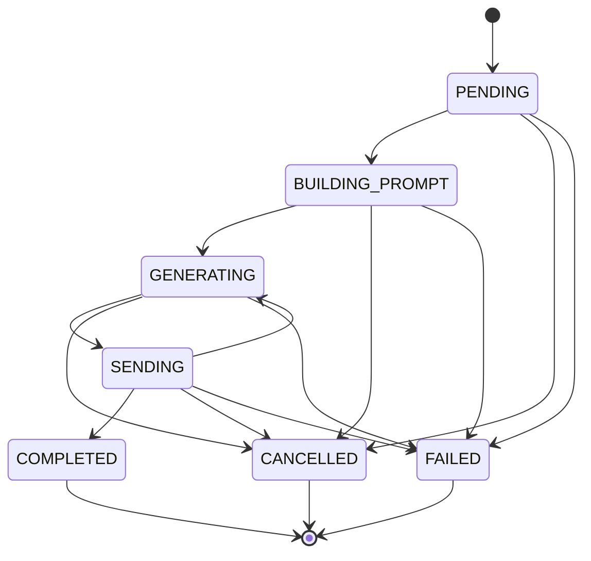
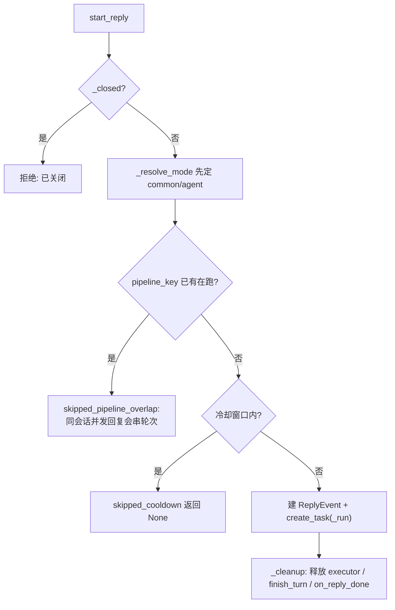
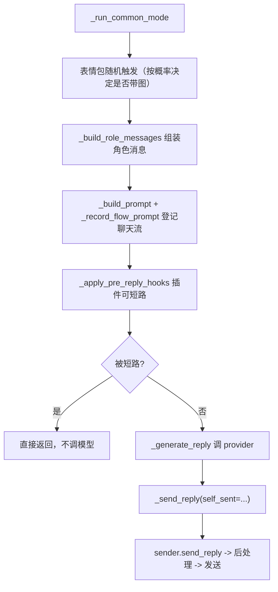
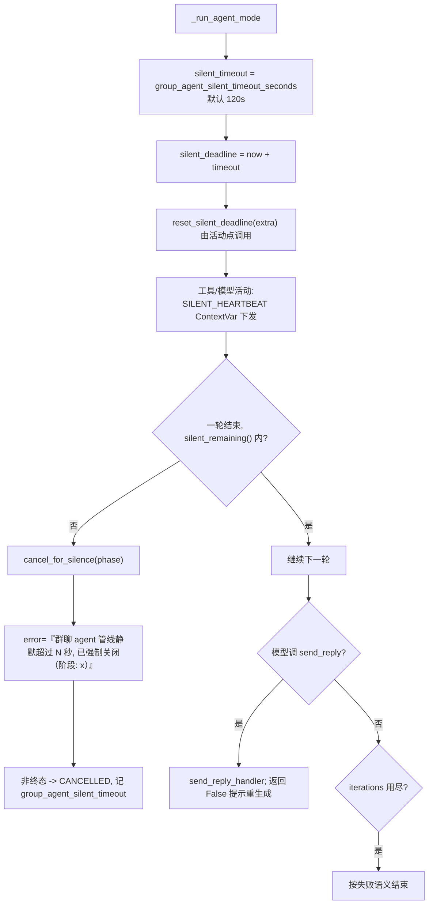
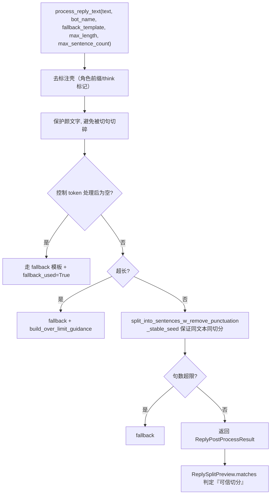
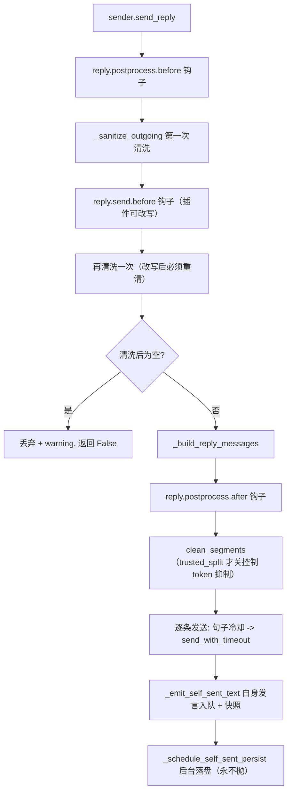
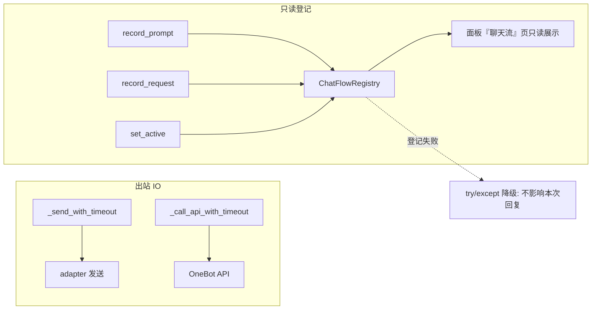

# 03 回复管线：状态机 / 冷却 / 静默看门狗 / 发送与后处理

## 范围

从事件管道喊 `start_reply` 到消息真正发出去（并把自身发言写回队列）的全部环节：
状态机、同会话去重、冷却、两种模式（common / agent）、静默看门狗、后处理与输出兜底、发送。
意愿判定本身见 `02-inbound-message.md` 的细节块与 `willing` 小节；工具迭代见 `04-agent-loop.md`。

## 流程

## 时序

## 细节

### 状态机：七个状态与合法迁移

`reply/event.py:19 ReplyState`、`:29 _VALID_TRANSITIONS`；`:58 transition` 对非法迁移直接
`raise RuntimeError`（「非法状态转换: A -> B」），三个终态没有出边。
群聊有个特例：`sender.py:167 _leave_sending` 允许 COMPLETED 之后再次进入 SENDING，
这样模型连续多次 `send_reply` 不会被状态机吞掉；私聊则回到 GENERATING。

### start_reply 的四道拒绝（顺序不能换）

`pipeline_key = f"{conversation_ref.kind}:{queue_key}"`（`orchestrator.py:600`）；
冷却基准是**上一次成功的 `_run` 完成时刻**（`:1805`），不是「上次收到消息的时刻」。
后台通知走 `start_background_reply`（`:761`），它带 `skip_cooldown=True`，不占用冷却额度。

### common 模式：提示词 -> 生成 -> 发送

AI 回复检查分流（`:3014`）：`full_check` 直接查；否则先用
`process_reply_text(...).fallback_used` 预演判断是否「需要复核」，需要则追加一条 user 消息
等模型再次 `send_reply`。这样避免「超长必炸」还要多花一次调用。

### agent 模式：静默看门狗（内联闭包，不是独立任务）

看门狗是 `_run_agent_mode` 里的闭包 + `SILENT_HEARTBEAT` ContextVar（`orchestrator.py:2031-2095`），
**没有独立任务** —— 调试时不要去找 `watchdog_task` 之类的东西。

### 后处理：去壳 -> 控 token 判定 -> 切句 -> 兜底

`postprocess.py:50` 是唯一入口；`:36 ReplySplitPreview.matches` 只有 text 与 segments
**逐字一致**才认为可信，不可信时发送侧不会抑制控制 token。

### 输出兜底与发送：两次清洗 + 自身发言入队

自身发言的合成 message_id 是**严格递减的负数**（`sender.py:561`），与后端真实 id 天然不撞号；
落盘 `event_id` 是 `self:<id>`，软重启后据此补齐 assistant 块。
入队失败只 warning：「宁可少一条上下文，也不能让回复发不出去」。

### 超时封装与聊天流登记（失败都不影响回复）

三处登记（`orchestrator.py:1337 / 1357 / 1382`）全部 try/except；
面板按 `pipeline_key` 取快照与后台任务（`flow_registry.py:147`）。
视觉上下文 `ReplyVisionContext`：每轮 `refresh_defaults` 在预算内加载图片，
`request_messages` 在请求边界追加图片附录，加载失败**可见可重试**。

## 关键状态

| 状态 | 谁置位 | 谁清理 | 失败时停在哪 |
|---|---|---|---|
| `ReplyState` 七态 | `ReplyEvent.transition` | 终态无出边 | 非法迁移直接 RuntimeError；终态补 `completed_at` |
| 同会话在跑标记 `_replying_queues` | `_start_reply_with_tracking` 成功后 | `on_reply_done` | start_reply 返回 None 时不置位（否则会话会被永久锁住） |
| 冷却基准 `_last_reply_time` | `_run` 成功完成时 | 不清理（只被新值覆盖） | 取消/失败都不刷新基准 |
| 静默看门狗 `silent_deadline` | `_run_agent_mode` 建闭包 | 每轮 `reset_silent_deadline` | 超时 -> CANCELLED + 记 phase，不抛异常上浮 |
| 发送中标记 | `sender._enter_sending` | `_leave_sending` | 群聊允许 COMPLETED -> SENDING 再入 |
| 自身发言落盘任务 | `_emit_self_sent` | 后台任务自行结束 | 永不抛异常，失败只记日志 |

## 易错点

* **冷却不是意愿的事**：`willing/service.py` 里没有 cooldown；回复冷却在
  `orchestrator.py:619`，逐句打字冷却在 `sender.py:456`，静默超时在 `orchestrator.py:2041`。
  改「不回复」的直觉时先确认是哪一层。
* **同会话去重与冷却都会让 `start_reply` 返回 None**：调用方（事件管道）必须把 None 当作
  「本次不回复」，而不是错误 —— 命令同步回复被拒时**不能**丢弃回复中标记。
* **插件改写后必须重新清洗**：`reply.send.before` 之后还有一次 `_sanitize_outgoing`，
  去掉它会让插件注入的标注壳直接发给用户。
* **状态机终态无出边**：想「失败后再发一条」要新建 ReplyEvent，不能把 FAILED 改回 SENDING。
* **自身发言必须入队且允许失败**：入队/落盘失败只 warning（`fix(2)` 的教训是「不入队会丢上下文」，
  但绝不能因为落盘失败把已发出的回复判为失败）。
* **看门狗是闭包不是任务**：关机路径不会去 cancel 它，靠 deadline 自愈；改 `_run_agent_mode`
  时要保证每个可能长时间阻塞的 await 前后都有 `reset_silent_deadline`。
