# 03b 回复管线的工具面：模型看到什么工具 · 谁执行 · 结果怎么回灌

## 范围

本图覆盖主回复管线（agent 循环）给模型看的**那一张工具表**及其执行侧：

* `reply/tools.py`（2688 行）：`ReplyToolExecutor.definitions`（装配 + 过滤）、`execute`（分派）、
  内建执行器（send_reply / wait / 会话工具 / 技能路由）、`build_reply_toolset`；
* `reply/output_guard.py`：发送前的标注 / 思维链 / 控制词兜底清洗（工具层与发送层共用）；
* `reply/vision_context.py`：原生视觉的**每次请求临时图片附录**（`ReplyVisionContext`）。

**不画什么**（相邻图）：Agent 循环本身的迭代 / 预算 / 空轮次（03-reply-pipeline、04-agent-loop）；
SkillManager 的注册与 `{skill}__{tool}` 命名细节（06-tools-skills）；插件加载（08-plugins）；
AgentToolRuntime 内部各叶子工具的实现（06-tools-skills）；`ReplySender` 的发送与冷却（03）。

**spec / 直觉与现实的差异**（本图逐条落到节点上）：

1. **初次下发的工具表不是「活的」**：`build_reply_toolset` 在构造时就把
   `executor.definitions()` 拍成 `Toolset.specs`；orchestrator 首轮用的是
   `reply_toolset.definitions()`（orchestrator.py:2646）这个快照，之后的重建才走
   `reply_toolset.executor.definitions()`。实测：`preactivate_skills` 之后
   `toolset.definitions()` 里**没有**新技能工具，只有 `executor.definitions()` 有（见「易错点」第 1 条）。
2. **`skills__load_tools` 的「本轮即可直接调用」有前提**：`consume_tools_dirty()` 只在
   **一次工具批次执行完之后**被检查（orchestrator.py:3322）。模型在同一个回合里先调
   `load_tools`、再调刚加载的工具是可以的（同一批次内的后续调用直接走 token 路由），
   但如果它这一轮**只**调了 load_tools，工具表要等到下一次模型调用才刷新。
3. SPLIT-MAP 标注 `reply/tools.py` 为 2537 行，实际 2688 行（含 `build_reply_toolset` 尾部）。

## 流程

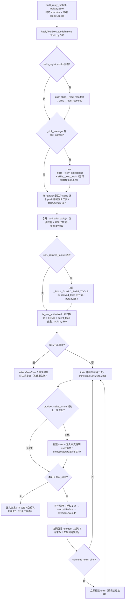

## 时序

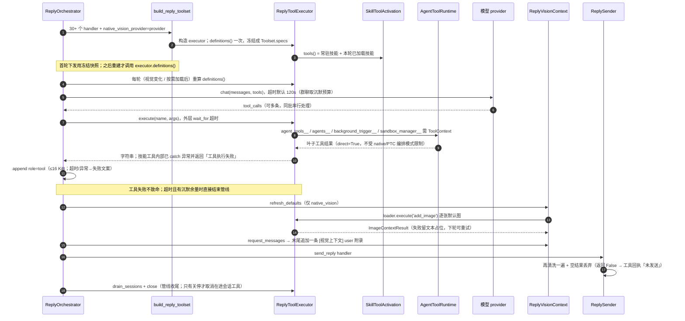

## 细节

### 工具清单：每个工具的出厂条件与执行入口

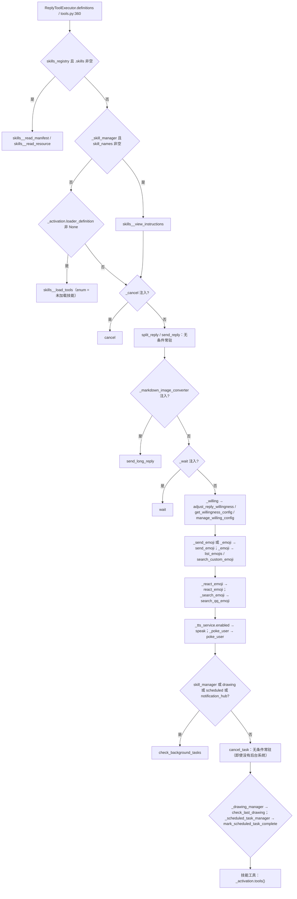

一句话版：**`split_reply` / `send_reply` / `cancel_task` 永远在**，其余工具全部取决于
构造时那个 handler 是不是 None；`speak` 还要 TTS 当前 enabled。

| 工具 | 出现条件 | 执行入口 |
|---|---|---|
| `skills__read_manifest` / `skills__read_resource` | `_skills_registry.skills` 非空 | `_read_skill_manifest` / `_read_skill_resource`（1 MiB、路径越界与软链接校验） |
| `skills__view_instructions` | `_skill_manager.skill_names` 非空 | `_view_skill_instructions` |
| `skills__load_tools` | 还有「可加载」技能时 | `_load_skill_tools` → `SkillToolActivation.load` |
| `cancel` | `cancel_handler` | `_execute_cancel` |
| `split_reply` / `send_reply` | 恒有 | `_execute_split_reply` / `_execute_send_reply` |
| `send_long_reply` | `markdown_image_converter` | `_execute_send_long_reply` |
| `wait` | `wait_handler` | `_execute_wait`（冷却默认 60s） |
| `adjust_reply_willingness` / `get_willingness_config` / `manage_willing_config` | `willing_service` | 三个 willing 执行器 |
| `send_emoji` | `send_emoji_handler` 或 `emoji_service` | `_execute_send_emoji` |
| `list_emojis` / `search_custom_emoji` | `emoji_service` | 分页上限 200 |
| `react_emoji` / `search_qq_emoji` | 对应 handler | `_execute_react_emoji` / `_execute_search_qq_emoji` |
| `speak` | `tts_service.enabled` 且 `speak_handler` | `_execute_speak`（清洗后为空即拒发） |
| `poke_user` | `poke_user_handler` | `_execute_poke_user` |
| `check_background_tasks` | 任一后台管理器 | `_execute_check_background_tasks` |
| `cancel_task` | 恒有 | `_execute_cancel_task` |
| `check_last_drawing` / `mark_scheduled_task_complete` | 对应管理器 | 各自执行器 |
| 技能工具（`{skill}__{tool}`） | 常驻技能或本轮已加载 | `_execute_skill` / `_execute_session_tool` |

### wire 可见性：原生视觉 · 技能常驻策略 · 任务工具模式三因素

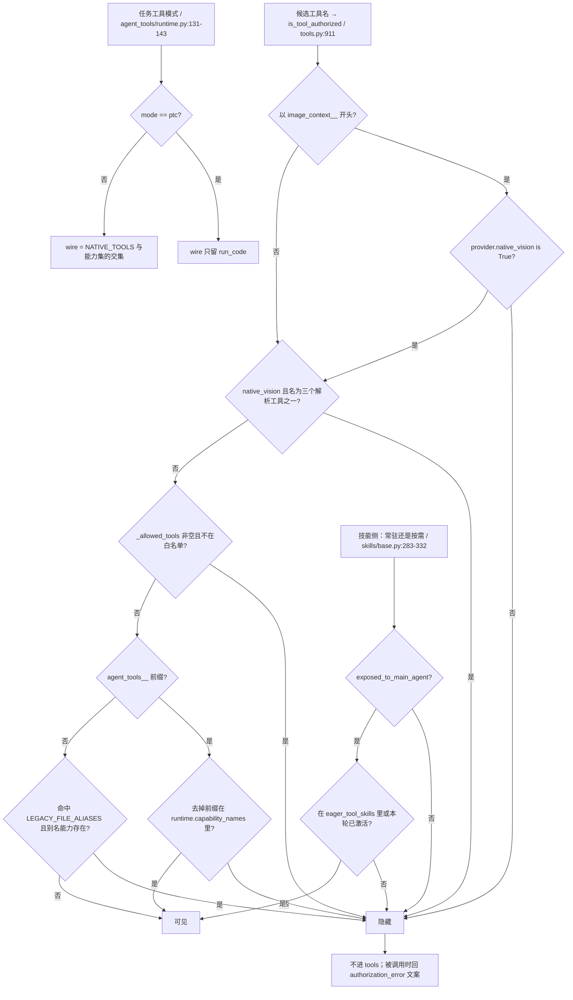

三个因素各自独立，别混：

* **原生视觉**（`native_vision_provider.native_vision is True`，即 chat provider）：为真时
  **藏** `image_parse__parse_image`、`drawing__inspect_image`、`user_profile__analyze_user_avatar`；
  不为真时**藏** 所有 `image_context__*`（默认只有 `image_context__add_image`）。没有配置项能覆盖。
* **技能常驻策略**：`SkillManager(eager_tool_skills=...)`，默认集是
  `chat_history / drawing / gallery / image_context / image_pool / image_send`（`skills/__init__.py:50`）；
  其余技能只在 `skills__load_tools` 之后出现。`agent_tools` 伞技能 `exposed_to_main_agent=False`，
  永远不常驻也不可被加载。
* **任务工具模式**：只决定**任务型 Agent**的编排方式；主回复管线用
  `agent_tools_packages` 的按需包（内部固定 `runtime.definitions(mode='native')`），
  所以切到 PTC 也不会把主回复工具换成一个 `run_code`。

`is_tool_authorized` 与 `_policy_authorized` 在 `definitions()`（tools.py:886）与
`execute()`（tools.py:957）两处都跑；orchestrator 里在 `tool.call.before` 前后**各查一次**
（orchestrator.py:3126、3175），因为钩子可以改写工具名与参数。

### executor 分派：授权 → 计划模式 → 内建 if 链 → 技能路由

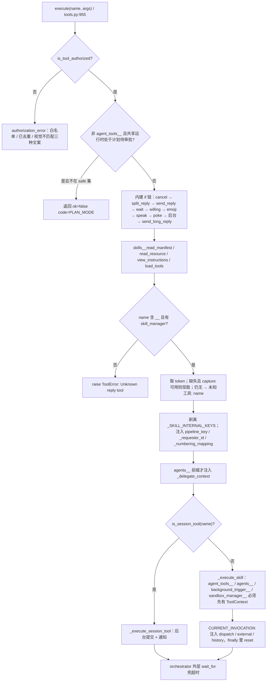

* 授权失败**不抛异常**：返回中文字符串给模型（`Error: …`），模型可以改参数重试。
  只有完全未知的名字才会 `raise ToolError`，由 orchestrator 记成工具失败。
* 技能路由要求「可信聊天身份」：`conv_kind in {group, private}` 且 `conv_id` 是数字；
  缺失时 `agent_tools__*` 返回 `{"ok": false, "code": "CONTEXT_REQUIRED"}`。
* 技能工具的真实执行在 `SkillManager.execute`（skills/base.py:409）：`{prefix}__{tool}` 精确匹配
  owner，token 对不上返回「工具不可用或已更新」；技能内部异常被 catch 成
  `工具执行失败 [name]: <脱敏摘要>` —— **工具面看不到异常**，只有日志里有。

### 结果回灌与失败语义：role=tool · 16 KiB 截断 · 连续失败软提示

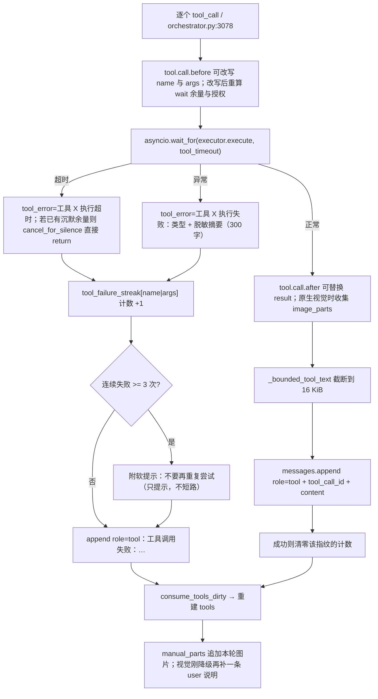

* `tool_timeout` = 沉默余量（有预算时）否则 `max(模型响应超时, wait 秒数 + 依赖超时 10s)`
  （orchestrator.py:3117-3124）；模型响应超时群聊取 `group_agent_silent_timeout_seconds` 默认 120s。
* **超时**：有沉默预算 → 结束整条管线；没有预算（私聊等）→ 只把失败写回给模型。
* **异常**：工具失败绝不冒泡出管线；异常摘要先脱敏再进上下文。
* 结果永远是字符串：`ImageContextResult` 是 `str` 子类，图片以 `image_parts` **带外**返回，
  orchestrator 必须在转成文本**之前**读走它（tools.py:1093-1095 与 orchestrator.py:3197-3201 两处）。

### 原生视觉切换：工具增删与「只多给一轮」的重试

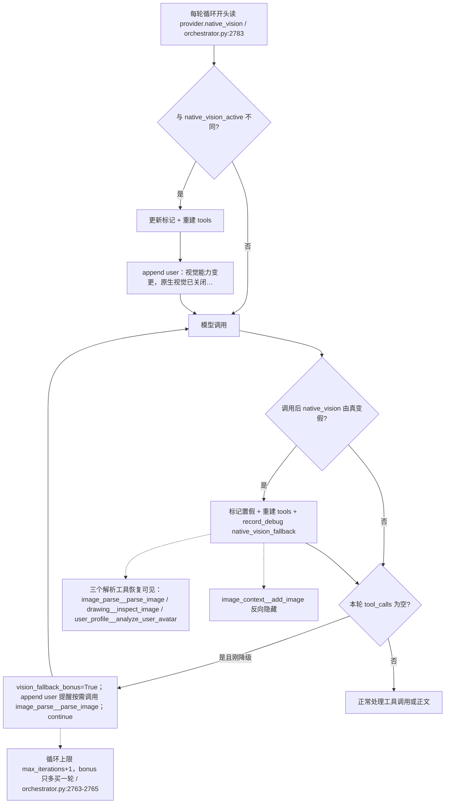

* 两处检测点：**循环开头**（`2783`，检测任意方向的变化）与**模型调用之后**（`2972`，只检测真→假）。
  前者会补一条「[视觉能力变更]」提示；后者补的是「[原生视觉回退]」并允许额外一轮。
* 降级后模型不能凭空声称看过图片：注入的 user 文案明确要求「按需调用
  `image_parse__parse_image`，不能声称已经看到图片」。
* 图片本身不重发：降级的轮次里已经加载的 `image_parts` 会被丢弃（附录只在
  `native_vision_active` 为真时拼接），失败是「看不到」而不是「看到旧图」。

### 输出兜底三入口：工具层 → 发送层 → 切分层的调用时序

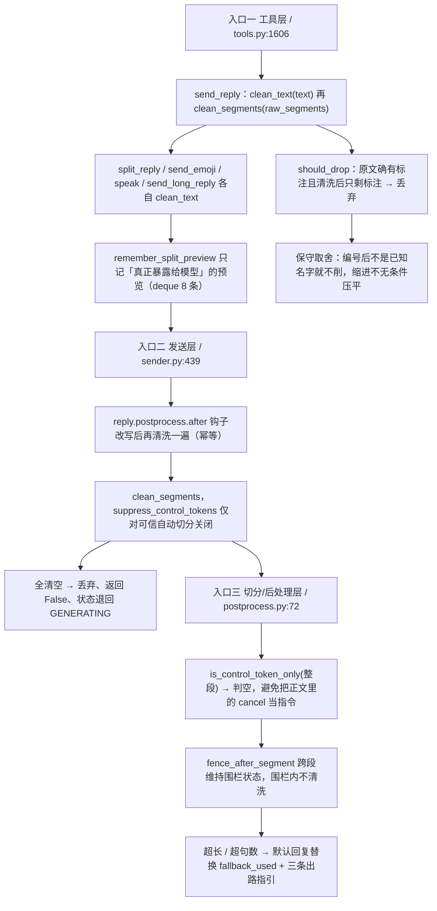

三个入口的分工：

1. **工具层**让模型看见「自己真正发出去的是什么」；`send_reply` 返回的正文就是清洗后的文本。
   清洗后为空时**直接不发**并回一段可操作的中文提示（tools.py:1627-1633）。
2. **发送层**是最后一道：插件钩子可以改逐条内容，所以清洗必须再来一遍；
   全部清空时返回 `False`，`send_reply` 把它翻译成「没有可发送的正文或图片，未发送」，
   避免模型以为已经回复而结束整轮。
3. **切分层**决定「这条还算不算一句话」：`cancel` 只有整段就是一个裸控制词才被吞掉，
   `cancel 是什么意思` 原样保留。

已知取舍写在模块 docstring 里：无法标注的脏草稿（例如「192: 我是一条鱼」而 192 后不是
已知名字）会被保留 —— 精度优先于召回。

### 视觉上下文：默认图片预算、失败可见、可重试

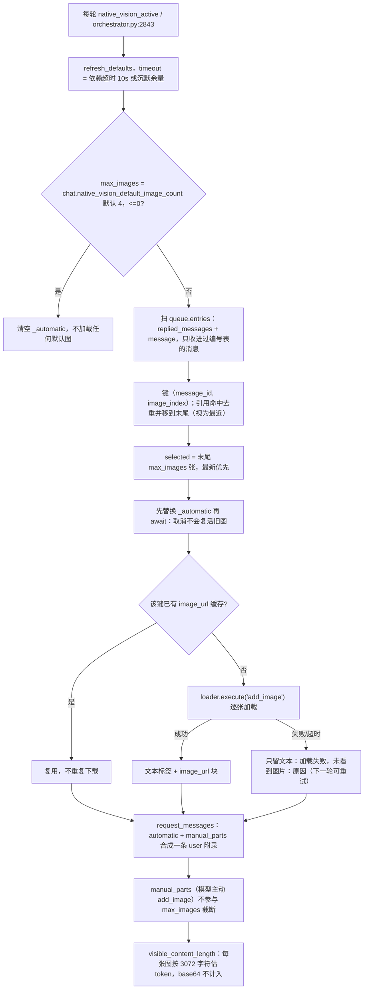

* 附录永远在**请求边界**追加（`append_image_context`），历史保持纯文本：
  自动图 `[默认加载图片]`、工具图 `[主动加载图片]`，两者都带 `tool_call_id` 与元数据 JSON。
* 加载失败**不静默**：占位文本写明「图片尚未加载或加载超时，不能判断其内容」，
  下一轮 `refresh_defaults` 会重试（键相同但缓存里没有 image_url 块）。
* 主动加载（`image_context__add_image`）是普通工具，不是会话工具；它自己的限额是
  单图 10 MiB、单次合计 20 MiB、2000 万像素、最长边 4096（超限等比缩小）。
* `_estimate_tokens` 用 3072/张的保守估值，避免把 base64 当成正文 token 把预算算爆。

### 会话工具生命周期：1 运行 + 1 排队 · 超时 · 通知

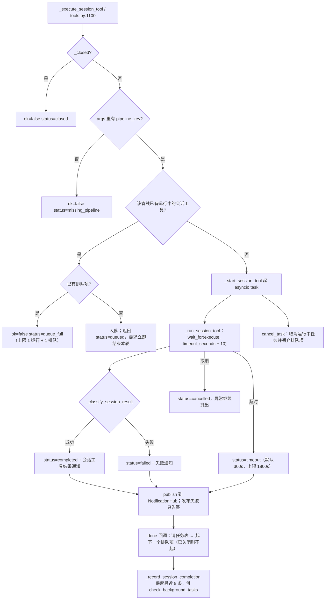

* 声明为会话工具的技能工具只有两个：`image_parse__parse_image`
  （image_parse_skill.py:139）与 `sandbox_manager__download_file`（sandbox_manager_skill.py:84）。
* `_parse_session_timeout`：`0 / None / 布尔 / NaN / 畸形` → 300；负数钳到 1；上限 1800。
  **`timeout_seconds=0` 不是「不超时」**，而是回落到 300 秒。
* 结果分类看 `error/errors` 键、`status in {cancelled, error, failed, failure, timeout}`、
  以及 `ok` 的真值（字符串 "false"/"no"/"0"/"none"/"" 都算失败，`ok=None` 也算失败）。
* 会话工具**活过本轮回复**：管线结束只 `drain_sessions`（等它跑完），
  只有进程关停的 `close()` 才 `cancel()` 在途任务。

### 与 skills / agent_tools 的边界：同一能力两个入口的差异

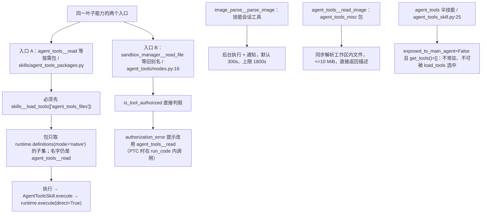

* 五个按需包共享前缀 `agent_tools`，因此加载前后工具名完全一致
  （`agent_tools__read` 等），模型不用区分来源；路由按**最终名**精确匹配。
* 执行入口统一走伞技能的 `execute`，所以凭据、计划模式、归属校验完全相同；
  包本身只是「呈现方式的裁剪」。
* `agent_tool_capabilities()`（tools.py:901）算的是**能力集**（与 wire 呈现无关），
  `ptc_enabled` 时额外包含 `run_code`；它被塞进 `ToolContext.allowed_tools`，
  供 runtime 二次校验「这个叶子工具是否在本轮授权范围内」。
* 计划待审批时，旧工具入口（除 safe 列表外）一律返回 `PLAN_MODE`，
  防止模型用「不经过 run_code 的老路」绕过执行限制。

### 上限与阈值一览：写死在代码里的数字

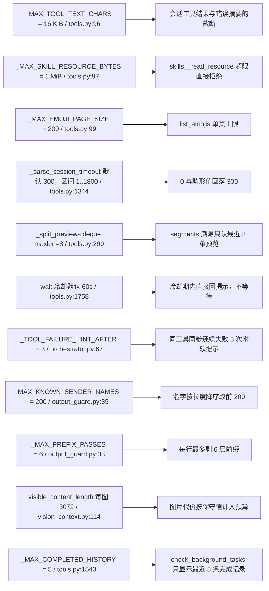

这些值全在代码里，`config.toml` 改不到；调参需要改代码。与配置项相连的只有：
`chat.native_vision_default_image_count`（默认 4）、`chat.wait_cooldown_seconds`（默认 60）、
`chat.agent_wait_max_seconds`（默认 60）、`chat.agent_max_iterations`（默认 200）。

## 关键状态

| 状态 | 谁置位 | 谁清理 | 失败时停在哪 |
|---|---|---|---|
| `Toolset.specs`（首轮工具快照） | `build_reply_toolset` 里的 `definitions()` | 不清理；后续重建走 `executor.definitions()` | 预激活 / 首轮加载的技能工具**不在首轮表里**，要等一次重建 |
| `_split_previews`（≤8 条） | `remember_split_preview`（split_reply / AI 检查暴露的预览） | deque 自然淘汰；随执行器释放 | 未匹配预览时 `segments` 一律独立清洗，`ai_check_approved` 不能跳过清洗 |
| `_ai_check_pending` | `_build_ai_check_prompt` | `send_reply` 成功 / `cancel` / `send_long_reply` 成功 | 下一轮无 tool_calls → `FAILED`「AI回复检查未通过」 |
| `_session_task_info` / `_session_task_queue` | `_start_session_tool` / 排队 | done 回调、`cancel_task`、`close()` | 排队满 → `queue_full`；关停后提交被拒 |
| `_session_completed` | `_record_session_completion` | `close()`；超过 5 条截断 | 只影响 `check_background_tasks` 视图，不影响执行 |
| `_skill_tokens` | `definitions()` 时 `capture_execution_token` | 随执行器释放 | token 对不上 →「工具不可用或已更新」/「未知工具」 |
| `_closed` | `close()`（幂等） | 不清理 | 之后的会话工具提交、排队消费、新任务启动全部被拒 |
| `_activation._activated` / `_dirty` | `load()` / `preactivate_skills` | 随执行器释放；`consume_dirty` 只清标记 | 未加载的技能工具不可见，但**已经注册**的名字仍可执行 |
| `vision_context._automatic` | `refresh_defaults` | 下一轮整体替换 | 加载失败留文本占位，并在下一轮重试 |
| `vision_context.manual_parts` | 每轮 `image_parts` 追加 | 随管线对象释放 | 不受 `max_images` 截断（主动加载没有张数上限） |
| `native_vision_active`（管线局部变量） | orchestrator:2784 / 2976 | 管线结束即消失 | 只影响 `tools` 与图片附录；system 提示词里的 `[native_vision]` 段不会跟着改 |

## 易错点

* **首轮工具表是快照，不是活列表（本轮实测）**：`build_reply_toolset` 冻结
  `Toolset.specs`，orchestrator 首轮用 `reply_toolset.definitions()`。实测
  `preactivate_skills(["dummy"])` 之后 `toolset.definitions()` 里没有 `dummy__ping`，
  `executor.definitions()` 里有，且 `consume_tools_dirty()` 为 True。
  后果：插件 `preactivate` 意图（minigame 的 `agent_reply(preactivate=[...])`）在
  **首轮模型调用里拿不到新工具 schema**，要等模型先调一次别的工具触发重建才补上。
  排查「插件说预激活了但模型不会用」时先看这里。
* **`is_tool_authorized` 被调用两次不是冗余**：`definitions()` 过滤 + `execute()` 拦截，
  orchestrator 还在钩子前后各查一次（钩子能改工具名）。别把其中一处当死代码删掉。
* **视觉规则是双向的**：`native_vision=True` 藏三个解析工具；`!= True` 藏 `image_context__*`。
  没有开关能同时拿到两边——这正是「切换时必须重建 tools」的原因。
* **`agent_tool_capabilities()` 与 wire 呈现无关**：它算的是能力集（决定 `ToolContext.allowed_tools`），
  `ptc_enabled` 只影响这里是否包含 `run_code`，不影响主回复管线直接调用叶子工具。
* **技能 allowed-tools 白名单是「全部命中技能都声明才生效」**（orchestrator.py:2162-2172）；
  生效时 `_SKILL_GUARD_BASE_TOOLS` 里的会话基础设施（cancel/send_reply/wait/
  check_background_tasks/cancel_task/agents__delegate…）**不能被限制掉**，这是有意设计。
* **同参数连续失败的软提示只提示不短路**（orchestrator.py:3258）：部署修好后必须还能继续调用；
  反过来，看到 3 次失败提示不等于工具被禁用。
* **`drain_sessions` ≠ `close`**：管线结束只等在途会话工具跑完（通知要靠它），
  只有进程关停才取消。任何新代码用 `close()` 收尾一轮回复都会砍掉在途 `parse_image`。
* **`image_context__add_image` 与 `image_parse__parse_image` 是两种能力**：前者把图片塞进
  原生视觉上下文（普通工具、不限额张数、受字节/像素限制），后者走独立视觉模型解析
  （会话工具、后台执行、默认 300s）。它们在原生视觉开关下互为镜像，别混用。
* **计划待审批的 safe 列表里有已被去重的旧别名**（`sandbox_manager__read_file` 等，
  tools.py:967-972）：共享运行时存在时这些名字先被 `is_tool_authorized` 拦掉，
  列表里的条目是死条目，不是「计划模式下仍可用」的承诺。
* **`timeout_seconds=0` 不是「不超时」**：会话工具的 0/None/布尔/NaN 一律回落 300 秒，
  真正的上限是 1800 秒，且外层还要再加 10 秒收尾窗口。
