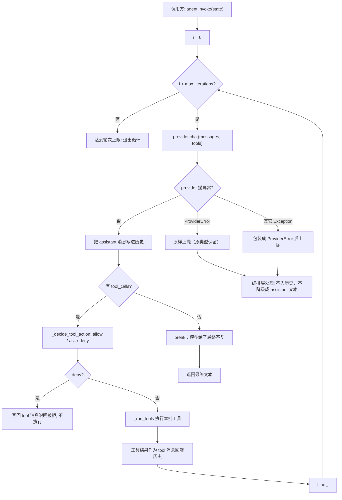
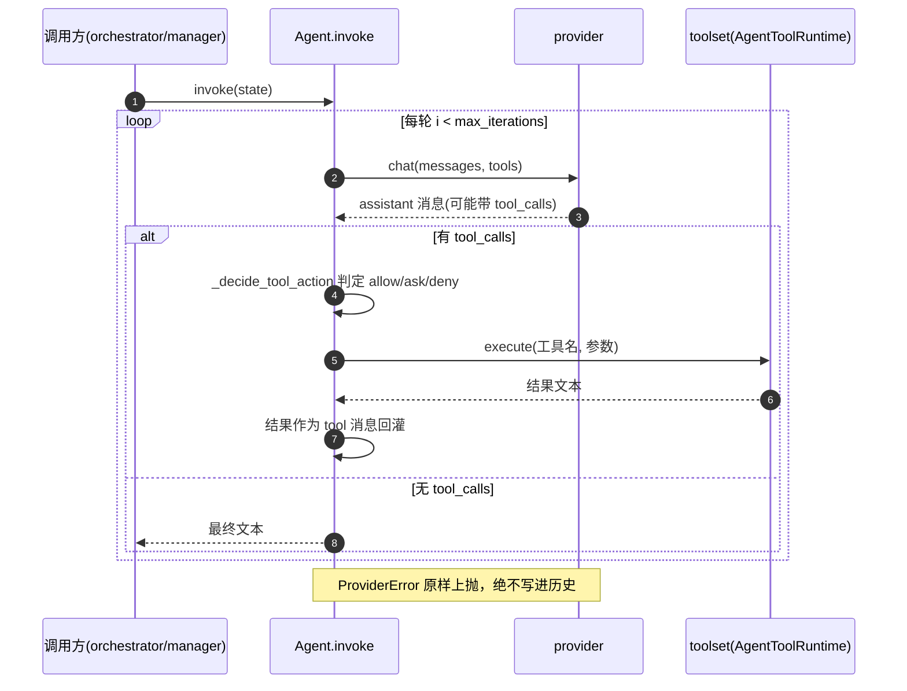
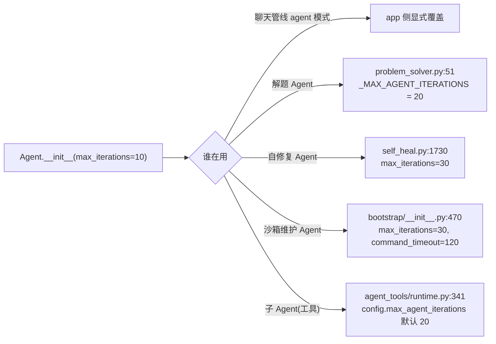
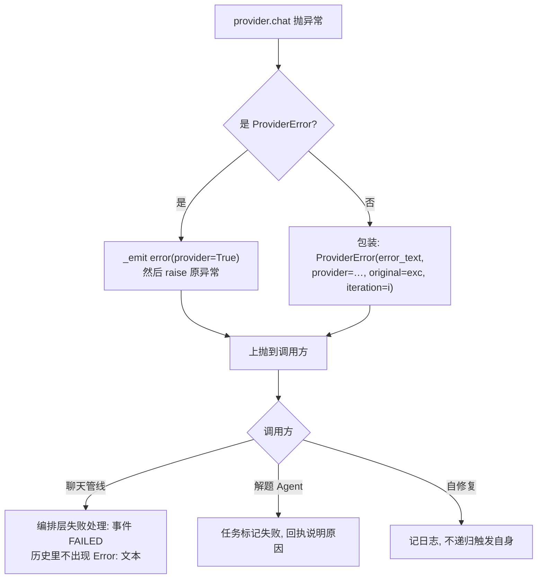
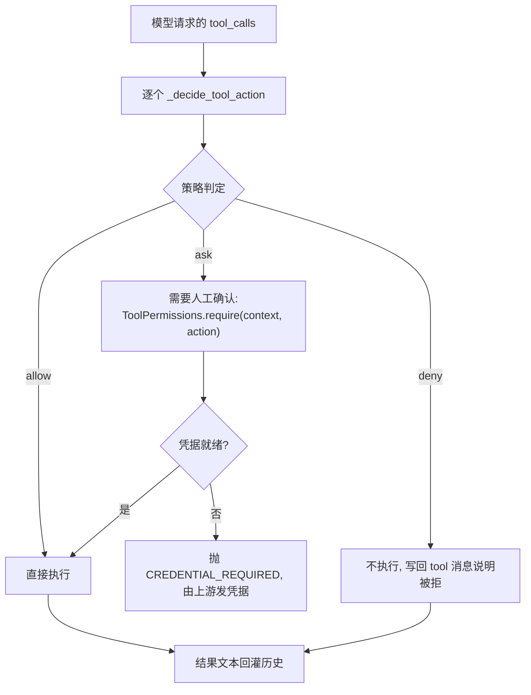
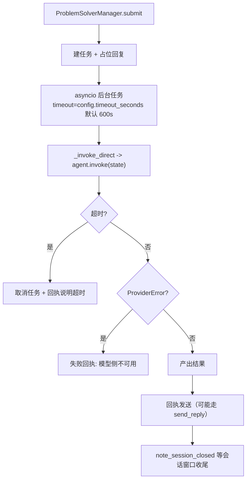
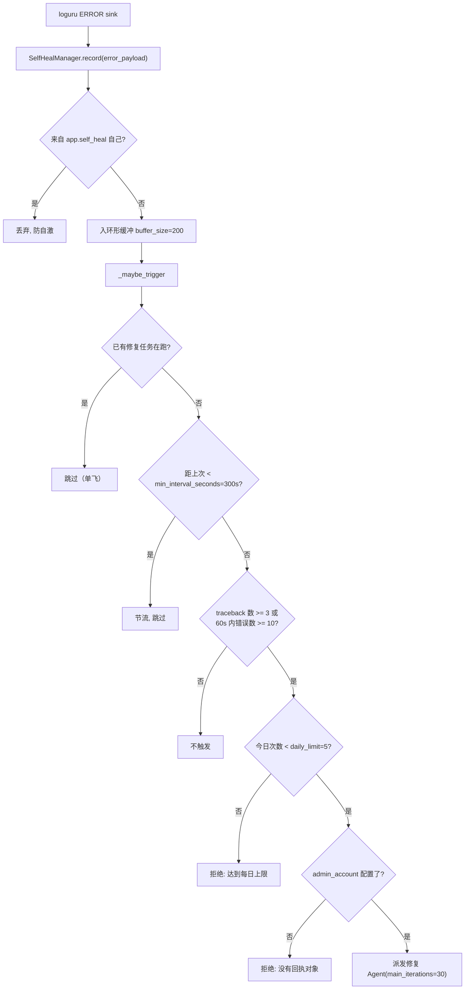
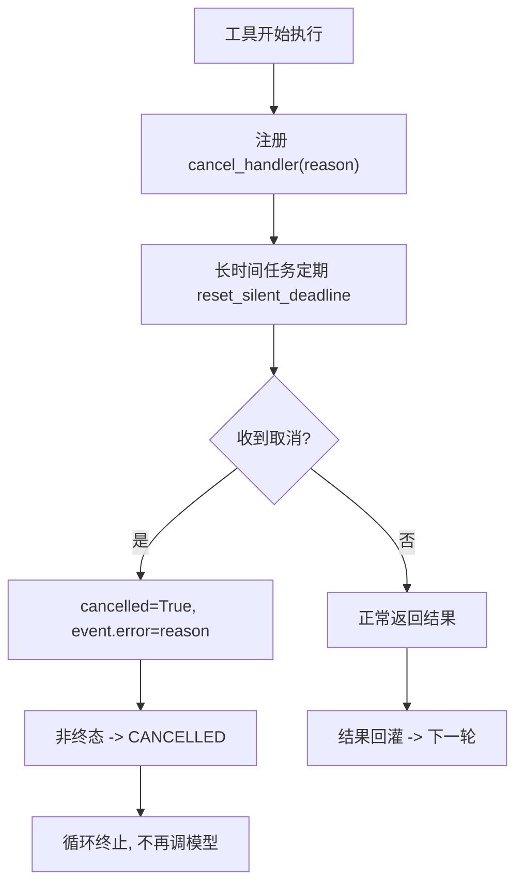

# 04 Agent 循环：工具迭代 / 轮次上限 / 失败语义 / 自修复

## 范围

模型与工具之间的往返循环本体（`packages/chat/src/neobot_chat/runtime/agent.py` `Agent` 类），
以及 app 侧怎么用它：解题 Agent（`ProblemSolverManager`）、自修复 Agent（`SelfHealManager`）。
工具清单与技能注册见 `06-tools-skills.md`；模型路由见 `05-llm-routing.md`。

## 流程

## 时序

## 细节

### 迭代上限：三处不同的数字

`packages/chat/src/neobot_chat/runtime/agent.py:53` 的默认值是 10，**实际生效值看调用点**：
改上限时容易只改一处，导致「聊天够用、解题不够」这类不对称问题。
`stream_invoke`（`:150`）用同一个上限，流式与非流式的轮次语义必须一致。

### 失败语义：ProviderError 的类型契约

类型定义在 `packages/chat/src/neobot_chat/schema/exceptions.py:8 ProviderError`。
`fix(12) §4.2` 的教训：**绝不能**把 provider 异常吞成一条 assistant 文本 —— 那会污染历史，
让模型以为「刚才那句 Error: … 是自己说的」。

### 工具裁决：allow / ask / deny 三分支

`agent.py:327 _decide_tool_action`、`:370` deny 分支；
敏感操作凭据在 `agent_tools/permissions.py:13`。
「被拒」也是一次有效轮次（要有 tool 消息），否则模型会反复重试同一个被拒调用。

### 解题 Agent：提交 -> 后台任务 -> 超时

解题 Agent 与聊天管线**共用同一个 `Agent` 类**：`problem_solver.py:21` 直接
`from neobot_chat import Agent`，本文件只负责配置、委托与提示词。查工具循环问题请去
`packages/chat/src/neobot_chat/runtime/agent.py`，不要只看 app 侧。

### 自修复：三重门槛 + 每日上限

阈值来自 `agents/self_heal.py:101 SelfHealAgentConfig`（traceback_threshold=3、
rate_threshold=10、rate_window_seconds=60、min_interval_seconds=300、daily_limit=5）。
`trigger_now`（`:349`）是手动入口，注释写明**暂未接入技能** —— 想手工触发要自己接线。

### 工具执行期间的取消与心跳

取消是「工具层可见」的：`orchestrator.py:2259 cancel_handler` 注入 toolset，
这样进程命令、子 Agent 之类长任务能被静默看门狗或用户命令打断，
而不是等 `max_iterations` 耗完。

## 关键状态

| 状态 | 谁置位 | 谁清理 | 失败时停在哪 |
|---|---|---|---|
| 轮次计数 `i` | `invoke` 循环 | 循环结束即弃 | 到 `max_iterations` 直接退出（不是异常） |
| 历史 messages | 每轮追加 assistant / tool | 循环结束交回调用方 | ProviderError 时**不追加**，历史保持干净 |
| 工具裁决结果 | `_decide_tool_action` | 单次调用 | deny 也写 tool 消息，避免重复请求 |
| 自修复单飞任务 | `_dispatch` | 任务 done 回调 | 单飞/节流/阈值/每日上限任一不满足即不触发 |
| 取消标记 | `cancel_handler(reason)` | 每个回复事件独立 | 非终态转 CANCELLED，工具尽快退出 |

## 易错点

* **主循环不在 `agents/problem_solver.py`**：那是配置与委托；循环本体在
  `packages/chat/src/neobot_chat/runtime/agent.py`。改循环语义要同时看 `invoke` 与 `stream_invoke`。
* **providers 异常必须原样上抛**：包装只对「非 ProviderError」做；把 `ProviderError`
  也包一层会让原生视觉降级判定失效（`05-llm-routing.md` 依赖这个类型）。
* **轮次上限有三个数字**：默认 10、解题 20、自修复/沙箱维护 30、子 Agent 取
  `agent_tools.max_agent_iterations`。改一个要知道影响谁。
* **deny 不写历史是 bug**：模型会无限重试被拒的工具，必须在历史里留下 tool 消息。
* **自修复要防自激**：`record` 里跳过 `app.self_heal` 自己的日志，否则一次失败会滚成风暴。
