# 05 模型路由与降级：角色/编号路由 · 原生视觉回退 · 计费与统计

## 范围

本图覆盖「一次模型调用」前后的三段链路：

1. **路由**：`[agent_model]`（角色 -> 编号 0-3，`config/schemas/bot.py:656`）与
   `[models.assignments]`（角色 -> 模型引用名 model_ref，`:538`），经
   `assembly/agents.py:38 resolve_agent_model_name` 解析成 `create_provider` 能用的 key；
2. **降级**：`bootstrap/_providers.py:26 build_main_provider` 的三条分叉，以及
   `packages/chat/src/neobot_chat/providers/native_vision.py:15 NativeVisionFallbackProvider`
   在运行期因 `NativeVisionUnsupportedError` 把本次请求切到视觉模型；
3. **计费与统计**：`statistics/tracker.py:56 UsageTracker.record` 是唯一的用量落点，
   `statistics/billing.py:711 BillingService.compute_cost` 决定 `cost_source`，
   `statistics/reporter.py:27 generate_all_reports` 产出 5 张 Markdown 报表；
   观测点落在 `observability/logging.py:247 configure_loguru` 与 `observability/debug.py:57 DebugRecorder`。

**不画什么**：

* provider 的 HTTP 重试与消息序列化细节（`BaseHTTPProvider._request_with_retry`、
  `to_openai_content` / `to_anthropic_content`）、异常类型的全表 —— 归
  `05b-provider-native-vision.md`（待补）；
* 入站消息与回复状态机 —— `02-inbound-message.md`、`03-reply-pipeline.md`；
* Agent 循环与工具执行 —— `04-agent-loop.md`；
* 回复意愿概率 —— `02b-willing-probability.md`。

**spec 与现实的差异提示**（读代码得到，不是配置文档里的说法）：

* `AgentModelRouting` 的 `creator` / `memory` / `chat_interaction` / `willingness` /
  `scheduled_task` 五个编号字段，**当前没有任何 resolve 调用点**；全仓解析只发生在
  `main_agent` / `problem_solver` / `self_heal` / `archive_summary` 四个角色上。
* `problem_solver` **不是** `AgentModelRouting` 的字段，所以它的编号恒为
  `default_index=1`（`bootstrap/_pipeline.py:196`），配置里没有对应开关。
* 主模型声明 `native_vision=True` 时，若视觉模型不可用，`_providers.py:62` 直接返回
  `(None, error)` —— 即使主 provider 本身创建成功也不会被使用。

## 流程

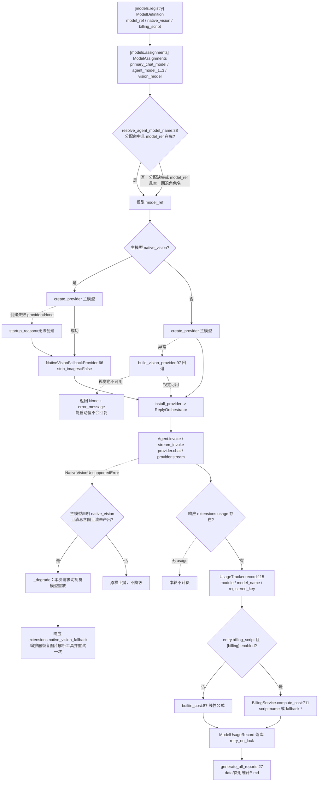

## 时序

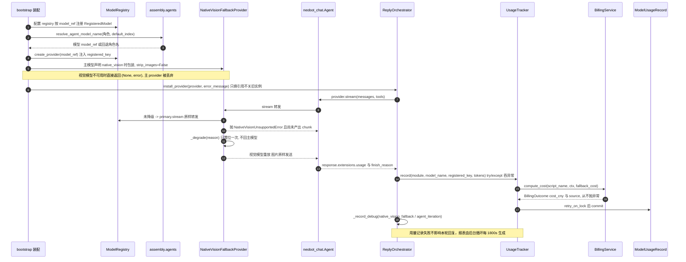

## 细节

<details>
### 两层路由：角色 -> 编号 -> 模型 key，每个字段与当前消费者

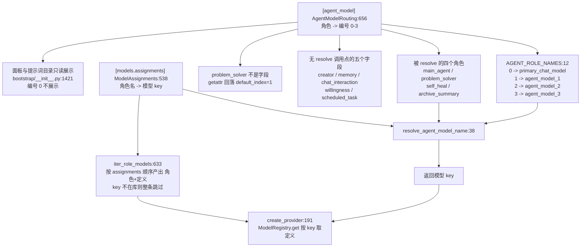

| 层 | 结构 | 默认值（当前 schema） |
|---|---|---|
| 角色 -> 编号 | `AgentModelRouting` 8 个整数字段 | main_agent=0；其余 7 个（creator/memory/chat_interaction/willingness/scheduled_task/archive_summary/self_heal）全为 1 |
| 编号 -> 角色名 | `AGENT_ROLE_NAMES` 硬编码字典 | 0/1/2/3 -> primary_chat_model/agent_model_1/agent_model_2/agent_model_3 |
| 角色名 -> key | `ModelAssignments` 6 个单值角色 + 1 个列表 | primary_chat_model=deepseek-flash；agent_model_1/2/3=deepseek-flash-max/high/off；vision_model=qwen3-vl-8b；tts_model=cosyvoice2；creator_image_models=[flux-schnell] |

关键事实：**配置里没有「角色 -> key」的直连字段**。改 `[agent_model].main_agent=2` 只是让主回复
去引用「编号 2 当前绑定的 key」，真正换模型要改 `[models.assignments].agent_model_2`。
`iter_role_models`（`:633`）只遍历 assignments，因此**没有出现在 assignments 里的 registry 条目
不会被注册进全局模型库**（`config/loader/manager.py:496-533` 先 `registry.clear()` 再逐条注册，
注册名就是 ModelDefinition 的 key）。`missing_assignment_keys`（`:645`）列出悬空引用，
装载器据此决定降级还是致命。
</details>

<details>
### resolve_agent_model_name 的每一步判据与两种回退

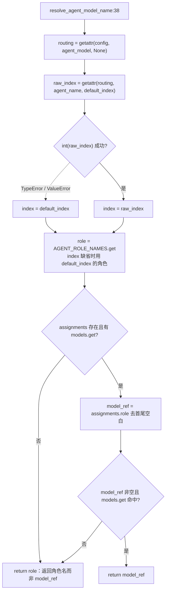

* `models.get` 是 `Models.by_key`（`bot.py:624`）的查询：**只认注册表里的 key**，
  角色名不在其中，所以回退分支返回的 `role` 通常会一路走到
  `ModelRegistry.get` 抛 `ValidationError`（`packages/chat/.../models.py:163-167`）。
* 编号越界（如 7）不会报错：`AGENT_ROLE_NAMES.get(index, AGENT_ROLE_NAMES[default_index])`
  静默改成 `default_index` 的角色。`int(True)` 等于 1，`int("2")` 也成立。
* `default_index` 由调用点决定：`bootstrap/_providers.py:42` 与 `cli.py:498` 用 0（主对话），
  `_providers.py:114` 统一用 1（可选 Agent）。
* 该函数不缓存、不落盘：每次构建 provider 时现算，热重载后立即生效。
</details>

<details>
### 主 provider 构建：三条分叉与返回契约

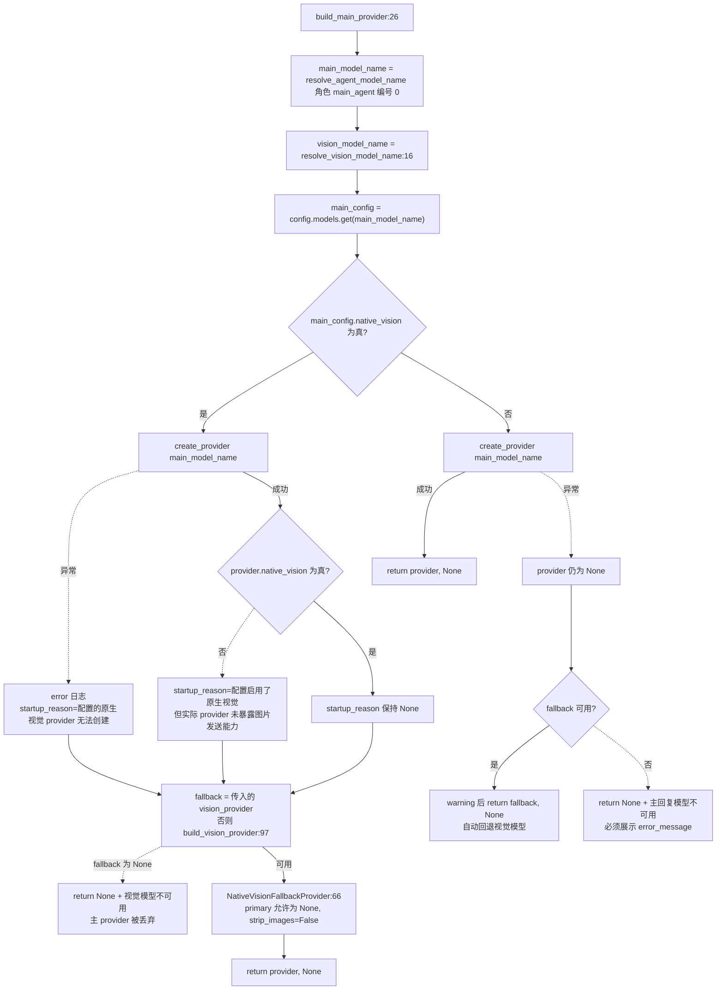

* 装配顺序（`bootstrap/__init__.py:815-820` 与热重载 `:252-260`）：**先建视觉 provider**，
  再建主 provider，且把视觉 provider 传进去复用 —— 同一个实例同时服务图片解析与回退路由。
* `resolve_vision_model_name`（`:16`）与主模型同构：`vision_model` 分配命中才返回 key，
  否则返回常量 `"vision_model"`。默认库里没有这个 key，于是 `create_provider` 抛异常、
  `build_vision_provider` 只 warning 并返回 None。
* **返回契约**（docstring 明说）：`provider is None` 时 `error_message` 必须非空，
  否则「能启动但不会回复」会变成无法定位的静默故障。调用方是
  `install_provider(provider, error_message)`（`reply/orchestrator.py:971`，只换引用、不关旧实例）。
* `:77` 与 `:86` 两个 `if provider is None` 是顺序结构而不是 if/else：视觉回退可用就在第一个出口
  返回，不可用则穿透到第二个出口给出文案；两次判断之间 `provider` 没有被重新赋值。
* 解析阶段的两个异常 `.` 分支都只写日志不抛出：provider 创建失败永远退化为「回退或返回错误」，
  不会把装配流程打断。
</details>

<details>
### 原生视觉降级的三个触发点与四条准入条件

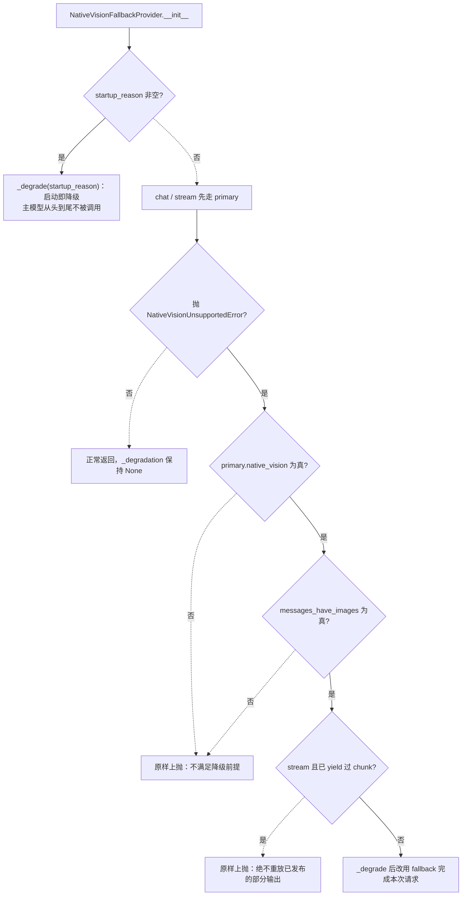

**三个触发点**：

1. 启动期 `create_provider` 失败 -> `startup_reason="配置的原生视觉 provider 无法创建"`；
2. 启动期 provider 可用但 `native_vision` 为假 -> `startup_reason="配置启用了原生视觉，但实际
   provider 未暴露图片发送能力"`，wrapper 立刻降级（主模型被跳过）；
3. 运行期 `NativeVisionUnsupportedError`。仓库内的抛出点：
   `providers/deepseek_offical.py:210`（图片出现在非 user 消息）、`providers/anthropic.py:67`
   （system 消息含图）、`providers/vision.py:45`（HTTP 400/422 正文命中能力拒绝正则）、
   `vision.py:80/107/112`（无法序列化的图片块）。前两处发生在**序列化期**，消息里确实含图。

**不会触发降级的情况**（务必区分）：401/403/429/5xx、超时、连接错误、图片本身非法
（`raise_if_image_unsupported` 只在 400/422 且正文命中 5 条正则之一时才升级成类型化异常，
见 `vision.py:14-47`）；普通 `ProviderError`（如 `deepseek_offical.py:243` 的 API 错误）
不是子类，也直接上抛。
</details>

<details>
### _degrade 与 strip_images：图片保不保留、通知怎么写

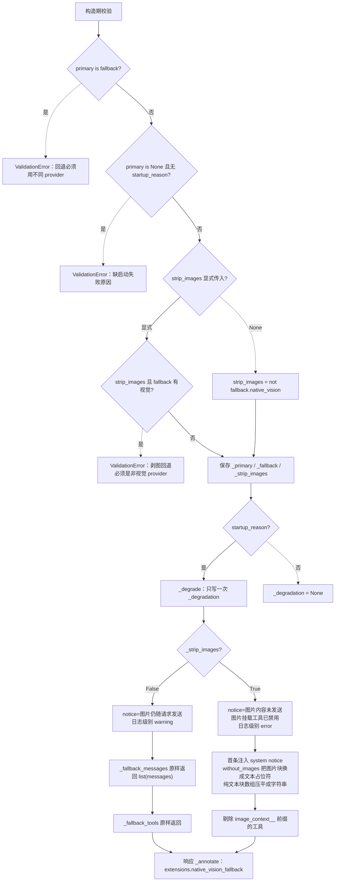

* `strip_images` 的实际取值：主链路**写死 False**（`_providers.py:69`），因为视觉模型在
  `ModelDefinition.__post_init__`（`bot.py:345`）里被强制 `native_vision=True`。默认推导式
  `not fallback.native_vision` 只在别处手工构造 wrapper 时才生效。
* `native_vision` 属性（`:64-71`）语义：**已降级且不剥图时返回 True** —— 图片原样发给了视觉模型，
  能力必须如实上报，否则上层会改走图片解析流程。已降级且剥图时返回 fallback 自身的能力。
* `_degrade` 是**一次性**的：`if self._degradation is not None: return`（`:112`），
  且没有恢复主模型的路径；只有新建实例（重启或配置热重载）才复位。
* `vision_degradation`（`:108`）返回 dict 副本，字段为
  `reason / from_model / to_model / notice`；`_annotate` 把它挂到响应消息的
  `extensions.native_vision_fallback`（chat 与 stream 的最终 message 都会挂）。
* `max_tokens` 的 setter（`:88-105`）只 warning、不改写：wrapper 代理的是主回复管线共享实例，
  真写下去会把主模型预算压到 8192 一类值。需要独立预算的 Agent 必须拿独立 provider。
* `close`（`:214`）并发关闭 fallback 与 primary（primary 为 None 时跳过），
  按顺序抛出第一个异常 —— 关停阶段不静默吞错。
</details>

<details>
### ProviderError 契约：五处 raise 点与「可降级 / 不可降级」判据

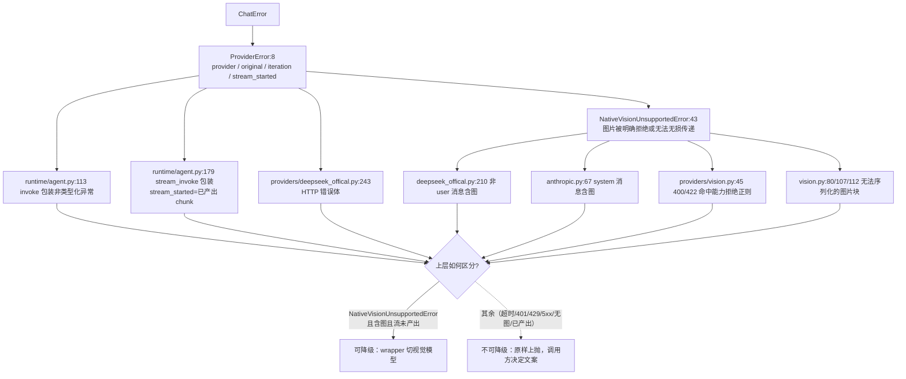

* `ProviderError.__init__`（`schema/exceptions.py:11-29`）记录 `provider`、`original`、
  `iteration`、`stream_started`；`original_name` 属性给出原始异常类型名，`__str__` 追加
  `(provider=..., cause=...)`。
* `Agent` 的包装规则（`runtime/agent.py:103-107` 与 `:168-173`）：
  `except ProviderError: raise` —— **保留类型不package**，注释明写「视觉降级链路依赖这个类型」；
  其它异常才被包成 `ProviderError`。旧行为是把异常降级成 assistant 文本，现已禁止。
* `stream_started=True` 表示用户可能已收到半截输出，调用方不得重放请求；
  wrapper 的 stream 分支（`:197-201`）用同样的判据拒绝「先发一半再换模型」。
* 三处基类来源正好对应三种现实故障：Agent 层包装（模型调用失败）、
  `deepseek_offical.py:243`（HTTP 错误体）、以及 `vision.py:45` 升级后的子类。
</details>

<details>
### 计费：billing_script 触发判据、builtin_cost 公式与 SOURCE 六取值

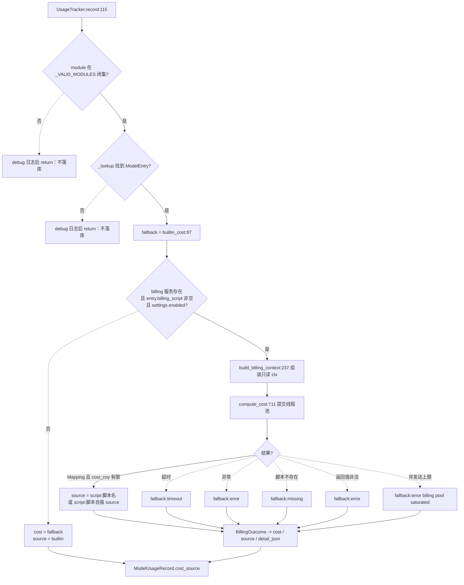

**builtin_cost（`:87`，逐字保留改造前实现）**：

```
effective_cache_miss = cache_miss_tokens if cache_miss_tokens > 0 else input_tokens
cost = (cache_hit * cache_hit_price_per_mtokens
        + effective_cache_miss * input_price_per_mtokens
        + output * output_price_per_mtokens) / 1_000_000
```

**触发判据（`tracker.py:158`）**：`billing` 实例存在、该模型 `billing_script` 非空、
`[billing].enabled=true` 三者同时成立才进脚本路径；否则连 ctx 都不组装（零额外开销，A9）。

| SOURCE 取值 | 何时写入 | 金额 |
|---|---|---|
| `builtin` | 未配脚本、billing 关闭、或 `compute_cost` 入口发现 enabled=false | builtin_cost |
| `script:名称` | 脚本返回合法 cost_cny 且未自报 source | 脚本值 |
| `script:自报值` | 脚本返回 Mapping 且带非空 `source` 字段 | 脚本值 |
| `fallback:missing` | 脚本文件不存在（`_missing` 集合命中） | builtin_cost |
| `fallback:error` | 加载失败、求值抛异常、返回值非法、并发饱和 | builtin_cost |
| `fallback:timeout` | 超过 `[billing].timeout_ms`（默认 200ms） | builtin_cost |

**其他阈值与默认值**：`BILLING_MAX_WORKERS=2`、`BILLING_MAX_INFLIGHT=2`；
槽位在 future **真正结束**时归还（超时后线程仍在跑，槽位不释放，`:692-697`）；
`record_detail` 默认 true，`cost_detail` 超 `MAX_COST_DETAIL_CHARS=8192` 截断；
脚本入口二选一：`compute_cost(ctx)` 或 `BillingPolicy.compute(ctx)`（`:501-519`）；
重载判据 `st_mtime_ns + st_size` 变化（`reload_on_change` 默认 true）；
`preview`（`:804`）不检查 enabled、不写库，供面板保存前试算；
`warmup`（`:631`）在启动装配期预加载注册表里出现过的脚本名，`_warmup_billing_scripts`
（`bootstrap/__init__.py:206`）在 enabled=false 时直接 return。

**ctx 只有 13 个键**（`build_billing_context`，`MappingProxyType` + 顶层深拷贝）：
`model_key / model_name / provider / model_type / module / usage / pricing / settings /
billing_config / conversation / occurred_at / local_time / tzname`；
`usage` 只透传 input_tokens、output_tokens、cache_hit_tokens、cache_miss_tokens、
completion_tokens_details 五个键，不注入 provider、DB session 或服务对象。

**随仓库分发的两个模板**：`templates/deepseek_peak_valley.py`（北京时间周一至周五
09:00-12:00 与 14:00-18:00 为高峰，空闲时段乘 0.5；注释强调模型 pricing 必须填**高峰价**，
填均价会让金额系统性偏小）与 `templates/per_call.py`（读 `billing_config.price_per_call`，
与 token 无关）。
</details>

<details>
### 用量落库与报表：record 的入参、双索引与 5 张表

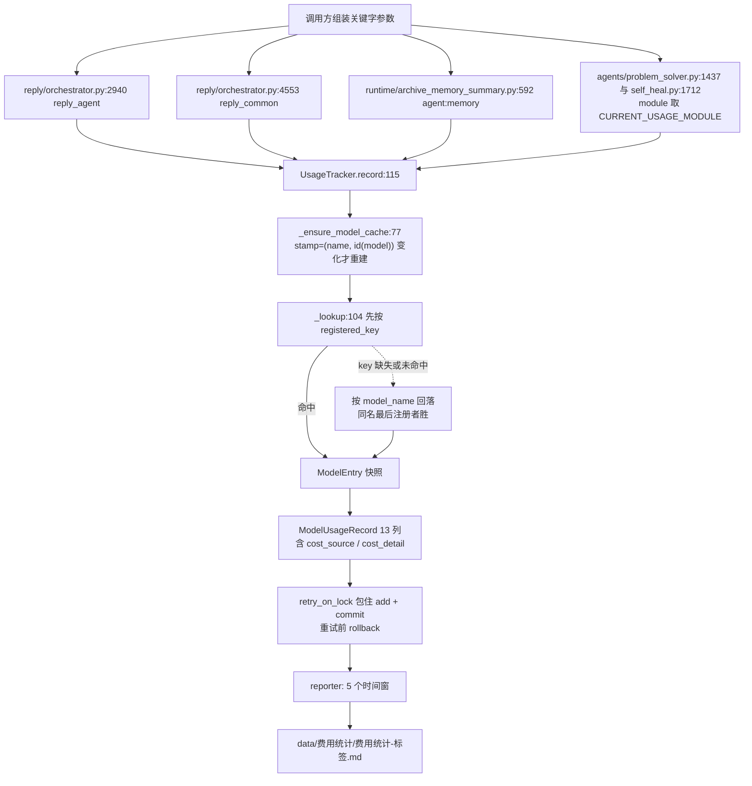

* `record` 的入参是**关键字**形式：`module`、`model_name`、`input_tokens`、`output_tokens`、
  `cache_hit_tokens=0`、`cache_miss_tokens=0`、`conversation_kind=""`、`conversation_id=""`、
  `registered_key=""`（`tracker.py:115-127`）。
* `_VALID_MODULES`（`:24-35`）是 10 项闭集：reply_agent、reply_common、agent:memory、
  agent:chat_interaction、agent:image_parse、agent:willingness、agent:scheduled_task、
  agent:problem_solver、agent:self_heal、memory_compaction。其中
  **agent:image_parse / agent:chat_interaction / agent:willingness / agent:scheduled_task /
  memory_compaction 在当前仓库没有任何产出点**（全仓 grep 只命中白名单本身），
  写了不会报错、也不会落库。
* `CURRENT_CONVERSATION_KIND` 与 `CURRENT_CONVERSATION_ID` 全仓只有读取、**没有 setter**，
  因此 problem_solver 与 self_heal 的记录永远是空会话字段，报表里进「无上下文」分组。
* `ModelUsageRecord`（`packages/storage/.../models.py:281`）列：id、module_name、model_name、
  provider_name、input_tokens、output_tokens、cache_hit_tokens、cache_miss_tokens、cost_cny、
  cost_source（默认 builtin）、cost_detail（可空）、conversation_kind、conversation_id、created_at。
* 报表（`reporter.py:13-19`）：5 个时间窗 —— 全部历史、最近1个月、最近1周、最近1天、最近1小时，
  各自一个文件；单窗失败只 warning，不影响其它窗口。文件含总览、按模块、按模型、按会话类型、
  计费来源分布 5 张表，末尾给出「计费来源合计 N 笔」（应与区间记录数相等）。
* 触发：`runtime/application.py:554 _run_report_loop` 后台任务，启动时拉起（`:204`），
  成功间隔 1800s，失败 60s 后重试。
</details>

<details>
### 观测点：日志 sink、DebugRecorder 事件与面板可读字段

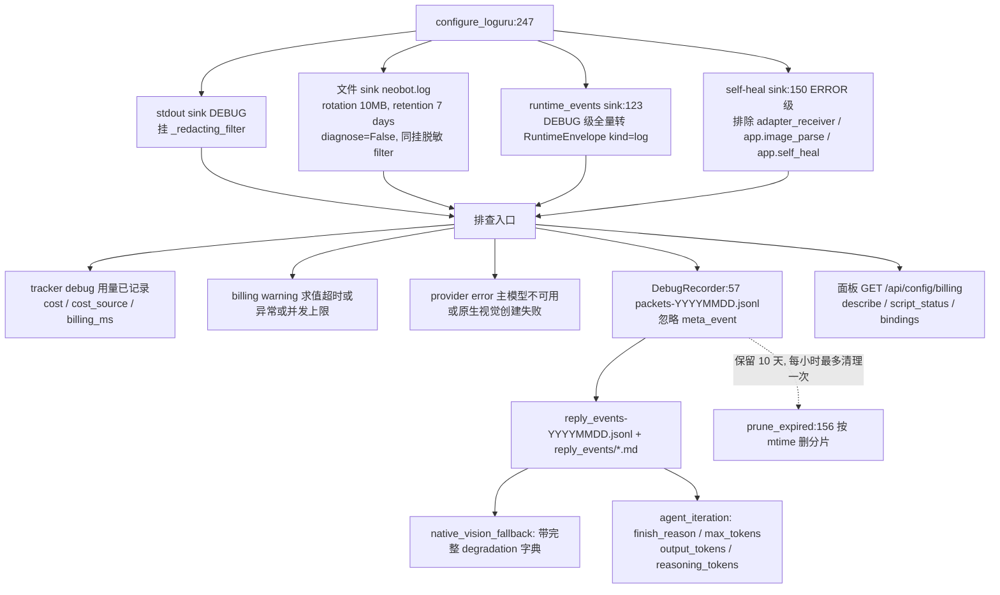

* 控制台 sink 走 **stdout** 而不是 stderr（`logging.py:271-279`）：宿主（容器日志、
  进程管理器、把实例输出重定向到文件再 tail 的前端）通常只收一路流，普通日志落在
  stderr 会被归成「错误通道」，级别色与归类语义都被带偏。真正的致命错误仍由 CLI 直接
  `print(file=sys.stderr)`，不受影响。
* 日志脱敏（`logging.py:61` 的 `_redacting_filter`，`logging.py:51` 的 `redact_sensitive`）在
  **格式化前**改写共享 record：API Key、token、password、URL 内嵌凭据都被替换成 ***；
  异常 traceback 也重新渲染后挂回 `record["exception"]`，自修复 sink 仍能拿到结构化 traceback。
* `LoguruLoggerAdapter._format`（`:313-318`）把关键字参数拼成 `k=v` 追加到消息尾部 ——
  `logger.warning("...", script=name, timeout_ms=...)` 这类结构化字段只在**文本**里，
  机器可读版本在 runtime_events sink 的 payload 与 billing 面板里。
* DebugRecorder 由编排器 `_record_debug`（`orchestrator.py:1643`）驱动，
  关键事件：`prompt_built`、`native_vision_fallback`（`orchestrator.py:2978`）、
  `agent_iteration`（含 finish_reason 与 max_tokens）、`reply_generated`。
* `record_packet` 只忽略 `post_type=meta_event`（`:88`）；`_write_jsonl` 本身没有 try/except，
  写盘异常会向上抛。保留期 `DEFAULT_RETENTION_DAYS=10`，构造时 `force=True` 清一次。
* `ContextRecorder`（`_record_context`）与用量统计**同源**（都用 `extensions.usage`），
  但它是纯内存 + 逐份 diff（spec(10)），不落盘、图片 base64 换成 sha256。
</details>

## 关键状态

| 状态 | 谁置位 | 谁清理 | 失败时停在哪 |
|---|---|---|---|
| `_degradation`（降级标记） | `_degrade`：启动 reason 或运行期类型化异常 | 无清理路径，只有新建实例（重启/热重载）复位 | 置位后请求全部走 fallback，不回主模型 |
| `startup_reason` | `build_main_provider` 的两处失败分支 | 构造后固化进 `_degradation` | 为空时 wrapper 走主模型；非空则一律走 fallback |
| provider / error_message | `install_provider` 换引用 | 热重载替换；旧实例由调用方关闭 | provider=None 时编排器持有 error_message，回复不可用 |
| 全局 ModelRegistry | 装载器 `registry.clear()` 后逐条注册 | 每次配置重载整体重建 | key 缺失的模型按策略降级或致命，create_provider 抛 ValidationError |
| `UsageTracker._model_info` 缓存 | `_ensure_model_cache`（stamp 变化才重建） | 注册表条目集合或实例 id 变化 | 缓存里没有该模型 -> debug 日志 + 跳过落库 |
| ModelUsageRecord 行 | `record` 内 retry_on_lock + commit | 只追加，无删除路径 | 写库异常上抛；主回复链路的 try/except 吞掉，本轮不计费 |
| 计费脚本 `_policies` | `ensure_policy` 按 mtime_ns+size 重载 | `reload_scripts(force=True)` | 加载失败保留旧策略；无旧策略则 `fallback:error` |
| debug 分片文件 | `DebugRecorder._write_jsonl` | `prune_expired`（保留 10 天，每小时最多一次） | 写盘异常不在 `_write_jsonl` 内吞掉（`debug.py:148`） |

## 易错点

* **两层路由不是「角色 -> key」**：`[agent_model]` 只给编号，编号再经 `AGENT_ROLE_NAMES`
  映射成角色名，最后才由 `[models.assignments]` 给出 key。只改编号不改 assignments，
  很可能两个编号指向同一个 key（默认 1/2/3 分别是三个不同 key，但用户自定义后常见同值）。
* **`problem_solver` 没有编号字段**：`getattr(routing, "problem_solver", 1)` 永远返回 1。
  想在配置里单独给它编号不会生效；要么在 `AgentModelRouting` 加字段，要么改调用点的
  `default_index`。同理 `creator` / `memory` / `chat_interaction` / `willingness` /
  `scheduled_task` 五个字段当前只被面板与提示词目录读取。
* **回退返回的是角色名不是 key**（`agents.py:62 return role`）。默认库没有
  `primary_chat_model` 这类 key，所以这条兼容路径实际以 `ValidationError` 收场，
  表现为「主模型不可用 -> 回退视觉模型」或「返回 error_message」。
* **声明原生视觉的主模型可能被整体丢弃**：`_providers.py:62` 在视觉模型不可用时直接
  `return None, error`，即使主 provider 已经创建成功也不会使用。排查「明明配了主模型却
  不回复」时先看这行。
* **`strip_images` 主链路写死 False**（`_providers.py:69`）。回退请求的图片原样发送；
  如果把 `vision_model` 指到一个 `native_vision=false` 的普通 chat 模型，wrapper 不会替你
  剥图（`strip_images=True` 且 fallback 有视觉才会触发校验），结果是带着图片去请求一个
  不接受图片的模型。
* **wrapper 不代理 `registered_key`**：`native_vision.py` 只有 `native_vision` / `model` /
  `max_tokens` / `vision_degradation` 四个代理点，没有 `registered_key` 也没有 `__getattr__`。
  于是开启原生视觉后，主回复链路 `getattr(self._provider, "registered_key", "")` 恒为 ""，
  `_lookup` 只能按 `model_name` 回落 —— 而默认库 4 个 chat 条目的 model_name 都是
  `deepseek-flash`（`tracker.py:40-44` 的 D19 注释正是为此），同名最后注册者胜，
  「按模型绑定计价脚本」会串到别的注册条目。
* **降级后 `provider.model` 会换人**：`model` 属性代理当前生效路由，同一条会话的用量可能
  分别记在两个不同 model_name 下，而 `module` 不变（reply_agent / reply_common）。
* **降级不可逆**：`_degrade` 首行就 return；`max_tokens` 的 setter 只告警不改写。
  需要独立输出预算的 Agent 必须走 `build_optional_agent_provider` 拿独立实例
  （`_runtime.py:419-429` 的注释解释了为什么自修复不复用主 provider）。
* **未知 module 静默跳过**：`record` 对不在 `_VALID_MODULES` 的 module 只写 debug 日志，
  不落库也不报错（`tracker.py:128-130`）。加新 Agent 时忘记扩白名单，统计里会直接少一块。
* **会话字段永远是空**：`CURRENT_CONVERSATION_KIND` / `CURRENT_CONVERSATION_ID` 没有 setter，
  两个使用它们的 Agent 只会写空值。
* **费用为 0 不等于没花钱**：默认模型库的 pricing 全是 0，不配 `billing_script` 时
  `builtin_cost` 恒为 0；先看报表的「计费来源分布」表再下结论（`fallback:*` 占比高说明
  脚本在超时或抛错，金额静默退回内建公式）。
* **计费链路永不抛异常**：`compute_cost` 的 docstring 明确「从不抛异常」，所有失败都回落
  `fallback_cost`；`[billing].enabled=false` 时连脚本都不加载、线程池都不建。
* **原生视觉开启会改工具可见性**：`reply/tools.py:930-938` 隐藏 `image_parse__parse_image`、
  `drawing__inspect_image`、`user_profile__analyze_user_avatar`，并只放行 `image_context__` 前缀；
  `image/parser.py:76` 也会因为 `native_vision=True` 直接跳过外部视觉解析。降级发生时
  `orchestrator.py:2972-2988` 检测到 `native_vision` 由真变假，恢复工具并追加一条 user 提示
  **重试一次**，然后把 `native_vision_fallback` 事件写进调试包。
