# 05b Provider 实现与原生视觉降级：注册表 · 三种供应商 · 异常契约 · 包装器

## 范围

本图钻「模型路由选定之后」到「一次 HTTP 调用落地」之间的 provider 实现层：

1. **注册表与构造**：`models.py:80 RegisteredModel.create_provider` / `:91 _build_provider` /
   `:191 create_provider(name)`，`:42 _normalize_provider_kind` 决定用哪个供应商类；
2. **三种供应商的请求/响应形态**：`providers/base.py:153 BaseHTTPProvider`、
   `providers/deepseek_offical.py:20 DeepSeekOfficalProvider`、
   `providers/openai.py:16 OpenAIProvider`、`providers/anthropic.py:19 AnthropicProvider`；
3. **异常契约与可降级判据**：`schema/exceptions.py:8 ProviderError` /
   `:43 NativeVisionUnsupportedError`，以及六处 raise 点；`providers/vision.py:35
   raise_if_image_unsupported` 的 400/422 + 5 条正则升级规则；
4. **原生视觉包装器**：`providers/native_vision.py:15 NativeVisionFallbackProvider` 的
   构造期校验、`:111 _degrade`、两种 notice、降级后工具集变化；
5. **装配与凭据落地**：`bootstrap/_providers.py` 四个构造函数、`strip_images` 写死 False、
   API Key 从环境变量到 Authorization 头的注入路径。

**不画什么**（指向相邻图，避免重叠）：

* 角色 -> 编号 -> 模型 key 的两层路由、`[models.assignments]`、计费脚本选路与报表
  —— `05-llm-routing.md`（本图只画它交给 provider 的那一段）；
* 用量落库 / 报表细节 —— `05-llm-routing.md` 与 `23-billing-stats.md`；
* Agent 循环与工具执行 —— `04-agent-loop.md`；模型可见工具集的完整清单 —— `03b-reply-tools.md`；
* 面板模型库 CRUD、模型连通性测试的 UI 侧 —— `09b-dashboard-api.md`（本图只把它当作 provider 之外的旁路观测点）；
* 配置装载器 `config/loader/manager.py` 的注册流程 —— `01b-config-system.md`（本图只引用它注入的
  `base_url` / `api_key`）。

**spec 与现实的差异提示**（读代码得到）：

* `app/src/neobot_app/credentials/` **不是 API Key 仓库**：它按 `chat_flow` 发放 6 位口令，用于
  kick / agent_execute 这类**聊天动作授权**（`credentials/model.py:23 ACTION_REQUIRED_LEVEL`）。
  provider 的 API Key 完全走另一条路（`EnvConfig.get_api_platform_config`）。
* 主链路 `strip_images` **写死 False**（`bootstrap/_providers.py:69`），所以
  「剥图 + 文本占位符 + 首条 system notice」这一整套能力在主链路**永远不生效**；
  `orchestrator.py:2972-2988` 的「工具恢复 + 追加 user 提示 + 重试一轮」也因此不可达（该分支要求
  `native_vision` 由真变假，而 `strip_images=False` 时包装器降级后仍上报 True）。
* `NativeVisionFallbackProvider` 只代理 `native_vision` / `model` / `max_tokens` /
  `vision_degradation` 四处，**不代理 `registered_key`**（SPLIT-MAP W21、W25）。
* 流式重试的「首个字节到达前」注释与实际不符：`vision.py:35` 会无条件 `aread()` 整个响应体，
  重试窗口因此比注释描述的小（见「易错点」）。

## 流程

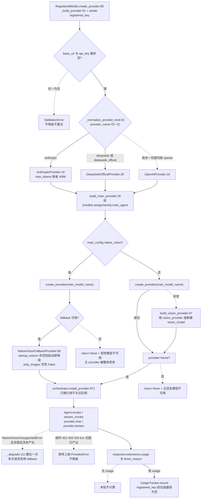

## 时序

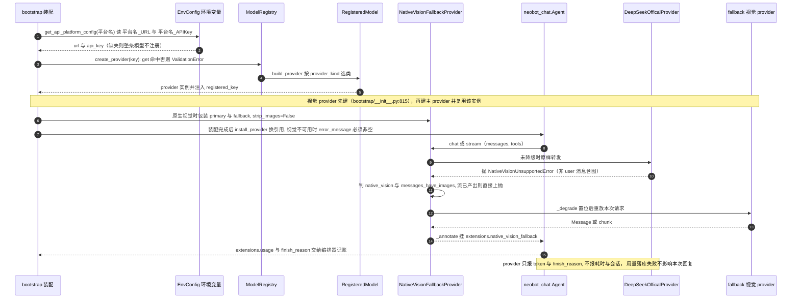

## 细节

### 注册表与 create_provider：key 不命中即 ValidationError，密钥在构造期硬校验

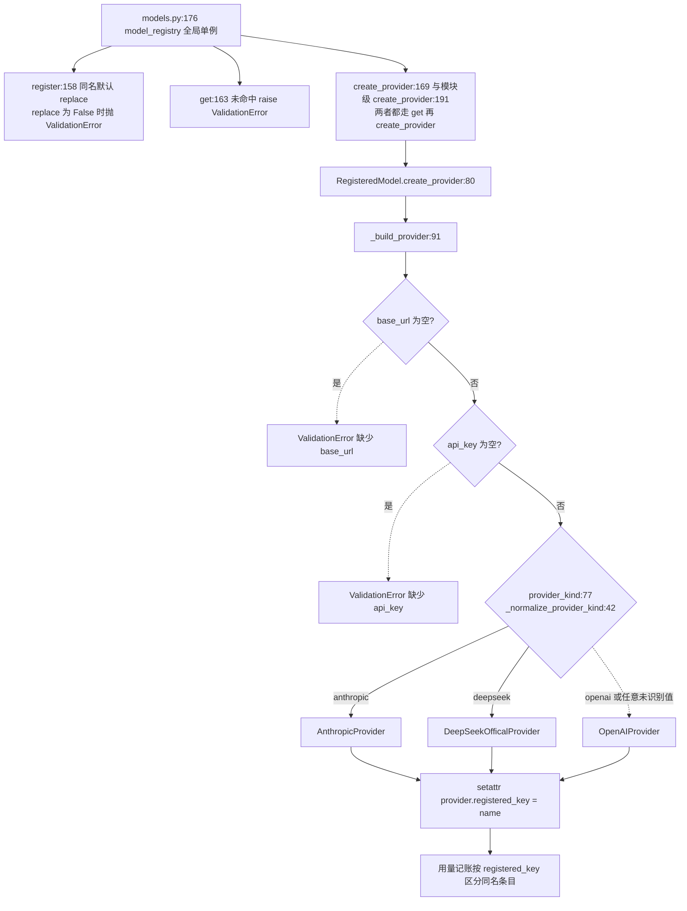

* 归一化表（`models.py:44-51`）：`anthropic` 原样；`deepseek` / `deepseek_offical` /
  `deepseek_official` -> deepseek；`openai` -> openai；**其余任何字符串**（含打错的
  `DeepSeek官方`、`azure`）全部落到 OpenAI 兼容分支，不报错 —— 拼错供应商名的表现是
  「请求发到了 OpenAI 格式端点」，而不是启动失败。
* `registered_key` 是构造后 `setattr` 挂上去的（`models.py:88` 注释说明 provider 无 `__slots__`），
  不走构造函数；原生视觉包装器不会把它透传出去。
* 注册表清除时机：`config/loader/manager.py:496 registry.clear()` 后逐条重建，装载器只注册
  `iter_role_models` 遍历得到的条目；因此**不在 assignments 里的 registry 条目不会进全局库**，
  `create_provider` 对它只会抛 `Model ... is not registered`。
* `RegisteredModel` 是 frozen dataclass，但 provider 不是：运行期只改 provider 属性的路径
  （如 `provider.max_tokens = ...`）不会回头改注册定义。

### 三种供应商的请求形态差异：端点、鉴权头、system 消息与图片位置限制

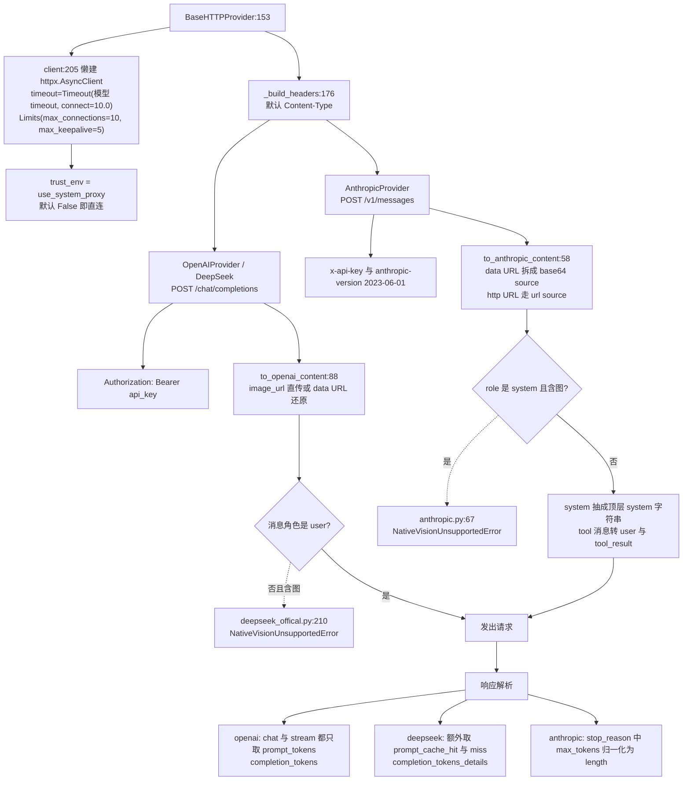

* **图片位置限制只在两条序列化路径上**：DeepSeek 是「非 user 角色含图即拒绝」
  （`deepseek_offical.py:209-210`），Anthropic 是「system 消息含图即拒绝」（`anthropic.py:66-67`）。
  `OpenAIProvider._build_payload:87` 对角色不做任何限制 —— 带图的 assistant 历史会原样发给兼容端点，
  由服务端决定接受还是报错。
* `AnthropicProvider` 把 system 抽成**顶层字符串**（多条 system 用空行拼接，`:81`），
  `tool` 角色转成 `user` + `tool_result` 块（`:117`），工具定义用 `input_schema`（`:130`）。
  所以同一条历史在两个供应商下的形态完全不同，**加新的图片挂载点时要同时想清楚这两条转换**。
* 流式差异：OpenAI 兼容侧靠 `data:` 行的 `choices[0].delta` 累加；Anthropic 侧先靠
  `event:` 行切换事件类型，再按 `content_block_start` / `content_block_delta` /
  `content_block_stop` / `message_delta` / `message_stop` 驱动（`anthropic.py:252-313`）。
  `stop_reason` **只在 message_delta 里下发**，Anthropic 的 finish_reason 因此可能整轮为空。
* 空参数工具的统一出口是 `normalized_tool_calls`（`base.py:108`）+ `tool_arguments_text`：空串或
  空白串归一化为 `{}`，非法 JSON 在 Anthropic 出站侧由 `tool_arguments_object` 退化成 `{}` 并
  `logger.warning`（`anthropic.py:100-103`），**绝不因为一条坏历史让整段会话永久失败**。

### 异常契约：五处 NativeVisionUnsupportedError 与两处 ProviderError 的判据

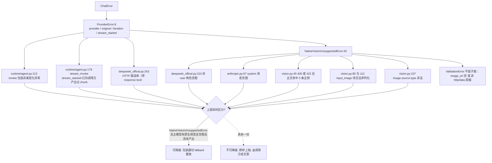

* `raise_if_image_unsupported`（`vision.py:35-47`）**只认 400 与 422**，且正文必须命中
  `vision.py:14-20` 的 5 条正则之一（例如 `image_url ... only supported by ... models`）。
  401/403/429/5xx、超时、连接错误、图片本身非法都**不是**能力拒绝，不会触发降级。
* 该函数被调用**两次**：`base.py:246` 与 `deepseek_offical.py:235`（后者在
  `_raise_for_status_with_body` 里）。httpx 的 `aread()` 会缓存到 `_content`，第二次读不会重复消费流；
  这是有意为之的双保险，不是重复请求。
* `runtime/agent.py:103-107` 与 `:168-173`：`except ProviderError: raise` —— **保留类型不重新包装**，
  注释明写「视觉降级链路依赖这个类型」。只有非 `ProviderError` 才被包成
  `ProviderError(provider=registered_key 或 model 或类名, original=exc, iteration=i)`。
* `stream_started` 的语义是「用户可能已经收到半截输出，不得重放」；包装器
  `native_vision.py:199` 用同一判据拒绝「先发一半再换模型」。
* `AnthropicProvider` 的 `chat` / `stream` **不传 `check_status`**（`anthropic.py:163`、`:253`），
  走 `base.py:250 resp.raise_for_status()`，于是 Anthropic 的 4xx/5xx 抛的是
  `httpx.HTTPStatusError`，**不是 `ProviderError`**；只有 Agent 层才会把它包装成 `ProviderError`。
  DeepSeek 侧则在 provider 内就抛 `ProviderError`（带响应正文，便于定位鉴权/余额问题）。

### 原生视觉包装器：构造期校验、代理字段白名单与门面语义

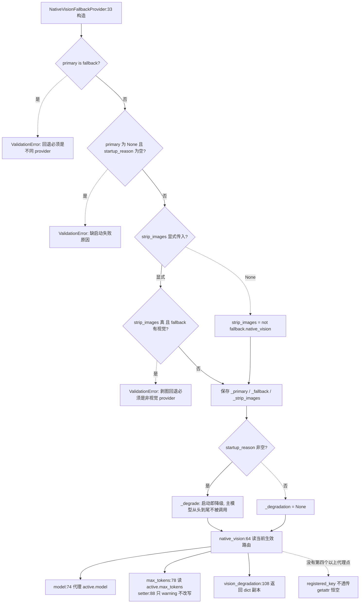

* `native_vision` 的判据（`:68-71`）：**已降级且不剥图** 时无条件返回 True（图片确实发给了视觉模型，
  能力要如实上报，否则编排器会改走外部图片解析）；其余情况读当前生效 provider 的同名属性。
* `model` 会**换人**：降级前是主模型名，降级后是 fallback 的 model 名 —— 用量记账、日志、
  `agent_iteration` 调试事件里的 `model_name` 都跟着变。
* `max_tokens` 的 setter 只 `logger.warning`（`:99-105`）：包装器代理的是主回复管线共享实例，
  真写下去会把主模型输出预算压到 8192 一类值。需要独立预算的 Agent 必须走
  `build_optional_agent_provider`（`_providers.py:106`）拿独立实例 ——
  `bootstrap/_runtime.py:419-423` 的注释解释了自修复为什么不能复用主 provider。
* `close`（`:214`）并发关闭 fallback 与 primary（primary 为 None 时跳过），
  用 `asyncio.gather(return_exceptions=True)` 收集后**按顺序抛第一个异常** —— 关停阶段不静默吞错。

### 降级全过程：三种触发点、两种 notice、门面切换与只置位一次

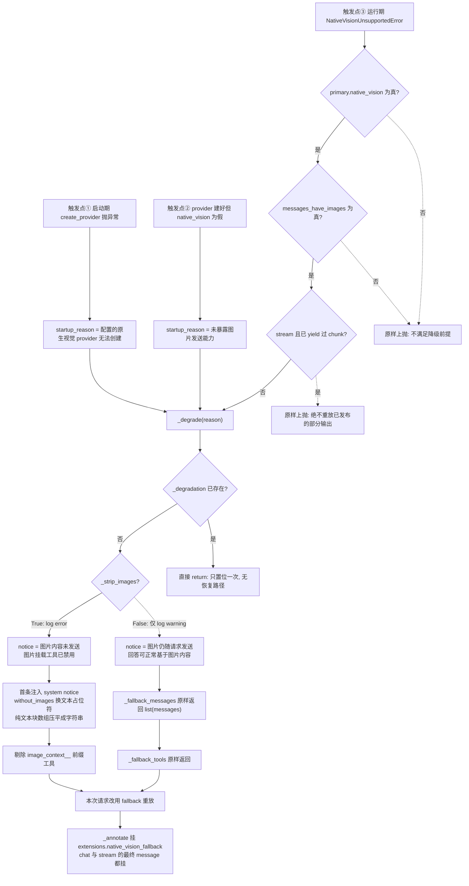

* 三种触发点里，① 与 ② 发生在**装配期**，包装器构造时就调 `_degrade`（`native_vision.py:60-61`），
  于是 `chat` / `stream` 的 `if self._degradation is None` 直接跳过主模型 —— **主模型从头到尾不被调用**。
* notice 的两份文案（`:115-126`）：剥图版明说「不能声称已看到图片……请使用恢复后的图片解析工具」，
  保留图片版明说「图片仍随请求发送」。在**主链路（`strip_images=False`）下 notice 只进日志**：
  `_fallback_messages` 不注入 system 消息，notice 也不发给用户或模型。
* 降级信息只被一个消费者读取：`orchestrator.py:2978-2981` 把 `vision_degradation` 写进调试事件
  `native_vision_fallback`；没有任何代码把 notice 文本转成用户可见文案。
* `_degrade` 无恢复路径：只有新建实例（重启或配置热重载）才复位 `_degradation`。
  热重载路径见 `bootstrap/__init__.py:252-263`（`_build` 重建 ProviderBundle 后逐个挂载点 `install_*`）。

### 降级后工具集与编排器联动：三条规则、一次重试与一个不可达分支

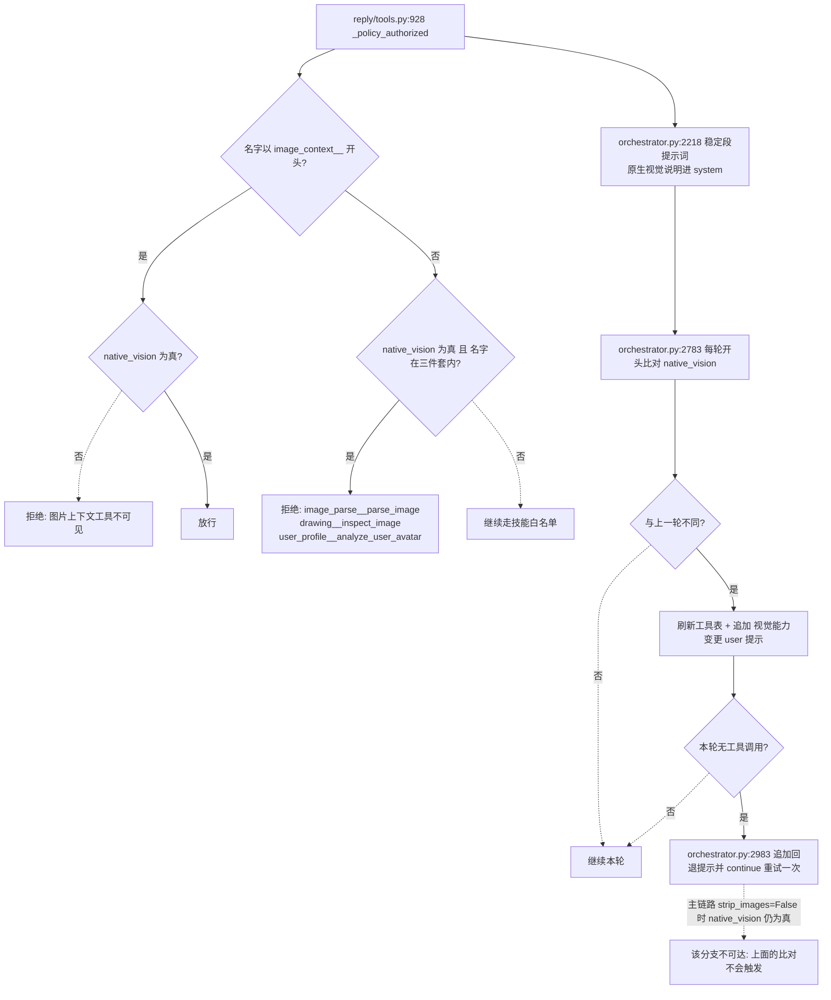

* 视觉规则是**双向**的（SPLIT-MAP W48）：`native_vision=True` 时藏
  `image_parse__parse_image` / `drawing__inspect_image` / `user_profile__analyze_user_avatar` 三件套，
  并只放行 `image_context__` 前缀；`!=True` 时反向隐藏 `image_context__`。没有配置项能覆盖。
* `reply_toolset.executor.definitions()` 在检测到视觉能力变化时被重新拉取
  （`orchestrator.py:2777` / `:2786`）；注意首轮工具表是构造时冻结的快照（SPLIT-MAP W46），
  所以「同一轮内」的可见性变化要靠这次重建。
* 不可达分支的判据要连起来读：重试要求 `native_vision` 由 True 变 False
  （`:2972-2974`），而 `strip_images=False` 的包装器降级后 `native_vision` 仍是 True
  （`native_vision.py:68`）。若要启用这条恢复链路，必须先有装配点把 `strip_images` 传成 True，
  而那会连带触发「剥图回退必须是非视觉 provider」的构造期校验。
* `image_context` 工具产出的图片只有在 `native_vision is True` 时才被收集回流
  （`:3197-3201`）；`common` 路径另有 `:4483-4493` 的默认图片挂载。

### 超时 / 重试 / 并发：委托规则、两次重试与流式重试的真实窗口

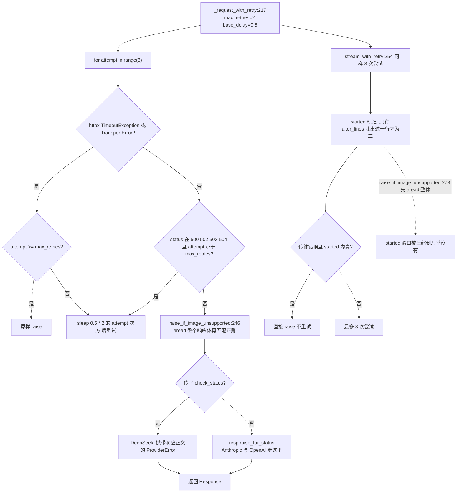

* **重试判据是「传输层异常 + 4 个 5xx」**：`_RETRYABLE_HTTP_STATUSES = {500, 502, 503, 504}`
  （`base.py:15`）。429 **不在其中** —— 限流不会重试，直接往上抛。
* 第 3 次尝试（`attempt == max_retries`）遇到 5xx 时条件 `attempt < max_retries` 不成立，
  直接走 `raise_for_status` 抛出：所以是「最多 3 次请求」，不是「3 次重试」。
* 超时是**每个模型一份**：`ModelSettings.timeout_seconds` 默认 120.0
  （`models.py:31`），连接超时固定 `connect=10.0`（`base.py:211`），代理开关
  `use_system_proxy` 默认 False（`trust_env=False`，即不读系统代理环境变量）。
* 连接池 `Limits(max_connections=10, max_keepalive_connections=5)` 是**每个 provider 实例一份**；
  `client` 属性在实例被关闭后会自动重建，因此 `close()` 之后再用不会炸，但会新开连接池。
* 流式重试的真实窗口：`vision.py:43` 无条件 `aread()`，`_stream_with_retry` 在拿到响应头后就
  把**整个响应体**读进内存，然后才逐行 yield；因此 `started` 之前的窗口实际上已经包含了全部
  响应时间，注释里「首个字节到达前重试」在当前实现下约等于「重试到读取完成前」。
  SSE 语义上仍然是逐行处理，但**内存里会先存下整段响应**。

### 凭据与 base_url 注入路径：环境变量到请求头，两条不相干的通道

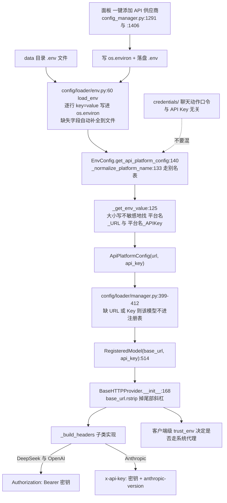

* **凭据读取发生在注册期**：装载器构造 `RegisteredModel` 时就把 `api_key` 字符串固化进 dataclass，
  之后改环境变量不会影响已注册条目 —— 必须触发热重载重建 provider（`install_provider`）才生效。
* Key 只写不读：面板接口 `api.py:1534` 的注释与 `config_manager.py:1261` 的 `key_env` 字段说明
  面板不回显密钥；日志侧由 `observability/logging.py` 的脱敏过滤器在格式化前替换
  API Key / token / password / URL 内嵌凭据。
* provider 实例上的 `api_key` 是**明文属性**（`base.py:167`），可被同进程对象读取；
  本图不贴任何真实密钥，排查时用面板的模型测试或日志里的供应商名。
* `app/src/neobot_app/credentials/` 是**聊天动作授权**：`code`（6 位口令）+ `chat_flow` 绑定会话，
  按 `ACTION_REQUIRED_LEVEL`（kick / quit_group / willing_* / agent_* 等）校验签发者等级，
  5 次未命中进入 300s 冷却（`credentials/service.py:26-28`）。它**不参与 provider 的鉴权**。
* 面板的模型连通性测试走自己的 httpx 客户端（`dashboard/model_probe.py:171-179`），
  **固定用 `Authorization: Bearer`**，不区分供应商：对 Anthropic 官方端点做探测会得到
  鉴权失败 —— 这是面板旁路，不是 provider 行为。

### 观测点：provider 只上报 usage 与 finish_reason，其余在编排器与旁路

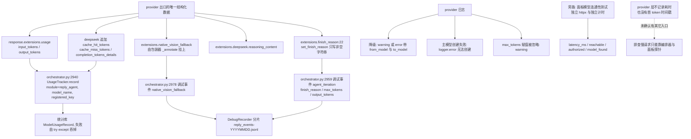

* provider **不写**任何日志字段表示耗时；`agent_iteration` 调试事件里也没有耗时字段，
  只有 `finish_reason` / `max_tokens` / `output_tokens` / `reasoning_tokens`。
* 用量记账的 `registered_key` 在开启原生视觉后恒为空（包装器不透传），`_lookup` 只能按
  `model_name` 回落，同名条目最后一个注册者胜 —— 这是 W21 的具体后果，
  表现是「按模型绑定的计价脚本串到别的条目」。
* `finish_reason` 是**唯一**能区分「模型主动沉默」与「被长度上限截断」的字段
  （`base.py:22-30` 的注释），它只留在 `extensions` 里，不会被 `_serialize_messages` 回灌给 API。
* Anthropic 的流式路径如果服务端没下发 `message_delta.stop_reason`，`finish_reason` 会缺失，
  编排器读到的是空 —— 排查「明明被截断却当沉默处理」时先看这里。

## 关键状态

| 状态 | 谁置位 | 谁清理 | 失败时停在哪 |
|---|---|---|---|
| `_degradation`（包装器降级标记） | `native_vision.py:111 _degrade`：启动 reason 或运行期类型化异常 | 无清理路径，只有新建实例（重启 / 配置热重载）复位 | 置位后本包装器的请求全部走 fallback，不回主模型 |
| `_strip_images` | 构造期一次性决定（主链路写死 False） | 不可变 | 为 True 时注入 system notice 并剥图；主链路恒 False |
| `startup_reason` | `_providers.py:56`（创建失败）与 `:58`（provider 未暴露视觉能力） | 构造后固化进 `_degradation` | 非空即启动期降级，主模型整场不被调用 |
| provider / error_message | `orchestrator.install_provider:971` 换引用 | 下一次热重载替换；旧实例由调用方关闭 | provider 为 None 时编排器抛 `RuntimeError(未配置 chat provider)` |
| 全局 ModelRegistry | 装载器 `clear()` 后逐条 `register` | 每次配置重载整体重建 | key 不在库 -> `create_provider` 抛 ValidationError -> 上层按「模型不可用」处理 |
| `_client`（httpx.AsyncClient） | `base.py:205 client` 懒建 | `close()` 置为已关闭；再次访问会重建 | 复用已关闭客户端会重建连接池，不报错 |
| `stream_started` / `emitted` | `agent.py:155-163` 产出过 chunk 即置位 | 每次 invoke / stream_invoke 重新初始化 | 为真时上层不得重放请求（包装器与本层同样拒绝） |
| 原生视觉工具可见性 | `reply/tools.py:930` 每次鉴权现算 | 与 provider 同生命周期 | 能力变化时编排器刷新工具表并追加 user 提示 |

## 易错点

* **包装器没有 `__getattr__`**：只有 `native_vision` / `model` / `max_tokens` / `vision_degradation`
  四个代理点。任何 `getattr(provider, "registered_key", "")` 在开启原生视觉后恒为空，
  用量只能按 `model_name` 回落（W21）。
* **启动即降级不发出任何 HTTP 请求**：`startup_reason` 非空时主模型一次都不会被调用。
  排查「换了个模型但回复风格没变」先看 `vision_degradation.reason`。
* **主链路不可能走剥图路径**：`strip_images=False` 写死在 `_providers.py:69`，
  所以 `without_images` 的占位符、首条 system notice、
  `native_vision.py:51` 的「剥图回退必须是非视觉 provider」校验在主链路都不生效（W25）。
  把 `vision_model` 指向一个不支持图片的 chat 模型时，包装器**不会替你剥图**，请求会带着图片发出去。
* **工具恢复 + 重试一轮的分支不可达**（同上一条的连带后果）：
  `orchestrator.py:2972` 要求 `native_vision` 由真变假，而保留图片的降级使它恒为真。
* **重试不是「内容层」的**：只有传输异常与 500/502/503/504 会重试，429 与 401/403 立即上抛；
  400/422 只在正文命中 5 条正则时才升级成 `NativeVisionUnsupportedError`，否则原样抛 `HTTPStatusError`。
* **`raise_if_image_unsupported` 会 `aread()` 整个响应体**：流式请求在拿到响应头后先被整体读进内存，
  注释里「首个字节到达前重试」的窗口因此被压缩；改这块时不要把 `started` 当成真实的首字延迟。
* **两道「400/422 -> 能力拒绝」的判定是双保险而非重复请求**：httpx 的 `aread()` 缓存到 `_content`，
  第二次调用不会再消费流；但换成 `aiter_bytes` 之类的实现就会破功。
* **Anthropic 的 provider 层不抛 `ProviderError`**：它走 `raise_for_status()`，类型转换推迟到
  `Agent.invoke` 的包装分支；只按 `ProviderError` 做错误分类的调用方会漏掉这条路径。
* **图片位置限制不统一**：只有 DeepSeek（非 user 角色）与 Anthropic（system 消息）在序列化期拒绝，
  OpenAI 兼容路径完全不检查。切换供应商时「同一段历史能不能发出去」的答案会变。
* **`max_tokens` 赋值被静默忽略**：包装器的 setter 只 warning。自修复 / 解题这类想改输出预算的
  Agent 必须拿独立 provider（`build_optional_agent_provider`），否则预算压不下去也不报错。
* **`credentials/` 与 API Key 无关**：前者是聊天动作口令（6 位码 + 会话绑定 + 防爆破冷却），
  在排查「密钥无效」时看它只会浪费时间；密钥链路的真相在 `.env` -> `EnvConfig` ->
  `RegisteredModel.api_key` -> `_build_headers`。
* **面板的模型测试不用 provider**：它固定发 `Authorization: Bearer`，对 Anthropic 官方端点必然报鉴权失败；
  「面板测试通过」不等于「provider 能跑通」，反之亦然。
* **`model` 属性会换人**：降级后同一条会话的用量可能分别记在两个 `model_name` 下，
  而 `module` 不变（reply_agent / reply_common），按模型维度看报表会出现「同一个 module 两个模型」。
