# 06 工具运行时与技能：注册 · native/PTC · 管理员凭据 · 沙箱裁决 · 维护 Agent

## 范围

本图覆盖「模型能碰到的能力」从注册到落地的整条链路：

* `agent_tools/`：`AgentToolRuntime` 的模块装配、定义表、门禁、分发，PTC 解释器与限额，
  管理员凭据（`ToolPermissions`）、子 Agent（`ChildAgentTools`）、进程工具（`ProcessTools`）、LSP（`LspTools`）；
* `skills/`：内置 Python 技能（`SkillModule` / `SkillManager`）的注册、`{skill}__{tool}` 前缀路由、
  常驻 / 延后加载（`SkillToolActivation`）、`agent_tools` 五个按需工具包；
* `packages/chat/src/neobot_chat/skills/`：Markdown 技能（`SKILL.md`）的发现、关键词命中与系统提示注入；
* `runtime/sandbox_service.py`、`sandbox_lock.py`、`sandbox_maintenance.py`：路径裁决、原子写、临时区、
  维护周期的调度与执行。

不在本图内：`04-agent-loop` 画 chat 侧 `Agent` 的工具调用回合；`03-reply-pipeline` 画回复编排与
工具表进入提示词的主干；`05-llm-routing` 画 provider 选择与降级；`01-startup` 画装配顺序。
provider / adapter / 浏览器 / 插件只出现在调用点，不展开。

**spec 与现实的差异（读图前先知道）**：

1. `SandboxLock` 全仓库**没有任何调用点**（`acquire` / `release` / `acquire_temp` / `is_owner` / `is_occupied` 均无调用者，
   只被 `bootstrap/_runtime.py:221` 构造并注入）。「同一时间只有一个 agent 能写沙箱」目前**不成立**。
2. `SandboxManagerSkill` 的 `hold_temp` 只调用 `ensure_temp_dir`，`minutes` 参数不产生任何计时（NO-OP）。
3. `execute_command` 在 `runtime.py:103` 注册时被**无条件跳过**：线协议上的命令工具只有平台名 `pwsh` / `bash`。
4. `config.agent.tools.mode=ptc` 只改变**任务型 Agent**（子 Agent / 解题 / Goal）的呈现；
   主回复管线永远按 native 取叶子工具（`agent_tools_packages.py:60` 显式 `mode="native"`）。

## 流程

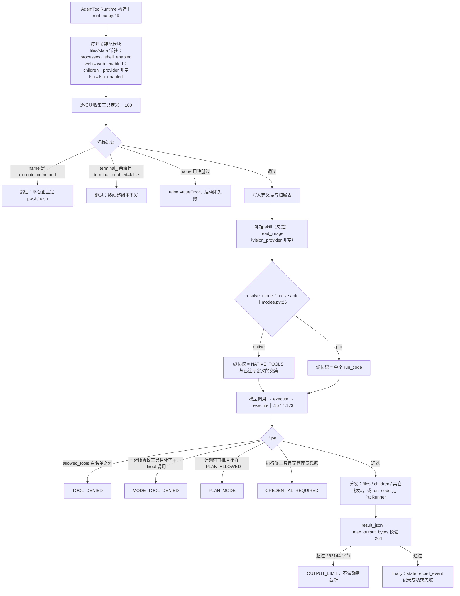

主图只画主干与四个拒绝点。注册顺序、两种模式、四个 PTC 硬上限、凭据签发、子 Agent 三种编排、
Windows 进程树、技能前缀与按需加载、Markdown 技能注入、沙箱路径七道闸、锁与临时区、
维护 Agent 循环各有一块折叠细节。

## 时序

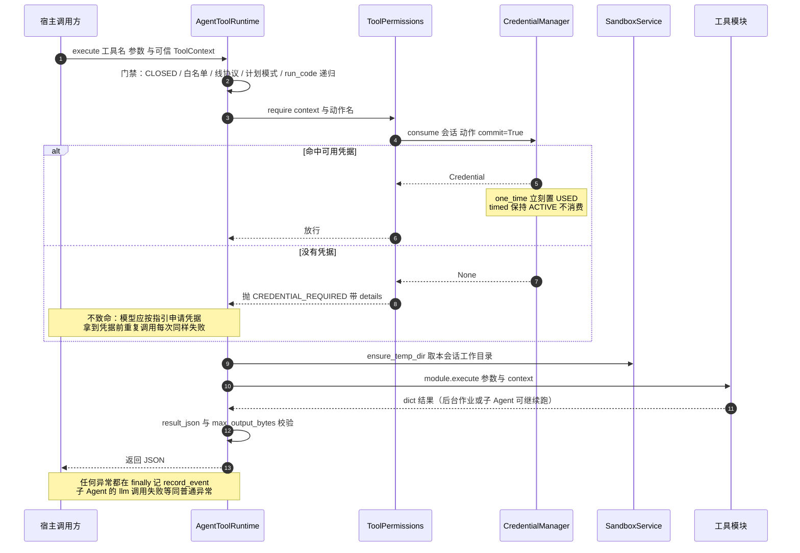

## 细节

### 工具注册全流程：模块 → 定义表 → 线协议过滤

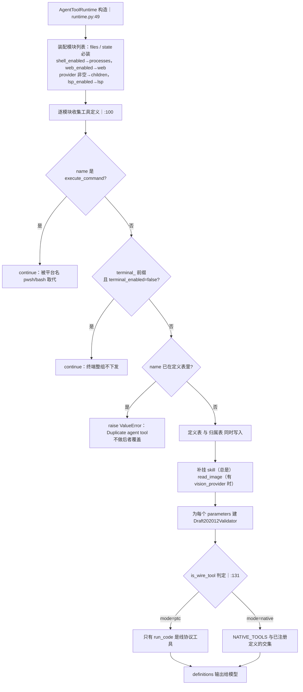

`NATIVE_TOOLS`（`modes.py:7`）共 21 个名字：`read`、`write`、`edit`、`glob`、`grep`、`read_image`、`lsp`、
`run_python`、`pwsh`、`bash`、`web_search`、`web_fetch`、`job_list`、`job_output`、`job_kill`、
`todo_write`、`ask_user_question`、`question_status`、`enter_plan_mode`、`exit_plan_mode`、`skill`。
注册表同时充当「工具是否存在」的唯一事实来源：`capability_names` 给出全集，
`capability_definitions(allowed_tools)` 给出按技能白名单裁剪后的叶子能力；
`reply/tools.py:923` 用 `agent_tools__` 前缀反查这张表来授权。
`LEGACY_FILE_ALIASES`（`modes.py:16`）把 `sandbox_manager__read_file` 等 5 个历史别名
标记为「已去重」：能力存在时旧别名一律不授权。

### native 与 ptc：同一批能力的两种模型可见面

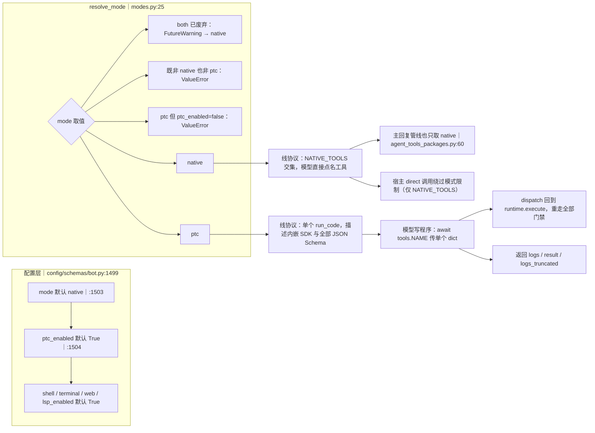

模式只决定「任务型 Agent 怎么编排」，不决定能力是否存在：
`_invoke_child`（`runtime.py:316`）给子 Agent 装 `Executor.definitions`，它调
`runtime.definitions(allowed_tools=context.allowed_tools)`，于是子 Agent 在 ptc 下只看到 `run_code`；
主回复管线走 `AgentToolsPackageSkill.get_tools`，固定 `mode="native"`，
所以把配置改成 ptc 不会让主回复变成「只会写程序」。
`directly_exposed`（`:185`）只在宿主显式传 `direct=True` 时成立，且只覆盖 `NATIVE_TOOLS` 成员。
`run_code` 在 native 下不是线协议工具，即使 direct 调用也会 `MODE_TOOL_DENIED`。

### PTC：四个硬上限、整张限额表与解释器边界

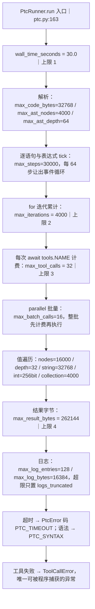

四个「最先撞到」的上限是：单次程序**最多 32 次工具调用**、**墙钟 30 秒**、
**返回值不超过 262144 字节**、**循环累计 4000 次迭代**。
其余限额都是正整数校验（`__post_init__` 拒绝非正数），改小会让既有程序直接失败、
改大只影响单次调用的资源占用，不影响能力授权。
注意三个容易混的预算：`max_steps`（语句/表达式步数 30000）、
`max_iterations`（for 实际迭代 4000）、`max_tool_calls`（工具调用 32）。
另外 `max_output_bytes`（配置默认 262144，`bot.py:1513`）是**外层**结果上限，
与 `max_result_bytes` 是两道不同的闸：外层超限抛 `OUTPUT_LIMIT`。

下面是解释器本身的安全边界：

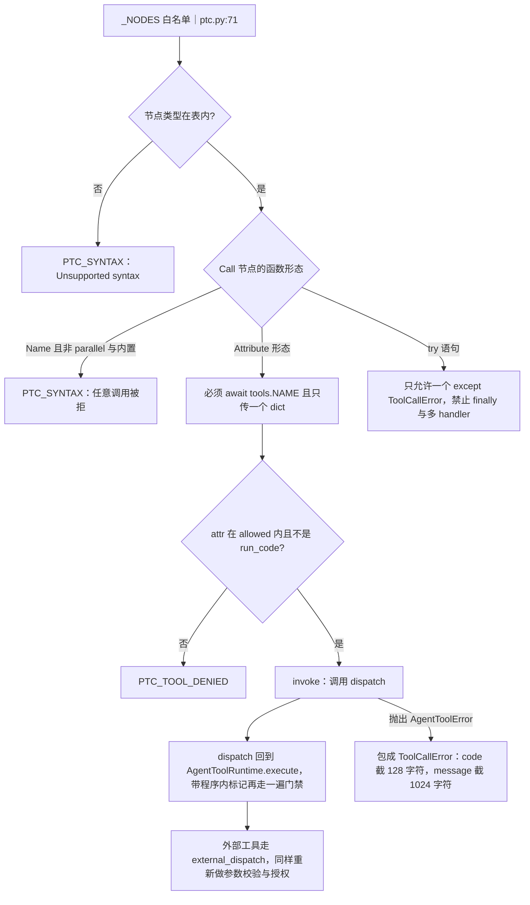

解释器自述的边界（`build_python_sdk`，`:102`）：无 import、函数/类、递归、推导式、while、
元组/集合、切片、f-string、getattr、任意属性；`is`/`is not` 只支持与 `None` 比较；
赋值复制 JSON 值（不做容器别名）；`print` 走有界日志。
保留名 `_RESERVED` = 内置 7 个 + `tools` / `ToolCallError` / `run_code` / `parallel`，赋值即语法错误。
`parallel` 的并发语义只在**整批**工具都属于宿主声明的并发安全集合（`runtime.py:21` 的 `_SAFE_READS`）时成立；
只要有一个不安全，整批退化为串行。批中任一失败会取消并 drain 其余调用，
但**已完成调用的副作用不回滚**；宿主 dispatch 若不配合取消，则杀不掉。

### 权限与凭据：require → CREDENTIAL_REQUIRED → 管理员签发 → 重试

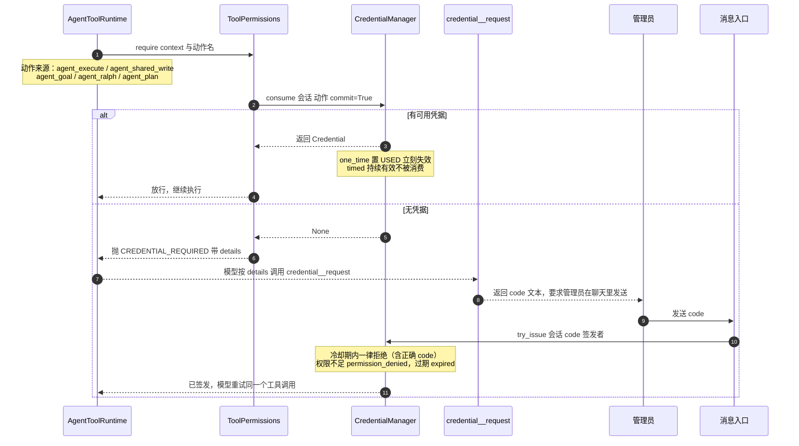

`require` 的 docstring 写明「never grant from model text」：`context` 必须是宿主铸造的
`ToolContext`（`contracts.py:9`，`__post_init__` 校验 owner 与 `chat_flow_id` 必须含冒号），
模型参数里伪造的身份不参与判定。
当前会触发凭据检查的位置：`_EXECUTION` 六个工具（`run_python` / `execute_command` / `bash` / `pwsh` /
`terminal_open` / `terminal_send`）→ `agent_execute`；`write`/`edit` 且路径以 `shared:` 开头 →
`agent_shared_write`；`create_goal`、`update_goal` 的 resume/edit → 先要 `human_request` 再要 `agent_goal`；
`ralph` → `human_request` + `agent_ralph`；`_approve_plan` → `agent_plan`。
`update_goal` 的 complete/blocked 走另一条闸：没有真人请求时必须匹配到正在运行的目标轮，
否则 `GOAL_ROUND_REQUIRED`。
凭据不是重试型错误：`permissions.py:29` 明确写「拿到凭据之前重复调用每次都会同样失败」，
且「凭据不等于操作系统沙箱」。

### 子 Agent / workflow / ralph：三种编排的差异与上限

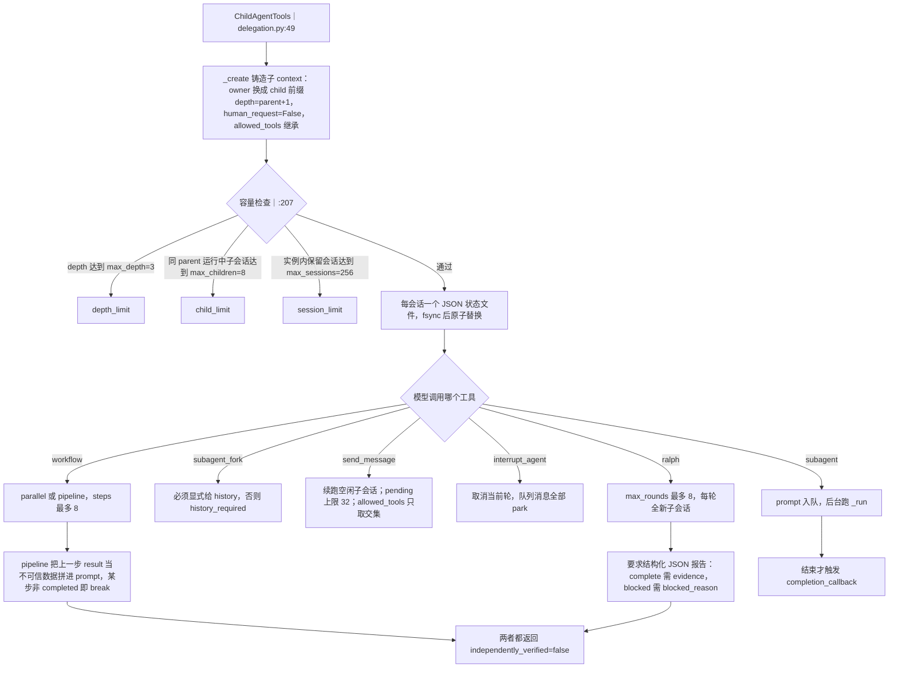

`max_agent_iterations`（默认 20，`bot.py:1510`）是**每个子 Agent 每轮**的模型回合上限，
`max_child_agents`（默认 8）与 `max_goal_rounds`（默认 8）分别喂给 `max_children` 与 `max_rounds`。
其余边界：`max_pending=32`、`max_messages=512`、`max_text_chars=65536`、
`max_summary_chars=8192`、`max_state_bytes=1MiB`。
子 context 的 `human_request` 恒为 `False`，所以子 Agent **永远无法**创建 goal 或启动 ralph
（`HUMAN_REQUIRED`）；`send_message` 只能把 `allowed_tools` 收窄成交集，不会放大权限。
进程重启后 `_restore` 逐文件校验血缘（owner 不同、agent_id 相同、depth 不差 1、白名单越权都会拒绝），
合法会话被 park 成 idle 且 outcome 记为 `recovered`，只有显式 `send_message` 才会再跑。

### 进程工具：一次命令的限流、超时与 Windows 进程树终止

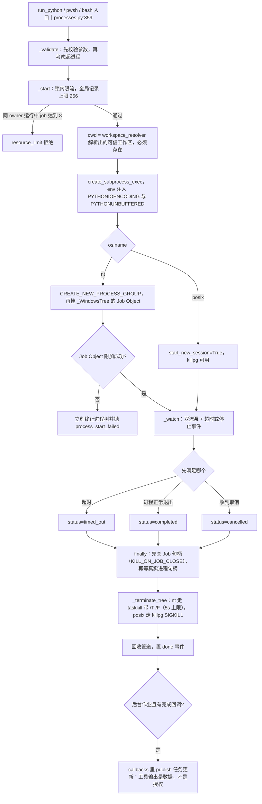

`ProcessConfig` 默认值（`processes.py:33`）：`default_timeout=30.0`、`max_timeout=300.0`、
`max_wait=30.0`、每流 `output_limit_bytes=64KiB`、`max_spill_bytes=32MiB`、`max_spill_files=512`、
`max_jobs_per_owner=8`、`max_terminals_per_owner=4`、`max_records=256`、
`max_command_chars=128KiB`、`cleanup_timeout=5.0`。
限流按 `owner` 统计、跨会话生效（访问本身更严），所有者校验把「别人的 id」和「不存在的 id」
都回同一个 `not_found`，不给出存在性预言。
Windows 侧 `_WindowsTree` 用 Job Object 的 kill-on-close 兜住「父进程已退出、子进程还在跑」的情况，
`taskkill` 只在启动或附加失败时兜底；`:124` 的 terminate 会 `WaitForSingleObject` 真实句柄，
避免「宣告完成时孙进程还在跑」。终端是持久**管道** shell（非 PTY，无 TUI、无交互 stdin），
`terminal_signal interrupt` 先发 CTRL_BREAK_EVENT（nt）或给进程组发 SIGINT（posix），
随后**无条件**走 `_cancel_and_wait`。

### 技能注册：最终名前缀与 {skill}__{tool} 路由

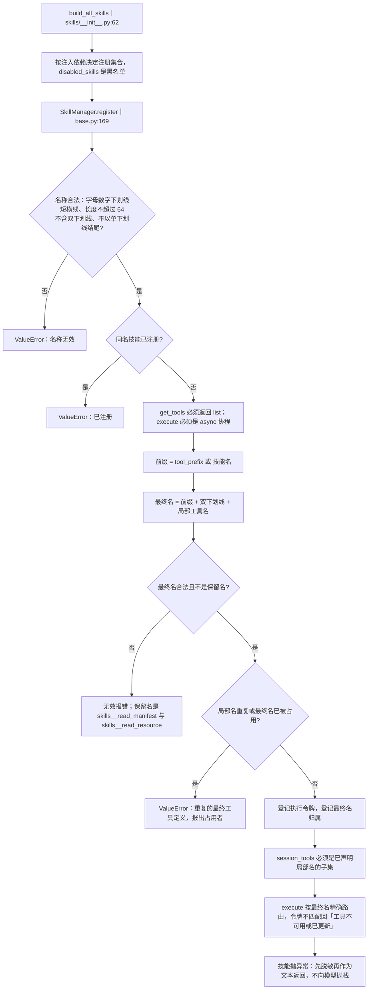

前缀**可以被多个技能共享**（`tool_prefix` 属性，`base.py:83`），因此路由必须按最终名精确匹配
（`_final_owners`），不能按技能名反查 —— 这正是 `agent_tools` 五个包能共用前缀的前提。
单条工具定义上限 `_MAX_SCHEMA_BYTES=64KiB`；`_validate_schema` 会拒绝外部 `$ref`、
递归 `$ref`、`prefixItems`/元组 `items`、非法正则与悬空指针。
`session_tools` 声明的工具走「提交后立即返回、后台完成再通知」的会话模式
（`reply/tools.py:1052` 分流），非会话工具直接 await。

### 技能按需加载：常驻 / 延后 / skills__load_tools / agent_tools 五包

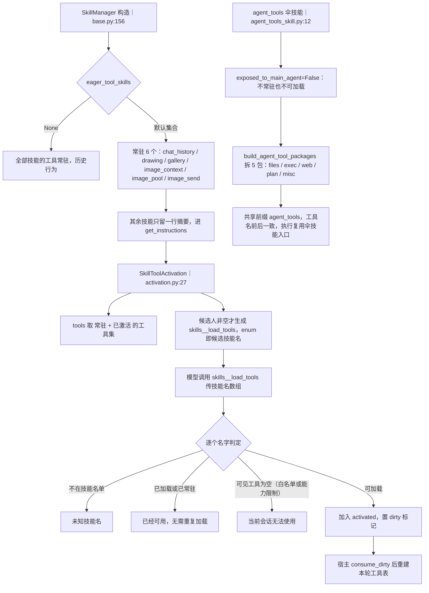

动机写在注释里：全部常驻时实测**超过 2 万 token**，而 `agent_tools` 的 20 个常驻工具
18 小时内只被调用 2 次、每次却占约 8.9K 字符（`skills/__init__.py:45`）。
`get_all_tools`（忽略按需策略）专供不经过主回复管线的独立 Agent（如沙箱维护 Agent）；
`get_skill_tools` 供只挂部分技能的子 Agent 取「已加前缀」的定义。
`exposed_to_main_agent=False` 的技能既不在 `deferred_skill_names` 里，也不会出现在加载候选里。
加载失败不是错误路径：未知 / 重复 / 不可见都会以人类可读文本回给模型，`_dirty` 只在真的新增时置位。

### Markdown 技能：SKILL.md 的发现、关键词命中与注入时机

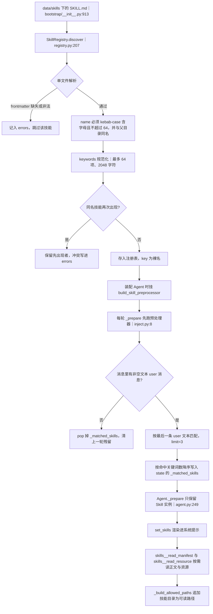

匹配**只用 keywords**（`registry.py:399`）：把 keywords 按空白与中英标点切分，
统计长度不小于 2 的词在查询文本里出现的个数，同分保持注册顺序；
`description` 不参与匹配。最多注入 3 个（注释写明与 README 一致），
且每轮都重算：没有用户消息时显式清理，避免上一轮命中污染本轮。
注意这是与内置技能**完全不同的第二套系统**：SKILL.md 提供的是提示词元数据 + 正文按需读取，
不注册任何工具，也不授予权限；插件通过 `register_many(owner, skills)` 以 `owner:name` 注册，
`unregister_owner` 整批注销，frontmatter 的 `allowed-tools` 会进入回复执行器的白名单过滤。

### 沙箱路径裁决：resolve_agent_path 的七道闸

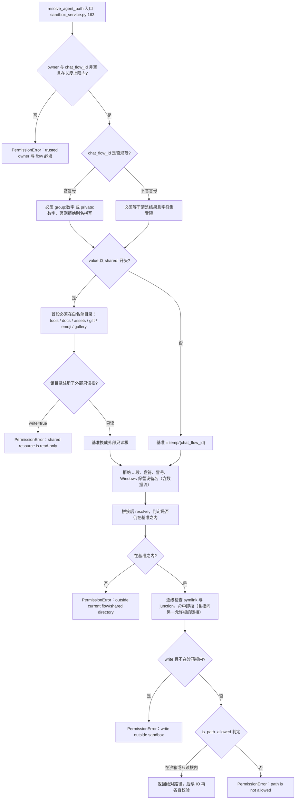

这是「受信上下文」版本：`owner` 与 `chat_flow_id` 只能由宿主传入，
模型参数里的 `owner` / `chat_flow_id` / `pipeline_key` 会被 `AgentFileTools.execute`（`:155`）
判为 `untrusted_context` 直接拒绝。
旧的 `resolve_path`（`:141`）只做「拼 `temp/{清洗后的 flow id}` + 沙箱边界检查」，
没有 shared 白名单与符号链接检查，新代码应走 `resolve_agent_path`。
`_sanitize_flow_id`（`:503`）先删 `..` 与斜杠，再把 `<>:"|?*` 和控制字符换成下划线，
去掉首尾空格与点，空串回落 `unknown` —— 冒号被拒的规范判定正是为了避免两个不同身份
经清洗后落进同一个目录。

### 沙箱并发与临时区：装配了却没生效的锁，以及真正的保护

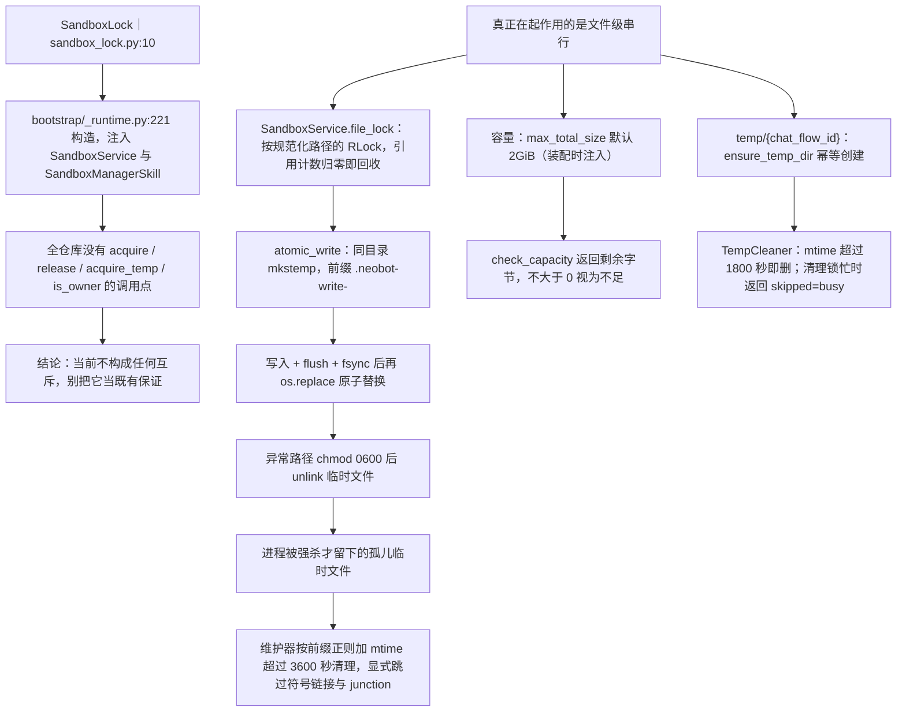

`SandboxLock` 的类注释宣称「主持有者拥有完整写权限、临时持有者只能访问 temp/{chat_flow_id}」，
但 `SandboxService.__init__` 把 `lock` 存进 `self._lock` 后再未使用，
`SandboxManagerSkill` 同样只赋值不使用，全仓库也不存在任何 `acquire` 调用 ——
**读代码时不要以为沙箱写操作被单会话互斥保护**。
`hold_temp` 工具（`sandbox_manager_skill.py:873`）只调 `ensure_temp_dir` 就返回
「已保活 N 分钟」，没有任何计时器或标记，属于纯回显。
同一个文件的跨进程写入没有锁：`file_lock` 是进程内 `threading` 原语，
多进程共享同一沙箱目录时只靠原子替换保证「不写坏」，不保证「不互相覆盖」。

### 沙箱维护 Agent：独立循环、调度判据与执行体

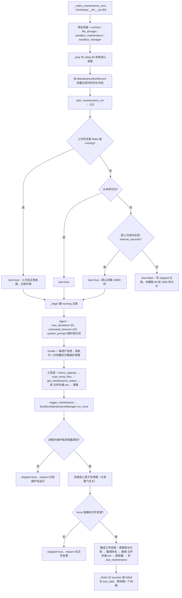

整个周期是同步文件系统操作（整树 rglob、rmtree、move），必须 `asyncio.to_thread`，
否则会卡住事件循环数秒（`sandbox_maintenance.py:64` 的注释就是这条历史坑）；
因此互斥从「事件循环天然串行」变成了显式 `_MAINTENANCE_LOCK`，拿不到就跳过本轮。
「有没有变更」只看 `tools` / `docs` / `assets` 与 `文件存储.md` / `TODO.md` 的 mtime 是否新于
`.last_maintenance`，所以安静运行时绝大多数轮次会跳过；孤儿临时清理**必须**放在变更门之前，
否则安静 Bot 上的残留永远清不掉。
`interval_seconds` 来自 `agent.sandbox.maintenance.interval_seconds`，
CLI 侧（`cli.py:558`）有同构的一份循环，两条路径共用同一套 prompt 与调度函数。

## 关键状态

| 状态 | 谁置位 | 谁清理 | 失败时停在哪 |
|---|---|---|---|
| 定义表与归属表 | AgentToolRuntime 构造期一次性写入 | 无（close 只停后台任务） | 重名直接 raise，进程启动失败 |
| `_closed` 标志 | close 首行 | 不重置 | 之后所有 execute 回 CLOSED |
| 计划模式 | enter_plan_mode 与 StateTools | exit_plan_mode 或人工审批 | 非白名单工具回 PLAN_MODE，不执行 |
| 一次性凭据 | credential__request 建 pending，管理员发文本后 ACTIVE | consume 置 USED；cleanup 清 pending 与已用 | 无凭据回 CREDENTIAL_REQUIRED，操作零副作用 |
| 子会话状态与 outcome | 创建为 queued，启动为 running，结束定终态 | close 全部 park 成 idle | 重启恢复为 idle 且 outcome=recovered，只有 send_message 能再启动 |
| 子会话状态文件 | _persist 每次变更后 fsync 再替换 | close 不删（保留会话） | 写盘失败回滚内存状态，outcome=failed 且 error=persistence_failed |
| 进程与终端记录 | _start 写入记录表 | 前台结束即弹出；close 清空 | 超上限回 resource_limit；Job 附加失败回 process_start_failed |
| spill 字节与文件计数 | _Capture.append 预留后累加 | close 删除临时目录（计数不重置） | 超限置 spill_failed，结果里 spill_limit_reached=true |
| `_matched_skills` | inject_skills 每轮覆盖写 | 无用户文本消息时 pop | 只是提示词数据，不授权任何工具 |
| 已激活技能集合 | SkillToolActivation.load | 随执行器对象生命周期 | 不可见技能只回文本提示，不抛错 |
| 沙箱临时目录 | ensure_temp_dir 幂等创建 | TempCleaner 按 1800 秒 mtime 删 | 目录被清后旧路径失效，需重新解析 |
| `.last_maintenance` 标记 | 维护周期末尾写时间戳 | 无（只读比较） | 标记不存在时视为有变更，首跑必做 |
| SandboxLock 持有者 | 无调用点 | 无 | 当前不参与任何裁决，不可依赖 |

## 易错点

* **SandboxLock 是死装配**：`acquire` / `acquire_temp` / `is_owner` / `is_occupied` 全仓库零调用点，
  `SandboxService._lock` 与 `SandboxManagerSkill._lock` 赋值后未使用。想加互斥必须自己接线。
* **`hold_temp` 是 NO-OP**：`minutes` 只出现在返回文案里，没有保活计时，临时目录照样按 mtime 被清。
* **`execute_command` 注册时被跳过**（`runtime.py:103`）：线协议命令工具只有 `pwsh` / `bash`；
  直接把 `execute_command` 交给 runtime 会得到 `UNKNOWN_TOOL`。
* **PTC 只在任务型 Agent 上生效**：主回复管线固定按 native 取叶子工具，
  排查「切了 ptc 没变化」时先看调用方是 `AgentToolsPackageSkill` 还是 `_invoke_child`。
* **三个 PTC 预算别混用**：`max_steps`（30000 步）、`max_iterations`（4000 次 for 迭代）、
  `max_tool_calls`（32 次工具调用）；墙钟 30.0 秒是独立的一道闸，超时回 `PTC_TIMEOUT`。
* **`parallel` 的并发是整批判定**：混入一个非并发安全工具就整批串行；
  失败批次会取消其余调用，但**已完成调用的副作用不回滚**。
* **PTC 里只能 catch `ToolCallError`**：`except Exception` 与 `finally` 会被 AST 校验直接拒绝，
  其他错误以 `PtcError` 终止整个程序。
* **凭据不是重试型错误**：没有凭据时每次调用都以同样原因失败，必须先 `credential__request`
  并由管理员签发；`one_time` 用一次即 USED，`timed` 不会被 consume 掉。
* **子 Agent 永远不是「真人请求」**：`human_request=False` 是硬事实，
  所以子 Agent 无法创建 goal、无法启动 ralph；`send_message` 只能收窄工具白名单。
* **ralph 的报告只是自述**：`independently_verified` 恒为 false，`complete` 必须带非空 `evidence`
  字符串、`blocked` 必须带 `blocked_reason`，否则降级为 `continue` 继续烧轮数。
* **技能前缀可以共享，路由必须按最终名**：`agent_tools` 五个包同前缀；
  重复的最终工具名会让 register 直接抛错，改用「按技能名反查」会路由到错误实现。
* **两套「技能」互不相干**：Markdown 技能（SKILL.md，最多命中 3 个，只进系统提示）
  与内置技能（工具表里的 `{skill}__{tool}`）同名也不冲突；改一套不要以为另一套跟着变。
* **维护循环的「跳过」不等于什么都没做**：孤儿原子写残留每轮都清；
  反过来只有 `force=True` 才跳过变更门，常规调用不会强跑。
* **跨进程没有沙箱写锁**：`file_lock` 是进程内原语，多进程共享沙箱目录时只保证
  「文件不会写坏」（原子替换），不保证「互相不覆盖」。
