# 07 档案记忆：自动总结触发 · 三种写入结果 · 溢出压缩与快照

## 范围

本图画「实时消息 → 档案」这条主干，以及它落在三个包里的契约与落库细节：

* 触发：`EventPipeline._schedule_archive_summary`（每条群/私聊消息）→
  `ArchiveMemoryAutoSummaryService.record_message` 的**计数与判据链**；
* 写入：`archive_crud` 工具 → `ArchiveMemoryService.set_with_outcome` 的**三种结果**
  （正常落库／超限先写后压缩／超限拒绝写入）；
* 溢出：`max_total_chars` 被突破后的**两层冷却 + 单飞 + 后台压缩 + 失败回滚**；
* 留痕：`archive_snapshots` 压缩前快照与保留策略；
* 存储：`SqlAlchemyUnitOfWork` 事务边界、SQLite WAL／busy_timeout、`retry_on_lock`、
  乐观锁 `set_if_version`；
* 读取：`ArchiveMemoryAccess` 契约、面板与工具的分页／预览口径。

**不画**（指向相邻图）：

* `archive_memory_summary.py` 的内部细节（提示词拼装、手写工具循环的逐轮判据、手动／批量压缩的
  面板入口与任务状态表、用量统计）→ `docs/flow/07b-archive-summary.md`（待补）；
* 入站消息解析与管道分发 → `02-inbound-message`；回复编排 → `03-reply-pipeline`；
  Agent 类工具循环 → `04-agent-loop`。

**spec 与现实的差异**（先看这三条再读图）：

1. `agent.memory.archive.auto_compact_chars`（默认 200，描述写「超过即触发一次 AI 自动精简」）
   在**全仓只有定义处**（`config/schemas/bot.py:1171`）出现过，没有任何读取点 —— 真正生效的
   只有 `max_total_chars` + `overflow_action` 这一组。
2. `max_chars`（500）与 `group_profile_max_chars`（1500）是**渲染／摘要长度上限**，不是存储上限；
   存储上限只有 `max_total_chars`（10000）。三者互不相干，见细节 4 与细节 9。
3. 自动总结的工具循环是**手写循环**（直接调 `provider.chat`），不走 `neobot_chat` 的 Agent 类；
   轮次、预算、单次调用超时都是这个服务自己的常量（细节见 07b 待补）。

## 流程

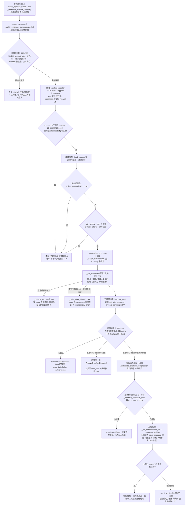

## 时序

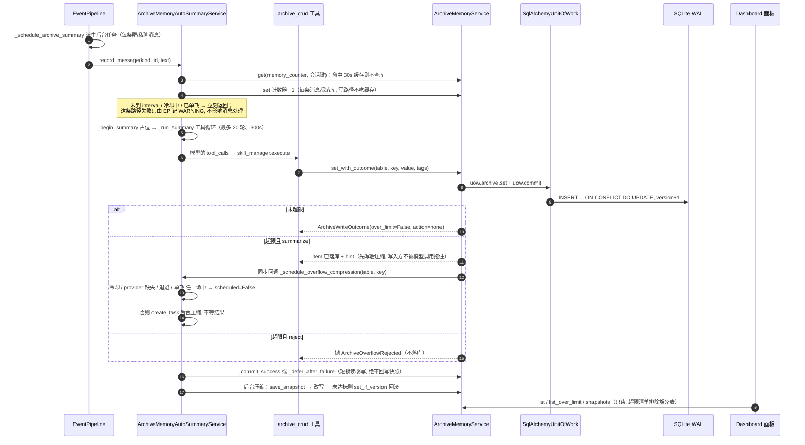

## 细节

### 触发判据链：五个前置 return + 计数阈值 + 两道闸门

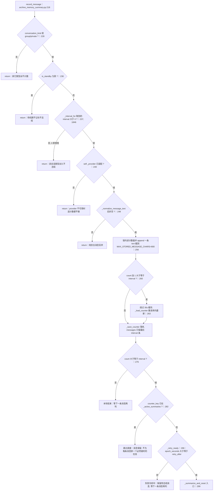

阈值来自 `config/schemas/bot.py:1123` 的 `AgentMemoryTrigger`：`group_interval=500`、
`private_interval=200`，`0` 表示禁用（`_interval_for` 直接返回 0，与「未配置」同义）。
两道闸门顺序不能换：**先判单飞（K）再判冷却（L）**，因为冷却中的计数器每来一条消息都会
越过 interval，若先判冷却就会在每条消息上多读一次库。
注意 `H` 的「绕过缓存重读」只在**将要触发**时才做：把外部对 counter 行的清零／改冷却
覆盖掉的代价，比每条消息多一次 DB 读大得多。

### memory_counter 行的形态与读写时机（为什么它是豁免表）

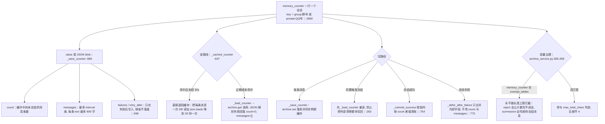

`DEFAULT_EXEMPT_TABLES = {memory_counter}`（`archive_service.py:40`）不是优化而是**安全阀**：
500 条 × 800 字 ≈ 400KB 的计数器天然超过任何 `max_total_chars` 上限。装配期由自动总结服务
显式传入 `exempt_tables=(COUNTER_TABLE,)`（`archive_memory_summary.py:207`），以 `COUNTER_TABLE`
为唯一事实来源。缓存 TTL 30 秒的代价是：外部改动最多 30 秒后才可见 —— 因此成功／失败两条
清账路径都必须回库读最新值。

### 成功清账 vs 失败退避：count 差值算法与 60→900 秒指数退避

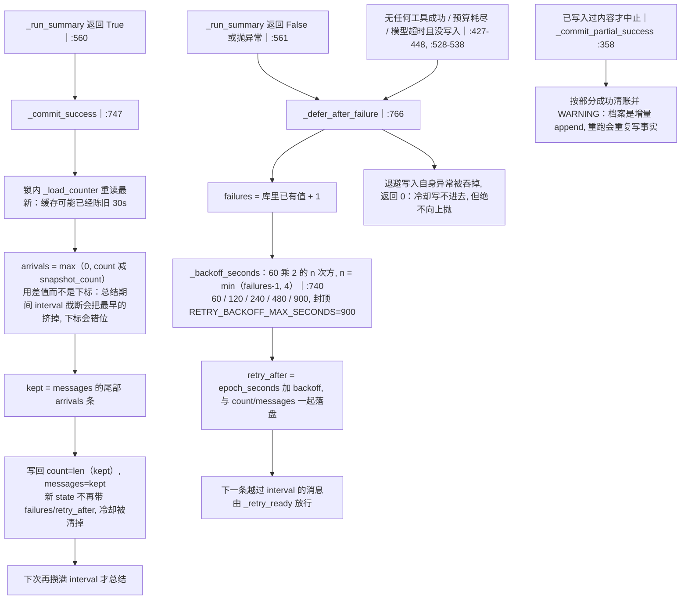

`count` 的语义是「**缓冲中尚未总结**的消息条数」（`:760-761`），不是累计计数器：
成功后被重置为总结期间新到的条数，所以总量与旧行为一致，但总结期间到达的那几条不会被丢掉。
失败退避是**唯一持久化在数据行里的冷却**（`failures`/`retry_after` 与计数器同一个 JSON），
进程重启后依然生效；而压缩路径的退避与冷却都是纯内存的（见细节 5）。

### 一次写入的三种结果：ArchiveWriteOutcome / ArchiveOverflowRejected / ArchiveVersionConflictError

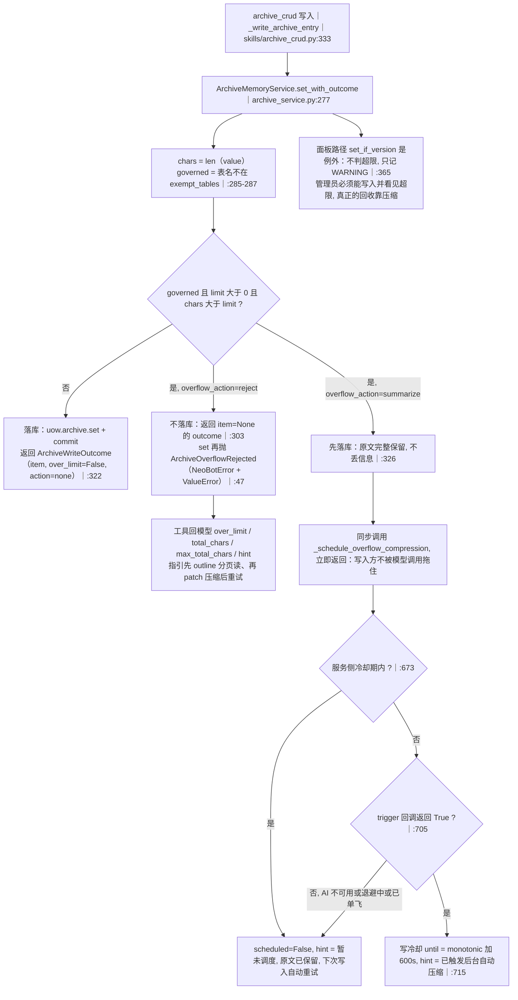

三种结果对应三条不同出路，别混：

| 结果 | 触发条件 | 是否落库 | 谁消费 |
|---|---|---|---|
| `ArchiveWriteOutcome`（success） | 未超限 | 是 | 工具层直接回 ok |
| `ArchiveWriteOutcome`（over_limit + summarize） | 超限且 action=summarize | **是**（先写后压缩） | 工具回 hint, 后台压缩 |
| `ArchiveOverflowRejected` | 超限且 action=reject | 否 | 工具／上层捕获, 回错误与指引 |
| `ArchiveVersionConflictError` | `set_if_version` 版本不一致 | 否 | 面板 409；压缩回滚失败时保留快照 |

`ArchiveWriteOutcome.ok` 的定义就是 `item is not None`（`:107-110`），它只回答「是否真的落库」，
不回答「是否超限」—— `over_limit=True` 与 `ok=True` 可以同时成立。

### 溢出压缩的两层冷却：服务侧 600s 与触发方 60→900s 退避

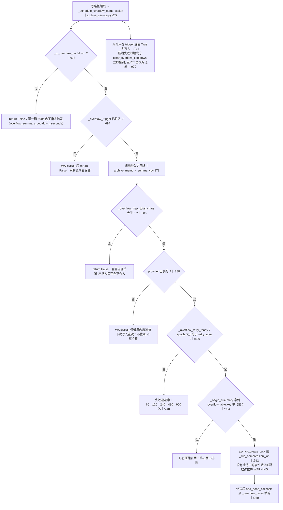

**两个时钟不同**，这是排查「为什么压不动」的关键：

* 服务侧冷却用 `time.monotonic()`（`archive_service.py:163, 675, 716`）—— 墙钟跳变不影响，
  但**进程重启即清空**；
* 触发方退避用 `epoch_seconds()`（`archive_memory_summary.py:1819`）—— 同样只在内存里，
  重启后 `_overflow_failures` / `_overflow_retry_after` 归零，压缩会立刻被再试一次。

「失败时不写服务侧冷却」是刻意的（`:684-686` 注释）：若一次失败写 600 秒冷却，
真正的重试节奏就再也由不了退避控制。另外 `MAX_OVERFLOW_BACKOFF_ENTRIES=512` 只做**容量保护**：
超过 512 条且已过期时才清理（`:1823-1831`），长期运行不会无界增长。

### 压缩留痕与回滚：快照什么时候留、什么时候删

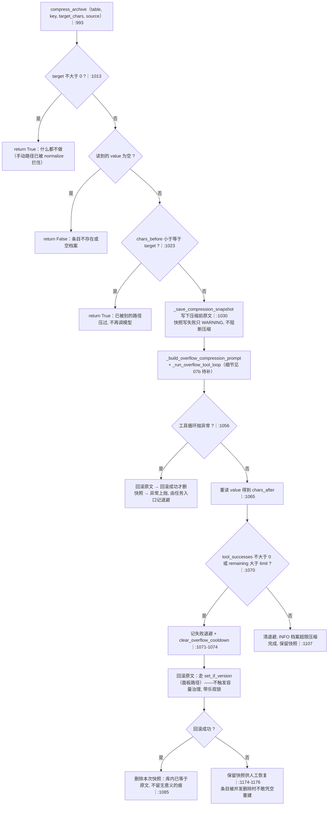

「宁可不压，不静默丢数据」（R19）全靠这两条：

* **未达标即失败**：压缩后仍大于目标，即使模型确实写了内容，也回滚原文（`:1070-1085`）；
* **回滚走 `set_if_version`**：一是绕过容量治理 —— 否则会形成「回滚 → 再次超限 → 再压缩」的
  死循环；二是带乐观锁，不覆盖并发的人工编辑（冲突时保留快照）。
  回滚的前提是「库内内容确实等于原文」或「成功改回原文」；条目已被删除时返回 False，
  快照保留（`:1174-1176`）。

### 快照保留策略与「压缩后可回看」

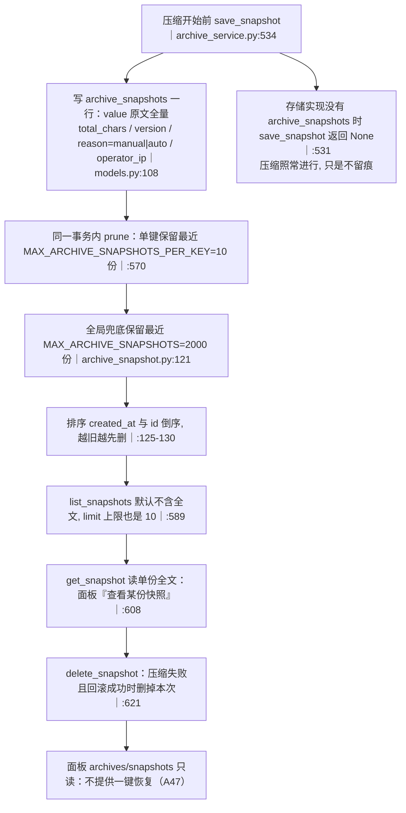

快照是**压缩前**写的：只有在「模型已经改写过档案」这个不可逆动作之前留一份原文才有意义。
`reason` 区分 `manual`（面板／批量）与 `auto`（写超限自动压缩），`operator_ip` 自动压缩时为
NULL —— 排查「谁把档案压小了」先看这两列。面板没有任何写接口，恢复属于独立工作项
（`models.py:111-113`）。

### 存储层：UoW 事务边界 / WAL / retry_on_lock / 乐观锁单语句 UPDATE

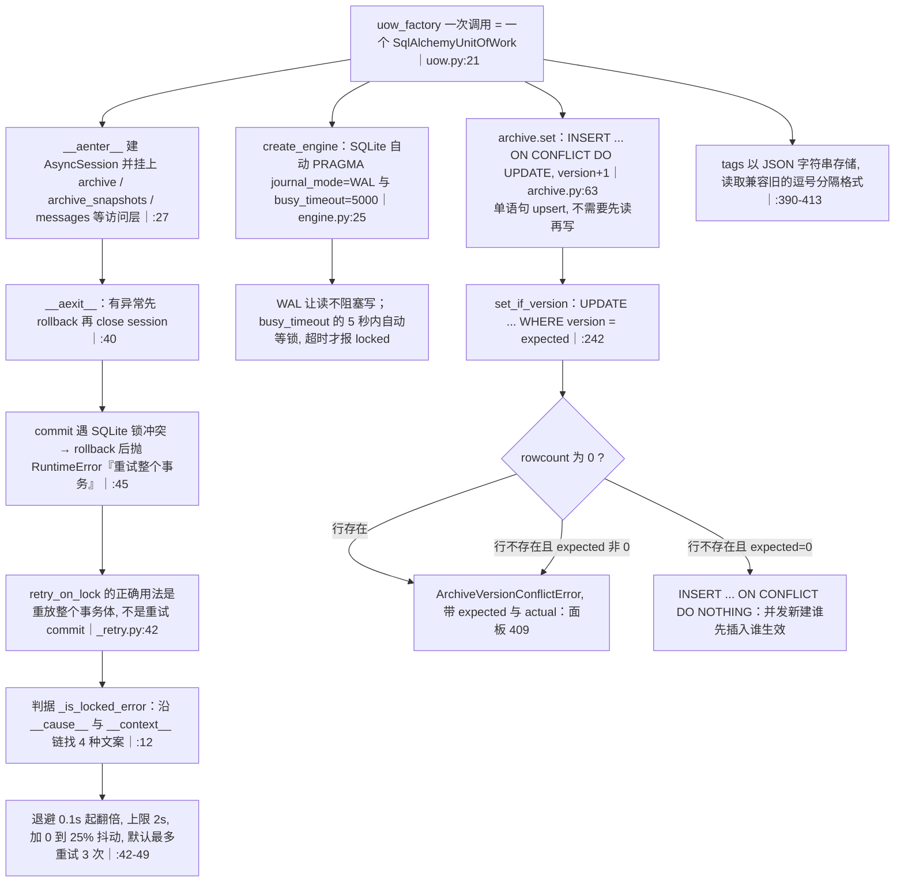

为什么 `commit()` 不允许「rollback 后重试 commit」：仓库层大量使用
`session.execute(insert(...).on_conflict_do_update())`，这类 Core DML 不体现在 ORM 的
new/dirty/deleted 状态里，rollback 之后重试 `commit()` 可能提交成功却**静默丢掉写入**
（`uow.py:46-55`）。正确姿势是调用方用 `retry_on_lock` 包住整个事务体并在 `on_retry` 里
`session.rollback()`。

### 读取路径：契约、面板与工具的分页／预览口径

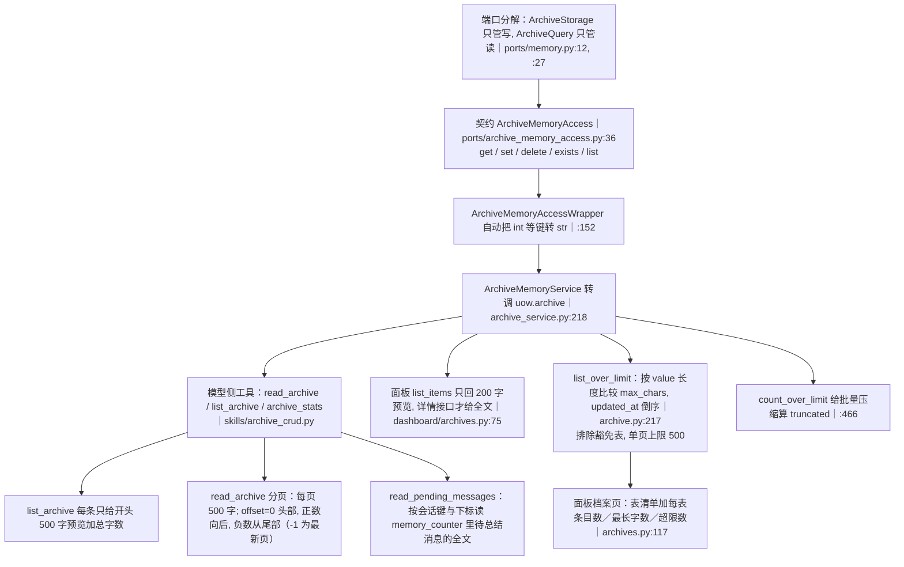

读取路径的**三层口径**要分清：存储上限 `max_total_chars`（判定与压缩）、渲染上限
`max_chars` / `group_profile_max_chars`（塞进提示词的展示长度）、工具预览
（`list_archive` 500 字、面板 200 字）。三者互相独立：把渲染上限调小不会触发压缩，
把存储上限调小也不会改变提示词里的展示长度。
面板与工具读的是同一条 `ArchiveMemoryService`，不新建数据层（`dashboard/archives.py:5`）。

## 关键状态

| 状态 | 谁置位 | 谁清理 | 失败时停在哪 |
|---|---|---|---|
| `memory_counter` 行的 count／messages | `_save_counter`（每条消息都写） | `_commit_success` 按 count 差值清账 | 失败时原样保留：消息不丢, 等下一条消息再判 |
| `memory_counter` 的 failures／retry_after | `_defer_after_failure` | 成功清账时整行覆盖写（新 state 不带这两个键） | 退避写入自身异常被吞, 退化为下一条消息立即重试 |
| `_active_summaries` 单飞位 | `_begin_summary` | `_summarize_and_reset` 的 finally | 无论成功失败都释放；进程崩溃则随进程消失 |
| 服务侧压缩冷却 `_overflow_cooldown_until` | 调度成功时写 monotonic 加 cooldown | 到期自然失效或 `clear_overflow_cooldown` | 压缩失败时触发方主动清除, 避免 600 秒静默 |
| 触发方退避 `_overflow_failures`／`_overflow_retry_after` | `_record_overflow_failure` | 压缩成功时 pop；超 512 条时清已过期项 | 纯内存：进程重启归零, 会立刻再试一次 |
| `archive_snapshots` 行 | `save_snapshot`（压缩前） | 失败且回滚成功时删除；prune 单键 10／全局 2000 | 快照写失败只 WARNING：压缩照跑, 失去留痕 |
| `archive_memories.version` | 每次 `set`／`set_if_version` 加 1 | 不清理（无上限） | 版本冲突抛 `ArchiveVersionConflictError`；压缩回滚失败则保留快照 |
| 手动／批量压缩任务表 `_manual_tasks` | `_new_manual_task` | `_prune_manual_tasks`：结束 1800s 后清, FIFO 50 条, running 永不淘汰 | 进程重启即清空, 面板只当「最近一次操作结果」 |
| 后台压缩任务集合 `_overflow_tasks` | 调度时 `create_task` 并 add | 完成回调 `add_done_callback` 移除 | `wait_pending_overflow_tasks` 只在测试与关闭路径等待 |

## 易错点

* **`auto_compact_chars` 是死配置**：默认 200、描述写着「超过即触发 AI 自动精简」，但全仓
  除 `config/schemas/bot.py:1171` 的定义处外没有任何读取点。改它不会有任何效果 —— 真正生效的
  是 `max_total_chars` + `overflow_action` + `overflow_summary_cooldown_seconds`。
* **两个「上限」不是一回事**：`max_chars`（500）／`group_profile_max_chars`（1500）只决定
  渲染与摘要长度（`_summary_limits` 把它们当作 `user_summary`／`group_summary` 的硬限制），
  与存储上限 `max_total_chars`（10000）无关。
* **`memory_counter` 必须无条件豁免容量治理**：若对它 reject，自动总结连计数都写不进去；
  若对它 summarize，压缩器会去「压缩」待总结消息队列，把尚未总结的消息吃掉。
  误伤的表现是「档案自动总结整体失效」，比超限严重得多。
* **provider 不可用时 `record_message` 提前返回**（`:240`），这条消息**不计入**计数器；
  而失败冷却中仍会每条消息计数落库。前者丢计数，后者只是攒着 —— 排查「消息数对不上」时
  先确认这段时间 provider 是否可用。
* **`flush_all` 不看冷却**（`:791-849`）：关闭收尾时对所有 `0 < count < interval` 的会话
  立即总结，处在失败退避中的会话也会被强行尝试一次；`record_message` 才会判 `_retry_ready`。
  关闭顺序是 `flush_pending_summaries` 先于 `archive_summary_service.close`（`application.py:471, :476`），
  所以刷新时 provider 还活着 —— 但可能拖慢关机（每条最多 300 秒预算）。
* **`_run_summary` 的异常分支没有显式 `return False`**（`:561-569`，函数注解是 `bool`）：
  走到这里会落下返回 `None`。调用方按 falsy 处理，行为正确，但别依赖「返回布尔」这一契约。
* **压缩未达标 = 失败并回滚**，不是「尽力而为」：回滚走 `set_if_version`（面板路径）因此
  **不会**再次触发自动压缩；反过来说，任何绕过 `set` 的写入路径都不参与容量治理。
* **服务侧冷却看 monotonic，触发方退避看 epoch**：两者都是进程内的，重启后冷却全清；
  但 `memory_counter` 里的失败退避是**持久化**的，重启后仍然拦着自动总结。
* **`uow.commit` 不允许「rollback 后重试 commit」**：Core DML 的写入不在 ORM 状态里，
  重试 commit 可能「提交成功但静默丢写入」；正确做法是 `retry_on_lock` 重放整个事务体。
* **面板路径故意不做容量上限拦截**（`set_if_version`，`archive_service.py:365`）：管理员写入
  超限档案只会得到 WARNING，超限条目靠 `list_over_limit` 暴露、由压缩回收；不要把它
  当成「服务端已经拦住」。
* **压缩期间不要整条重写档案**：hint 里明确要求（`archive_service.py:329-331`）—— 模型若在
  后台压缩进行中整条 `save_archive`，会与压缩结果互相覆盖，而 `version` 冲突只在
  `set_if_version` 路径上才报错。
