# 07b 档案自动总结与压缩：计数触发 · 手写工具循环 · 溢出压缩 · 面板手动/批量入口

## 范围

本图钻 `app/src/neobot_app/runtime/archive_memory_summary.py`（2153 行）的内部，以及它依赖的
`packages/memory/src/neobot_memory/archive_service.py` 里**与容量治理相关的半边**：

* 计数：`record_message` 的读-改-写、30 秒解析缓存、`interval` 截断、单飞与失败退避；
* 总结：`_summarize_and_reset` -> `_run_summary` 的**手写工具轮次循环**（提示词装配、20 轮、
  300s 预算、单次调用超时、工具失败熔断、终止条件）；
* 收尾：`_commit_success` / `_defer_after_failure` 两条清账路径与指数退避；
* 溢出压缩：写路径判定、reject/summarize 两种动作、两层冷却与两层退避、压缩循环与回滚；
* 快照：`save_snapshot` 时机与保留策略、`set_if_version` 回滚为何不再触发容量治理；
* 面板入口：`start_manual_compression` / `start_batch_compression` / `get_manual_task` 与进程内
  任务状态表；关闭收尾 `flush_all`；用量统计与日志观测点。

**不画什么**（指向相邻图）：

* 触发者与入站链路：`EventPipeline._schedule_archive_summary` / `flush_pending_summaries` 的位置、
  入站消息解析 -> `02-inbound-message.md`、`02c-event-pipeline.md`（本图只标调用点）；
* 记忆与档案的整体契约、三种写入结果全貌、存储层事务与乐观锁仓库实现 -> `07-memory-archive.md`；
* 面板端点权限与快照历史页面 -> `09b-dashboard-api.md`；`archive_crud` / `favorability` 工具自身
  的实现 -> `06-tools-skills.md`。

**spec 与现实的差异**（先看这四条再读图）：

1. `agent.memory.archive.auto_compact_chars`（默认 200）是**死配置**：全仓只有定义处
   （`config/schemas/bot.py:1171`），容量治理只认 `max_total_chars` + `overflow_action`（W4）。
2. 自动总结**不走 `neobot_chat` 的 Agent 类**：本文件手写 `provider.chat` 轮次循环，轮次/预算/超时
   全是自己的常量与 `agent.memory.trigger.*` 配置（`:425`）。
3. `flush_all` 与 `record_message` 的判据不一致：关闭收尾不看待机、不看 provider、不看失败退避
   （W17；本图细节 9 补了「不看 provider」这一条）。
4. 两层冷却用**两个时钟**：档案服务侧用 `time.monotonic()`，触发方失败退避与计数器退避用
   `time.time()`（`epoch_seconds`）；只有计数器退避落在库里，另外两个随进程消失（细节 4）。

## 流程

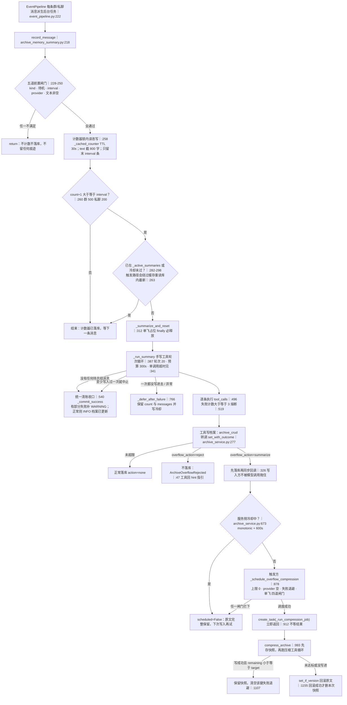

主干只有一条：**每条消息计数 -> 攒够 interval -> 手写循环更新档案 -> 写超限则后台压缩**。
三种失败语义要分清：写入被拒（reject，不落库）、压缩没调度（保留原文等下次写入）、
压缩未达标（回滚原文，留下快照）。

## 时序

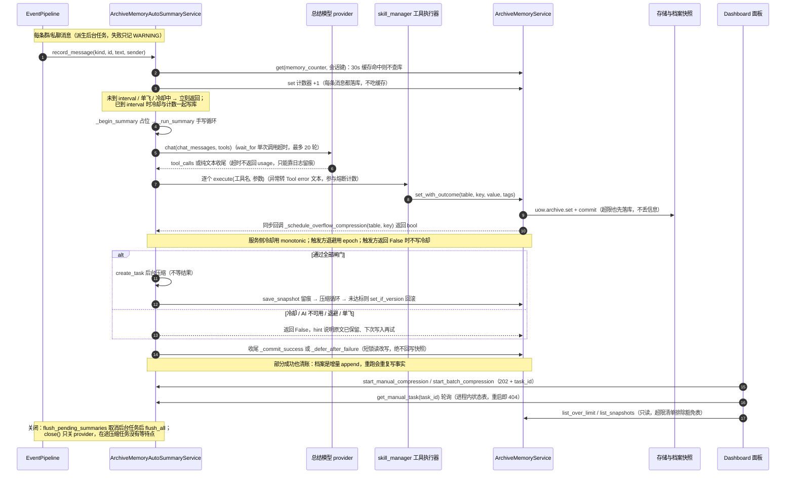

三条「不致命」的线：**单条消息记录失败**只由 EventPipeline 记 WARNING；**压缩失败**保留原文并退避，
绝不影响写入方；**用量统计失败**只 WARNING（但账单会缺，见细节 10）。

## 细节

### 计数与触发：五道前置闸门、30 秒解析缓存与两道并发闸门

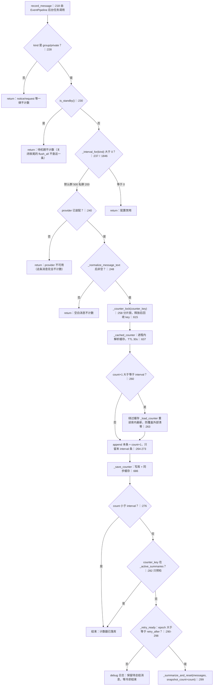

要点：**计数器是唯一事实来源**，`count` 的语义是「缓冲中尚未总结的消息条数」。缓存只服务读路径，
写路径每条消息都落库（崩溃丢失窗口与旧实现一致）；只有「将要触发总结」这一条路径强制绕过缓存，
因为写回缓存内容会撤消外部对该行的清零或冷却修改（`:261-263` 的注释写明）。
非触发路径仍以 30 秒前的缓存为读-改-写基底：外部进程在这 30 秒内对该行的修改可能被覆盖回去，
这是缓存换性能的已知代价。
`messages` 只保留最后 `interval` 条：冷却期足够长时，最早的待总结消息会被新消息挤出缓冲并**永久丢失**
（没有溢出到别处的暂存区）。

### _run_summary 手写循环：20 轮、300s 预算、三种 break 与三种收尾

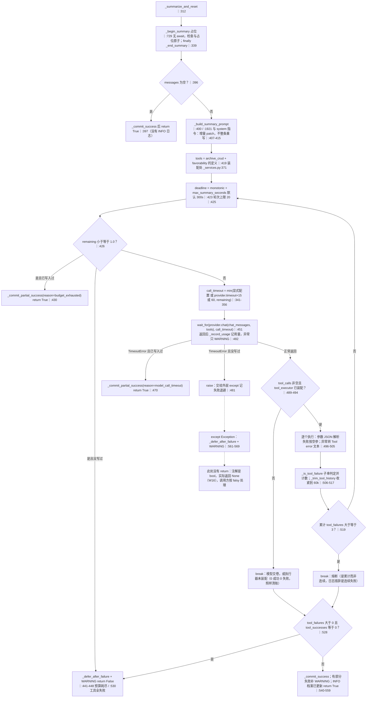

循环的三种正常出口都落到清账：**模型不再调工具**（break）、**轮次用满**（for 走完）、**工具熔断**（break）。
只有「一次工具都没成功 + 有失败」「预算耗尽且没写过」「抛异常」三种情况才走退避。
`asyncio.wait_for` 的超时不返回 `usage`，服务端却已经计费 —— 所以超时分支专门打一条 WARNING 说明
「本次调用不会计入用量统计」（`:459-468`）。
`_next_call_timeout` 的余量设计（`PROVIDER_TIMEOUT_MARGIN_SECONDS=15`）是让 httpx 先超时并返回可读错误，
而不是在模型仍正常推理时被外层掐断（`:341-347`）。

### 清账 vs 退避：count 差值清账、字段覆写顺带复位冷却、60 到 900 秒指数退避

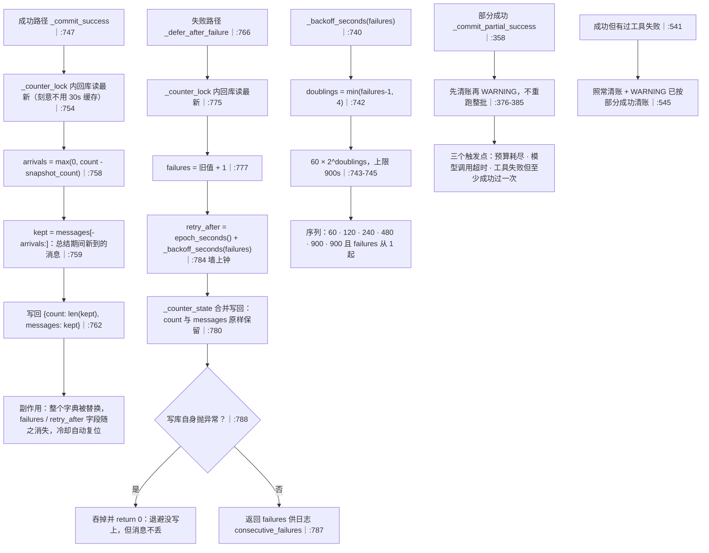

用 `count` 差值而不是消息下标：总结期间消息会因 `interval` 截断把最早的挤掉，下标会错位，
而 `count` 每条消息恰好 +1（`:750-752`）。退避整体在计数器锁内完成，失败路径只允许合并冷却字段，
不得改写 `count` / `messages`（`:771-772`）—— 否则会把总结期间新到的消息用旧快照覆盖掉。
**部分成功清账是刻意的**：档案是增量 append，重跑会把同一批事实再写一遍，还会再烧一遍 token，
大概率以同样方式再次中止；代价是「模型没处理完就被销账」只留一条 WARNING（`:370-374`）。

### 溢出判定与两层冷却：服务侧 monotonic 600s + 触发方 epoch 退避

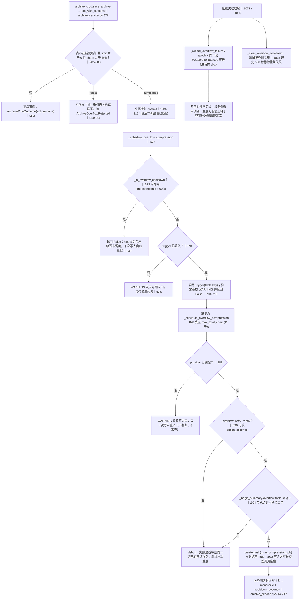

**同一套退避算法用在三处**：会话总结（落库）、溢出压缩（进程内 dict）、以及面板手动压缩失败
（也写进溢出压缩这张表，因此一次失败的手动压缩会推迟自动重试）。
服务侧冷却只在 `trigger` 返回 True 时写入；触发方因为 AI 不可用 / 退避 / 单飞而返回 False 时
**不写冷却**，这样「下次写入再试」不会被一次失败锁死 600 秒（`:684-685`）。
`_prune_overflow_backoff` 只在条目数超过 512 时才清理已过期项（`:1823-1831`）。

### 压缩循环：target 三种 no-op、与总结同源的预算与熔断、未达标必须回滚

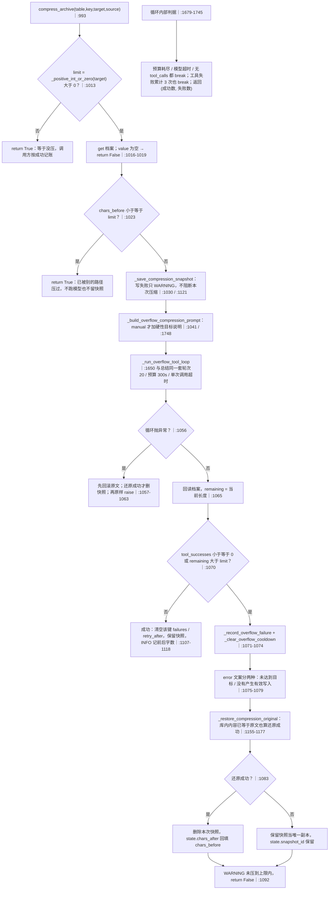

判定只看两个量：**至少成功写过一次** 且 **最终长度不超过 target**。因此「模型把档案改写短了但丢了事实」
不会被拦（没有事实保真校验）；反过来「模型只写了一部分、长度已达标」会被当成功保留。
与总结循环的差别：这里预算耗尽 / 超时**不写失败退避**（不算异常），由外层按「未达标」统一收口，
所以不会重复记两次失败。
自动路径的 target 恒为 `max_total_chars`，手动路径是面板传入并经 `normalize_manual_target` 校验的值。

### 快照与回滚：压缩前留痕、每键 10 份、回滚走 set_if_version 因此不再触发治理

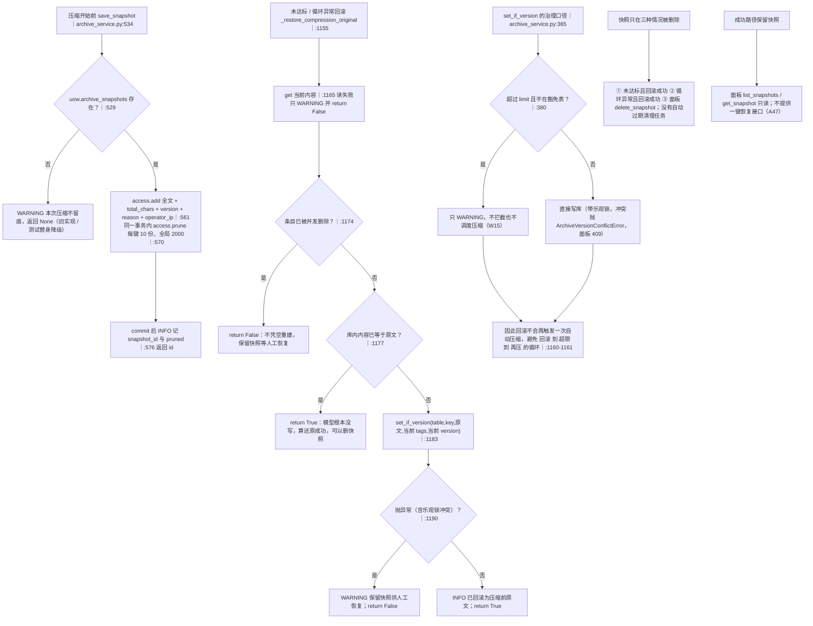

快照的写入时机由调用方保证：**压缩开始前、拿到 chars_before 之后**（`:547-548`）。写失败只告警，
不阻断压缩本身。删除是保守的：只有确认「库内内容已等于原文」才删，否则快照就是这次失败压缩的唯一副本。
`_set_if_version_fallback` 用于没有原生乐观锁的内存实现（先查后写，有 TOCTOU 窗口，仅开发路径，
`archive_service.py:420-444`）。

### 面板手动压缩：目标边界、零 token no-op、与自动压缩抢单飞键

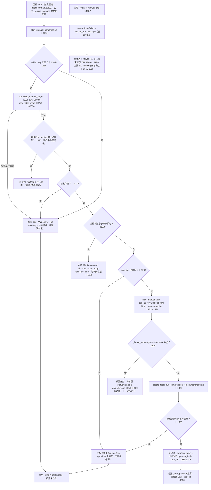

手动路径**不查服务侧冷却、也不查失败退避**，只与自动压缩共用单飞键 `overflow:{table}:{key}`（D16）：
同一键正在跑时如实回「进行中」，不排第二个模型循环。
`manual_target_bounds` 的兜底上限 100000 在 `max_total_chars=0`（容量治理关闭）时生效，
所以单条手动压缩在关闭治理后仍可用（A44）。
任务状态表只当「最近一次操作结果」，历史在 `archive_snapshots`；进程重启即清空，面板查询返回 404
（`dashboard/api.py:2432-2436`）。

### 批量压缩：20 条上限、truncated 口径与逐条串行

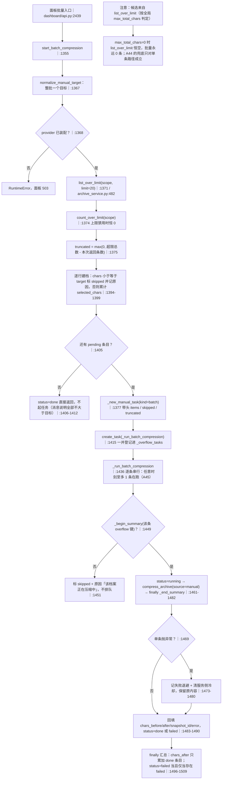

`truncated` 是「超限总数 - 返回条数」，面板据此提示还有多少条没被这次请求覆盖（要分多次点）。
`skipped` 有两个来源：**自身不大于目标**（本次统一目标）与**同键正在被压缩**（自动或其它手动任务），
两者都进同一个 `skipped` 列表，面板如需区分只能看 reason 文本。
批量任务自身的异常被最外层 `except` 兜住，已完成的条目结果不受影响（`:1493-1495`）。

### 关闭收尾 flush_all：只刷部分计数、与 record_message 的三处判据差异

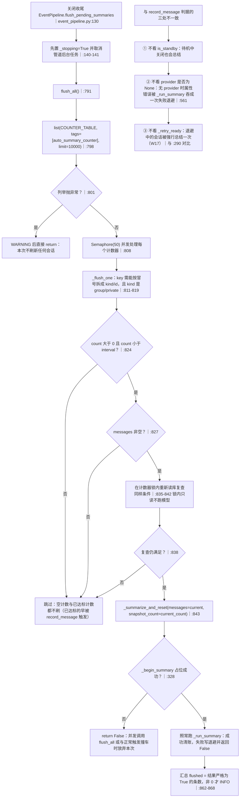

关停顺序（`application.py:467-477`）：先 `flush_pending_summaries`，再 `archive summary service` 的
`close()`；而 `close()` 只关 provider（`:1842-1844`），**不等在途的溢出压缩任务** ——
`wait_pending_overflow_tasks` 在全仓只有测试调用（`app/tests/modules/runtime/*`），生产关闭路径没有等待点。
`flush_all` 的并发语义：`asyncio.gather(..., return_exceptions=True)`，单个计数器异常只 WARNING，
不影响其它会话（`:850-861`）。

### 观测点：日志字段、用量统计的两个 kind、面板可见状态

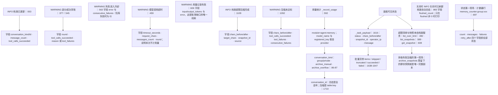

`agent_prompt_parts()`（`:1904`）把群聊模板与工具定义交给分析页展示，是「模型看到什么」的只读入口；
提示词拼装细节见细节 11。日志字段名即排查时的检索键，例如用 `consecutive_failures` 判断某个会话
是否已经连续失败多轮。

### 提示词装配：档案表与长度上限、好感度软约束、截断补救与容量说明

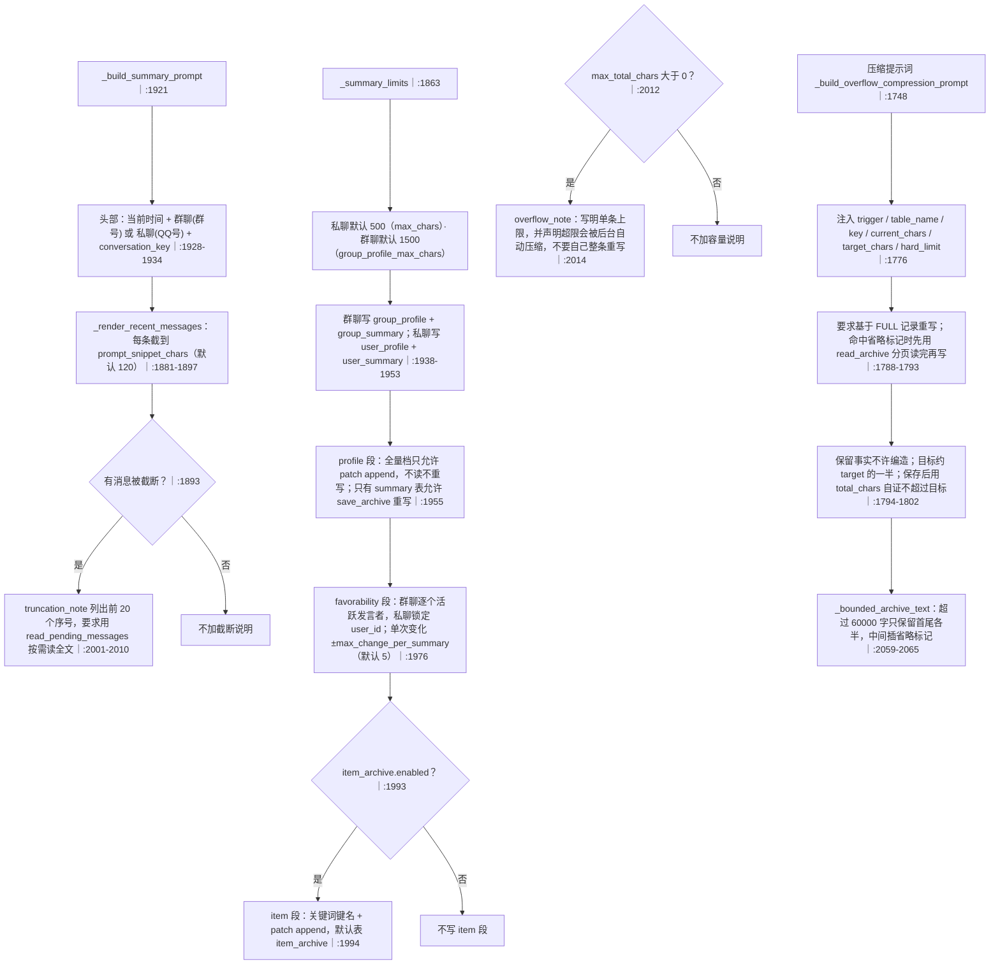

`max_chars` / `group_profile_max_chars` 是**渲染与摘要长度上限**，与存储上限 `max_total_chars` 无关
（三者互不相干，见 07 的说明）。favorability 的 ±N 只是写进提示词的软约束，真正的钳制在工具侧；
但工具侧读的配置键名与 schema 不一致（见易错点）。
压缩提示词的目标与硬上限是两个字段：手动路径下 `target` 是本次要求，`hard_limit` 始终是全局
`max_total_chars`（`:1782-1783`）。

## 关键状态

| 状态 | 谁置位 | 谁清理 | 失败时停在哪 |
|---|---|---|---|
| `memory_counter:{kind}:{id}` 行（count / messages / failures / retry_after） | `record_message` 每条消息写库；`_defer_after_failure` 追加冷却字段 | `_commit_success` 整字典覆写，顺带抹掉 failures / retry_after | 计数器写库失败由 EventPipeline 捕获记 WARNING，这条消息不计数 |
| `_counter_cache[key]`（TTL 30s） | `_cached_counter` 读库后 / `_save_counter` 写后 | TTL 到期；下一次写入覆盖 | 缓存永远不是事实来源：触发路径强制回库重读 |
| `_active_summaries`（会话键与 `overflow:table:key` 共用） | `_begin_summary`（无 await，原子） | `_end_summary`：总结 finally、压缩任务 finally、批量每条 finally | 调度失败（无事件循环）时显式 `_end_summary` 释放，不留幽灵占位 |
| `_overflow_failures` / `_overflow_retry_after`（进程内） | `_record_overflow_failure` | 压缩成功时 pop；条目过期且超 512 时 `_prune_overflow_backoff` | 只在内存，重启即重置退避（与计数器退避不同） |
| `_overflow_cooldown_until[(table,key)]`（服务侧，monotonic） | 档案服务在 trigger 返回 True 时写 | `clear_overflow_cooldown`（触发方在压缩失败时调用） | 触发方返回 False 时不写冷却，下次写入可立即重试 |
| `_overflow_tasks` | `create_task` 后 add | 任务完成回调自动 discard | 关闭路径没有等待点：`wait_pending_overflow_tasks` 只有测试调用 |
| `_manual_tasks`（进程内，含 batch 的 items/skipped） | `_new_manual_task` | `_prune_manual_tasks`：已结束且超 1800s，或 FIFO 超 50；running 永不淘汰 | 进程重启即清空，面板按 task_id 查询 404 |
| `archive_snapshots` 行 | 压缩前 `save_snapshot`（同事务内 prune） | 未达标且回滚成功 / 异常且回滚成功 / 面板 `delete_snapshot` | 回滚失败时保留快照，作为这次压缩的唯一副本 |
| 面板 payload 的 status / chars_before/after / snapshot_id / error | `_finalize_manual_task`（单条）与批量 finally 汇总 | 只读投影，无清理 | 轮询不到即进程重启或超出 TTL |
| `provider` 引用 | `install_provider` 换引用（不关旧实例，由调用方清理） | 只有 `close()` 关当前实例 | provider 为 None 时：record_message 早退不计数，触发方拒绝调度，手动入口回 503 |

## 易错点

* **`_run_summary` 异常分支没有 `return False`**（`:561-569`，W16）：注解写 `-> bool`，实际返回 `None`。
  调用方按 falsy 处理所以行为正确，但把返回值直接参与 `is False` 判断会踩坑。
* **`flush_all` 与 `record_message` 判据不一致**（`:791`，W17）：关停收尾不看 `_retry_ready`，退避中的会话
  会被强行总结一次；而且它**也不看 `is_standby`、不看 `provider is None`** —— 没装 provider 时
  `self._provider.chat` 的 `AttributeError` 会被 `_run_summary` 的 `except Exception` 吞成一次失败退避，
  于是每次关闭都给退避中的会话再叠一次 `failures`。
* **两层冷却用两个时钟，且都不落盘**：服务侧 `_overflow_cooldown_until` 用 `time.monotonic()`，
  触发方 `_overflow_retry_after` 用 `time.time()`（改系统时间会影响后者）；只有计数器行的 `retry_after`
  是持久的。重启后溢出退避清零，但服务侧冷却同样清零 —— 「重启后立刻又压一次」是预期行为。
* **回滚不再触发容量治理**（W15）：`set_if_version` 对超限只 WARNING（`archive_service.py:380-389`），
  所以「压缩未达标 -> 回滚 -> 又超限」不会形成压缩循环；代价是面板可以写入超限档案，只能靠
  `list_over_limit` 暴露。
* **`auto_compact_chars` 是死配置**（W4）：`config/schemas/bot.py:1171` 定义，全仓无读取点；改它没有任何效果。
* **清账会顺带清掉失败计数**：`_commit_success` 写回的字典只有 `count` / `messages`（`:762`），
  所以一次成功就把 `failures` / `retry_after` 抹掉 —— 这是冷却复位的实现方式，不是 bug；
  但也意味着「连续失败 3 次后成功一次」无法从计数器行看出历史。
* **预算耗尽/超时都优先「部分成功清账」**：只要成功写过一次就清账、不重试；只有一次都没写进才退避。
  代价是「档案只更新了一半」完全静默，只有一条 WARNING（`:377`）。
* **工具失败是子串匹配**：`_is_tool_failure` 用 `未知工具` / `工具执行失败` / `Tool error` 三个标记
  在**返回值文本**里搜索（`:2122-2125`）。工具正常返回的正文一旦包含这些词就会被计成失败，
  累计 3 次即熔断本轮总结。
* **`tool_executor` 为 None 时循环直接 break**（`:493-494`）：0 成功 0 失败，于是走 `_commit_success` 清账并
  打印「档案已更新」，但档案一个字都没动。装配正常时不会发生（`bootstrap/_services.py:375` 必传），
  测试替身或手工构造实例时要小心。
* **`messages` 缓冲只有 `interval` 条**：长冷却 + 消息洪水会把最早的待总结消息挤出并被覆盖（`:270`），
  那批消息永远不会被总结。`flush_all` 读的也是这同一份缓冲。
* **批量压缩的候选来自 `list_over_limit`（按 `max_total_chars` 判定），不是按本次目标**：
  所以出现「超限 10 条、全部 skipped」是正常的（目标比它们的当前字数还大）；更隐蔽的是
  `max_total_chars=0` 时 `list_over_limit` 恒空 —— 容量治理关闭后**批量入口永远 0 条**，
  而单条手动压缩仍可用（A44 的兜底只覆盖了单条路径，`:1230-1233`）。
* **手动/批量压缩不查服务侧冷却与失败退避**，只抢单飞键：面板可以立刻重压一条刚失败过的档案；
  但手动失败会写进自动压缩的退避表，反过来推迟后台自动重试。
* **快照只在「确认回滚成功」时才删**（`:1084`，`1157-1204`）：回滚失败或条目被并发删除时快照保留，
  面板没有一键恢复接口（A47），恢复要靠人工把快照内容写回。
* **`_favorability_min` / `_favorability_max` 读了从不用**（`:127-128`）；而 `skills/__init__.py:186-188`
  读的键名是 `favorability_max_change` / `favorability_min` / `favorability_max`，schema 里却是
  `favorability.max_change_per_summary` / `min_value` / `max_value`（`bot.py:1201-1212`）。
  结果：提示词里的 ±N 用配置值，工具侧钳制恒为默认 ±5、范围 ±1000 —— 改配置会让两边口径分叉。
* **`_format_counter_message` 是死函数**（`:2151`）：全仓只有定义处；渲染走的是
  `_normalize_counter_message` + `_format_sender`（`:2132`、`:2142`）。
* **关停不等在途压缩**：`close()` 只关 provider（`:1842`），`wait_pending_overflow_tasks` 只有测试调用；
  进程退出时在途的压缩任务可能被丢弃（原文已在库，快照可能残留）。

