# 08 插件系统：扫描 · 加载 · 启停 · 依赖 · 配置热重载

## 范围

本图覆盖 `packages/modloader` 里**除 runtime.py / installer.py / hooks.py 之外**的插件骨架：

* 目录扫描与 `plugin.toml` 元数据：`loader.py`、`loading/manifest.py`、`loading/models.py`；
* 注册与启停状态机、插件句柄与注册表视图：`manager.py`；
* 插件间依赖判定与加载顺序：`dependency.py`、`loading/ordering.py`；
* 模块导入与缓存清理：`loading/importer.py`；启停持久化：`state.py`；
* 插件配置存储与校验：`config_store.py`、`config_validation.py`、`version.py`；
* 两条配置热重载链路：`runtime/hot_reload_registry.py`（本体配置）、`runtime/plugin_config_reload.py`（插件配置原地生效）；
* 装配入口：`bootstrap/_skills.py:91 build_plugin_runtime`。

**不画什么**（避免与相邻图重叠）：

* `modloader/runtime.py`（2328 行编排门面）的逐行细节、`installer.py` 的下载/解压/备份、`hooks.py` 的处理器绑定与参数注入 → 见 `08b-plugin-runtime.md`（待补）。本图只在节点上标注它们的位置与调用顺序。
* `Plugin`（`plugin.py`）的装饰器注册面（命令/工具/Agent/Markdown Skill 绑定）→ 见 06-tools-skills。

**spec 与现实的差异**：实现里**没有文件监听**。全仓没有插件目录 watcher，`reload` 只能由面板按钮 / `plugin_control` 门面 / 插件自身调用触发；`config.reload` 命令只分发**本体**配置（`HotReloadRegistry.apply`），插件配置走 `apply_plugin_config_change` 这条独立通道 —— 两者不互相触发。

## 流程

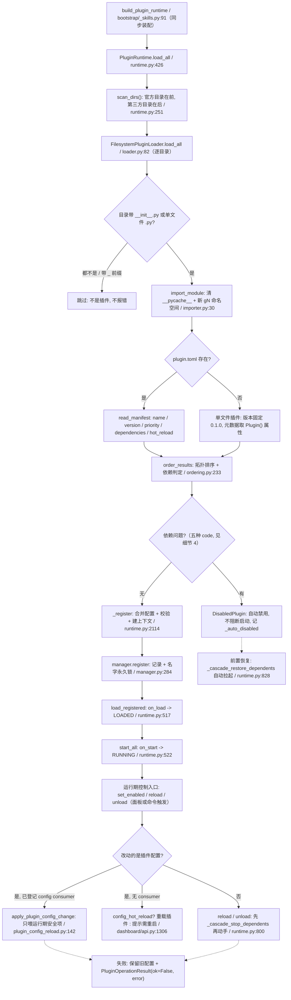

节点全部用符号名 + 文件行号；判据写在菱形上，失败语义用虚线 —— 细节展开见下文 12 个折叠块。

## 时序

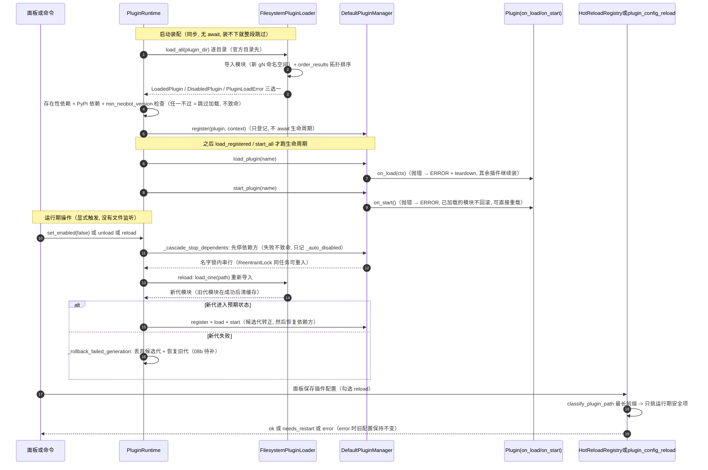

三条「不致命」的线要记牢：**单个插件加载失败**只影响它自己；**依赖未满足**是自动禁用而不是异常；**配置消费者失败**只回滚这一次改动，不影响其它组件。

## 细节

### 发现与元数据：扫描规则、plugin.toml 字段与类型校验

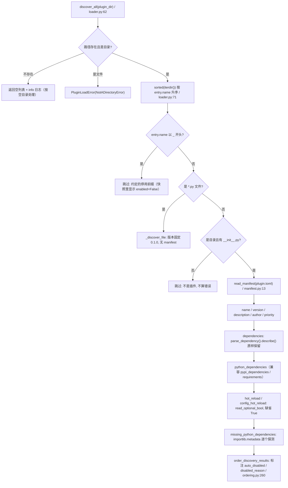

类型校验点（任一不合法该插件变成 `PluginLoadError`，不影响其它插件）：`enabled` 必须 bool、`priority` 必须 int、`dependencies` 必须是 string list、`python_dependencies` 不能含空串、`tags` 最多 16 项且单项不超过 32 字符、`[config]` 必须是 table。`min_neobot_version` 只在 `runtime.py:260 _host_version_error` 里比较，且**只在插件 enabled 时检查**；无法比较（源码运行、版本号非数字开头）时跳过检查并打 warning。
单文件插件（`plugins/foo.py`）没有 manifest 可读：版本恒为 `0.1.0`，依赖/优先级/热重载能力全部取 `Plugin(...)` 上的属性。

### 插件 ID 校验与同名去重：__ 是硬禁止、官方插件是保留字

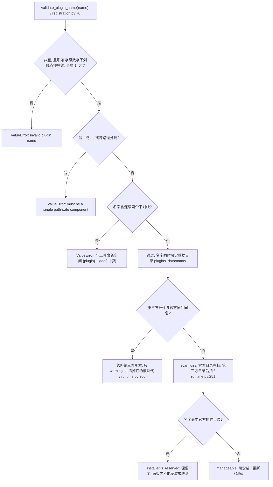

数据目录也有越界防线：`runtime.py:2192 _plugin_data_dir` 要求 `data_dir / name` 解析后仍是 `data_dir` 的**真子目录**，否则抛 `ValueError` 并让注册失败。工具全局名另有约束：`validate_qualified_tool_name` 要求 `{plugin}__{tool}` 整体匹配 `[A-Za-z0-9_-]{1,64}`（点号本身合法，但拼出来的名字超长或带点会被拒）。

### 依赖声明解析：名字 + 逗号分隔的版本约束，无法比较一律放行

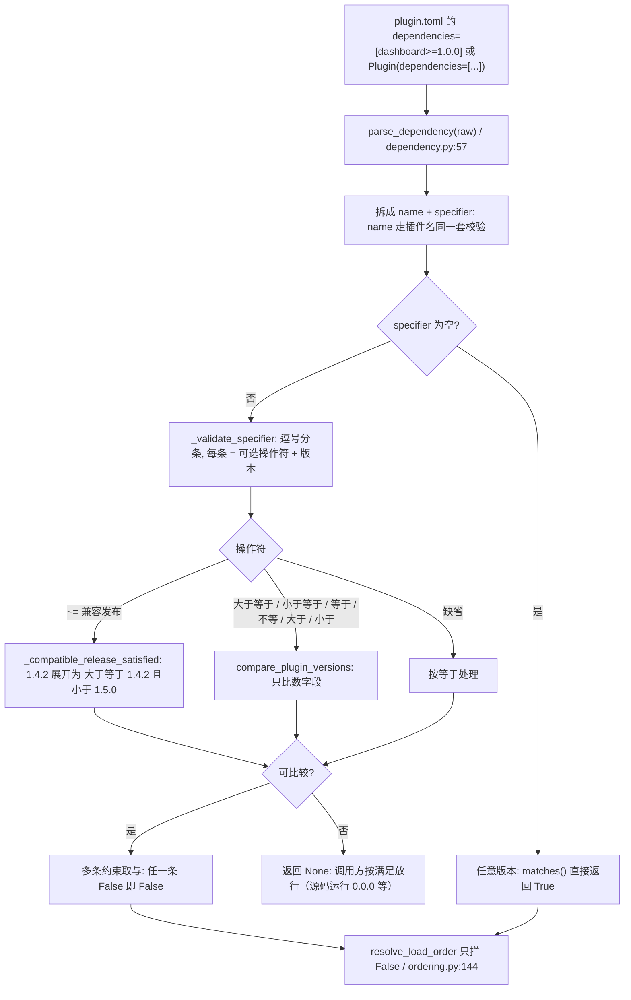

版本口径（`version.py`）：`1.0` 与 `1.0.0` 相等（去尾零）；预发布后缀被忽略，`1.0.0-alpha.1` 按 `1.0.0` 处理；`compare_plugin_versions` 对**任一侧解析不出数字**或**全零版本**（源码运行回落 `0.0.0`）返回 `None`，语义是「无法比较，别拦」。
`parse_dependencies` 额外拒绝两类写法：单个字符串（必须是列表）、同名依赖声明两次。

### 依赖未满足的自动禁用：五种 code 与沿依赖链的传播

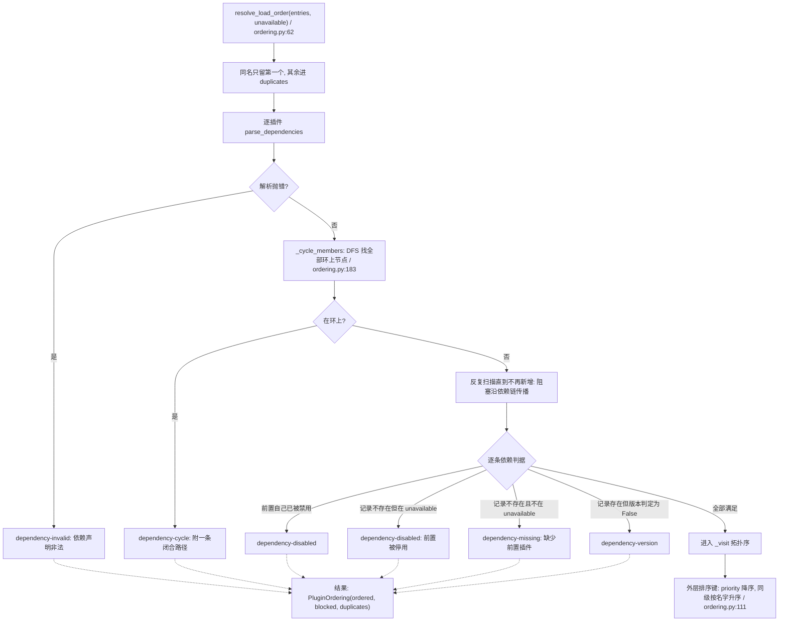

**四个判定入口不能混用**，这是启动期最容易踩的坑：

| 入口 | 时机 | 判据 | 不满足的后果 |
|---|---|---|---|
| `ordering._evaluate` | `loader.load_all` 排序时 | 静态快照 + `unavailable` 名单 | 变 `DisabledPlugin` |
| `runtime._dependency_presence_issues` | `load_all` 注册阶段 | 只查记录**在不在**，不要求已加载 | 自动禁用（跳过注册） |
| `runtime._dependency_issues` | 启动 / 激活 / 重载插件 | 要求前置状态在 LOADED 或 RUNNING，且版本满足 | 返回 `ok=False` + 原因 |
| `PluginRegistryView.dependency_issues` | 面板查询 | 同上一行，但只产出文本 | 只展示，不拦操作 |

注册阶段之所以只查「在不在」：`load_all` 只做扫描与登记，各插件的 `on_load` 发生在之后的 `load_registered()`，此时要求前置就绪会把**所有**依赖插件误判成自动禁用（`runtime.py:364` 的注释写明了这一点）。
注意自动禁用条目在 `loader.load_all` 里同样会清模块缓存 —— 被禁用的插件不该把自己的模块代留在 `sys.modules`。

### 加载顺序与模块缓存清理：gN 代际命名空间 + 删 __pycache__

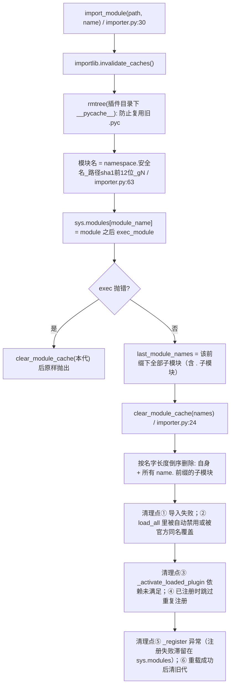

namespace 分两个：第三方插件 `neobot_user_plugins`，官方插件 `neobot_builtin_plugins`（`runtime.py:140`、`runtime.py:145`）。
**反直觉之处**：模块名里带自增代际 `_gN`，所以「热重载会复用到旧模块」在当前实现里不成立 —— 真正保证新代码生效的是**删掉 `__pycache__`**（避免按源码 mtime 判定时命中旧字节码）。清理 `sys.modules` 的作用变成了「不留孤儿代」：注册失败、被禁用、被同名覆盖的插件，其模块不会注册进管理器，留着只占内存并污染排查视野。

### 注册装配：配置三段合并 + 校验回落 + 上下文注入

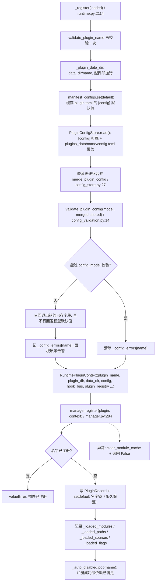

插件配置与代码分离：默认值随插件包走（`plugin.toml` 的 `[config]`），用户改动落在 `plugins_data/<插件名>/config.toml`，**重装/更新插件不会丢配置**；校验失败不硬失败 —— 非法已存字段回落默认值并记 `_config_errors`，插件拿到的配置保证能通过它自己的 `config_model`（面板这类「配置坏掉就再无修复入口」的插件全靠这条）。

### 启停状态机与依赖联动：谁先停、谁来恢复

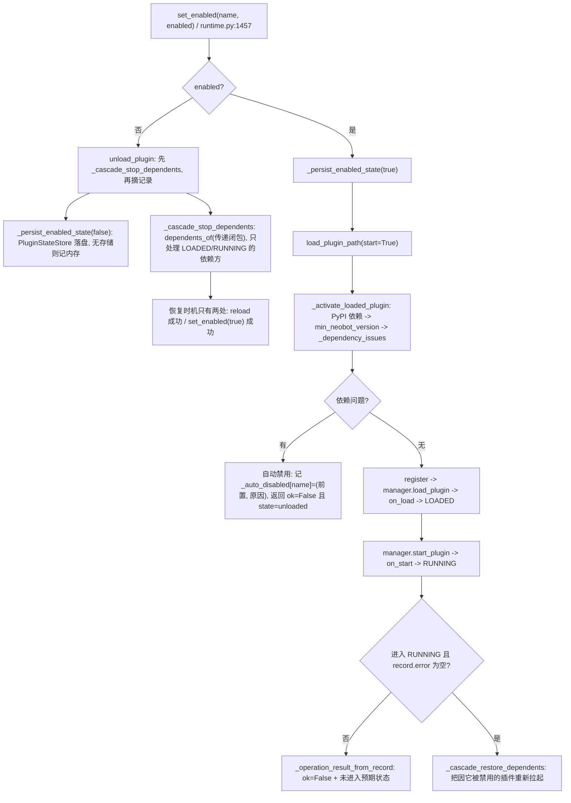

状态机本体在 `manager.py`：`_load_plugin_locked` 只接受 UNLOADED / STOPPED 起步，`_start_plugin_locked` 在 STOPPED 时会先补一次 `load_plugin`；`on_load` / `on_start` 抛错都进 ERROR 并立刻 `_teardown_owned_resources`（清理回调、事件订阅、Agent 注销、插件数据库关闭，`manager.py:583`）；已处于 STOPPING 或 `_teardown_depth>0` 时再次 stop 直接返回 False，不污染外层那次停止的记账。
`_cascade_restore_dependents` 只认 `_auto_disabled` 里 `前置 == 刚恢复的插件` 的条目；路径找不到就静默丢弃该条目（插件目录被删了）。

### 操作并发：可重入名字锁 + 拒绝逆序等待的 OperationBusy

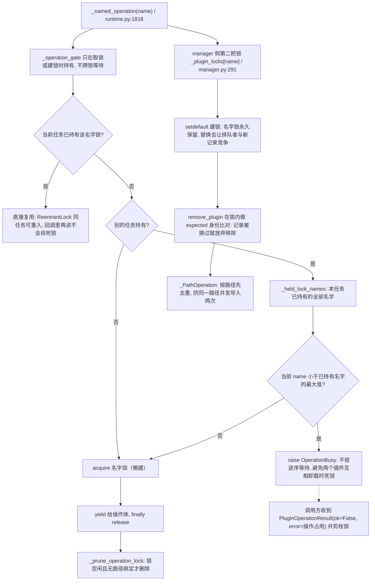

失败路径也必须剪枝：`load_plugin_path` / `unload_plugin` / `start_plugin` / `stop_plugin` / `reload_plugin_result` 在 `ok=False` 时都调用 `_prune_operation_lock`，否则 ghost 操作会一直占着名字锁，后续面板操作全变成「操作占用」。
`ReentrantLock` 的 `_pending` 计数是给「闲置剪枝」用的：有人正在排队等锁时 `is_free()` 为假，不能被剪掉。

### 插件本体热重载：候选代转正，失败必须回滚旧代

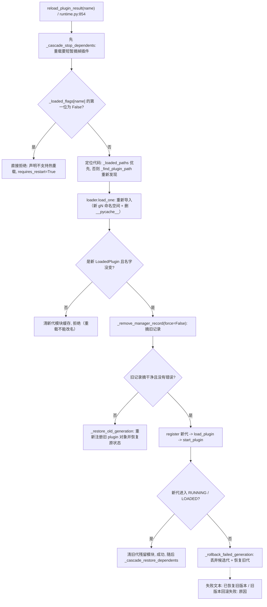

判据细节：`hot_reload` 与 `config_hot_reload` 的最终取值是「`plugin.toml` 显式声明优先，否则取 `Plugin(...)` 的属性，都没有则 True」（`loader.py:276`、`loader.py:279`），快照里已加载插件用 `_loaded_flags` 覆盖发现结果（`runtime.py:1355`）。
回滚细节（旧代重新注册、按原状态恢复 RUNNING/LOADED、候选代清理）见 `08b-plugin-runtime.md`（待补）；本图只标出「失败必须回到旧代」这条不变量。

### 配置热重载（本体侧）：HotReloadRegistry 的前缀匹配与失败隔离

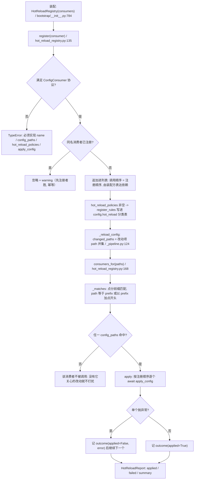

空 `changed_paths` 直接返回空元组；前缀匹配按「点分」而不是字符串包含，所以 `adapter` **不会**命中 `adapter_x`（`hot_reload_registry.py:181`）。单消费者失败被吞成 `ReloadOutcome`，其余组件继续 —— 这是刻意的失败隔离，代价是「部分生效」在返回值里，不看 `failed` 字段就发现不了。
软重启会重新装配 bot 侧组件，`bootstrap/__init__.py:1182` 先 `unregister` 旧消费者再注册新的：旧消费者持有已释放对象，留着会被喂到死对象上。

### 插件配置原地生效：最长前缀分类 + 无 hot 项不调用

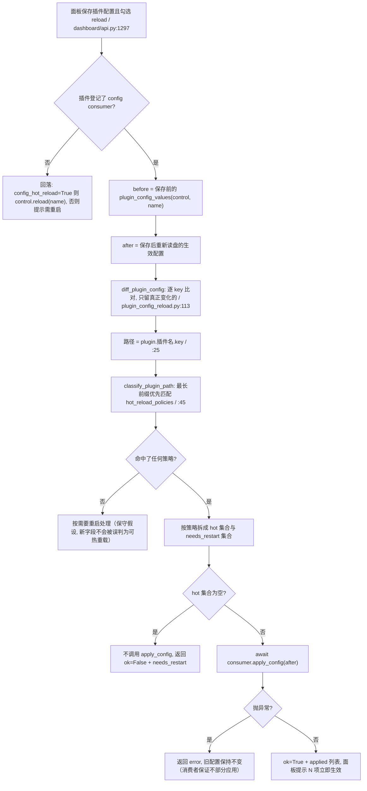

路径命名空间刻意**不写进本体分类表**（`plugin_config_reload.py:12`）：插件配置不属于 `config.toml`，混进去会让面板的本体配置页冒出幻觉条目。
dashboard 是这套通道的样板：`hot_reload=False` / `config_hot_reload=False`（`dashboard/__init__.py:29`），但登记了消费者并逐项声明 —— 8 项运行期安全（`latency_probe_interval_seconds`、`latency_probe_idle_seconds`、`latency_probe_active_window_seconds`、`latency_probe_gate_check_seconds`、`bot_info_cache_ttl`、`log_buffer_size`、`history_max_days`、`allow_archive_delete`），10 项需重启（`host`、`port`、`base_path`、`manage_plugins`、`allow_remote_manage`、`session_timeout_minutes`、`secure_cookies`、`trust_proxy_headers`、`login_max_failures`、`login_rate_limit_window_seconds`）。面板持有 HTTP 服务与监听端口，整插件重载会切断当前保存请求并丢掉内存指标，所以「立即生效」只能走原地通道。

### 跨插件调用：require 校验就绪与版本，call 有三种能力形态

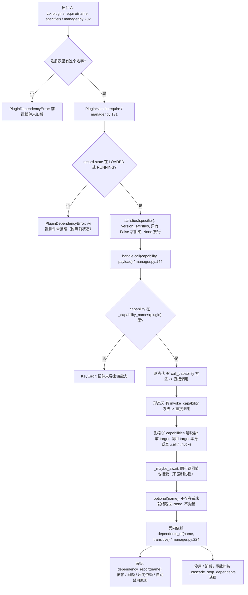

能力名规则：`[A-Za-z0-9_.:-]{1,64}`（`validate_capability_name`）。`PluginHandle.ready` 读的是**被持有那个记录**的状态（句柄通常持的是前置插件），所以 `require().call()` 在插件自己的 `on_load` 里调用依赖方时常因前置仅 LOADED、未 RUNNING 之外的组合而抛错 —— 跨插件调用应放在 `on_start` 之后，或先用 `optional()` 判空。
`dependents_of` 完全基于插件**声明**的 `plugin.dependencies`（解析失败按无依赖处理），不看运行时是否真的调用过。

## 关键状态

| 状态 | 谁置位 | 谁清理 | 失败时停在哪 |
|---|---|---|---|
| `PluginState.UNLOADED` | 初始值；`_unload_plugin_locked` 成功后 | 下一次 `register`+`load` | 取消/未完成时返回 `ok=False, state=unloaded` 并附原因 |
| `LOADING -> LOADED` | `manager._load_plugin_locked`（on_load 正常返回后） | `unload` / `remove_plugin` | on_load 抛错 -> `ERROR` + 立即 teardown；插件不参与后续 |
| `STARTING -> RUNNING` | `manager._start_plugin_locked`（on_start 正常返回后） | `stop` / `unload` | on_start 抛错 -> `ERROR`（模块仍注册，可直接重载） |
| `STOPPING -> STOPPED` | `manager._stop_plugin_locked` | `start_plugin` 会先补 `load_plugin` | on_stop 抛错 -> `stop_failed=True` 且错误进 `record.error`，下次 stop 重试 |
| `ERROR` | on_load / on_start 异常或被取消 | 成功重载、或 STOPPED 后重新 load、或移除记录 | 终态：不自动恢复，面板显示 `record.error` |
| `_auto_disabled[name]=(前置, 原因)` | `_remember_auto_disabled`（排序结果 / 依赖未满足 / 联动停用） | `_register` 成功、`_cascade_restore_dependents` 成功、`set_enabled(true)` 成功 | 前置一直缺失则保持 unloaded，启动不受影响 |
| `_loaded_modules / _loaded_paths / _loaded_sources / _loaded_flags` | `_register` | `_clear_plugin_tracking` | 清理时按值比对，避免清掉并发替换后的新记录 |
| `manager._plugin_locks[name]` | `manager.register` 的 setdefault | 原则上不清理 | 锁被替换会让排队者与新记录竞争，所以只增不减 |
| `runtime._operation_locks[name]` | `_named_operation` 懒建 | `_prune_operation_lock`（空闲且无路径绑定） | 失败路径也剪枝，避免 ghost 操作占锁 |
| `plugin_state.json`（PluginStateStore） | `set_enabled` 落盘（临时文件 + 原子替换） | `uninstall_plugin` 调 `forget` | 文件损坏按空状态处理并 warning，不阻断启动 |
| `_plugin_config_consumers[name]` | `register_plugin_config_consumer`（后登记覆盖先登记） | `unload_plugin` 主动注销 / 插件自行注销 | 未登记则面板回落「需要重启」 |
| `_config_errors[name]` | `_register` 校验失败 | 校验通过时弹出 / `_clear_plugin_tracking` | 只影响提示，插件拿到的配置保证可校验通过 |
| `HotReloadRegistry._consumers` | `register`（同名忽略） | `unregister`（软重启前） | 一个都不命中时报告写「没有组件声明关心本次改动的配置项」 |

## 易错点

* **没有文件监听**：改完插件代码不会自动生效。面板「重载」按钮 / `control.reload` / 插件里调 `plugin_control` 才是触发点；`config.reload` 只重载**本体**配置。
* **`hot_reload=False` 是硬闸**：`_loaded_flags[name][0]` 为假时重载直接被拒并置 `requires_restart=True`（`runtime.py:904`）。dashboard 就是靠这条 + 配置消费者，把「立即生效」改走原地通道。
* **依赖未满足 ≠ 报错**：它变成 `DisabledPlugin` / `auto_disabled`，程序照常启动；面板上看到的是「自动禁用 + 原因」，重置依赖后会被 `_cascade_restore_dependents` 自动拉起，不需要用户手工启用。
* **版本无法比较时放行**：`version_satisfies` 返回 `None` 时 `_evaluate` 不拦；源码运行 `0.0.0`、非数字版本号都会走这条路 —— 「明明写了约束却没拦」是设计如此。
* **注册阶段只查依赖在不在**（`_dependency_presence_issues`）：跨目录场景下可能出现「前置已注册但还没 `on_load`」的窗口，此时插件在 `on_load` 里 `require().call()` 会抛 `PluginDependencyError`。跨插件调用放到 `on_start` 之后更稳。
* **清理模块缓存 ≠ 让新代码生效**：新代码靠 `_gN` 新命名空间 + 删 `__pycache__`；清理是为了不留孤儿模块代（注册失败、被禁用、被官方同名覆盖三种情况必须清）。
* **`clear_module_cache` 按「名字长度倒序 + 前缀」删**：传进来的名字包含全部子模块，顺序反了会先删父再删子（子模块名仍能匹配前缀，所以实际仍能删净）；但只传顶层名字不会删掉 `pkg.sub`。
* **插件名含连续两个下划线直接拒绝**：与工具全局名 `{plugin}__{tool}` 的分隔符冲突，早失败好过在 `bind_tools` 阶段整批注册失败。
* **官方插件与第三方插件同名时静默丢弃第三方**：只有一条 warning，没有任何面板冲突提示（安装路径的冲突提示是 `installer.probe` 的另一回事，见 08b 待补）。
* **两处「重复注册」语义相反**：`HotReloadRegistry.register` 同名忽略（先注册者胜），`PluginRuntime.register_plugin_config_consumer` 是字典赋值（后登记覆盖）。
* **联动停用只发生在 `stop/unload/reload` 入口**，恢复只发生在 `reload` 成功或 `set_enabled(true)` 成功；手工 `manager.stop_plugin` 绕过 runtime 不会触发联动。
* **操作锁只增不减是刻意的**（manager 侧），runtime 侧的操作锁却要主动剪枝 —— 改这两个字典时别把策略搞反。
* **`plugin.toml` 与 `Plugin(...)` 的 name/version 必须一致**：不一致在 `validate_manifest_conflicts` 直接报错（`manifest.py:98`），而 `dependencies`/`priority`/`min_neobot_version` 是「manifest 优先，缺失才回落到代码」。
* **`_cascade_restore_dependents` 只认配对的前置名**：如果联动停用时记的前置名字与实际恢复的插件不同（例如中途改了依赖声明），条目会被静默丢弃，插件再也拉不起来。
