# 08b 插件运行时：门面动作矩阵 · 热重载回滚 · 安装器 · 钩子总线

## 范围

本图覆盖 `packages/modloader` 里**运行时门面与安装/钩子**这一层：

* `runtime.py`（2382 行）的 `PluginRuntime` 门面：加载 / 卸载 / 启停 / 热重载 / 快照 / 依赖报告 / 配置读取，以及并发锁与路径绑定；
* `installer.py`：GitHub 来源解析、代理、下载与解压防线、安装 / 更新 / 卸载、备份目录、更新检查；
* `hooks.py`：`PluginHookBus` 的订阅 / 退订 / 优先级 / 超时 / 阻断，`dispatch_envelope` 信封派发与输出捕获；
* `management.py`：`PluginOperationResult` / `PluginSnapshot` / `PluginControlFacade`（面板与插件看到的窄门面）；
* `config_store.py` + `config_validation.py`：`plugin.toml` 的 `[config]` 打底 + `plugins_data/<name>/config.toml` 覆盖 + 校验回落；
* `plugins/dispatch.py`：`Plugin.command/message/...` 装饰器到钩子总线订阅的桥。

**分工（与 08-plugins.md 不重叠）**：

| 内容 | 归谁 |
|---|---|
| 目录扫描规则、`plugin.toml` 字段与类型校验、`__` 与保留名校验、依赖声明解析与五种自动禁用 code、拓扑排序、gN 导入与缓存清理、`DefaultPluginManager` 状态机、两个 register 的相反语义、本体/插件两条配置热重载链 | 08-plugins.md |
| 门面动作矩阵与失败返回契约、热重载回滚（候选代丢弃 + 旧代恢复）、安装器全链路、`PluginHookBus` 与信封派发、插件配置读写校验、运行时并发锁 | 本图 |

**不画什么**：

* 面板端点清单与鉴权 → 09b-dashboard-api；本图只写「哪个动作被哪个端点调用」；
* `Plugin` 装饰器的参数注入与工具绑定 → 06-tools-skills；本图只写它如何变成一条钩子订阅；
* `config.reload`（本体配置）与 `apply_plugin_config_change`（插件配置原地生效管道）→ 08-plugins.md；
* `PythonDependencyInstaller`（PyPI 依赖安装交互）→ 08-plugins.md 细节块。

**spec 与现实的差异**（都在图里保留现状）：

* 全仓**没有文件监听**：`reload` / `reload_all` 只能由面板或插件自身显式触发；
* `reload_all()` 在 `app/` 与 `packages/` 的生产代码里**零调用点**（只有单测），面板也没有「全部重载」按钮；
* 面板的「检查更新 / 更新」与「安装」走**两条不同的路**：前者直连 `installer.update`，后者走 `runtime.install_plugin`；
* 卸载的备份是「先 `copytree` 再 `move`」，`move` 落进刚建好的备份目录 → 实际代码在 `.plugin-backups/<name>-<时间戳>/<name>/`（替换安装的备份是平铺的，两者不一致，已在本机实测）。

## 流程

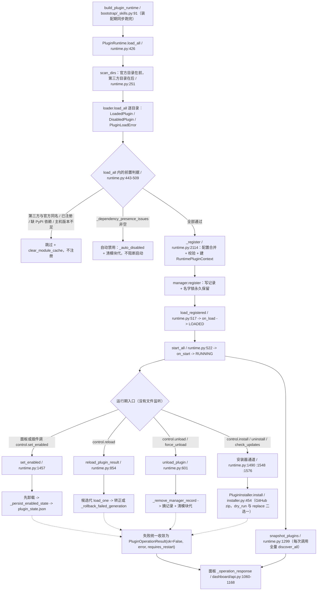

主图只画主干：每个动作的前置判据与失败语义在下面 10 个折叠块里。`PluginOperationResult` 是唯一的失败载体，没有动作会向调用方抛业务异常（`reload_plugin` 这个 bool 包装器例外，见细节 2）。

## 时序

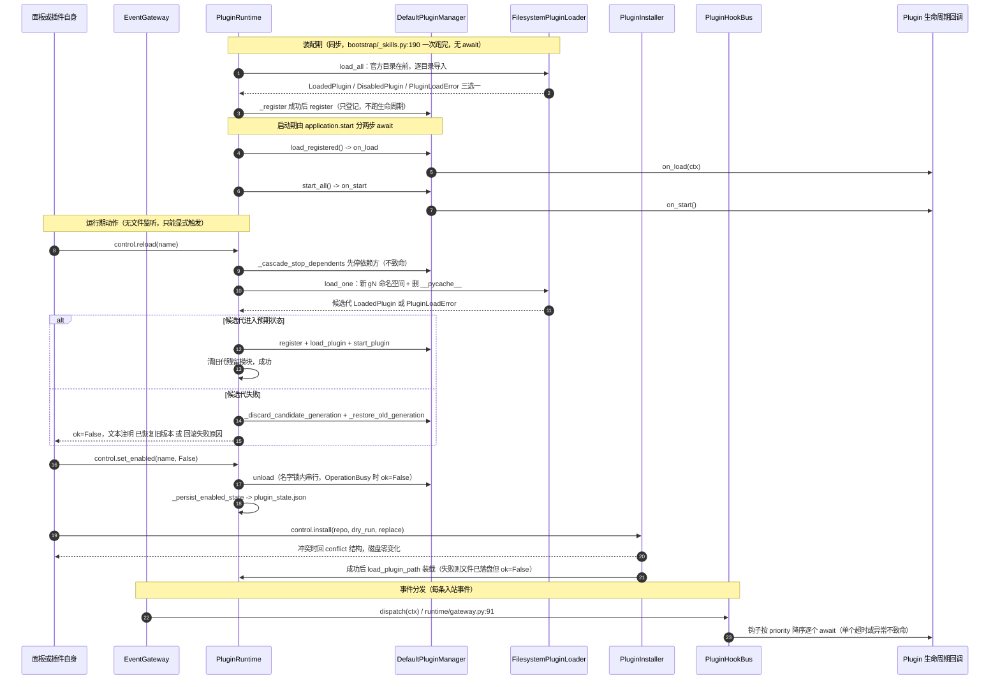

三条「不致命」的线：**单个钩子异常**只跳过它自己；**依赖未满足**是自动禁用不是报错；**热重载失败**必须回滚到旧代（回滚也失败才在文本里加「旧版本回滚失败」）。

## 细节

### 门面动作矩阵：每个动作的前置校验与失败停在哪

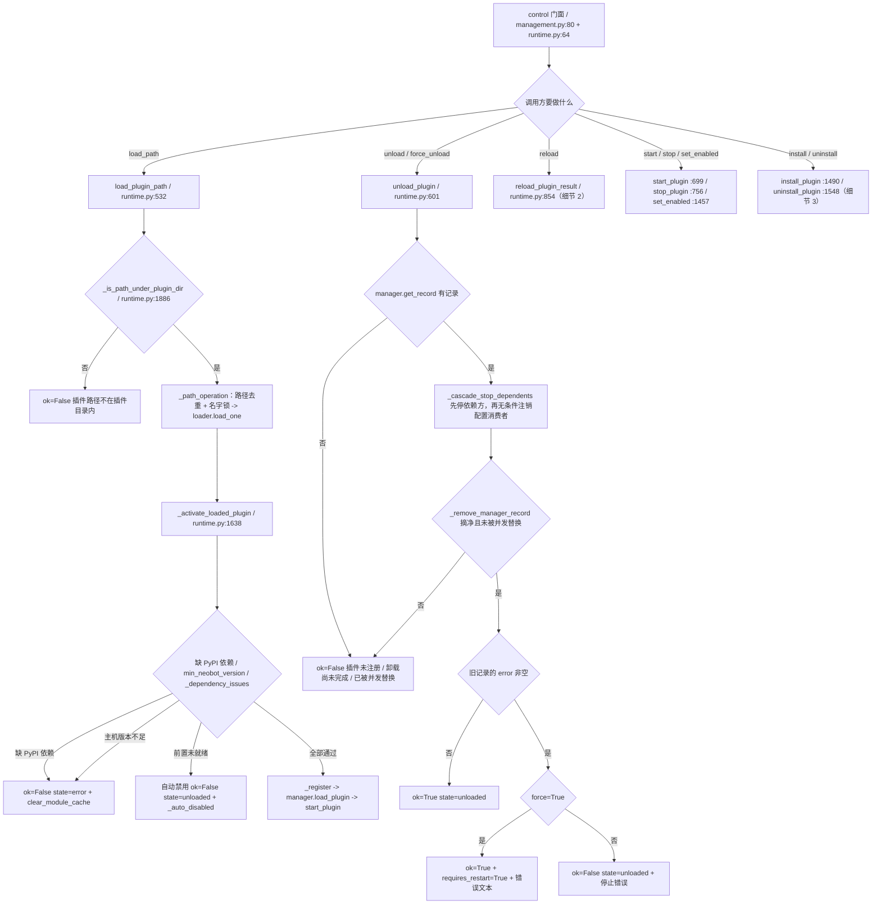

补充（这些动作没单独画，判据同样在门面里）：

| 动作 | 前置校验 | 失败返回 |
|---|---|---|
| `start_plugin` | 记录存在；已在 RUNNING 且 `error is None` 时直接 ok；`_dependency_issues` 为空；UNLOADED 时先补一次 `load_plugin` | `ok=False` + 依赖文本，或未进 RUNNING 的 `_operation_result_from_record` |
| `stop_plugin` | 记录存在；UNLOADED 且无错误、或 STOPPED 且未 `stop_failed` 时直接 ok | `stop_failed=True` 时 ok=False，错误留在 `record.error`，下次 stop 会重试 |
| `set_enabled(false)` | 记录不存在则跳过卸载，直接持久化 false | 卸载失败时**不落盘**（面板看到的是启停失败） |
| `set_enabled(true)` | 先 `_persist_enabled_state(true)` 再 `load_plugin_path(start=True)` | 装载失败时 state 文件已经写了 true，重启会再试一次 |
| `snapshot_plugins` | 每次调用都 `discover_all()`（全量扫描）；未加载但缺 PyPI 依赖的条目被标成 error | 只读，不抛错 |
| `reload_plugin`（bool 包装） | 转调 `reload_plugin_result` | 只有 `ok=False` 且 `state=unloaded` 且 `path is None` 才 `raise KeyError`，其余失败只返回 False |

### 热重载回滚：返回契约与「候选代必须被丢弃」不变量

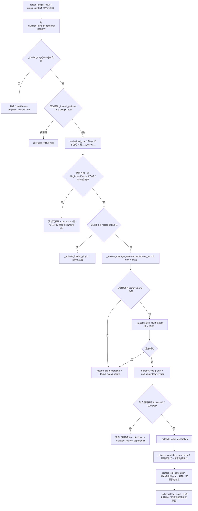

回滚细节（`runtime.py:1095-1211`）：

* `_discard_candidate_generation`：候选记录还挂在 manager 上时先 `remove_plugin`；候选状态是 `ERROR` 时直接 `force=True`；强删后记录仍在就把「无法移除失败的新版本」拼进错误文本；只有 manager 里已经没有该记录时才清 `_loaded_modules` / `_loaded_paths` 与模块代。
* `_restore_old_generation`：用 `manager.register(old_record.plugin, old_record.context)` 重新注册；旧状态是 RUNNING 就 `load_plugin` 后视情况 `start_plugin`，是 LOADED 就只 `load_plugin`，**其余状态直接把 `state/error/stop_failed` 写回记录**（不跑生命周期）。
* 失败文本只有两种形态：`插件新版本激活失败: ...; 已恢复旧版本` 或 `...; 旧版本回滚失败: ...`；`ok` 恒为 False，`state` 取恢复后的实时状态。
* 取消（`asyncio.CancelledError`）也走回滚：先回滚再 `raise`，回滚错误只记日志。
* 成功时不恢复依赖方会留下半死状态，所以 `_cascade_restore_dependents` 只在 `ok=True` 时调用。

### 安装与更新与卸载：来源、代理、压缩包防线与 ID 冲突二选一

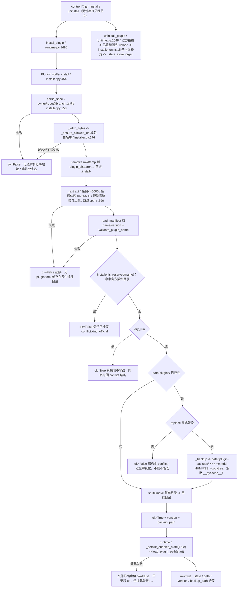

补充事实：

* **代理**：`ProxySettings(mode=system|none|custom, host, port)`（`installer.py:58`）在装配期取 `config.plugins.proxy_*`；面板保存代理先 `control.set_installer_proxy`（内存，下一次下载即生效）再写 `config.toml`（`persist=false` 时只写内存，重启回退旧值）。`custom` 必须有 host、端口必须 1-65535，否则构造即 `ValueError`。
* **下载**：`_fetch_bytes_sync` 用 `urllib` + 可选 `ProxyHandler`；`content-length` 超 64 MiB 先拒，读流累计再超也拒（`MAX_ARCHIVE_BYTES=64MiB`、`MAX_EXTRACTED_BYTES=256MiB`、`MAX_ARCHIVE_ENTRIES=5000`）；解压体积按 zip 中央目录声明累加，不是实际写入字节数。
* **先后顺序**：整包**先下载**再判冲突 —— 保留字、ID 冲突、`dry_run` 三条拒绝路径都已经花掉一次网络下载和一次解压到暂存目录。
* **`dry_run` 也要下载**：要用远端 `plugin.toml` 才能回 `name/version/conflict`。
* **`install_plugin` 不传 `expected_name`**：只有 `installer.update`（`installer.py:582`）校验「期望插件名」，面板的更新走的就是它。
* **备份目录**：`BACKUP_DIR_NAME = ".plugin-backups"`，位置是 `plugin_dir.parent`（默认 `data/`）。替换安装的备份是平铺的 `<name>-<stamp>/`；**卸载的备份会再嵌一层** —— `_backup` 先 `copytree` 建好目录，`shutil.move(target, backup_path)` 遇到已存在目录会把源目录挪进去，实际代码在 `<name>-<stamp>/<name>/`。两条路都不做清理，备份只增不减。
* **写入失败会还原备份**：`shutil.move` 抛错且目标目录还不存在时，把备份搬回原位再返回 `ok=False`（`installer.py:558-563`）。
* **卸载不删代码**：`installer.uninstall` 只把插件目录移进备份并 `forget` 启停状态；`_loaded_sources` / `_loaded_paths` 被 pop，但 `_loaded_flags` 不清（见易错点）。

### 钩子总线订阅侧：装饰器到 HookRegistration、优先级与退订

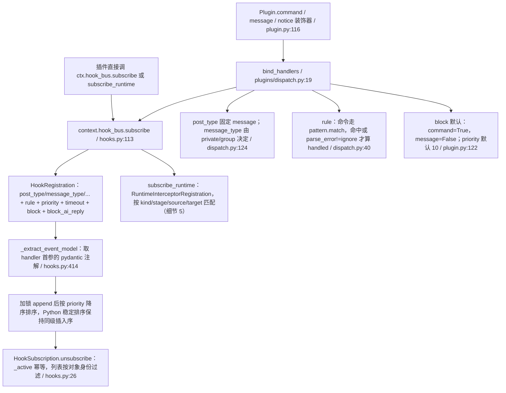

`HookRegistration` 的字段就是筛选器：六个 `*_type` 字段做**全等**比较（`hooks.py:54`），没有通配；`coerce` 只在 `event_model` 存在且首参注解是 `BaseModel` 子类时做模型校验。排序只在**插入时**做一次（`sort(key=priority, reverse=True)`），退订只是重建列表、不重排。装饰器侧的重名处理、`parse_error=ignore` 语义与依赖注入校验属于 `Plugin` 面，见 06-tools-skills；本图只关心它产出的那条订阅。

### 钩子总线派发侧：过滤、rule、超时隔离与 block_ai_reply

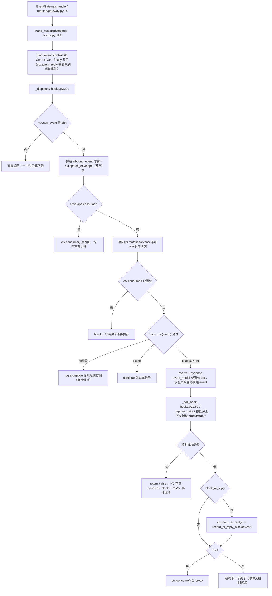

要点：

* **同步 handler 的超时拦不住**：`_call_handler` 对非协程用 `asyncio.to_thread`，`asyncio.wait_for` 超时只让等待方抛 `TimeoutError`，线程里的 handler 会继续跑完（返回值被丢弃，计为未 handled）。
* **handled 的判据是「没超时且没抛异常」**，不是返回值：装饰器包装出的 `dispatch` 恒返回 None，所以 `block=True`（命令默认）意味着「模式命中就吞掉这条事件」。
* **输出捕获按 ContextVar 路由**（`_ContextRoutedStream`，`hooks.py:327`）：并发 await 的钩子互不串台，`finally` 里上报，handler 抛异常也不丢已产生的输出；`sys.stdout is None`（pythonw 或 PyInstaller --noconsole）时 write 直接丢弃长度，不炸。
* 被 `block_ai_reply` 拦下时仍会继续跑其余钩子；只有 `block` 才 `break`。`agent_reply` 意图通过 `bind_event_context` 的 ContextVar 落到本次事件上（`agent_intent.py:27`），dispatch 结束后必定复位。

### 信封派发：四类生产者、拦截器替换规则与 consumed 短路

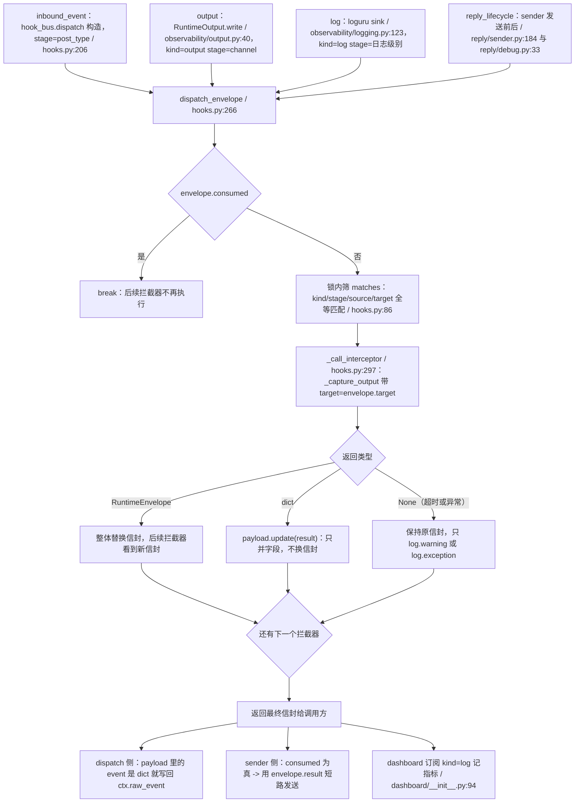

`RuntimeOutput.write` 用 `create_task` 异步派发（不 await），所以日志类拦截器**不阻塞**产生方；`sender.send_with_timeout` 是 `await dispatch`，能真正改写 `payload` 里的 message 或被 `consumed` 短路（短路时直接返回 `envelope.result`，不发消息）。`source` 与 `target` 是插件做定向拦截的抓手，`target` 形如 `group:<id>`。

### 插件配置读写与校验：默认值打底、非法已存值回落

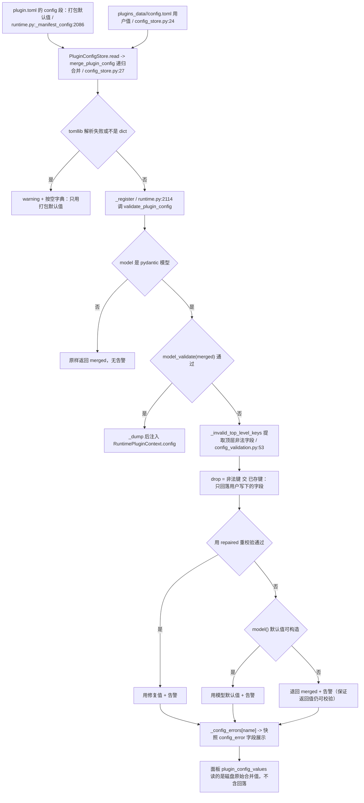

* `PluginConfigStore` 只读文件：写入由面板或用户完成（`config_store.py:44`），路径是 `plugins_data/<name>/config.toml`；插件升级新增的配置项靠「默认值打底」自动补上。
* 校验失败**不硬失败**：非法已存字段回落打包默认值，仍非法用模型默认值，最差退回原始 merged 并附告警 —— 返回值保证能过插件自己的 `config_model`（面板这类「配置坏掉就再无修复入口」的插件全靠这条）。
* 打包默认值本身非法属于插件作者问题：`drop` 只删「已存键 交 非法键」，不动默认值。
* 与配置热重载的分工：面板保存后「原地生效」还是「重载插件」由 `config_consumer` 是否存在加 `config_hot_reload` 决定（`dashboard/api.py:1297-1316`），管道细节见 08-plugins.md。

### 面板交互面：谁调哪个动作、结果怎么回

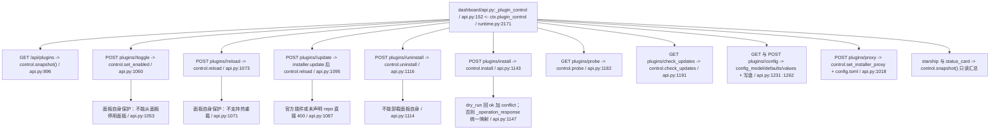

* **动作到结果**：所有动作返回 `PluginOperationResult`，`_operation_response` 把 `ok/error/state/requires_restart/conflict/backup_path` 映射成 HTTP；`conflict` 走 409，官方保留字与参数错走 400。
* **`update` 是唯一绕过 runtime 的写路径**：面板直接拿 `self._service("plugin_runtime").installer` 调 `installer.update(name, repo, branch)`（内部 `replace=True`、带 `expected_name`），成功后**再** `control.reload`；这条路上 `_persist_enabled_state` 不会被调用，也不做「依赖未满足自动禁用」的判定（reload 里才有）。
* **命令通道没有插件管理**：全仓没有插件管理命令，插件管理只存在于面板；插件想自我管理只能拿 `ctx.plugin_control`（`management.py:80` 的窄门面，`install/unload/reload` 都在里面，**没有面板层的 `_require_manage` 鉴权**）。
* 面板保存插件配置后的三条分叉（consumer 原地生效 / `control.reload` / 提示重启）在 08-plugins.md 有图；本图只标出它调的是 `control.reload`。

### 并发与锁：ReentrantLock、OperationBusy 与路径绑定

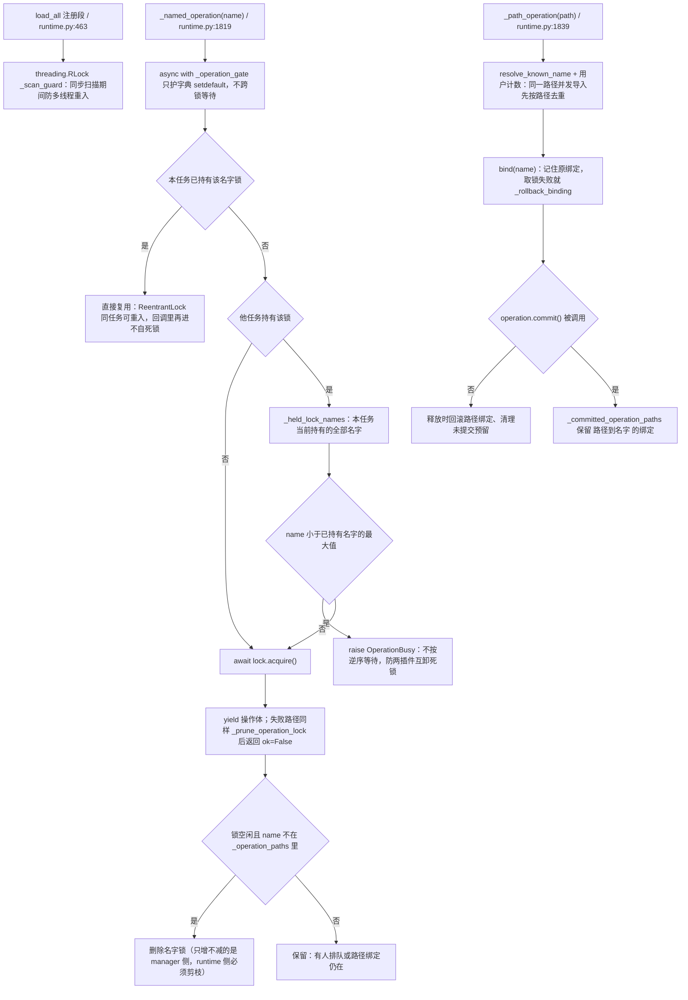

* 两个层级：`_operation_gate`（`asyncio.Lock`）只保护 `_operation_locks` 与 `_operation_paths` 的字典操作，**绝不跨名字锁等待**，避免整运行时头阻塞。
* `ReentrantLock`（`manager.py:21`）的 `is_free()` 把 `_pending > 0`（有人排队）也算「不空闲」，所以剪枝不会把排队者脚下的锁删掉；`is_owned_by_current_task()` 是重入判据。
* **逆序等待即拒绝**：当前任务已持有 `b` 却要取 `a`（`a` 小于已持有名字最大值）时抛 `OperationBusy`，调用方剪枝后返回 `ok=False` 的「操作占用」；`load_plugin_path` 在 `bind` 前已导入模块，这条路径会**先清模块代**再返回，避免 sys.modules 孤儿。
* manager 侧还有第二把锁 `_plugin_locks[name]`（`manager.py:291`，setdefault 永久保留），`remove_plugin` 在锁内做 `expected` 身份比对，记录被换过就放弃移除。

### 两套版本比较：依赖判定「无法比较即放行」与更新判定「无法比较即相等」

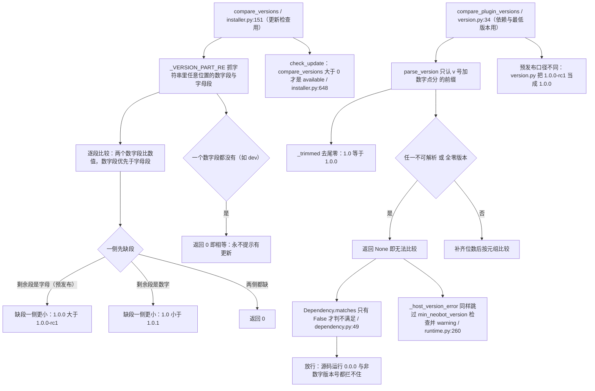

同一份「1.0.0-rc1 对 1.0.0」在两个实现里结论相反（安装器：rc 更小；version.py：相等），所以**依赖约束与更新提示可能互相矛盾**。两条「无法比较」的兜底方向也不同：依赖侧偏**放行**（宁可少拦），更新侧偏**相等**（远端是非数字版本时永远显示「已是最新」，既不误报也不提示）。`version_at_least` 是第三个入口（主机版本），同样在 host 为 `0.0.0` 时返回 None 跳过检查。

## 关键状态

| 状态 | 谁置位 | 谁清理 | 失败时停在哪 |
|---|---|---|---|
| `_loaded_modules` / `_loaded_paths` / `_loaded_sources` | `_register` 成功 | `_clear_plugin_tracking`（按值比对，避免清掉并发替换后的新记录） | 清完即返回 `ok=False`，插件不再出现在 `manager.names()` |
| `_loaded_flags[name] = (hot_reload, config_hot_reload)` | `_register` | **只有 `set_enabled(false)` 会 pop**；`_clear_plugin_tracking` 不碰 | 卸载后重新发现同一插件时，快照显示的是上一次加载时的 flags |
| `_auto_disabled[name] = (前置, 原因)` | 排序结果、`_dependency_presence_issues`、`_dependency_issues`、`_cascade_stop_dependents` | `_register` 成功、`_cascade_restore_dependents` 成功、`set_enabled(true)` 成功 | 前置一直缺失则保持 unloaded，启动不受影响 |
| `_operation_locks[name]` | `_named_operation` 或 `_PathOperation._acquire` 懒建 | `_prune_operation_lock`（`is_free()` 且无路径绑定） | 失败路径也剪枝；不剪则后续面板操作全变「操作占用」 |
| `_operation_paths` / `_committed_operation_paths` | `_PathOperation.bind` 与 `commit` | 未 commit 时 `_rollback_binding`；`_clear_plugin_tracking` 调 `_prune_operation_state` | 同路径并发导入被路径锁挡住，不会出现两个任务同时导入同一路径 |
| `plugin_state.json` | `set_enabled` 与 `install_plugin`（成功后写 true） | `uninstall_plugin` 调 `forget` | 文件损坏按空状态处理并 warning，不阻断启动；无 store 时回落 `_memory_enabled` |
| `data/.plugin-backups/<name>-<stamp>/` | `_backup`（替换安装与卸载都调） | 没有任何清理策略 | 备份失败即整次操作 `ok=False`；卸载时实际代码在 `<stamp>/<name>/` 这一层 |
| `.install-*` 暂存目录 | `install` 用 `mkdtemp(dir=plugin_dir.parent)` | `finally` 里 `rmtree(ignore_errors=True)` | 任何失败都回 `PluginInstallResult(ok=False, error)`，暂存目录必删 |
| `_config_errors[name]` | `_register` 调 `validate_plugin_config` 带回告警时 | 同处校验通过时 pop；`_clear_plugin_tracking` 也清 | 只影响快照与面板提示，插件拿到的配置保证可校验通过 |
| `_plugin_config_consumers[name]` | `register_plugin_config_consumer`（字典赋值，后登记覆盖） | `unload_plugin` **无条件**注销；插件自己也会注销 | 卸载失败也已经注销，面板随后回落「需要重启」 |
| `_CAPTURE_STDOUT` 与 `_CAPTURE_STDERR`（ContextVar） | `_capture_output` 进入钩子或拦截器前 set | `finally` 里 reset 并上报已捕获输出 | 上报失败被吞（不能影响钩子链）；handler 抛异常也不丢已产生输出 |
| `record.error` 与 `record.stop_failed` | `DefaultPluginManager` 的生命周期回调（08-plugins.md） | 成功 reload 或重新 load | `unload` 遇非空 error 返回 `ok=False`，只有 `force=True` 才 ok 且带 `requires_restart=True` |

## 易错点

* **卸载备份会嵌一层**（本次核对实测）：`_backup` 先建好 `<name>-<stamp>/`，`shutil.move(target, backup_path)` 遇到已存在目录会把插件目录挪进去，所以回滚一个被卸载的插件要搬的是 `.plugin-backups/<name>-<stamp>/<name>`，不是 `backup_path` 本身；替换安装的备份才是平铺的。两条路都不清理备份。
* **`reload_all()` 生产零调用点**：只有 `packages/modloader/tests/test_runtime.py` 在调，面板没有「全部重载」按钮。把它当生效链路写文档是错的。
* **一次失败的卸载也会注销配置消费者**：`unload_plugin` 在进入名字锁之前就调 `unregister_plugin_config_consumer(name)`，没有回滚。之后面板保存该插件配置会回落成「重载」或「需要重启」。
* **`_loaded_flags` 不随卸载清理**：`set_enabled(false)` 会显式 pop，`unload_plugin` 走的 `_clear_plugin_tracking` 不会。卸载后改了 `plugin.toml` 的 `hot_reload`，重新发现出的快照仍用旧 flags，直到下一次 `_register`。
* **安装是「先下载后判冲突」**：保留字、同名未替换、`dry_run` 都会把整包拉下来并解压到暂存目录；`probe` 才是零网络探测，但它只查本地目录、不查远端。
* **面板「更新」绕过 runtime**：`api.py:1095` 直调 `installer.update`（带 `expected_name`、`replace=True`）再 `control.reload`。这条链不写 `plugin_state.json`、不做依赖预检，和「安装」的语义不完全对称。
* **同步钩子的 `timeout` 是假的**：`asyncio.to_thread` 里的 handler 无法被 `wait_for` 取消，超时只是「不再等」，线程会继续跑；要真能被取消必须写成 `async def`。
* **`block=True` 是「命中即吞」**：handled 的判据是没超时没异常，与 handler 内部做了什么无关；命令默认 `block=True`、消息默认 `block=False`（`plugin.py:122`）。
* **拦截器返回 None 不等于失败**：超时、异常、正常返回 None 都保持原信封，只记 warning 或 exception；要改信封必须返回 `RuntimeEnvelope`，只改负载返回 dict（只做 `payload.update`）。
* **`snapshot_plugins` 是重操作**：每次调用 `discover_all()`（含单文件插件导入），面板轮询、星舰状态卡、`_snapshot_for`（进而 `check_plugin_update`）都会触发；`dependency_report` 对未注册插件同样要扫全目录。
* **`set_enabled(true)` 先落盘再装载**：装载失败后 `plugin_state.json` 里已经是 true，重启会再试一次；反之卸载失败不会落盘 false，面板上的开关会「弹回去」。
* **两套版本比较不能互换**（细节 9）：依赖判定用 `version.py`（无法比较即放行），更新提示用 `installer.compare_versions`（无法比较即相等）；预发布号在两边结论相反。
* **同名第三方被静默丢弃**发生在 `load_all`（`runtime.py:453`）并且**会清掉刚导入的模块代**；两处「重复注册」语义相反（`HotReloadRegistry` 先到先得 对 `register_plugin_config_consumer` 后到覆盖）见 08-plugins.md 的 W14 与 W38，改 `load_all` 或配置通道时两张图一起改。
