# 09 网页面板：HTTP 路由 · 鉴权 · 静态产物 · 前端数据流

## 范围

画**面板这个 HTTP 服务本身**：`DashboardServer.start` 的监听绑定、`_make_app` 装配的两层中间件、
`_auth_middleware` 的「公开路径 / 会话 / CSRF」判定、`_catch_all` 的「扩展优先 → SPA 回退」、
`web/` 静态产物的来源与提供方式，以及前端从 `main.tsx` 到 `/api/*` 的取数链路
（X-Token / X-CSRF-Token / 401 跳登录 / `queryCore` 去重与轮询）。行号以当前提交为准。

**不画**（避免与相邻图重复）：

- `api.py` 里逐个端点的请求/响应语义（`09b-dashboard-api.md`，待补）；
- `config_manager.py`、`.env`、模型注册表写入与前端配置编辑器（`09c-dashboard-config.md`，待补）；
- 插件加载器 `Plugin` 与 `plugin_state.json` 的通用启停语义（插件系统图，待补）。

**spec 与现实差异提示**：旧的内置调试控制台与管理员控制台已被本插件完全取代
（`dashboard/__init__.py:6`），排障时不要再去旧端口或旧路由里找面板。

**三份目录的关系**（本图最容易混淆的地方）：

| 目录 | 角色 | 是否入库 | 参与图头哈希 |
|---|---|---|---|
| `dashboard/frontend/` | 源码：React + Vite + TypeScript | 是 | 否（只哈希 `*.py`） |
| `dashboard/web/` | 构建产物：index.html + assets + image | 是 | 否 |
| `dashboard/` 下的 `*.py` | 服务端：路由、鉴权、静态资源 | 是 | 是 |

## 流程

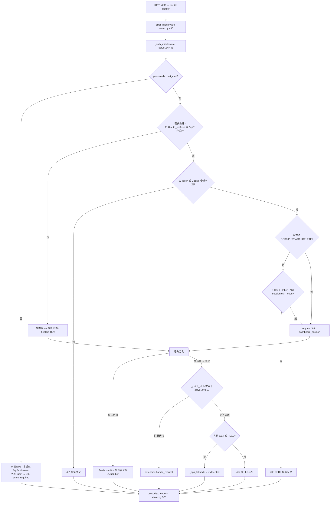

## 时序

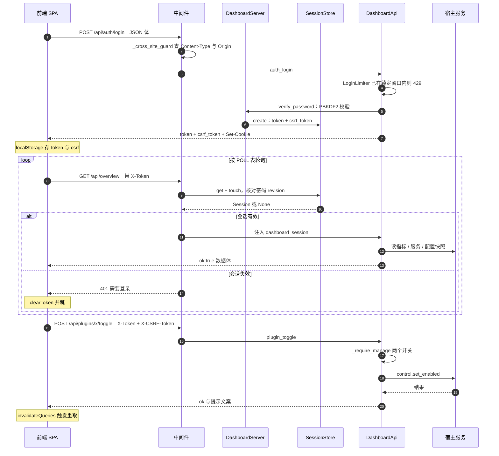

## 细节

### 请求生命周期：两层中间件 + on_response_prepare

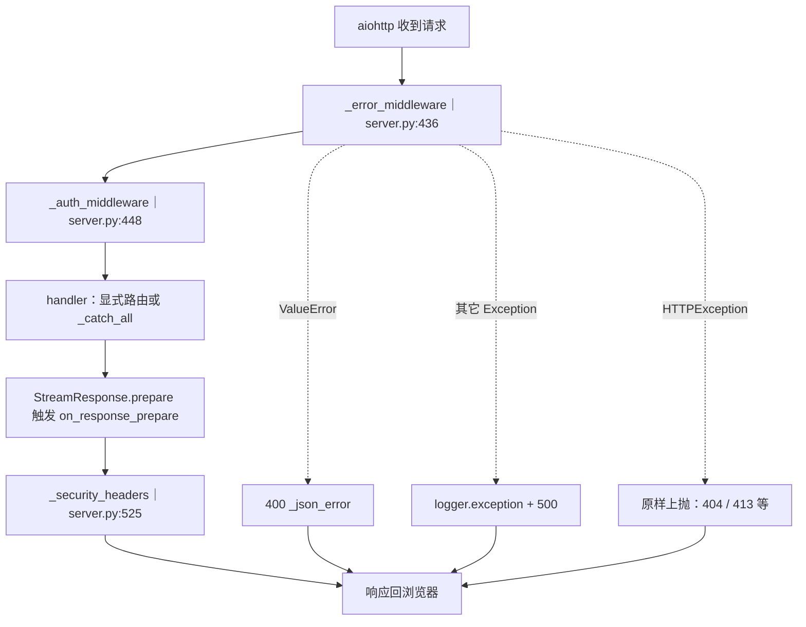

`_make_app`（`server.py:319`）里 `middlewares=[_error_middleware, _auth_middleware]` 的顺序就是洋葱顺序：
error 在外层，所以鉴权中间件里抛出的任何非 HTTPException 也会被它兜成 500。
`client_max_size=2MB`：请求体超限时 aiohttp 抛 `HTTPRequestEntityTooLarge`，被 error 中间件原样上抛成 **413**，
不会被包成 500。`web.AppRunner(app, access_log=None, shutdown_timeout=5)`（`server.py:251`）：不写 aiohttp 访问日志
（面板日志走 `Metrics.record_log`），关闭时最多等 5 秒。

安全头挂在 `on_response_prepare` 上，而该信号由 `StreamResponse.prepare` 触发（aiohttp `web_response.py:471`），
因此**中间件直接返回的 401 / 403 / 415 也带安全头**。四个头：`X-Content-Type-Options: nosniff`、
`Referrer-Policy: no-referrer`、`X-Frame-Options: DENY`、CSP
`default-src 'self'; img-src 'self' data: blob: https:; style-src 'self' 'unsafe-inline'; script-src 'self'; connect-src 'self'; media-src 'self' blob:; worker-src 'self' blob:; base-uri 'none'; form-action 'none'`。
路径以 `/api/` 开头时额外加 `Cache-Control: no-store`（`server.py:534`），静态资源不加。

观测点：500 一定伴随 `logger.exception`，日志里带 `path=`；400 基本等价于「请求体不是 JSON 对象」
（`_read_json` 抛 ValueError，`api.py:179`）。

### 鉴权分流：公开路径集、/api 前缀与扩展 auth_prefixes

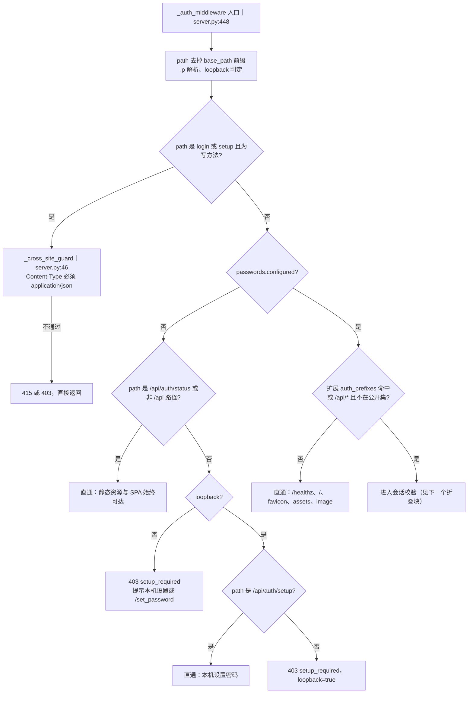

已配置密码时的公开集（`server.py:487`）：`/healthz`、`/`、`/favicon.ico`、`/api/auth/status`、
`/api/auth/login`、`/api/auth/setup`。注意 `/api/auth/setup` 在**已配置**时也放行，
由处理器直接回 400「面板密码已设置，请直接登录」——故意的，避免把它暴露成「需要登录」的接口。
`/assets/` 与 `/image/` 永远公开：前端壳与图标要能加载，真正的数据都在受保护的 `/api/*` 后面。

**没有 `@login_required` 这类装饰器**：保护范围由「`/api/` 前缀 + 公开集 + 扩展 auth_prefixes」三段决定。
新增一个 `/api/xxx` 路由就自动受保护；新增一个非 `/api` 路径则自动公开（SPA 路由就是这样）。
扩展路径判定 `_extension_requires_auth`（`server.py:201`）用的是**去掉 base_path 之后**的路径，
与前缀做「等于」或「前缀 + /」匹配，所以扩展的 `prefixes` / `auth_prefixes` 都不要带 base_path。

未配置密码分支里，「非 `/api` 路径一律直通」意味着**未设密码不等于端口不可访问**：
外网能看到登录页与静态资源，只有 `/api/*`（除 status）被 403 拦住。

### 会话与 CSRF：token 来源、revision 失效、会话上限

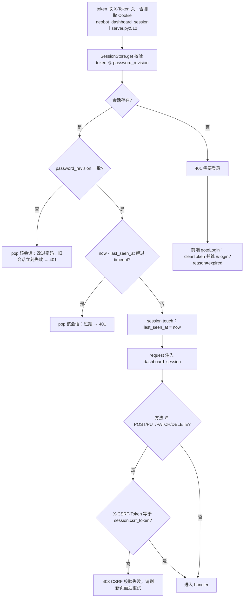

`token = secrets.token_urlsafe(32)`、`csrf_token = secrets.token_urlsafe(24)`（`security.py:198`）。
`SessionStore` 上限 `max_sessions=64`：`create` 时若已满，淘汰 `last_seen_at` 最小的那个会话；
`prune` 只在 `create` 里调用，所以「过期会话」通常是**下一次 get 时**才被清掉并返回 401。
Cookie 属性（`server.py:633`）：`HttpOnly=True`、`SameSite=Lax`、`Secure=secure_cookies`（默认 false）、
`path=base_path 或 /`、`max_age=session_timeout_minutes*60`（默认 720 分钟 = 43200 秒）。
CSRF 比较走 `secrets_equal` → `hmac.compare_digest`（恒定时间，`security.py:118`）。

观测点：`GET /api/system`（或 `describe`）里的 `sessions` 数组，token 只显示前 6 位 + `…`。

### 登录、首次设置与限流：429 / 401 / 403 分别从哪里来

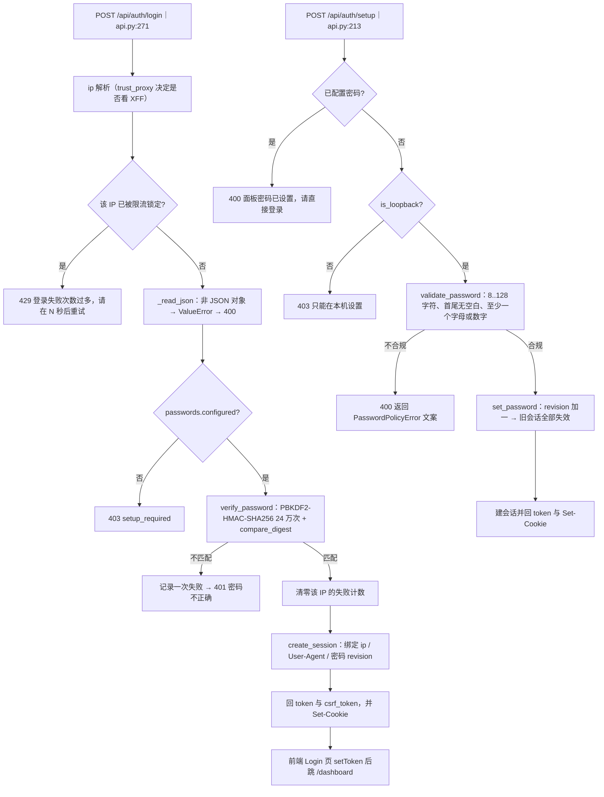

限流默认值：`login_max_failures=5`、`login_rate_limit_window_seconds=600`（`config.py:93`）；
`is_locked` 返回剩余秒数 = 窗口减去最早一次失败经过的时间再加一（`security.py:287`）。
密码落地：PBKDF2-HMAC-SHA256、迭代 240000、随机 16 字节盐，`auth.json` 以 0600 + `os.replace` 原子写
（`panel_auth.py:27`、`panel_auth.py:203`）。

**为什么 login / setup 要额外跨站守卫**：这两个端点在建立会话**之前**，拿不到 CSRF token。
`_cross_site_guard`（`server.py:46`）用两条与浏览器行为绑定的约束代替：
① 请求体必须是 `application/json`（跨站表单只能发 urlencoded / multipart / text/plain，命中即 415）；
② 若带 `Origin`，其 netloc 必须与 `Host` 相同（`trust_proxy_headers=true` 时额外接受代理写入的
`X-Forwarded-Host`），否则 403。`client_ip` 信任代理时取 `X-Forwarded-For` 的**最右**一项
（`security.py:122`）：最左一项客户端可以随便伪造，伪造 `127.0.0.1` 就能骗过「仅本机」判定。

### 路由注册、base_path 双注册与 catch-all 的扩展优先级

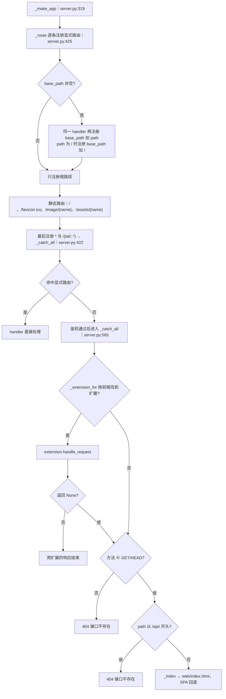

base_path 是**双注册而不是重定向**：`base_path=/neobot` 时 `/api/overview` 与 `/neobot/api/overview`
同时可用（`server.py:427`）。`_strip_base`（`server.py:537`）只在中间件与 catch-all 里去掉前缀用于判定，
路由本身仍是 aiohttp 注册的两份。改 base_path 必须重启（见「不可热重载」折叠块）。

扩展注册（`server.py:166`）：`register_extension` 要求至少一个以 `/` 开头的 prefix，返回 `prefixes[0]`；
`/api/extensions` 回 `extension_metadata`（name / prefixes / auth_prefixes / panel），前端侧栏据此渲染入口。
**扩展优先于 SPA**：所有未命中显式路由的请求先问扩展，扩展返回 None 才继续；
但鉴权中间件在分发**之前**执行，所以扩展路径要么落在公开集、要么必须声明 `auth_prefixes`，
否则就是「未鉴权也能访问的子插件接口」。

`_catch_all` 还会把「非 GET/HEAD 且没人认领」与「`/api/` 开头的 GET」判成 404 JSON，
其余 GET 才回 index.html —— SPA 用 `HashRouter`，所以除根路径外的页面路径其实很少走到这里。

### 静态产物：frontend 源码 → web 入库产物 → server 只读提供

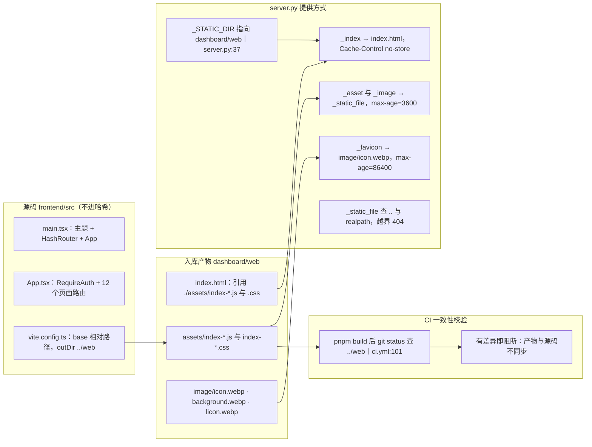

三者的关系是「源码 → 构建 → 入库产物 → 服务端只读提供」。`_STATIC_DIR` 固定指向 `dashboard/web`
（`server.py:37`），**没有**从 `frontend/src` 实时编译的路径：改了 TSX 不重新 build，面板行为不变。
产物缺失时 `_index` 返回 503 纯文本，提示去 `frontend/` 执行 `npm install && npm run build`（`server.py:547`）。

`vite.config.ts` 的 `base: './'` 让资源全部走相对路径，所以 `base_path` 子路径部署不需要改前端；
开发模式的 proxy 必须 `changeOrigin: false`（`vite.config.ts:23`）：后端对 login / setup 校验 Origin 与 Host 同源，
改成 true 会把 Host 改写成 `localhost:9981`，浏览器发来的 `Origin: http://localhost:5173` 对不上，登录直接 403。
CI 在 `pnpm build` 后用 `git status --porcelain --untracked-files=all -- ../web` 判断产物是否与源码一致
（`.github/workflows/ci.yml:101`），不一致即失败 —— 所以 `web/` 是必须一起提交的产物。

缓存策略三档：index.html `no-store`、`/assets/` 与 `/image/` `public, max-age=3600`、favicon `max-age=86400`。
`_static_file`（`server.py:591`）只接受 `assets` 与 `image` 两个目录下的名字，且做 `..` 与 realpath 越界检查。
面板 HTTP 扩展若要用自己的静态目录，用 `neobot_app.panel_web.StaticAssetDirectory`（`panel_web.py:44`），
它同样把绝对路径、`..`、盘符与 symlink 逃逸统一按 404 处理。

### 前端数据流：main.tsx → authFetch → /api 轮询

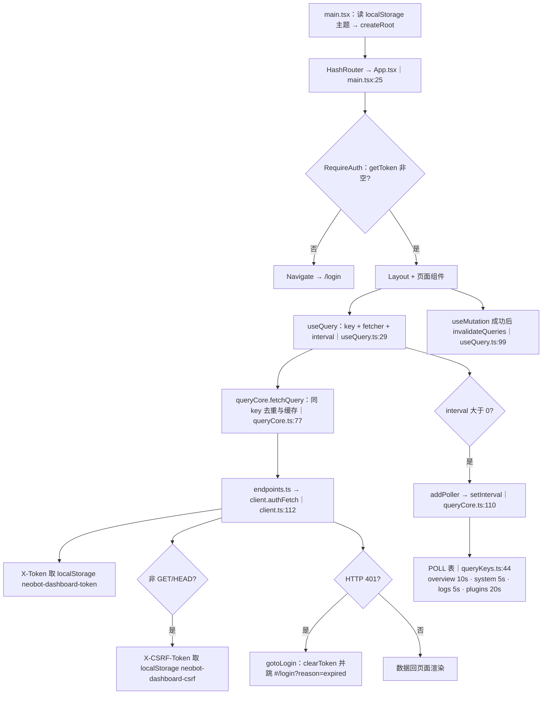

轮询节奏集中在 `POLL`（`queryKeys.ts:44`）：overview 10s、system 5s、logs 5s、chatFlows 5s、power 5s、
messages 60s、plugins 20s、archives 0（不轮询，避免覆盖编辑态）。`queryCore` 的三条语义：
同 key 同时只有一个在途请求（复用 `entry.promise`）、`force=false` 且已有数据时直接回缓存、
最后一个 poller 注销就 `clearInterval`。写操作走 `postJSON` / `putJSON` / `deleteJSON`，返回
`Result{ok,data,error,status}` —— **带 HTTP 状态码**，因为档案编辑要靠 409 区分乐观锁冲突，
所以不能退回「失败返回 null」的 `getJSON`。401 只清本地凭据并跳登录、不抛异常（`client.ts:122`），
调用方能区分「网络错误」与「未授权」。

登录流程：`Login.tsx` 先 `authStatus`（公开接口）拿「是否已配置密码」，再 `apiLogin`；
成功后 `setToken(token, csrf)` 并跳 `#/dashboard`。

### 管理权限：_require_manage 与两个开关的即时读取

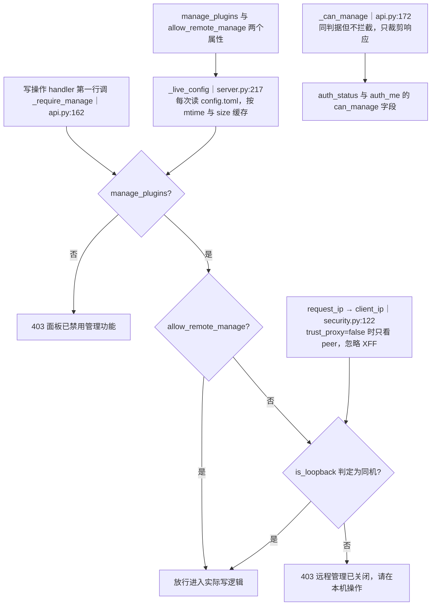

判定是「先开关、再来源」，任一不满足就 403；拒绝发生在 handler 解包请求体与碰宿主服务**之前**。
两个开关的属性走 `_live_config`：按插件配置文件的 mtime 与 size 做缓存键，改盘后**下一次请求**就生效，
不需要重启 —— 这是为了让管理员关掉管理功能后还能再打开，而不会把自己永久锁在门外。
这与配置消费者把这两个键标成「需重启」不矛盾：那里说的是「配置保存通道的生效分类」，
这里说的是「面板每次请求的读取策略」。

`_can_manage`（`api.py:172`）用同一判据但不拦截，只用于 `/api/auth/status` 与 `/api/auth/me` 的
`can_manage` 字段，前端据此隐藏管理按钮。注意它**不是**安全边界：真正的拦截始终在 handler 里的
`_require_manage`。观测点：`describe` 会回 `manage_plugins`、`allow_remote_manage`、`loopback_only`。

### 面板自身不能停用、不能热重载：配置改走原地生效

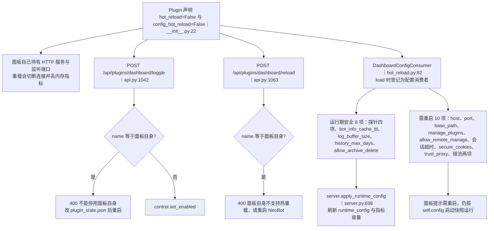

声明在 `__init__.py:22`，理由直接写在注释里（`__init__.py:28`）。`plugin_toggle` 与 `plugin_reload`
都对「`name == console.plugin_name`」显式返回 400，而不是「允许但会炸」：想关闭面板只能改
`data/plugin_state.json` 里 dashboard 的 `enabled=false` 再重启 NeoBot。

配置改动改走「原地生效」通道：`load()` 里 `register_config_consumer`（`__init__.py:184`）登记消费者，
保存配置且带 `reload=true` 时由 `plugin_config_save`（`api.py:1242`）调用
`_apply_plugin_config_in_place`（`api.py:1347`）：运行期安全项立刻生效，需重启项只回提示。
`apply_runtime_config` 只刷新 `runtime_config`、日志缓冲容量与历史保留天数，**不碰**监听、会话与安全字段。
失败时抛出，调用方保留旧配置并把错误原样报给面板（`hot_reload.py:114`）。
前端配置编辑器的交互与保存态见 `09c-dashboard-config.md`（待补）。

### 生命周期：端口回退、启动告警与延迟探针门控

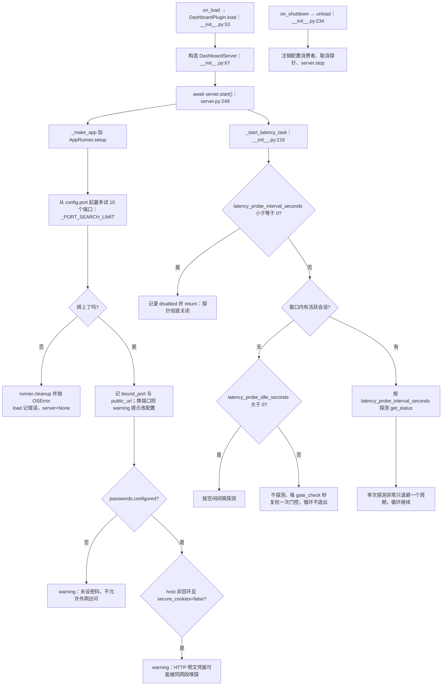

端口回退：`config.port` 起向后最多试 `_PORT_SEARCH_LIMIT=10` 个（`server.py:40`、`server.py:255`），
期间每个失败端口都吞掉 OSError 继续；全失败才 cleanup 并抛出，`DashboardPlugin.load` 捕获后
`self.server=None`（`__init__.py:83`），此后 `web.register_extension` 能力会抛「网页面板服务未启动」。
`public_url` 在 host 为 `0.0.0.0` / `::` 时把主机名显示成 `<服务器IP>`（`server.py:275`）。

探针门控的三条硬约束（`__init__.py:281` 的注释）：① 只有「配置明确关闭」或「插件卸载」才退出循环；
② **空闲期必须继续存活**，否则由于 `hot_reload=False` 导致 `load()` 不会重跑，探针会永久停摆；
③ 门控只读会话的 `last_seen_at`（`SessionStore.has_recent_activity`，`security.py:246`），
绝不能走 `SessionStore.get` —— 那会 `touch` 会话造成自我续期，只要探针在跑会话就永不过期。

## 关键状态

| 状态 | 谁置位 | 谁清理 | 失败时停在哪 |
|---|---|---|---|
| 面板密码 `auth.json` | `/api/auth/setup`（本机）或 QQ 私聊 `/set_password` | `PanelPasswordStore.clear` 或删文件 | 未配置时外网 `/api/*` 一律 403 `setup_required` |
| 会话 token | `auth_login` / `auth_setup` 里的 `SessionStore.create` | `auth_logout` 的 revoke、超时、密码 revision 变化、超过 64 被淘汰、进程重启 | 中间件拿不到会话即 401，前端清 token 跳 `#/login` |
| CSRF token | 随会话一起生成 | 随会话消亡 | 写方法不带或对不上 → 403「请刷新页面后重试」 |
| 登录失败计数 | `LoginLimiter.record_failure` | 登录成功清零、滑出 600 秒窗口 | 达到 5 次后 429，带剩余秒数 |
| HTTP 监听 runner 与 site | `DashboardServer.start` | `stop` 的 cleanup 加 `metrics.flush` | 10 个端口都绑不上 → OSError，插件把 server 置 None |
| HTTP 扩展注册表 | `register_extension`（能力 `web.register_extension`） | `unregister_extension`（插件停用或卸载） | 未注册 → `/api/extensions` 为空，路径落 SPA 回退 |
| 运行期配置快照 `runtime_config` | `apply_runtime_config`（配置原地生效通道） | 进程重启 | 绑定期与安全类字段不生效，面板继续提示需重启 |
| 前端凭据（localStorage） | 登录或设置成功后 `setToken` | `clearToken`（401 或点退出按钮） | 无凭据 → `RequireAuth` 直接跳 `/login` |
| 主题（`neobot-dashboard-theme`） | `main.tsx` 与 Layout 的主题切换 | 用户切换，不清除 | 读不到则回退到系统 `prefers-color-scheme` |

## 易错点

* **鉴权是 aiohttp 中间件，不是装饰器**：仓库里没有 `@login_required`。保护范围只有
  「`/api/` 前缀（除公开集）+ 扩展 auth_prefixes」。新增非 `/api` 路径默认**公开**，
  子插件接口不声明 `auth_prefixes` 就是裸奔。
* **未设密码不等于不能访问**：静态资源与 SPA 页面在任何情况下都可达，外网访问者能看到登录页，
  只是 `/api/*` 被 403 拦住。别把「未配置密码」当成「端口关闭」。
* **`/api/auth/setup` 在已配置密码时也在公开集里**：处理器回 400「请直接登录」而不是 401。
  这是刻意设计（避免暴露「需要登录」的接口形态），不是漏配。
* **快捷部署页要给「真正会监听的」OneBot 信息**：面板是反向 WS 的**服务端**，由 NapCat 主动连过来，
  所以给出的地址与 token 必须来自 `ReverseWsSettings.resolve`（配置 > 环境变量 > 默认值），
  而不是配置字段原值 —— 否则用户照着抄一个连不上的地址。监听 `0.0.0.0` 时同机地址与局域网地址
  要**分开给**（`0.0.0.0` 是不能连的）；路径由 NapCat 侧自己配、服务端不限制（仓库文档用 `/onebot`）。
* **引导的「必填」要能识别出厂占位**：`bot.account` 默认是 `0`、昵称与人设都是示例文案 ——
  只看「非空」会把占位当成配好了。判定用 schema 默认值现算比对（`_deploy_field_defaults`），
  不写死字面量；并且 `bot.account` 是 **int**，转文本别写 `x or ""`（`0` 是假值，会被吞成空串）。
* **首页承载「不报错但影响使用」的配置缺口**：`/api/overview` 的 `notices` 由后端读运行中
  配置生成（如未配置超级管理员账号），首页按 warning 样式渲染。这类缺口不影响启动、
  也不抛异常，只留在启动日志里很容易被忽略到最后 —— 该提示的放首页，别只 log 一行。
* **面板提示「已保存」不等于已经生效**：面板只报后端给的 `message`。配置项分
  「运行期读取（立即生效）」与「启动期持有快照（必须重启）」两类，而 `.env` 更特殊 ——
  它不进配置快照、连重载的 diff 都看不见。所以保存 env 后要按 `needs_restart`
  把「仍需重启」的意思如实呈现（警告样式 + 就地给出重启入口），别让绿色对勾
  盖过「新 Key 还没生效」这件事（issue #74）。
* **点「退出登录」不会结束服务端会话**：`Layout.tsx:123` 的 logout 只 `clearToken` 加跳转，
  并不调用 `/api/auth/logout`；而浏览器同源 fetch 仍会自动带上 HttpOnly Cookie，
  会话要等 `session_timeout_minutes`（默认 720 分钟）过期、进程重启或改密码才失效。
  需要立即注销时要显式调 `api.logout`（端点在 `endpoints.ts:135`，Layout 未使用）。
* **`authStatus().authenticated` 恒为 false**：`auth_status` 里写死 `"authenticated": False`（`api.py:200`），
  登录页真正的自动跳转靠 `checkAuth` 打 `/api/auth/me`（`Login.tsx:38`）。别读那个字段做判断。
* **base_path 是双注册**：`/api/overview` 与 `/neobot/api/overview` 同时有效，想只留一份得改 `_route`；
  改 base_path 必须重启（它是 `_REQUIRES_RESTART` 项，且路由在 `_make_app` 时就注册完毕）。
* **`web/` 是入库产物**：改 `frontend/src` 不 build 等于没改；CI 用 `git status` 校验产物同步（`ci.yml:101`）。
  只提交源码会让流水线直接红。
* **面板自己不能停用也不能热重载**：`plugin_toggle` / `plugin_reload` 对自身返回 400，
  关闭面板要改 `plugin_state.json` 并重启；配置改动走原地生效通道，只有 8 项运行期安全字段立即生效。
* **`manage_plugins` / `allow_remote_manage` 有两套语义**：面板每次请求按 `_live_config` 重新读盘（即时生效），
  而配置消费者把它们标成「需重启」；排查「开关改了没反应」时要区分这两条路径。
* **CSRF 只校验写方法**：GET 不做 CSRF 校验，靠 `SameSite=Lax` + `/api/*` 的 `no-store`。
  新增会改状态的 GET 接口等于自废防护。
* **CSP 很紧**：`script-src 'self'`、`connect-src 'self'`、`form-action 'none'`。
  前端新增内联脚本、外链 CDN 或被扩展页面引入第三方接口都会被浏览器拦掉，改 CSP 要同步评估 XSS 面。
