# 09b 面板接口面：api.py 的端点分组 · 权限级别 · 错误码语义

## 范围

本图覆盖**面板 HTTP 接口这一层**，也就是 `server.py` 显式路由挂上去之后、
到 `DashboardApi` 方法返回之间的全部判定：

* `dashboard/api.py`（2787 行，全仓第 2 大文件）：`DashboardApi`（`api.py:109`）的
  **75 个 async handler** 与 75 条 `/api/*` 路由（`server.py:326-418`）的对应关系、分组、
  权限级别、请求体解析、错误码、响应裁剪；
* 端点面四个实现助手：`archives.py`（档案表/条目/快照/超限）、`prompt_admin.py`
  （提示词分区与自定义文件）、`scheduled_admin.py`（定时任务转发 reminder 技能）、
  `model_probe.py`（供应商模型列表与连通性探测）。

**不画什么**（指向相邻图）：

* 两层中间件、静态产物、SPA 回退、CSRF 与会话存储本体 —— `09-dashboard.md`；本图只把它当作
  「已经放行的前提」，只描述**它替端点面做的事**（会话注入、写方法 CSRF、公开集、401/403/415）；
* `config_manager.py` / `plugin_config.py` 的读写与 revision 语义 —— `09c-dashboard-config.md`；
* 插件加载 / 启停 / 热重载 / 依赖判定 —— `08-plugins.md`、`08b-plugin-runtime.md`；
* 档案服务的存储实现与自动总结算法 —— `07-memory-archive.md`、`07b-archive-summary.md`；
* 用量表结构与计费脚本引擎 —— `23-billing-stats.md`；
* `status_card.py` 是 `/status` **QQ 命令**的出图卡片，不经过 HTTP 接口面，属命令/渲染图；
  `metrics.py` 的聚合口径属 09/23，本图只在「数据来源边界」里说明它是内存快照。

**spec / 直觉与现实的差异**（每条都在下面落到节点）：

1. **`can_manage` 在同一份 API 里有两个口径**：`config/env/models` 用的是
   `console.manage_plugins`（只读插件开关），而 `archives/prompts/scheduled-tasks/analysis`
   用的是 `_can_manage(request)`（还看来源 IP）。远程只读会话会拿到
   `can_manage: true` + `secrets_hidden: true` 的自相矛盾响应。
2. **「只读」并不等于「看不到内容」**：档案全文、提示词全文、提示词历史全文、定时任务列表对
   任何已登录会话开放；只有 `config.toml` 的 `source/raw`、`analysis/prompts` 的
   提示词正文、`.env` 做了裁剪。
3. **GET 也要求 manage**：`GET /api/archives/summarize`、`/api/archives/snapshots`、
   `/api/archives/snapshot` 走 `_require_manage`，而同一页的 `/api/archives/items`
   却只标 `can_manage`。
4. **有一条端点前端零调用**：`GET /api/archives/over-limit`（`server.py:390`），前端改用
   `/api/archives/items?over_limit=1`。
5. **参数越界不报错**：`_int_arg` 静默钳制（`?limit=99999` 变 200），非数字回落默认值。
6. 用量类接口失败降级成 **200 + `available:false`**，插件类接口失败却回 **500** —— 同一份
   API 里两套失败语义。

## 流程

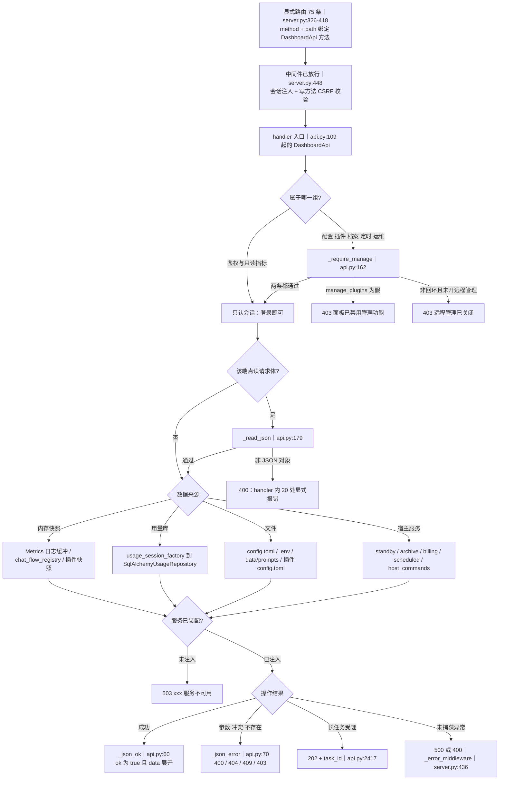

主干只有一句：**中间件只管「有没有会话 / 有没有 CSRF」，权限分级完全由 handler 自己声明**；
没有任何装饰器、没有路由表里的权限元数据。所以新加一个 `/api/xxx` 路由时，
自动获得的是「会话保护」，**不会**自动获得 manage 保护 —— 这一点在 09 图里是「鉴权」，
在本图里是「授权」。

## 时序

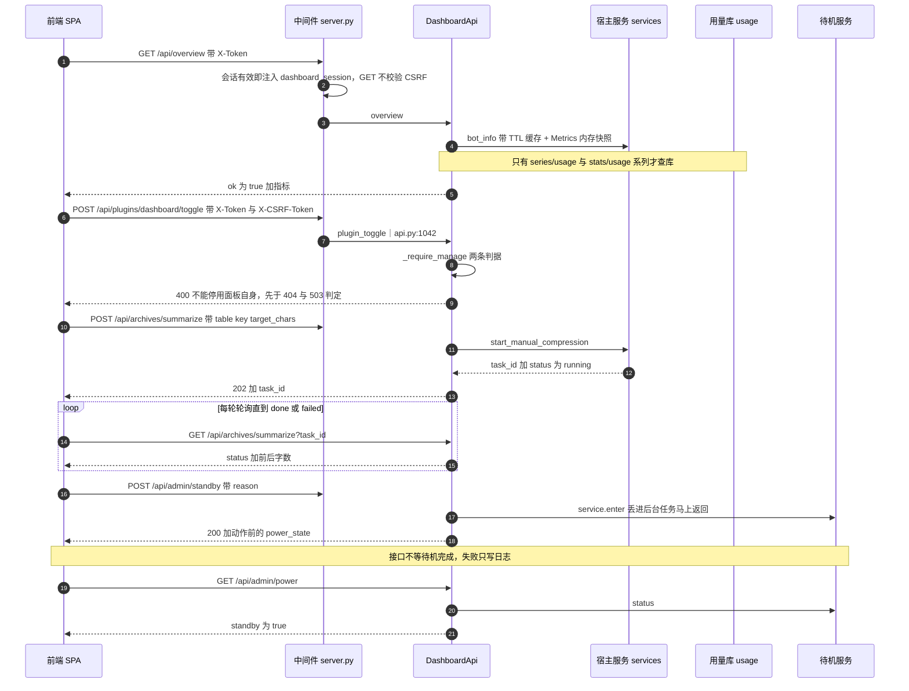

「谁等谁」：压缩任务接口**只等到任务受理**（202），真正干活在总结服务里；
待机 / 软重启接口**连受理都不等**（`asyncio.create_task`），返回的是动作前的状态。
「哪一步不致命」：压缩任务失败不改接口返回码（轮询里读 `status`）；电源动作失败只写
`logger.error`，HTTP 早已 200。

## 细节

### 端点分组全景：75 个 handler 与 11 个组的数据来源

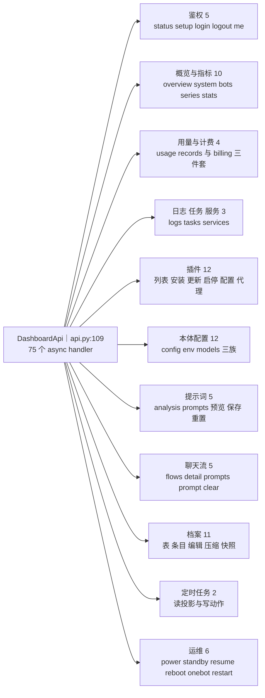

| 组 | 端点数 | 路由 | 权限 | 数据来源 |
|---|---|---|---|---|
| 鉴权 | 5 | `/api/auth/{status,setup,login,logout,me}` | 只有 status 在公开集；setup/login 走预会话跨站守卫 | 密码文件 + SessionStore |
| 概览与指标 | 10 | `/api/overview · system · bots · bot/detail · series/messages · series/latency · stats/api-calls · stats/active-users · series/usage · stats/usage` | 会话 | 内存 Metrics + psutil + 用量库 |
| 用量与计费 | 4 | `/api/stats/usage/records · /api/config/billing · billing/reload · billing/preview` | reload 需 manage，其余只认会话 | 用量库 + Billing 服务 |
| 日志任务服务 | 3 | `/api/logs · tasks · services` | 会话 | 内存日志缓冲 + 管理器投影 |
| 快捷部署 | 2 | `/api/deploy/status · /api/deploy/onebot-token` | manage | status 只读运行中配置与 .env 现状；生成 token 写回 `[adapter]` 并**用 extra_changed_paths=("adapter",)** 触发适配器按新 token 重连（没生效就如实说需重启） |
| 插件 | 12 | `/api/plugins` 与 `/api/plugins/{name}/{toggle,reload,update,uninstall,config}` | 列表与探测只读；其余 manage | 插件运行时快照 + 插件目录文件 |
| 本体配置 | 12 | `/api/config · config/validate · config/reload · config/models{,/library,/assignments,/test,/provider-models} · config/env{,/platform}` | 读只读、写 manage | config.toml / .env / 模型库 |
| 提示词 | 5 | `/api/analysis/prompts · prompts · prompts/preview · prompts/save · prompts/reset` | 保存与重置 manage | prompt store + custom/prompts.toml |
| 聊天流 | 5 | `/api/chat-flows{,,/detail,/prompts,/prompt,/prompts/clear}` | 清空 manage | 内存登记处 + 记录器 |
| 档案 | 11 | `/api/archives{,/over-limit,/items,/item,/summarize,/summarize/over-limit,/snapshots,/snapshot}` | 编辑删除压缩 manage | 档案服务 + 总结服务 |
| 定时任务 | 2 | `/api/scheduled-tasks · /action` | 读只读、写 manage | 管理器投影 + reminder 技能 |
| 运维 | 7 | `/api/admin/{power,standby,resume,reboot,standby/onebot,restart,shutdown}` | 全部 manage（`shutdown` 另外只收本机） | 待机服务 / 进程重启信号 / 进程停机信号 |

命名规律只在「档案」组破了一次：`/api/archives/summarize` 与 `/api/archives/summarize/over-limit`
是两个**不同的**批量语义（单条异步 vs 批量异步），只看前缀会以为是同一个接口的两种方法。

### 权限级别：三条判据与四种级别的判据链

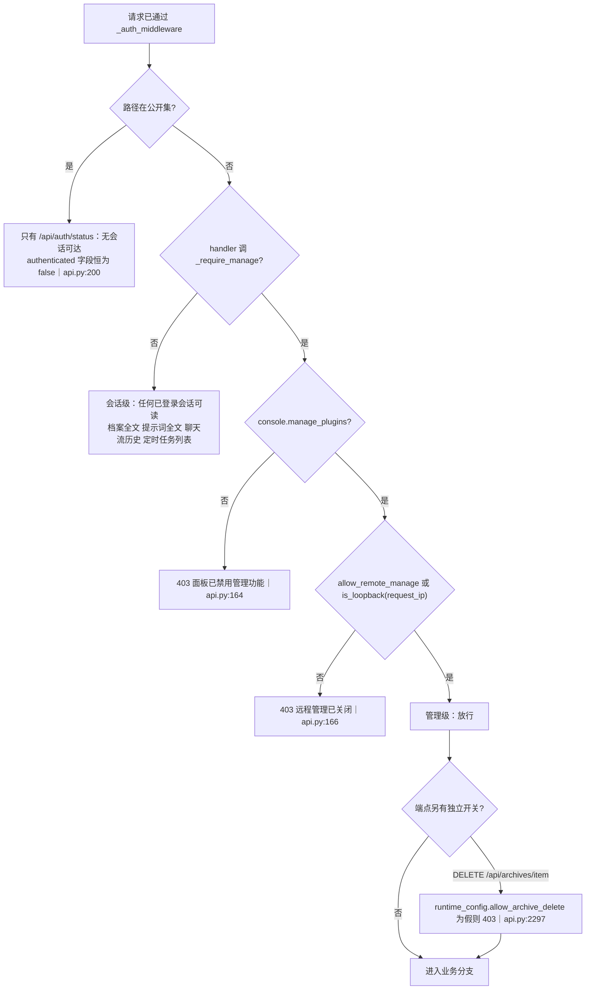

`_require_manage`（`api.py:162`）只读两个开关，两条都是 403，但文案不同 —— 前端直接把这句
中文显示给用户，所以「怎么改回来」写在文案里：

* `dashboard.manage_plugins=false` —— 整个面板只读，**改它是为了把管理员锁在外面**；
* `dashboard.allow_remote_manage=false`（默认）+ 非回环来源 —— 面板监听 0.0.0.0，
  这一条才是「外网看不到管理按钮」的真正开关；
* 两个开关都走 `server.py:217 _live_config`（按 mtime 缓存重读插件 config.toml），
  所以**改完不用重启面板**；但 `allow_archive_delete` 走的是 `server.runtime_config`，
  只在插件配置消费者原地生效时才刷新 —— 两个开关的生效时机不一样。

判定「是否本机」用 `is_loopback(request_ip)`，而 `request_ip` 在
`trust_proxy_headers=true` 时取 `X-Forwarded-For` 的**最右**项（见 09 图）：
反代部署下这一条直接决定远程管理是否可用。

### 写操作 × CSRF × manage：35 个写方法的三张清单

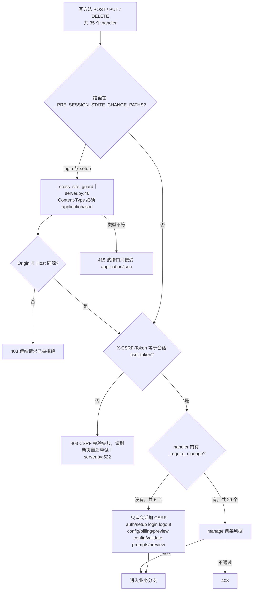

三张清单（改动时按这张表判断要不要补 `_require_manage`）：

| 类别 | 数量 | 端点 | 说明 |
|---|---|---|---|
| 要 CSRF 且要 manage | 29 | 全部插件写、本体配置写、模型写、提示词写、聊天流清空、档案编辑删除压缩、定时任务写、全部 `/api/admin/*` | 面板主流程 |
| 要 CSRF 不要 manage | 6 | `auth/setup · auth/login · auth/logout · config/validate · config/billing/preview · prompts/preview` | 前三个是会话建立/撤销本身；后三个是纯计算 |
| 不要 CSRF 但要 manage | 3 | `GET /api/archives/summarize · /archives/snapshots · /archives/snapshot` | GET 不校验 CSRF，却要 manage |

反直觉的两处：**`logout` 要 CSRF**（它是写方法且不在预会话集合里，所以退登也必须带
`X-CSRF-Token`，前端 `authFetch` 统一加）；**三个档案 GET 要 manage**（远程只读会话能读
档案条目，却读不了压缩历史快照）。

### 错误码语义：谁能产生哪个状态码，错误体长什么样

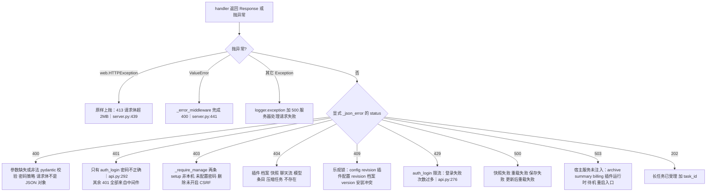

错误体形状由两个工厂函数锁定（`api.py:60` / `api.py:70`）：

* 成功：`{"ok": true, ...data 展开, ...extra}`；data 是 dict 时**逐个 update 上去**，
  所以 handler 返回的 dict 可以覆盖 `ok` 键（现状没人这么干）；
* 失败：`{"ok": false, "error": "中文文案", ...extra}`，extra 用来带结构化上下文 ——
  `errors`（pydantic 字段级）、`conflict`（插件安装冲突）、`current` 与
  `actual_version`（档案乐观锁）、`setup_required`（未设密码）。

**409 的四种来源不是同一个东西**：配置 revision（`ConfigConflictError`）、插件配置
revision（`PluginConfigConflictError`）、档案 version（`ArchiveVersionConflictError`）、
安装目标已存在（`result.conflict`，由 `_operation_response` 判成 409）。
前端只能靠 `error` 文案区分，没有机器可读的错误码字段。

### 数据来源边界：内存快照 / 用库 / 文件 / 宿主服务四条路

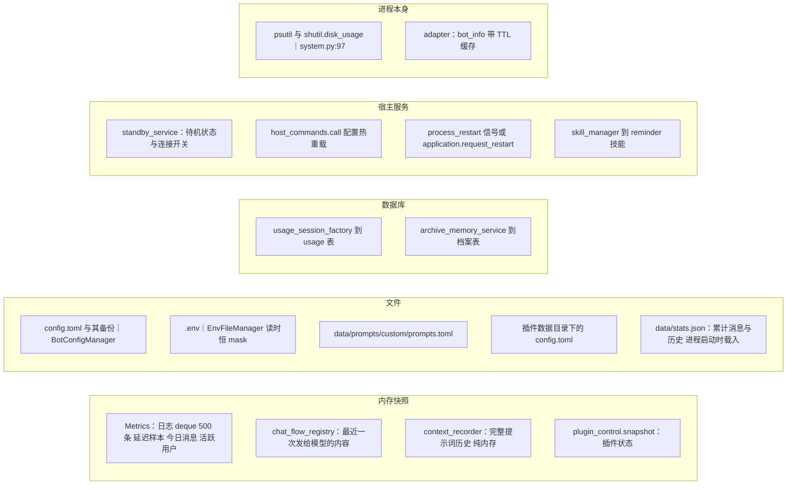

四条路的**失败姿势完全不同**，这是排查「面板显示不对」的第一分叉：

| 路 | 代表端点 | 服务缺失时 | 数据源异常时 |
|---|---|---|---|
| 内存快照 | `/api/overview`、`/api/logs`、`/api/chat-flows` | 恢复空列表或 503 | 基本不会失败；`chat_flows` 未注入才 503 |
| 用量库 | `/api/stats/usage`、`/api/series/usage` | `usage_session_factory` 为空即回 200 加 `available:false` | 异常被吞：200 加 `available:false` 加 `error` |
| 文件 | `/api/config`、`/api/config/env`、`/api/prompts` | 管理器总是存在 | 读取失败 400（校验）或 500（IO） |
| 宿主服务 | 档案 计费 定时 运维 | 一律 503 加「未注入 xxx」 | 依端点而定，多为 500 |

`/api/config/env` 保存后可以顺带重载，但**环境变量不在配置快照里** ——
配置 diff 永远看不到 `.env`。所以面板保存时会显式带上 `env` 这条变更路径
（`env_save` 传给 `_reload_config` 的 `extra_changed_paths`）：
不带的话热重载消费者一个都不会被触发，provider 仍握着旧凭据，而提示语还会说
「没有检测到配置项变化」。响应里的 `needs_restart` 表示「仍有模块必须重启进程」——
TTS / 生图 / 联网搜索等在启动期读取环境变量，没有对应消费者，热重载覆盖不到；
前端据此用警告样式提示并就地给出重启入口（issue #74）。

`Metrics` 的 `data/stats.json` 只在进程启动与保存时碰盘，**不是**每次请求都读文件；
`system.py` 也不读 `stats.json`，它实时问 psutil 与磁盘。把面板的「今日消息」当
数据库查询来调优是白费力气 —— 它就是一个 deque 加一个内存字典。

### 长任务端点：202 加 task_id，状态靠轮询，进程重启即失忆

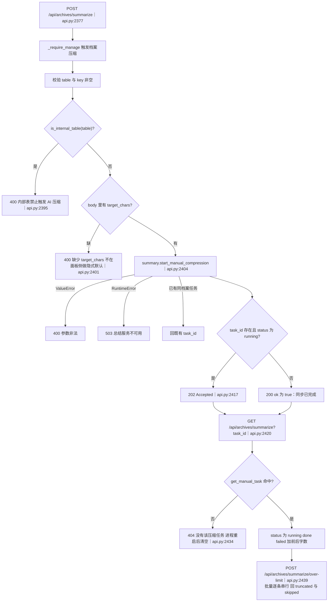

* **目标是调用方给的**：`target_chars` 缺失直接 400，面板不给默认值；区间由服务层
  `manual_target_bounds()` 提供，只在 `/api/archives` 里作为
  `min_target_chars/max_target_chars` 展示（`api.py:2166`）。
* **状态机在服务层，面板只转发**：接口不认识 running/done/failed 之外的任何状态，
  也不做超时判定；进程重启后 `get_manual_task` 回 None，前端得到的是 404 而不是 failed。
* 单条与批量的区别不是「一个 vs 多个」：批量走 `start_batch_compression`，
  返回体里除了 `items` 还有 `truncated` 与 `skipped`（一次最多处理的条数上限），
  单条没有这两个字段。
* 这是本图**唯一**会出现 202 的地方；插件安装、插件更新这些「慢活」是同步 await 的，
  最长受 aiohttp 默认超时约束，没有进度查询接口。

### 运行时动作：待机 / 软重启 / 进程重启 / 待机连接 四条链路

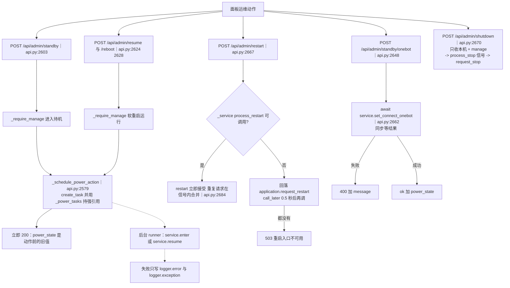

名字最像、语义最远的一对：

| 端点 | 做什么 | 谁执行 | 面板期间可用吗 |
|---|---|---|---|
| `/api/admin/reboot`、`/api/admin/resume` | **软重启运行体**：停掉再按当前配置重建 bot 侧对象 | `standby_service.resume`，后台任务 | 面板与连接保持可用 |
| `/api/admin/restart` | **重启进程**：让代码改动生效 | 宿主 `process_restart` 信号（回落 `application.request_restart`） | 面板会断开重连 |
| `/api/admin/shutdown` | **优雅关闭整个进程**（等价 SIGTERM） | 核心 `process_stop` 信号 -> `cli.py` 的 `stop_watcher` -> `request_stop()` | 面板会断开且不再回来 |

`_power_tasks` 那个强引用不是洁癖：代码注释（`api.py:2598`）写明「返回值被丢弃的后台任务
可能被 GC 回收，待机或软重启会静默半途而废」。任何重构都不能改成裸 `create_task`。
另外 `admin_standby` 与 `_soft_restart` 的响应都带 `power_state()`，而此刻动作还没执行 ——
前端必须靠 `/api/admin/power` 轮询，不能拿这个响应当结果。

### 插件端点的前置拒绝链：先拒什么后拒什么

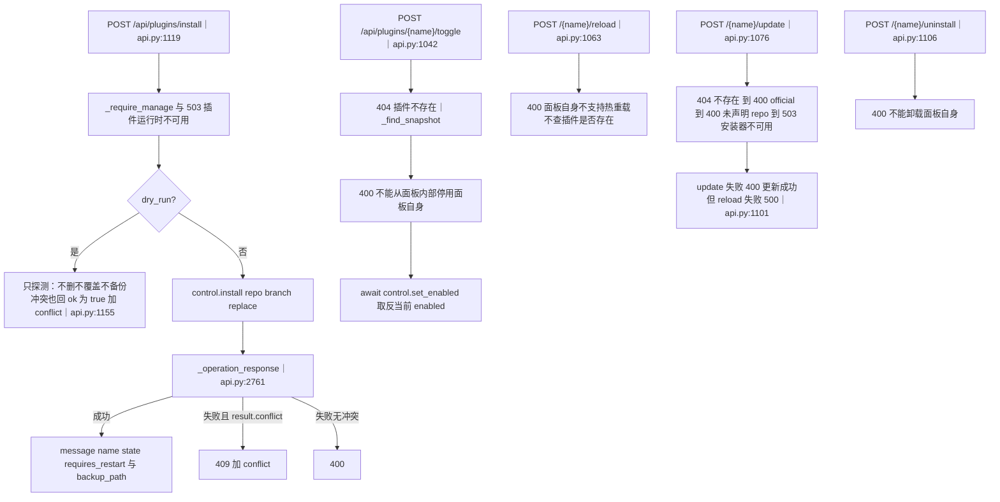

顺序不是随意的，它决定了错误文案的优先级：

* `toggle` 先查存在性再查「是不是面板自己」—— 所以停用面板自身拿到的是 400 而不是 404；
* `reload` **不查存在性**，直接把名字交给 `control.reload`（插件运行时自己会报不存在）；
  这是四个 `/{name}/` 端点里唯一不调 `_find_snapshot` 的；
* `update` 的三道门顺序是「官方插件 > 未声明 repo > 安装器缺失」，所以官方插件永远拿到
  「随本体更新」而不是「安装器不可用」；
* `install` 的 `dry_run` 分支**在失败时也回 400**（`api.py:1149`），
  只有探测成功才走 `ok` 加 `conflict`；`replace` 时必须显式传，
  否则磁盘零变化地拒绝。

### 响应裁剪与 can_manage 的两个口径

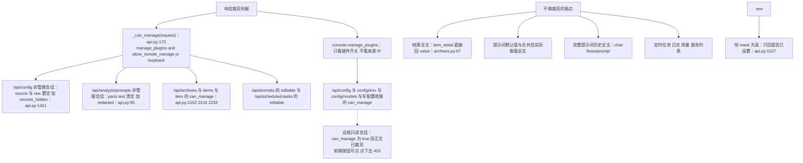

两个口径的后果很具体：`config.toml` 里也有机密（`adapter.local_auth_token`、
`adapter.reverse_ws_access_token`），代码注释（`api.py:1417-1420`）明确说「只读会话不得获取原文与 raw 副本」，
但同一个响应里的 `can_manage` 却按「只看插件开关」算。远程只读会话因此会看到
`can_manage: true` 与 `secrets_hidden: true` 并存。前端只有在档案页把
`can_manage === true` 当门禁（`Archives.tsx:89`），配置页拿的是这个失真字段。

反过来，「只读」不等于「看不到内容」：任何已登录会话都能读档案全文与提示词全文。
真正的隔离边界是**会话**，`_require_manage` 只隔离**写与运维**（外加三个档案 GET）。

### 前端契约对应：75 条路由里只有 1 条没有前端调用点

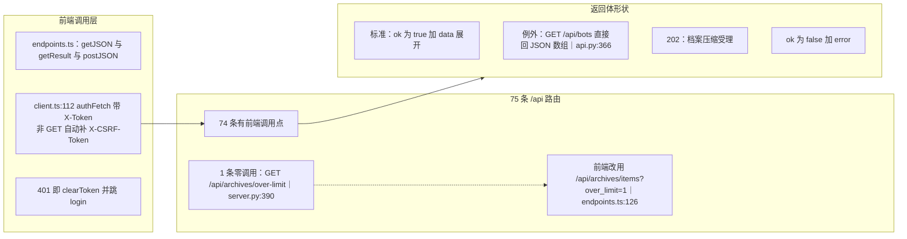

* `/api/auth/status` 的调用点在 `client.ts:59`（不在 `endpoints.ts`），
  所以按文件搜「有没有人调」会漏；
* 五个 `/api/plugins/{name}/*` 是**字符串拼接**出来的，静态搜完整路径同样会漏；
* `GET /api/bots` 是全仓唯一不包 `{"ok": true}` 的接口（`api.py:366` 直接
  `web.json_response([...])`），前端也确实是按 `BotSummary[]` 解（`endpoints.ts:140`）；
  给它加 `_json_ok` 会静默打断这一个页面；
* 外部/agent 侧**没有**任何调用点：除前端与面板自身的 HTTP 扩展外，仓库里没有别的客户端
  直接打这些 `/api/*`（`starship` 等插件走的是扩展前缀，不是 `/api/` 前缀）。

### 参数钳制与上限一览：越界静默改值，不报错

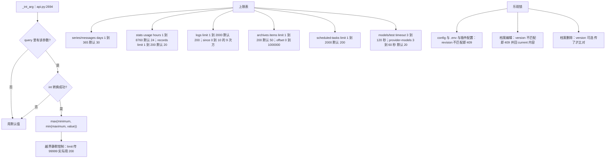

* `_int_arg` 是**纯钳制**：既不 400 也不在响应里提示「你的参数被改了」。
  只有 `archive_admin.MAX_LIST_LIMIT`（200）这种跨模块常量会反过来限制上限；
* `archives.py:16 PREVIEW_CHARS` 是 200：列表接口只回预览，全文只有 `/api/archives/item` 才给，
  这是「大档案不塞爆浏览器」的实现点；
* `stats_usage_records` 先把 `stats_since(cutoff)` 全量取回再 `records[:limit]` 切片
  （`api.py:737`）—— 上限只限制**返回条数**，不限制查询量；
* 超时钳制只作用于探测类接口（`models/test` 与 `provider-models`），且钳的是
  HTTP 客户端超时，不是整个请求的预算。

## 关键状态

| 状态 | 谁置位 | 谁清理 | 失败时停在哪 |
|---|---|---|---|
| `console.manage_plugins` / `allow_remote_manage` 的 live 缓存 | `server.py:217 _live_config` 按 mtime 重读 | 文件 mtime 或大小变化即整体替换 | 读不到时回落到启动时的配置快照，管理开关**不会**因为文件损坏而放开 |
| `_power_tasks`（后台电源动作强引用） | `_schedule_power_action`（`api.py:2597`） | 任务结束时 done 回调 discard | 任务内部异常只写日志；HTTP 已 200，前端只能靠 `/api/admin/power` 看到状态没变 |
| 待机状态（standby service） | `service.enter` / `service.resume` 后台任务 | resume 成功即回到 running | 面板接口不等待，失败留在日志里；`power_state()` 在服务未注册时回 `available:false` |
| `runtime_config.allow_archive_delete` | 插件配置消费者原地生效时刷新 | 关闭开关即置假 | 只有 `DELETE /api/archives/item` 读它；为假时 403，而 GET 接口仍回 `delete_enabled:false` |
| `_display_names` 与其 TTL（60 秒） | `_display_name`（`api.py:1993`） | TTL 到期时**整表 clear**，不是逐键过期 | 名称解析异常一律回落 `pipeline_key`，绝不 500（注释 R2） |
| 配置 revision（config.toml 与 .env 与插件配置） | 每次成功保存后自增 | 下一次保存带新 revision | 不匹配即 409，响应里带当前文档；前端据此提示「已被他人修改」 |
| 档案 version（乐观锁） | `ArchiveMemoryService.set_if_version` | 每次写入自增 | 冲突 409 加 `current` 加 `actual_version`；删除接口的 version 是可选的 |
| 压缩任务 task_id（内存） | `start_manual_compression` / `start_batch_compression` | 服务层保留策略；进程重启即全清 | 轮询拿不到就是 404「进程重启后任务状态会清空」，不会变成 failed |
| 登录失败计数（LoginLimiter，按 IP） | `limiter.record_failure` | 登录成功 `reset`；窗口过期 | 锁定期内 429 并给出剩余秒数，密码校验根本不执行 |
| adapter bot_info 缓存 | `console.bot_info`（TTL 由插件配置 `bot_info_cache_ttl` 决定） | TTL 到期 | 取不到时各字段回落空串或 None，接口仍 200 |
| `_cache` 里的用量降级结果 | 无（每次都真查） | 无 | 库异常时回 200 加 `available:false`，前端据此显示「不可用」而不是报错 |

## 易错点

* **`can_manage` 有两个口径，别把其中一个当唯一真相**：`api.py:1415 / 1530 / 1626 / 1810`
  用 `console.manage_plugins`，`api.py:2162 / 2216 / 2233 / 1880 / 2536` 用
  `_can_manage(request)`。远程只读会话在配置页会拿到 `can_manage:true` 与
  `secrets_hidden:true` 并存的响应。改动配置页按钮门禁时必须先统一这个字段。
* **「只读会话」不是「看不到内容」**：档案全文、提示词全文、提示词历史、定时任务、日志、用量
  对任何已登录会话开放；被裁剪的只有 `config.toml` 的 `source/raw`、
  `/api/analysis/prompts` 的正文、以及恒掩码的 `.env`。
* **三个 GET 要 manage**（`archives/summarize` 状态、`archives/snapshots`、
  `archives/snapshot`）：远程只读会话能列档案、能读单条全文，却读不了压缩历史。
  这不是笔误 —— 代码把它们和批量压缩归成同一组管理动作。
* **`GET /api/archives/over-limit` 前端零调用**（`server.py:390` 注册，
  仓库里只有一处测试注释提到它）：前端走 `/api/archives/items?over_limit=1`
  （`archives.py:list_items` 的 `over_limit_only`）。改这个端点不会影响任何页面。
* **`_int_arg` 静默钳制**：`?limit=99999` 变 200、`?days=abc` 变默认值，
  响应里没有任何标记。排查「我传了 500 条却只回 200 条」先看这里。
* **`GET /api/bots` 是裸数组**（`api.py:366`）：全仓唯一不遵守 `{"ok": true}` 约定的接口，
  前端 `getJSON<BotSummary[]>` 也按数组解。给它补 `_json_ok` 会静默打断概览页。
* **`/api/auth/status` 的 `authenticated` 恒为 false**（`api.py:200` 硬编码）：
  它在公开集里，中间件不会注入会话，所以带有效 token 调也永远 false。判断登录态必须用
  `/api/auth/me`（前端 `checkAuth` 就是这么做的）。
* **同一份 API 里两套失败语义**：`series_usage` / `stats_usage` / `stats_usage_records`
  在 DB 异常时回 **200 加 `available:false` 加 `error`**（`api.py:444-457`），
  而 `/api/plugins` 在快照异常时回 **500**（`api.py:898`）。写前端错误处理时先看清是哪一类。
* **`/api/admin/reboot` 与 `/api/admin/restart` 是两条链路**：前者是
  `standby_service.resume`（软重启运行体，面板不断），后者是宿主 `process_restart`
  信号（重启进程，面板会断）。SPLIT-MAP 的 W6 记录的是「谁绑了哪个入口」，
  这里补的是「同一个面板上有两个都叫重启的按钮」。
* **`/api/admin/resume` 与 `/api/admin/reboot` 是同一张皮**：两个 handler 自己都不查
  manage，直接转发给 `_soft_restart`（`api.py:2632`，权限与日志都在那里）；
  因此日志与 403 文案对两者都写「软重启运行」，从日志里看不出用户点的是「退出待机」
  还是「软重启」—— 排查时只能靠 `reason` 字段。
* **`_schedule_power_action` 的响应是动作前的状态**：`admin_standby` 返回
  `power_state()` 时待机还没开始，响应里的 `standby` 仍是旧值；前端必须轮询
  `/api/admin/power`。另外那个 `_power_tasks` 强引用是**必须**的（`api.py:2598` 注释）。
* **`plugin_reload` 不查插件是否存在**：toggle / update / uninstall 都先
  `_find_snapshot`（不存在即 404），只有 reload 直接把名字交给插件运行时。
  所以「重载一个不存在的插件」返回的错误文案来自运行时，不是面板。
* **`config/billing/preview` 不要 manage，也不检查 `[billing].enabled`**：
  `billing.py:804` 的注释写明「保存配置前必须能先试算」，所以关掉计费也能试算。
  它能按请求体里的 `billing_script` 名加载并执行 `<DATA_DIR>/Billing/` 下的脚本；
  名字受 `_resolve_script_path`（`billing.py:441`）的「单段文件名」校验，不是任意路径执行，
  但「试算接口会跑代码」这一点在排查权限问题时要知道。
* **`plugin_config_save` 的提示文案顺序有坑**（`api.py:1317-1321` 注释）：
  `_plugin_config_meta` 会写一条通用 `message`，必须在它**之后**覆盖
  `applied` 与 `message`，否则「已生效 / 需重启」的提示会被通用文案吞掉。
* **`models_library_save` 会把已序列化的响应体再解析回来**塞 `saved_model_ref`
  （`api.py:1700-1710`）：说明 `_finish_config_write` 的返回体不可扩展。
  要加字段应该改 `_finish_config_write`，不要在调用点二次解析 JSON。
* **`_read_json` 的 25 个调用点有四种待遇**：20 处包 try 并显式回 400；
  **4 处完全不包 try**（`api.py:1890 prompts_preview`、`api.py:1917 prompts_save`、
  `api.py:1943 prompts_reset`、`api.py:2546 scheduled_tasks_action`），坏请求体靠
  `_error_middleware` 兜成 400，错误体形状一样但栈里多一层；
  1 处宽容处理（`api.py:2574 _power_reason` 把非法体当空体，电源动作照常执行）。
  打断点定位 400 时先确认是哪一类。
* **档案内部表是硬拒绝**：`memory_counter` 不能编辑（`api.py:2254`）也不能触发压缩
  （`api.py:2395`），两处都返回 400；但**可以删除**（删除只受 `allow_archive_delete` 管）。
  「内部表只读」这个说法在删除面前不成立。
* **写操作里还有 6 个不要 manage**：`auth/setup`、`auth/login`、`auth/logout`、
  `config/validate`、`config/billing/preview`、`prompts/preview`。
  给它们补 `_require_manage` 会直接锁死登录与设置密码流程；
  反过来，`config/validate` 与 `prompts/preview` 是纯计算，不是漏加权限。
