# 09c 面板配置编辑：三条写入通道 · diff 与掩码 · 前端编辑器数据流

## 范围

本图覆盖**面板里能改配置的那几个入口**，以及它们背后互相独立的三条文件写入通道：

* 本体 `config.toml`：`BotConfigManager`（`read` / `validate` / `save` / `update_section` /
  `update_models` / `update_plugins_proxy`）与 `.env` 的 `EnvFileManager`；
* 插件配置 `plugins_data/<插件名>/config.toml`：`PluginConfigEditor` 与前端插件编辑器；
* 面板自己的配置 `plugins_data/dashboard/config.toml`：`DashboardConfig` +
  `hot_reload.py` 的「运行期安全 / 需重启」逐键声明；
* 三个写入者的保真度对照：`Config.load` 补全写回（`config/loader/manager.py:606`）、
  面板 `_diff_document` 保存、`config/chat_writer.py` 定点写回；
* 前端编辑器数据流：`pages/ConfigManager.tsx`（顶层 tab）、`pages/config/BotConfigPanel.tsx`
  （表单与 TOML 双模式）、`pages/Plugins.tsx` + `pages/plugins/PluginEditorPanel.tsx`、
  `components/SchemaForm.tsx` 与 `components/schema/*`、`api/client.ts` 的状态码语义。

**不画什么**（相邻图）：逐个端点的请求/响应与权限矩阵（`09b-dashboard-api.md`）；
面板 HTTP 服务本身、鉴权中间件、静态产物、`queryCore` 通用取数（`09-dashboard.md`）；
插件加载、热重载本体、`__pycache__` 重建（`08-plugins.md` / `08b-plugin-runtime.md`）；
schema 分层、`Config.load` 全链路、版本迁移、`.env` 逐字段解析（`01b-config-system.md`，
本图只在「三个写入者」对照里引用它）；模型注册之后的 provider 路由（`05-llm-routing.md`）。

**前端为什么不进哈希**：`covers` 里的 `frontend/src/pages` 只有 `.ts/.tsx`，
检查脚本只对 `*.py` 计内容哈希（`scripts/flow/check_flow_diagrams.py:37`），
所以**改前端不会让本图变「过期」**；前端行为的变更必须靠人看到这张图后主动回来改。

**spec / 直觉与现实的差异**（逐条落到节点，证据见「易错点」）：

1. **`None` 不等于「清空」**：`_diff_document` 为它产出 `None`，而 `_merge_into_document`
   见到 `None` 直接 `continue`；键已存在时旧值原地保留，保存**无声无息地不生效**。
2. **面板保存不是最小 diff**：`read()` 把默认值物化进 `config` 载荷，表单原样提交它，
   于是「文件里没有、schema 里有」的字段会被整批写盘。实测 3 个键的文件一次保存变 432 个键。
3. **TOML 模式与表单模式的未知键待遇相反**：表单模式保留未知分区（`_diff_document`），
   TOML 模式却因为 `validate(source=...)` 直查 `BotConfig` 而报「未知配置项」→ **改不动**。
4. **插件配置表单的 `hot_reload` 徽标恒为 True**：`describe_pydantic_model` 硬编码，
   真话只在保存响应的 `message` / `changes` 里。
5. **`dashboard.manage_plugins` / `allow_remote_manage` 声明「需重启」，实际立即生效**：
   `server.py:217 _live_config()` 每次访问都按 mtime 读一遍插件配置文件。
6. **插件页每 20 s 轮询一次列表，列表数组换新会触发配置重读**，未保存草稿被静默覆盖。

## 流程

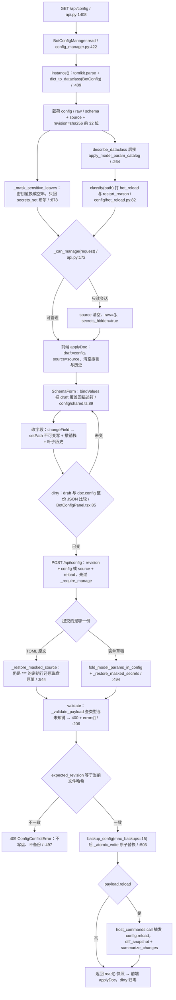

## 时序

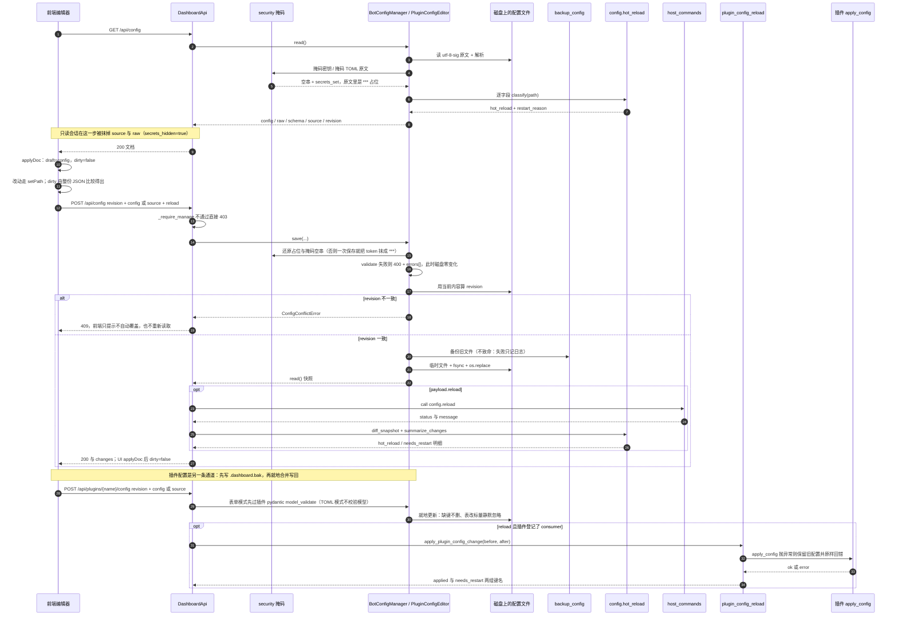

## 细节

### 编辑器数据流：读 → 渲染 → 脏标记 → 保存 → 应用

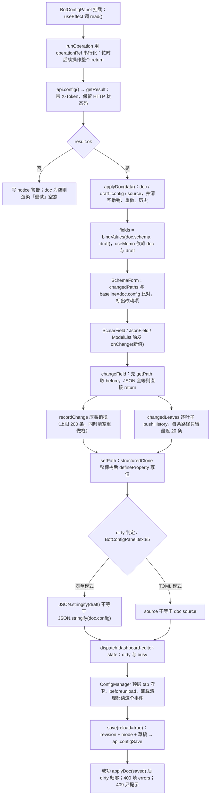

要点与阈值：

* `applyDoc` 里 `draft = data.config` 是**浅引用**，靠 `setPath` 的 `structuredClone`
  保证改草稿不动 doc；`doc.config` 同时充当 `baseline`（标黄与恢复默认的比较基准）。
* **dirty 是整份 JSON 比较**，不是字段级：数组顺序变化、整数与浮点写法不同、
  键顺序不同都可能让 dirty 为真；配置越大，每次渲染的两遍序列化越贵。
* 撤销/重做只服务表单模式（TOML 模式的按钮恒 disabled，见 `BotConfigPanel.tsx:311`）。
* 模式切换、重新读取、放弃修改都先 `confirm`，且**不转换草稿**：切换等于用 `doc` 重新
  `applyDoc`，TOML 文本与表单草稿之间没有任何互转（`BotConfigPanel.tsx:99`）。
* 「全部恢复默认」把每个叶子的 `default` 写进草稿（`resetAllDefaults`，可一次撤销），
  但 `default` 为 `null` 的字段会写成 `None` —— 见「易错点」第 1 条。

### schema 到表单描述符：kind 判定、模型参数伪字段、未注册类型的兜底

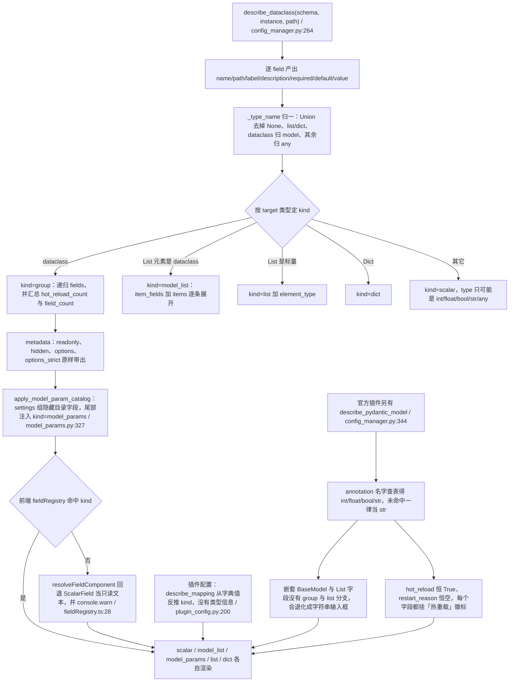

要点：

* `required = not _is_optional(field.type)`；`default = _jsonable(_default_of(field))`，
  `default_factory` 会被**真的调用一次**，抛异常则回落 `None`（`_default_of`，`:123`）。
* `value` 来自「按文件解析出的实例」，因此**文件里没写的键也会带默认值**（这是下一条
  「保存即物化」的根源）；前端只用草稿覆盖 `value`，不改描述符结构。
* `hidden` 只对「同组存在 `model_params` 伪字段」的字段生效（`Field.tsx:20`），
  即模型 `settings` 里的可选参数由伪字段接管，不再单独渲染。
* 没有 enum 分支：枚举靠 `metadata={"options": [...], "options_strict": True}` 表达，
  前端在 `ScalarField` 内部分流成下拉或可自由输入的 Combobox（`ScalarField.tsx:43`）。
* 插件配置两条 schema 路径并存：`plugin_config.read()` 先用 `describe_mapping`；
  `api.plugin_config_get` 若拿到 pydantic 模型再用 `describe_pydantic_model` **整份替换**
  （`api.py:1232`），此时 `plugin.toml` 的注释只用来补 `description`。

### 三种编辑模式与 source 保真：TOML 能改什么、只读还能看到什么

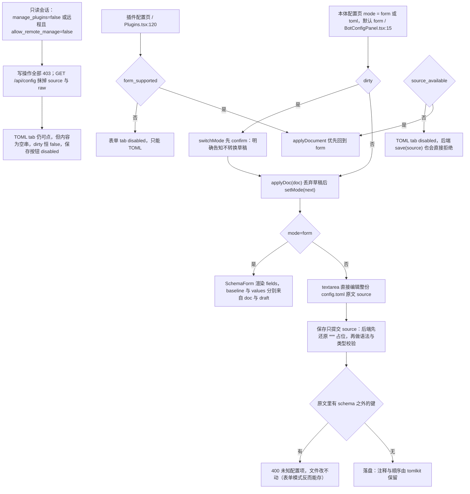

要点：

* 本体配置**没有** `source_available` 字段，只有权限抹除；插件配置有，且含密钥时
  `read()` 直接返回空的 `source` 与 `source_available: false`（`plugin_config.py:349`）。
* `_restore_masked_source` 只认「值仍是 `***`」的行；用户真把某个密钥改成 `***`，
  保存后会被换回旧值 —— 这是设计（`config_manager.py:944`）。
* `.env` 侧根本没有原文模式（`source_available: false`、`secret_policy: write_only`），
  前端只提供表单：`value` 与 `has_value` 分开返回，敏感键的 `value` 恒为空串。

### revision 乐观锁：五条写路径的口径与 409 的前端待遇

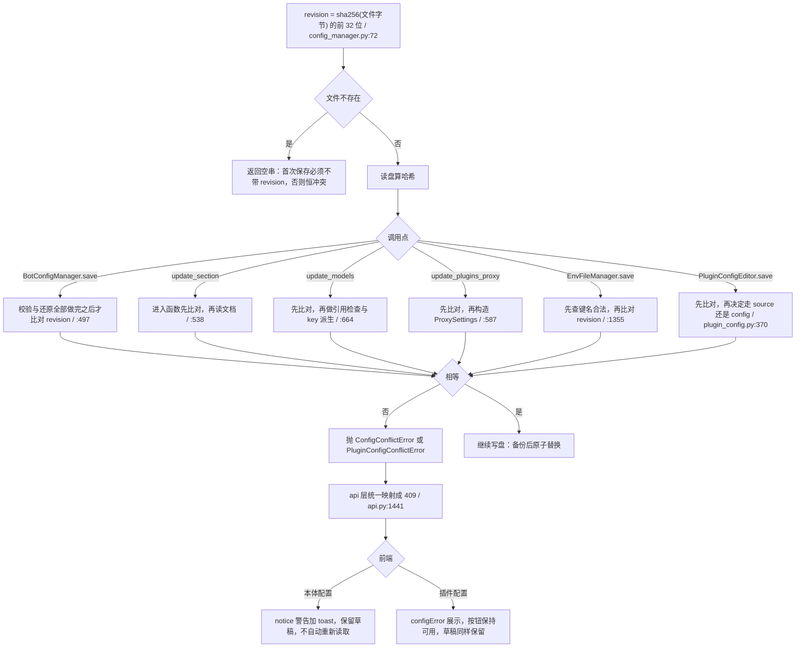

要点：

* `revision` 是**内容哈希**，不是自增版本号：任何外部改动（`chat_writer`、`Config.load`
  补全写回、手工编辑、甚至只改注释）都会让面板的下一次保存 409。
* 面板每次保存后都会把响应里的新 `revision` 写回 `doc`，所以连续保存不会互相冲突。
* 两个标签页同时编辑：后保存者必 409，且**不覆盖**对方内容（这才是乐观锁的意义）。
* 冲突只回一条文案，不带服务端当前内容 —— 与档案编辑的 409（带当前 version 与内容）
  不同，想对齐得先点「重新读取」。

### 保存之后怎么生效：「需重启」提示的三个独立来源

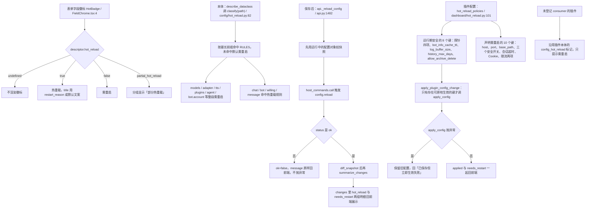

要点：

* 三个来源**互不校验**：字段徽标来自静态分类表，保存后的 `changes` 来自真实配置对象
  diff，插件的结论来自插件自己的声明。三者可能互相矛盾（见「易错点」第 5、6 条）。
* `config.reload` 失败不致命：`api._reload_config` 返回 `ok=false` 与文案，
  保存本身已经成功，前端只把 notice 标成 warning（`BotConfigPanel.tsx:234`）。
* 插件原地生效只覆盖「运行期安全」的键；`apply_config` 收到的是**整份新配置**，
  「只应用一部分」由消费者自己保证（`runtime/plugin_config_reload.py:151`）。
* 面板自己的配置里，`manage_plugins` 与 `allow_remote_manage` 被声明为需重启，
  但 `server.py:240` 每次请求都读盘取值 —— 声明与现实不符。
* 插件配置保存后前端**不渲染** `changes` 明细（`PluginEditorPanel` 没接这个字段），
  只有一句 `message`；本体配置页则会展开「已生效 / 需重启」两个折叠列表。

### 备份与历史值恢复：磁盘备份、TOML 注释、前端撤销与字段历史

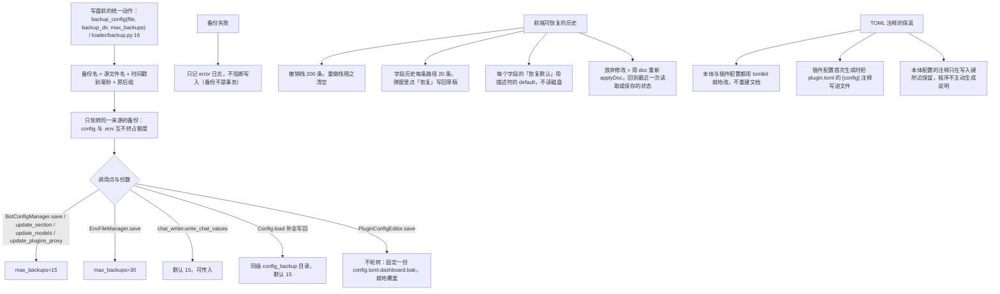

要点：

* 备份是**覆盖前**的副本（`shutil.copy2`），失败只记日志：真正保证不写坏的只有
  「临时文件 + fsync + `os.replace`」这条原子替换（`config_manager.py:80`）。
* 备份保留份数按「同名前缀」轮转，因此把 `config.toml` 备份与 `.env` 备份分得很清；
  在此之前两者同名，`.env` 的明文密钥被写进名为 config 的文件（`backup.py:19` 注释）。
* 面板**没有**「从备份恢复」入口：恢复要么靠 TOML 模式手改，要么人工从
  `data/config_backup/` 复制回去。
* 插件配置的 `.dashboard.bak` 放在配置文件同目录，只留最近一次，且写入失败被吞掉
  （`except OSError: pass`）。

### 三个写入者：谁保注释、谁保未知键、谁会把配置写胖

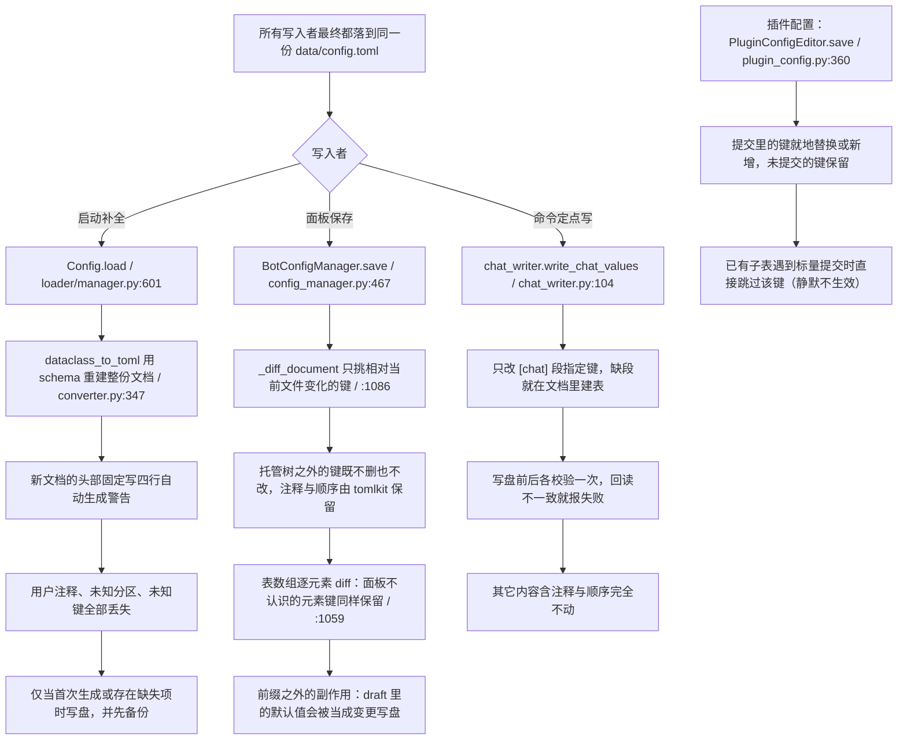

实测对照（本机跑 `BotConfigManager` 与 `Config.load`，同一份 3 键 + 未知分区的文件）：

| 写入者 | 用户注释 | 未知分区 / 未知键 | 默认值 | 备注 |
|---|---|---|---|---|
| `Config.load` 补全写回 | **丢** | **丢** | 全量写盘（实测 434 键） | 头部四行警告自陈「所有除了键值的内容（包括注释）都会在重新执行程序时丢失」 |
| 面板 `_diff_document` 保存 | 保留 | 保留 | **全量写盘**（实测 3 键变 432 键） | 因为 `read()` 的 `config` 载荷已经带全部默认值，diff 只相对文件 |
| `chat_writer` 定点写 | 保留 | 保留 | 不动 | 只写调用方点名的键 |
| `PluginConfigEditor` | 保留 | 保留（未提交的键不删） | 不主动补全 | 首次保存会把表单里的默认值一并写进文件 |

结论：**面板不是「最小 diff 写入器」**。它的 diff 保证的是「不删除我不认识的东西」，
并不保证「只写我改过的东西」；真正的低副作用写入者是 `chat_writer`。

### 掩码与还原：两个占位符、三类还原路径、各自漏在哪

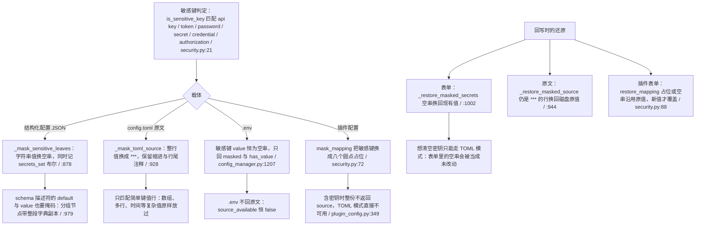

要点：

* **三个占位符不是同一个**：本体原文用 `***`（`config_manager.py:905`），
  `.env` 与插件配置用八个圆点 `SECRET_PLACEHOLDER`（`security.py:55`），结构化载荷用空串。
  排查「界面显示什么」时先分清是哪条通道。
* 掩码是**按最后一段键名**判定的（`is_sensitive_key(path[-1])`），
  所以 `models.registry.*.settings.max_output_tokens` 这类名字里带 token 的字段
  也会被当成密钥掩码进 `secrets_set` —— 实测该键出现在 `secrets_set` 里，
  面板上它是个普通数字输入框，值却是空串。
* 回归风险点：结构化的空串还原只在「当前值是非空字符串」时生效
  （`_restore_masked_secrets` 的 `isinstance(existing, str) and existing`），
  密钥原本为空时，表单里的空串就是空串。

### 前端轮询与 dirty 竞态：20 秒一次的列表刷新会覆盖未保存草稿

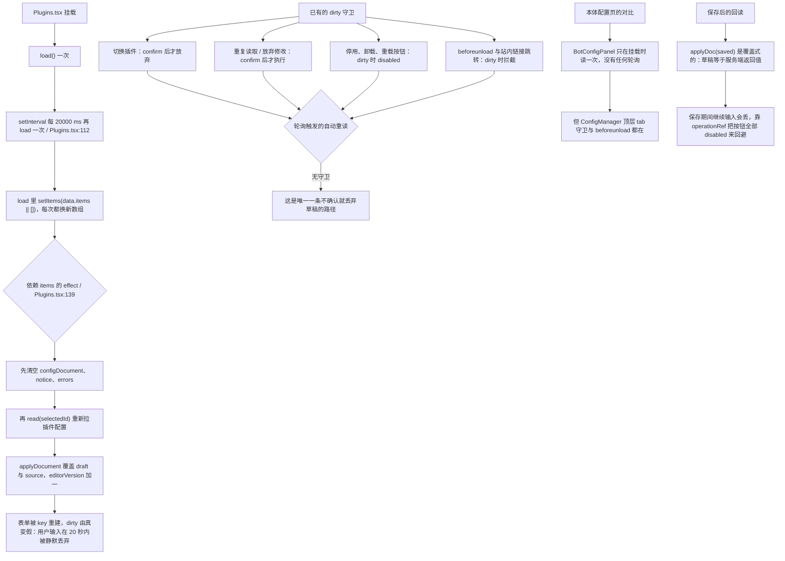

要点：

* 插件列表页用的是**裸 `setInterval` 加直接 `api.plugins()`**，没有接 `queryCore`，
  所以它既不受 `useQuery` 的去重保护，也会与 Dashboard 页的同一接口各拉一份。
* 该 effect 的依赖里同时有 `items` 与 `read`，`read` 是 `useCallback`（依赖 `applyDocument`）
  稳定，真正的触发器就是每次轮询换新的 `items` 数组。
* 想修的话，最小改动是让 effect 只依赖 `selectedId`（用 ref 读 `items` 做存在性判断），
  或在重读前判断 `dirtyRef.current`。
* `editorVersion` 只用来给 `SchemaForm` 换 key（强制重建输入组件），
  它同时也是「草稿被外部覆盖」的信号。

### 另外三条局部写路径：分区、模型库、插件代理

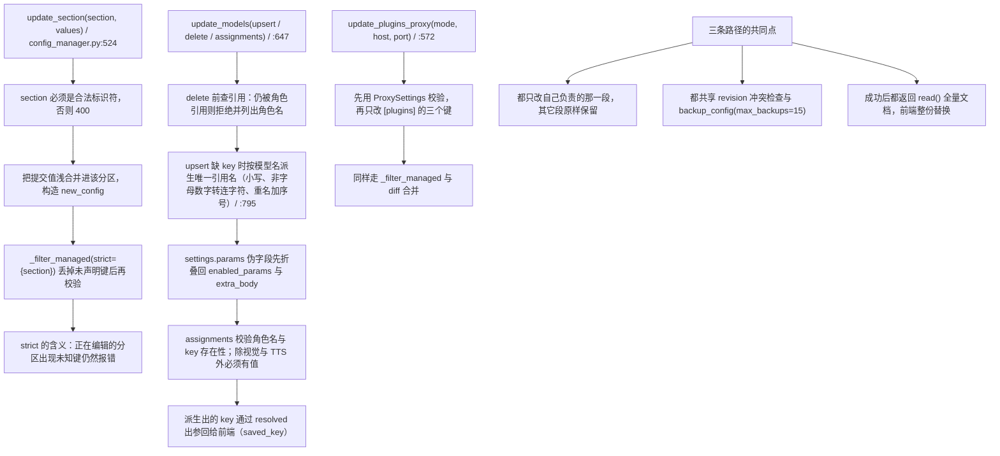

要点：

* `_filter_managed` 是「校验视图」而不是「写入视图」：它只用于 `validate`，
  真正合并进文档的是 `_diff_document` 的结果（两者对未知键的态度必须一致才安全）。
* `strict` 表达的是「本次正在编辑的分区」：`update_section` 必传，
  所以对官方插件配置分区（如 `[minigame]`）的编辑**不允许**出现 schema 之外的键。
* `update_models` 的 `delete` 只挡「被调用方引用」，不挡「被其它分区引用」；
  删掉正在被 `agent_model` 编号引用的 key，会在重启后被模型注册表报缺配置。

## 关键状态

| 状态 | 谁置位 | 谁清理 | 失败时停在哪 |
|---|---|---|---|
| `revision` | 每次 `read()` 与保存响应带回，前端存进 `doc` | 下一次读取或保存响应覆盖 | 不匹配则 409，磁盘零变化，前端保留草稿 |
| `dirty` | 前端整份 JSON 比较（表单比 `draft`，TOML 比 `source`） | `applyDoc`：读取、保存、放弃、模式切换、轮询重读 | 不阻断保存，只拦住切换 tab、切换模式与关页面 |
| `busy` / `operation` | `runOperation` 与 `act()` 进入时置位 | `finally` 里清空 | 期间所有写按钮 disabled；`operationRef` 让重复点击直接返回 |
| `errors` | 400 响应里的 `errors[]` | 下一次读取、校验通过、模式切换 | 有值时插件页 `canSave` 为假，本体页只展示不拦保存 |
| `notice` | 保存或读取的结果 | 下一次 `applyDoc` | 只是提示层，不改变任何数据 |
| `changes` | `config_save(reload=true)` 或 `config_reload` 的响应 | 放弃修改、下一次保存 | 只影响展示「已生效 / 需重启」 |
| `secrets_set` / `secrets_hidden` | `read()` 掩码时写入；只读会话置 `secrets_hidden` | 每次读取重算 | 密钥永远不回明文；只读会话连原文也拿不到 |
| `hot_reload` / `restart_reason` | `describe_dataclass` 逐字段调 `classify(path)` | 随 schema 重新生成 | 仅影响徽标与提示，不影响保存 |
| `config_error`（插件） | 插件加载时配置校验失败 | 配置改对后重载 | 插件按默认值运行，面板显示「已回落到默认值运行」 |
| `runtime_config`（面板自身） | `apply_config` 成功后 | 进程重启 | `apply_config` 抛异常时保留旧对象，面板继续用旧值 |
| `config_backup/*` | 每次写盘前 `backup_config` | 超过保留份数时按 mtime 删除 | 备份失败只记日志，写入照常进行 |
| `.dashboard.bak` | 插件配置每次保存前 | 下一次保存覆盖，只留一份 | 备份失败被吞掉 |

## 易错点

1. **`None` 不会清空已存在的键**（实测）：`_diff_document` 会为 `None` 生成变更，
   而 `_merge_into_document` 见到 `None` 直接 `continue`（`config_manager.py:1143`）。
   现象：文件里 `public_url = "http://example.com"`，提交 `None` 保存后文件不变、
   回读仍是旧值，接口返回 200。真正会删键的是「提交里没有这个键」（走 `_DELETE`）。
   受影响的具体字段是三个 `Optional` 且 `default=None` 的项：
   `file_server.public_url`、`web_search.engines`、`web_search.engine_timeout_seconds`，
   「全部恢复默认 + 保存」对它们无效。
2. **面板保存会把默认值写胖**（实测）：`read()` 的 `config` 载荷来自实例，包含所有默认值；
   表单把它整份提交，diff 只相对「文件里现有内容」，于是 3 个键的文件一次保存变 432 个键，
   并第一次出现 `version = "0.6.0"`。改动 `bot.py` 的默认值后，面板保存过的配置不会跟着变。
3. **TOML 模式在存在未知键时完全不能保存**（实测）：`validate(source=...)` 直接
   `_validate_payload(BotConfig, parsed, ...)`，任何 schema 之外的分区或键都报「未知配置项」；
   而表单模式对同样的文件可以正常保存并保留它们。想加自定义分区又只用 TOML 模式编辑，
   会陷入「保存不了」，而提示只给一个路径名。
4. **插件配置表单的 `hot_reload` 徽标恒为 True**：`describe_pydantic_model` 硬编码
   `"hot_reload": True`（`config_manager.py:374`），所以 `dashboard` 插件的 `port`、
   `manage_plugins` 也显示「热重载」，与它自己 `hot_reload.py` 的声明相反。
5. **`manage_plugins` 与 `allow_remote_manage` 声明需重启，实际立即生效**：
   `server.py:217 _live_config()` 按 mtime 与 size 缓存读盘，两个 property 都走它。
   远程把 `allow_remote_manage` 改成 false，下一个请求就被 403 ——
   「避免把管理员锁在门外」的假设不成立。
6. **插件页 20 秒轮询会丢未保存草稿**：列表轮询换新 `items` 数组，依赖 `items` 的
   effect 重跑，清空 `configDocument` 并重新读取。其它路径都有 `dirty` 守卫，唯独这条没有。
7. **插件配置的 TOML 模式不做模型校验**：`plugin_config_save` 只在表单模式跑
   `model.model_validate`（`api.py:1263`）；TOML 模式只解析语法，写进去的非法值
   要等插件加载时才发现，表现为 `config_error` 与「回落到默认值运行」。
8. **插件配置「表改标量」被静默忽略**：`PluginConfigEditor._merge_into_document` 遇到
   「现有值是子表、提交值是标量」时 `continue`（`plugin_config.py:413`），不报错也不写入。
9. **插件配置的改动明细前端看不到**：保存响应里有 `changes`（`api.py:1304`），
   但 `Plugins.tsx:274` 只用 `message`；要看明细得看响应体。
10. **两个密钥占位符**：本体原文是 `***`，`.env` 与插件配置是八个圆点；
    文档与排障时不要混用（`config_manager.py:905` 对 `security.py:55`）。
11. **按字段名判敏感会误伤**：`is_sensitive_key` 命中键名里的 `token`，
    于是 `models.registry.*.settings.max_output_tokens` 也被掩码并记进 `secrets_set`
    （实测输出里能看到该路径），但它在表单里其实是普通数字框。
12. **`.env` 保存后会就地改 `os.environ`**（`config_manager.py:1403`），
    但模型注册表要等 `config.reload` 才重建；`env_save` 的默认文案就是
    「环境变量已保存；模型注册表需重载后生效」。
13. **`.env` 敏感键无法通过面板清空**：空值被当作「未改动」直接跳过
    （`config_manager.py:1365`），只有非空新值才覆盖；删除要显式走 `deletes`。
14. **`MAX_STRING_LENGTH = 200_000` 只约束 config.toml**：`.env` 与插件配置没有长度上限。
15. **`config_manager.py` 的行数在两处不一致**：SPLIT-MAP §2 的清单写 1621 行（实际值），
    §3.3 的表格写 1464 行。以 `read` 工具与 `wc` 等价口径为准：1621 行。

### 与 SPLIT-MAP §3 的关系

W12（插件没有文件监听、插件配置与本体配置是两条独立通道）与本图的通道划分一致，
本图把它画细：两条通道各有自己的 revision、备份与「需重启」判据。
上文 1 到 14 条不在 W1-W50 里，属于本次写图新核出的差异；其中最该先修的是
第 1 条（静默不生效）与第 6 条（静默丢草稿），两者都是「用户以为成功了」的类型。
