# 10 联网搜索：HTTP(Bing) → 浏览器脚本化 → DuckDuckGo 三级回退

## 范围

**画什么**：`WebSearchExecutor`（工具面）→ `SearchSession`（轮次/编号/阅读）→
`SearchManager.search_with_fallback`（三级回退唯一实现）→ 三个检索主体
（`BingSearchEngine` HTTP、`BrowserSearchChannel` 脚本化、`DuckDuckGoSearchEngine`），
以及所有出口共用的两道闸门：`urls.normalize_result_url`（归一化）与
`validate.validate_results` / `classify_failure`（判据 + 失败分级）。

**不画什么**（指向相邻图）：

| 内容 | 去哪张图 |
|---|---|
| `browser/agent_browser/`（2084 行，面向"读网页"的浏览器自动化） | 12 浏览器自动化 |
| `web_parser/` 正文抽取、`ContentExtractor` | 21 联网解析与 B 站 |
| `[web_search]` 配置项在面板/热重载里的读写 | 01b 配置系统、09c 面板配置编辑 |
| 搜索工具的注册与解锁（`ToolPackage.locked`） | 06 工具与技能 |

本图 `covers` **刻意不写** `app/src/neobot_app/browser/`：`web_search/browser_channel.py`
直接驱动 Playwright，**不 import** `neobot_app.browser` 的任何东西（那份实现属于图 12），
写进 covers 只会让本图跟着图 12 的改动一起变红。

**spec 与现实的差异**（写图时逐条核对，均为代码事实）：

1. 设计稿（`bugfixes/fix(9)-bing-search-rebuild/search-fallback-redesign-v2.md` §3/§4）说 DDG 预算 **8s**，
   实现是 **15s**（`manager.py:57` 注释、`session.py:116` 的 `setdefault("duckduckgo", 15.0)`）。
2. 设计 T6 说"浏览器翻页默认关闭"，实现 **默认开启**（`browser_channel.py:127` `enable_paging=True`、`max_pages=2`）。
3. 设计 §2.3 有"同意/地区提示点一次"，实现 **没有**该交互：预热只 `goto` 首页 + `sleep 0.8`。
4. 设计说浏览器级预算 8s；实现里 8s 是 **Playwright 单次导航/等待超时**（`timeout_seconds`），
   链路层对 "browser" 级**没有** `wait_for` 预算（`engine_budgets` 无该键），冷启动+预热+重试可累加超过 8s。
5. 设计 §6 的 A10 要求"单次 search：HTTP ≤2 次"；实现里 `SearchManager.search` 的重试与失败类型无关，
   Bing 结构类失败实际最多打 **4 次** HTTP（引擎内 2 次 × manager 2 次）。
6. `SearchManager.set_global_concurrency` **无任何调用点** → 类属性 `_global_semaphore` 恒为 `None`，全局并发上限当前不生效。
7. `build_web_search_package`（`web_search_package.py:229`）**无运行时调用点**（只在 `scripts/` 的名单字符串里出现），
   且它构造 `WebSearchExecutor` 时不转发任何浏览器/预算参数 —— 别当有效链路。

## 流程

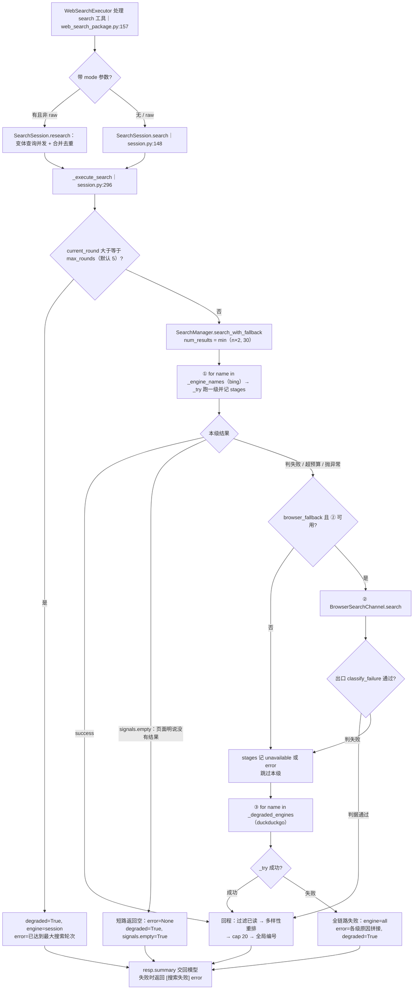

## 时序

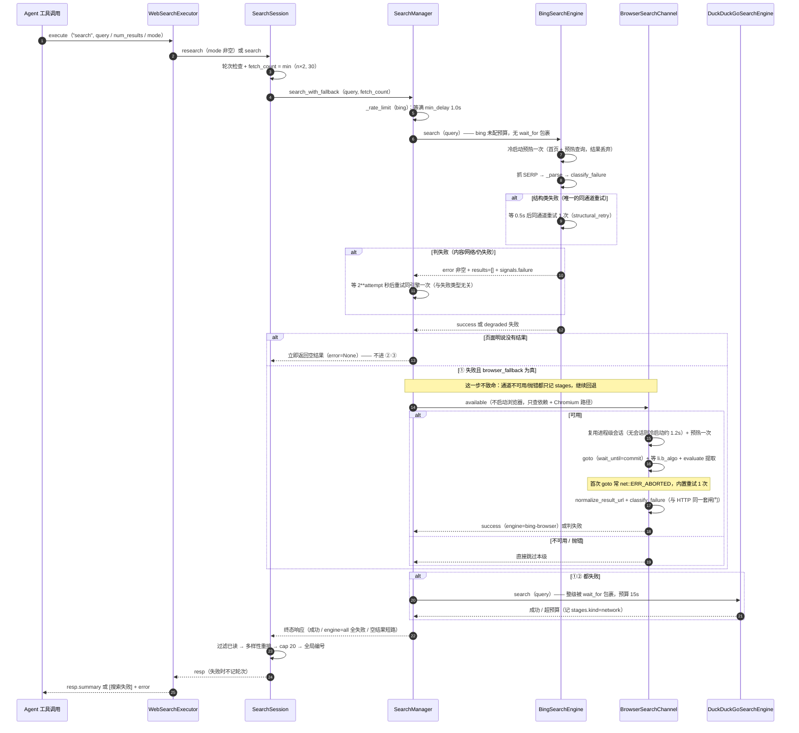

## 细节

### 三级链路：`search_with_fallback` 的每一级、每个判据、每个短路

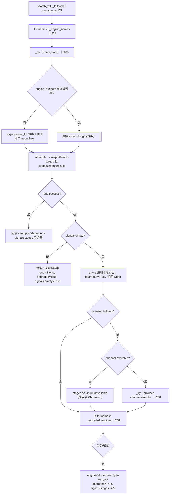

* 级别的名字就是 `stages` 里的 `stage` 字段：`bing` / `browser` / `duckduckgo`，
  `kind` 取 `signals.failure`（`ok` / `network` / `structure` / `content` / `empty`），
  没有 `failure` 时退化成 `ok` 或 `unknown`，还有两种链路自造值 `unavailable` / `error`。
* **预算只对该级的整段调用生效**：`engine_budgets["duckduckgo"]=15.0`（`session.py:116` 兜底），
  它包住的是 `self.search(...)`（含 manager 层重试与退避），不是单次 HTTP。
* 浏览器级的 `try/except Exception`（`:253`）是**唯一**兜住"本通道抛错"的地方；
  引擎级的 `_try` 只捕 `TimeoutError`，其它异常会穿出整条链路（见易错点）。
* `num_results` 由调用方决定：普通搜索是 `min（n×2, 30）`，research 的主查询是原值、变体是 `min（6, n）`。

### 校验闸门：C1/C2/C3 的每个阈值与四条硬信号

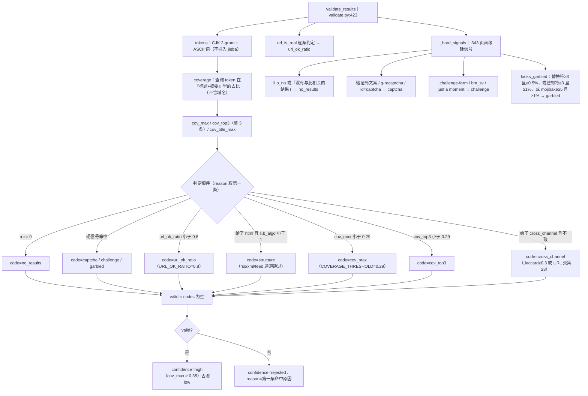

* 阈值来自 `reference/threshold_calibration.json`（393 条样本，放行错配 12 / 误杀正常 4）：
  BAD 样本最高 0.25、GOOD 最低 0.333，所以 **0.29** 是"两侧都留余量"的取值，不要照抄到别的场景。
* 其它数字常量：`SHELL_BODY_MAX=5000`（JS 跳转壳必须"短"才判壳）、
  `EMPTY_BODY_MAX=500`（0/47/95/141 字节的实测失败样本），
  `visible_text` **先剥 script/style/noscript/template** —— 否则 Bing 页里的
  `challenges.cloudflare.com` 会把每一页都判成挑战页（10 份夹具全中）。
* `_row_text` 只用标题 + 摘要，**故意不含域名**：英文查询里 host 会平白贡献 token 造成假放行。
* JS 跳转壳判据必须"短 + 含跳转标记"同时成立：302KB 的正常页正文里也有 `function l()`。

### 失败分级：`FailureKind` 五类 → `FailureClass` 的两种处置

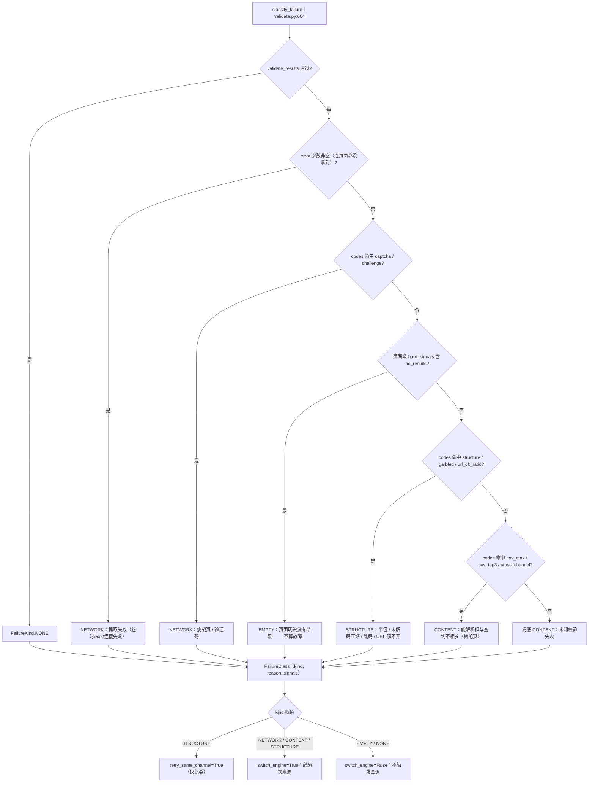

* 判据的**顺序**是修复的核心：`page_says_empty` 必须排在结构类之前，
  否则"0 结果"页必然带 `structure`（`li.b_algo=0`）会被误判成结构故障，白跑一次重试与整条回退。
* `EMPTY` 的识别口径是**页面级硬信号**（`li.b_no` / 无结果文案），不是 `n == 0`：
  实测给一个"空壳 html"（无 `li.b_no`、无无结果文案）且 `results` 为空时，
  codes 是 `["no_results","structure"]`、hard_signals 是 `[]` → 判 **STRUCTURE**
  （值得重试一次），而不是 EMPTY。**这是刻意的**：区分"页面说没结果"与"我们什么都没解析到"。
* 实测依据：同通道退避重试 3 次对内容类失败自愈 **0/21**（`fix(9)` 附录 B v2 §1），
  所以内容类只换通道/换身份；网络类（挑战页）重试只会加深风控。
* `retry_same_channel` 只是"允许重试"，是否真重试由调用方按预算决定 ——
  目前唯一的调用方是 `BingSearchEngine.search`。

### 单引擎重试：`SearchManager.search` 的两层尝试与退避

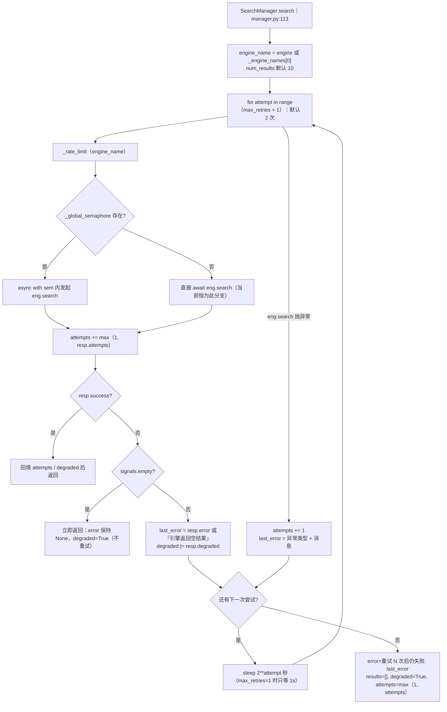

* **严格成功语义**（`models.py:58`）：`success = error is None and bool(results)`。
  "有 10 条结果但判失败"（`error` 非空）也走回退分支 —— 这是 `fix(9)` D3 的核心修正，
  旧实现"error is None 就算成功"会让重试与 DDG 兜底**从不触发**。
* 退避写的是 `2**attempt`（注释里写 1s/2s/4s），因为 `range(max_retries+1)` 只有 2 轮，
  默认配置下实际只可能等 **1s**。
* **重试与失败类型无关**：内容类失败在 manager 层照样重试一次；
  "内容类不重试"只体现在引擎内部（Bing 只在 `FailureKind.STRUCTURE` 时自己重试，
  `engine.py:186`）。两者叠加 → 单次查询最多 4 次 HTTP（见易错点）。
* `attempts` 是三层累加的：引擎内部次数 → manager 每级累加 → `_try` 再把本级的
  `resp.attempts` 加进总 `attempts`；超预算分支只 `+1`。

### 限速与并发：per-engine 锁让 `min_delay` 在并发下才真正生效

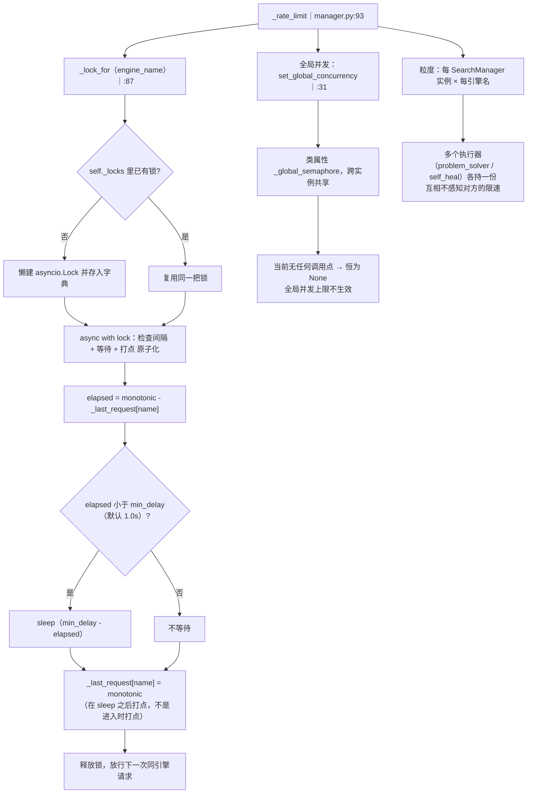

* 没有这把锁时并发调用会**同时**通过 `elapsed` 检查，`min_delay` 形同虚设 ——
  这是 `fix(9)` D3 修掉的老问题，回归测试是
  `app/tests/modules/web_search/test_manager_fallback.py::test_rate_limit_lock_is_effective_under_concurrency`。
* `min_delay` 默认 **1.0s**，`SearchSession` 从不覆盖它；`_last_request` 是
  `defaultdict(float)`，新引擎名的首次 `elapsed` 等于 `monotonic()` 本身（必然远大于 1.0）→ 不等待。
* 限速发生在**每次尝试之前**（`manager.py:134` 在重试循环内），所以重试也要重新排队等 1s；
  再叠加退避的 1s，一次失败重试的最短耗时约 2s。

### 浏览器通道（上）：可用性判定、Chromium 回退链、进程级会话复用

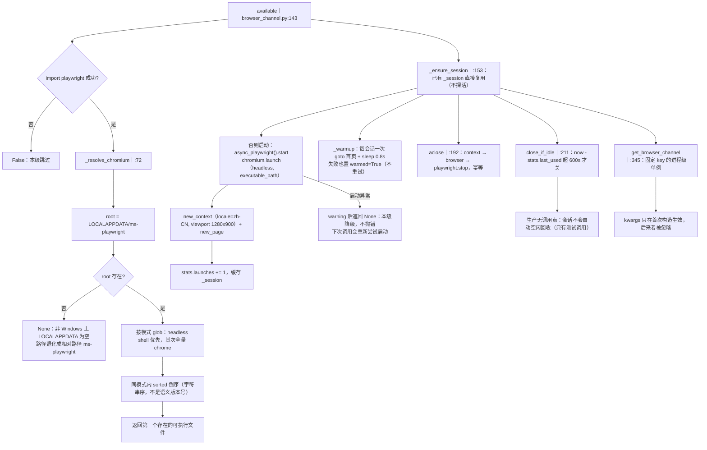

* `available()` **不启动浏览器**、不产生副作用，但每次都重新 glob 磁盘（不缓存结果）。
* `_resolve_chromium` 的第 2、3 条模式（linux64 / mac）实际永远走不到：
  `Path(os.environ.get("LOCALAPPDATA","")) / "ms-playwright"` 在 Linux/macOS 上是**相对路径**。
* 单例第一次构造决定 `timeout_seconds`：生产路径是 `SearchSession._build_browser_channel`
  先建（8.0s），manager 里的 `get_browser_channel()` 只是取回同一个对象。
* 会话不探活：`_ensure_session` 只判 `self._session is not None`，
  崩溃的 context 会在下一次 `goto` 抛错 → 该次检索判失败（不会自动重建，v2 §2.4 说的"重建一次"未实现）。

### 浏览器通道（下）：一次检索的动作序列与出口判据

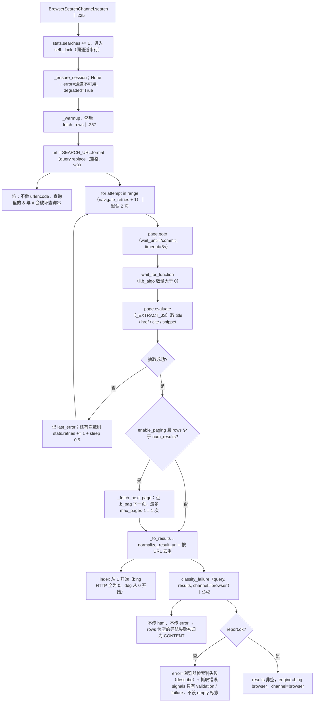

* 仿真结论（v2 §10）：可用性 12/12、冷启动约 1.2s、复用后单次约 1s、壳 URL 0 条；
  **除首次外每次都需要 1 次导航重试**（首次 `goto` 大概率 `net::ERR_ABORTED`），所以重试必须内置。
* 提取用页面内 JS：`li.b_algo` 里的 `h2 a`（浏览器已解壳，`a.href` 就是真实地址），
  摘要取 `.b_caption p / .b_captions / p`，`cite` 同时当 `site_name`。
* 去重键是 `display.split("#")[0].lower()`，**不是** HTTP 引擎用的 `normalize_for_dedup`
  （不去 `www.`、不剥跟踪参数）—— 同一篇文章在 `www.` 与裸域两个 shell 下不会被浏览器通道合并。
* 出口只做 `classify_failure`（内部调 `validate_results`，**不传 html**）→ 没有 C1 的 `li.b_algo` 判据，
  页面级硬信号也失去主要来源（`li.b_no`、DOM 挑战标记都读不到），只剩"标题+摘要"这一路文本；
  渲染失败时 `rows` 为空 → `scan_text` 为空 → 硬信号必然为空，EMPTY 判不出来。

### SearchSession：轮次、`fetch_count`、去重、多样性重排、全局编号

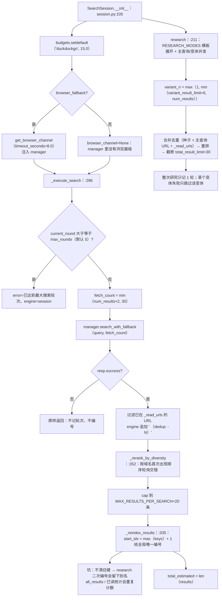

* 轮次上限是**先检查后消费**：`_execute_search` 在开头判 `current_round >= max_rounds`，
  `research` 的每个变体也各自过这一关；`search` 只在成功时 `append(SearchRound)`，
  失败的轮次不计数（模型可以重试）。
* `fetch_count = min(num_results×2, 30)` 是给"过滤已读 + cap 20"留的余量：
  工具层把 `num_results` 夹在 1..30（`preview_pages_limit`），所以 `fetch_count` 的取值范围是 2..30。
* 多样性重排是**确定性**的：按域名首次出现顺序建桶，然后每轮回各桶取第一条（`pop(0)`）。
  实测 `[a/1, a/2, b/3, c/4, b/5]` → `[a/1, b/3, c/4, a/2, b/5]`。
* `read` 才是"消费"结果的地方：只取 `content_fetched=False` 的，
  SSRF 校验（`validate_public_url_async`）→ 非文本 content-type 拒绝 → 跳转壳 / 空正文 / 乱码
  一律 `content_fetched=False`，成功才写 `_read_urls`（后续轮次据此过滤）。

### 引擎注册表与配置接线：`[web_search]` 段到运行时的每一步

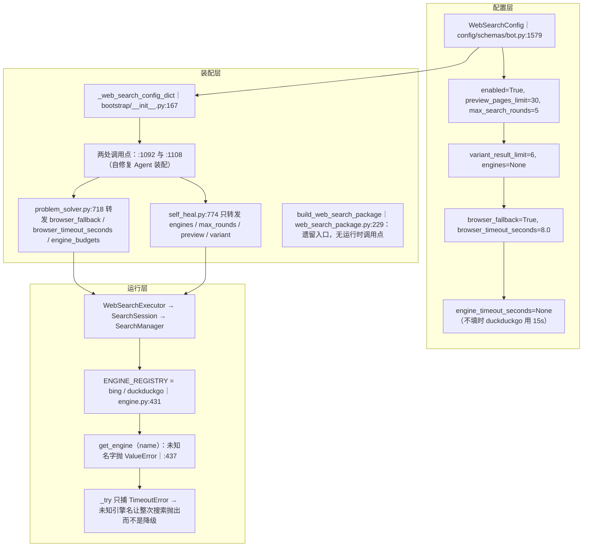

* `_web_search_config_dict` 的注释记着 `fix(9)` F5：此前两处调用点硬编码 `{}`，
  导致 `[web_search]` 段是**死配置**（引擎顺序、浏览器兜底、预算都改不动）。
* `WebSearchConfig.engines=None` 是默认值，`_web_search_config_dict` 把它补成
  `["bing","duckduckgo"]`；`SearchManager` 再把 `duckduckgo` 抽到最后一级。
* Bing 引擎**没有**配置入口：`get_engine(name)` 不带 kwargs，
  所以 `timeout=15.0`、`market=zh-CN`、`setlang=zh-Hans`、`warmup=True`、
  `structural_retry=True`、`structural_retry_delay=0.5` 全是硬编码默认值。
* 已知的反直觉接线事实：`self_heal` 的执行器拿得到 `engines`，但拿不到
  `browser_timeout_seconds` / `engine_timeout_seconds`（`:774` 那处没转发），
  于是自修复链路用默认 8s 浏览器超时 + `session.py` 兜底的 DDG 15s。

### 失败终态：空结果短路、`degraded + error`、以及观测点在哪

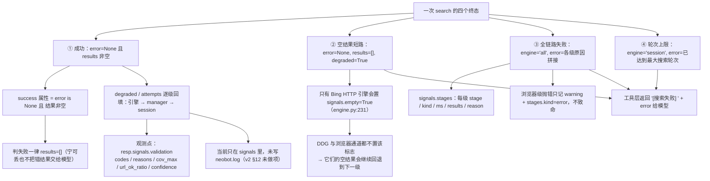

* ② 是**唯一**"成功语义为 False 但不是故障"的终态：`error=None`、`results=[]`、
  `degraded=True`、`signals.empty=True`，且**不写轮次**（`search` 里 `resp.success` 为 False）。
* ③ 的 `error` 是各级原因用 `"; "` 拼接，形如
  `bing: 结果校验失败（cov_max: 相关性不足：cov_max=0.12 < 0.29）; browser: ...`；
  浏览器级异常只留 `logger.warning`，不进 `errors`（只在 stages 里）。
* 观测第一手线索的顺序：`resp.signals["stages"]`（走了哪几级、每级多久、几条结果）
  → `resp.signals["validation"]`（判据明细）→ `resp.error` → `resp.attempts` / `resp.degraded`。
* 终态无出边：告警不会升级、不重试整条链路；
  `SearchSession` 也不为失败轮次保留任何状态（`_rounds` 不追加）。

### URL 归一化闸门：跳转壳、跟踪参数、去重键三件事

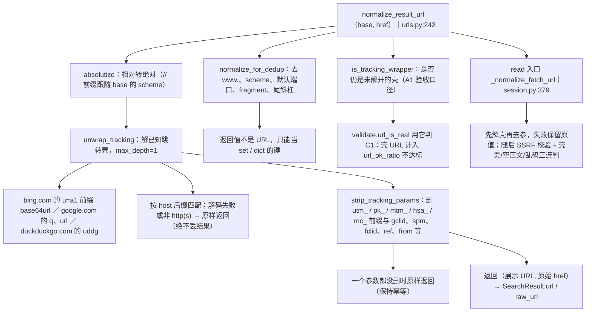

* 三个引擎的出口都走这一层：Bing HTTP 在 `_parse` 里调（`engine.py:306`）、
  DDG 在结果落库时调（`engine.py:364`）、浏览器在 `_to_results` 里调（`browser_channel.py:319`）。
* `raw_url` 保留页面原始 href：展示 URL 里不应再出现 `ck/a` 壳，
  但排障时要能回看壳里到底装了什么。
* 只解**一层**壳（`max_depth=1`）：真实夹具里壳不嵌套；超过深度仍返回当前值，
  由 `url_is_real` / C1 兜底 —— 解不开就判失败，而不是把壳交给模型。
* 跟踪参数表是**枚举**不是正则穷举：新出现的 `utm_*` 变体会自动被前缀规则吃掉，
  新出现的第三方参数需要手工加进 `_TRACKING_EXACT`。

## 关键状态

| 状态 | 谁置位 | 谁清理 | 失败时停在哪 |
|---|---|---|---|
| `_last_request[engine]`（限速时间戳） | `_rate_limit` 在 sleep 之后打点 | 无（随 `SearchManager` 实例消亡） | 该级超预算 → stages 记 `network`，本级放弃 |
| `_locks[engine]`（per-engine 互斥锁） | `_lock_for` 懒建 | 进程内不清理 | 持锁等待被超时取消 → 本级判失败 |
| 类属性 `_global_semaphore` | `set_global_concurrency`（**当前无调用点**） | 无 | 恒为 None：全局并发上限不生效，只有 per-engine 限速 |
| Bing 持久 client + `_warmed`（连接与 Cookie） | `_get_client` 懒建并在首次预热后置位 | `aclose`（经 `SearchManager.aclose`） | 关闭失败只记 debug 日志，不抛错 |
| 浏览器会话单例 `_CHANNELS[web_search.browser_channel]` | `get_browser_channel` 首次构造 | `reset_browser_channel`（测试）或 `aclose` | 启动/导航失败 → 本级降级，回退继续 |
| `stats.last_used / launches / navigations / retries` | 通道内部计数 | 随实例消亡；无空闲回收定时器 | 启动失败不计 `launches`；重试计入 `retries` |
| `SearchSession._rounds` | 成功的 `search` / `research` 追加 | `WebSearchExecutor.reset` 丢弃整个会话 | 失败响应不记轮次；轮次满则直接返回错误 |
| `_results_index`（全局编号） | `_reindex_results`（`start_idx = max(keys)+1`） | 只有重建 session | research 二次编号不清旧键 → 别名字段重复计数 |
| `_read_urls`（已读集合） | `read` 中 `content_fetched=True` 的 URL | 重建 session | 壳页/空正文/乱码/SSRF 拦截都不置位，也不进集合 |
| `resp.degraded / attempts / signals.stages` | 引擎置初值，manager 逐级回填 | 无（随响应对象） | 这是排障第一现场，但**没有**落盘到日志 |

## 易错点

* **"内容类失败不重试"只对引擎内部成立**：`SearchManager.search` 的重试与失败类型无关，
  所以 Bing 内容类失败实际会打 2 次请求；结构类失败叠加引擎内的 `structural_retry`
  最多打 **4 次** HTTP —— 与 `fix(9)` 附录 B v2 §6 的 A10「HTTP ≤2 次」不符。改这里前先确认要不要一起收敛。
* **`signals.empty` 短路只有 Bing HTTP 引擎会置位**（`engine.py:231` 显式写 `"empty": True`）；
  DDG 与浏览器通道都不设该键，所以"页面明说没有结果"在 ② ③ 两级会被当成普通失败继续回退。
  浏览器通道尤其明显：`classify_failure` 不传 html、抓取失败时 `rows` 也为空 → `scan_text` 为空
  → 硬信号必然为空，EMPTY 永远判不出来。
* **浏览器通道把抓取失败归成内容类**：`browser_channel.py:242` 调 `classify_failure` 时
  **没有传 `error`**（导航失败的 `last_error` 只拼进错误文案），于是 `rows=[]` 走
  `n == 0 → no_results`、无硬信号 → 落到兜底分支 `CONTENT`。排查"浏览器明明超时却说错配页"时看这里。
* **浏览器级没有整级预算**：`engine_budgets` 里只有 `duckduckgo`，
  `browser_timeout_seconds=8.0` 是 Playwright 单次 `goto` / `wait_for_function` 的超时。
  冷启动 + 预热（8s 超时）+ 导航重试（2 次 × 8s + 0.5s）+ 翻页最坏情况远超 8s。
* **`_resolve_chromium` 只认 `LOCALAPPDATA/ms-playwright`**：非 Windows 上这个环境变量为空，
  root 退化成相对路径，linux64 / mac 的通配符永远匹配不到 → `available()` 恒 False，
  链路直接跳过浏览器级（不会报错，只是静默少一级）。
* **`get_browser_channel` 的 kwargs 只在首次生效**：单例 key 固定，后来者传的
  `timeout_seconds` 被静默忽略；测试里要 `reset_browser_channel()` 才能换参数。
* **未知引擎名会让整次搜索抛出**：`get_engine` 抛 `ValueError`（`engine.py:441`），
  而 `_try` 只捕获 `asyncio.TimeoutError` → 异常穿出 `search_with_fallback`、穿出
  `SearchSession`，最终变成工具层的 `[错误]` 而不是 `degraded` 响应。配置写错引擎名的表现就是它。
* **两个引擎列表的边界**：`engines=["duckduckgo"]` 时该名字同时进 `_degraded_engines` 与
  `_engine_names`（`or list(names)` 兜底）→ ① ③ 各跑一遍，DDG 被请求两次；
  `engines=[]` 不回落默认值 → `primary_engine` 抛 `IndexError`，回退返回 `所有引擎均无结果`。
* **浏览器查询串没做 urlencode**：只把空格换成 `+`，查询里出现 `&` 会被当作参数分隔符、
  `#` 会截断。HTTP 通道走 httpx 的 `params`，没有这个问题。
* **`research` 的二次编号会留别名**：`_reindex_results` 只加键不删旧键。
  实测 4 条结果经两次编号后 `_results_index` 有 7 个键、`all_results` 返回 7 项（对象重复），
  `get_summary_for_agent` 的已读/未读统计随之偏大。用编号做外部引用时注意。
* **三处 `index` 起点不同**：Bing `_parse` 全部写 0、DDG 从 0 递增、浏览器从 1 递增，
  只有 `SearchSession._reindex_results` 之后的编号才是可引用的全局编号；
  直接拿引擎响应的 `index` 回传给模型会错。
* **别把遗留入口当有效链路**：`build_web_search_package` 无运行时调用点，
  真实的两个执行器是 `agents/problem_solver.py:718` 与 `agents/self_heal.py:774`；
  后者不转发浏览器与预算配置，两条链路的兜底行为**默认值相同、配置覆盖不同**。
* **预热是纯开销不是结果来源**：Bing 客户端首次使用会打两次请求（首页 + `neobot warmup` 查询），
  结果全部丢弃（`engine.py:148`）；看到日志里多出来的请求不要当成用户查询。
* **限速是实例级**：`_last_request` 与 `_locks` 都在 `SearchManager` 实例上，
  多个执行器（回复工具、解题 Agent、自修复）各持一份，互相不知道对方刚打过同一个引擎。
