# 11 小游戏：命令/关键词/工具三入口 · 认人窗口 · 积分账户 · 卡片渲染与降级

## 范围

**画什么**：`app/src/neobot_app/builtin_plugins/minigame/` 这一整个插件 ——
`__init__.py` 的三条入站路径（`/mg` 命令、关键词意图、`minigame__*` 工具）、
`service.py` 的六张表与积分账户写入语义、`games/*.py` 四个玩法的判据与阈值、
`themes.py` / `avatars.py` 的卡片主题与头像注入、文件末尾四个对外能力
（`points.get` / `points.add` / `points.rank` / `points.describe`）。

**不画什么**（指向相邻图）：

| 相邻内容 | 去哪张图 |
|---|---|
| 卡片渲染器本体（HTML 模板、slot/marker 注入、Chromium 截图端口） | 13-render-cards |
| 插件加载 / 热重载 / 能力调用机制（`require_plugin` / `handle.call`） | 08-plugins（08b-plugin-runtime） |
| 命令注册、权限树、群聊需被 @ 才走命令 | 17-commands |
| 头像存储本体（`avatar_store` 服务） | 20-avatar-files |
| 被 @ 时跳过等待的关键词快照 | 02b-willing-probability |

**spec 与现实的三处差异**（都在 `docs/04-功能文档/小游戏.md` 末尾登记为 WIP）：

1. **工具通道不发卡**：7 个工具都只返回文本，没有「已渲染好卡片、请发给用户」的句柄；
   全仓库 grep `minigame__card` 为 0 命中 —— 这个工具**不存在**，发卡只在命令入口发生。
2. `/mg help` 与 `/mg help <游戏>` 直接返回纯文本、不出图（`help_command`:873）。
3. `bottle_show_sender_id` 读得到但**未接线**，普通瓶一律显示 QQ 号（`config.py:36`）。

## 流程

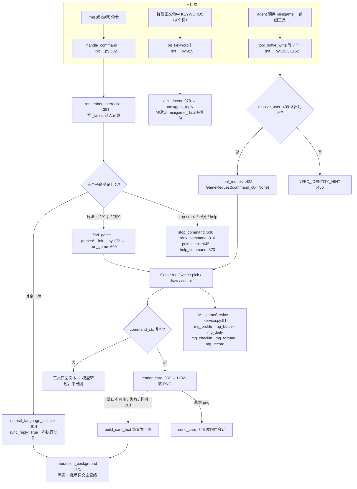

## 时序

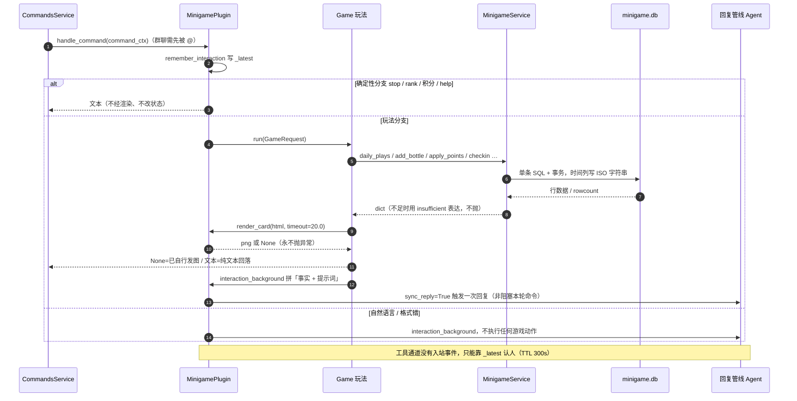

## 细节

### 三条入口如何汇到同一个 service

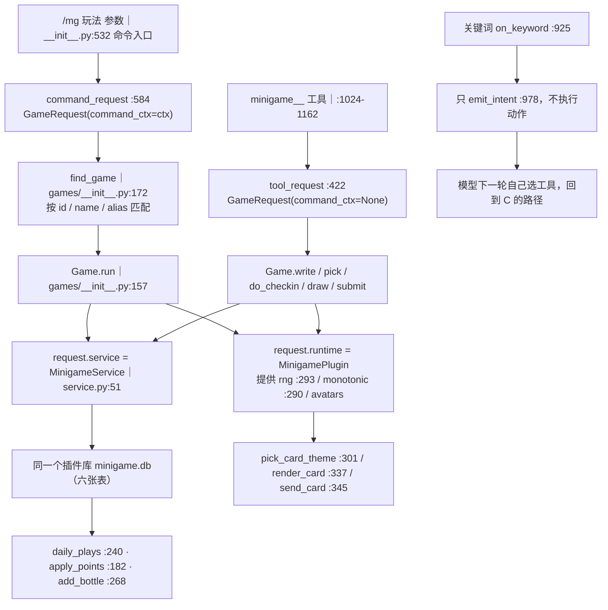

三条入口共用同一个 `GameRequest` 与同一个 `MinigameService` 实例：
`MinigamePlugin.load`:243 只构造一次 service，工具与命令都从 `_runtime()`:1014 拿同一个
单例插件对象（模块级 `_instance = MinigamePlugin()`:1011）。
唯一的结构差异是 `command_ctx`：它是「能不能发图」的总开关（`None` = 工具通道）。
关键词入口**刻意不执行任何动作**（R14/D11），只把控制权交回主管线。

### 工具通道认人：_latest 单槽 + 300 秒窗口

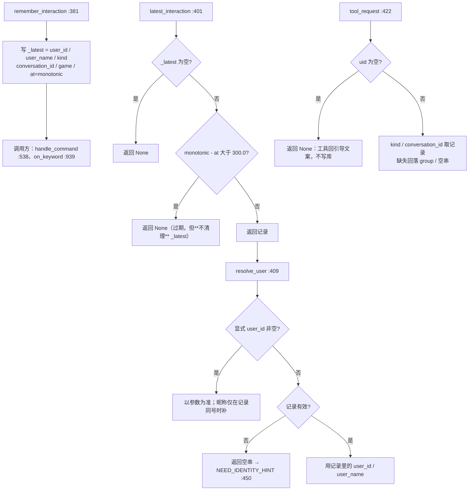

`INTERACTION_TTL_SECONDS = 300.0`（`__init__.py:72`）只作用于**工具通道认人**：
工具调用没有入站事件，这是唯一的身份来源。它和成语接龙的 60 秒步时限、
签到的自然日边界**没有任何关系**（三个不同时钟：monotonic / 本地日期 / 无）。
`_latest` 是**全局单槽**（不按用户、不按会话分桶）：A 用户刚说完话、B 用户的
agent 会话再调工具，认到的是 A —— 所以工具参数里才有可选的 `user_id` / `user_name`。

### 积分账户 apply_points：不足整笔不生效

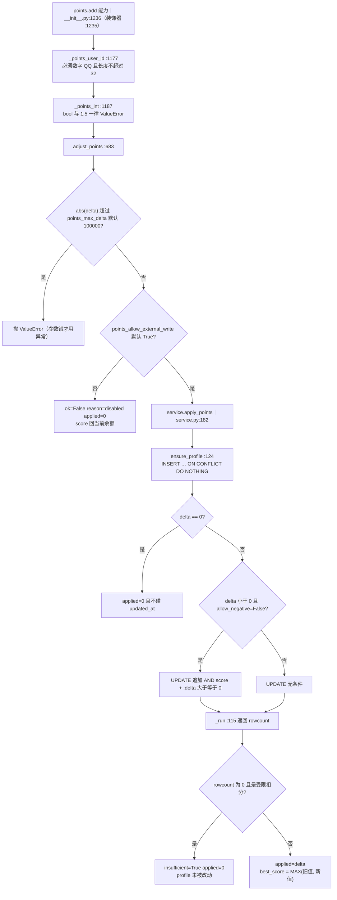

* 判据全在 SQL 里：`score + :delta >= 0` 是 WHERE 条件，因此**并发下也扣不成负数**，
  不需要额外锁；影响行数为 0 就是 `insufficient`。
* `play` / `win` 也写在这条 UPDATE 里，所以**失败整笔不生效时场次、胜场都不累加**。
* `add_score`:151 没有这个保护（它只被本插件用正分调用）：传负分可以把余额写成负数 ——
  其它插件**不要**绕过 `points.add` 直接调它。
* `best_score` 只升不降（`MAX(旧值, score + delta)`），扣分不会回退历史最高分。
* 返回体里 `delta` 是「请求值」、`applied` 是「实际生效值」，余额不足时两者不等，调用方看 `ok`。

### 签到：自然日边界、连续附加与并发幂等

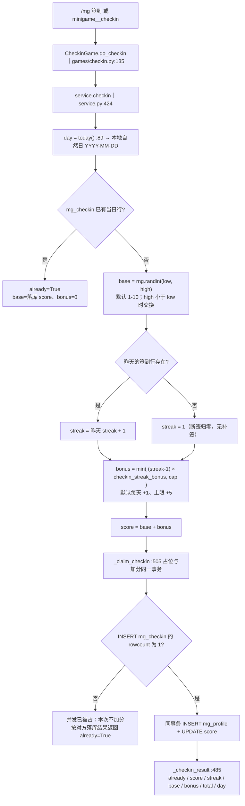

幂等的**唯一判据是 INSERT 的 rowcount**，不是事务外读到的 `existing` ——
后者正是「并发重复记账」的历史根因（`service.py:508-512` 的注释）。
随机源是注入的 `rng`（与抽签共用同一个 `random.Random` 实例，种子可测）。
返回值里的 `streak` 与 `score` 永远是**落库事实**，即使本次是重复签到。

### 抽签：档位权重、当日幂等与未知 key 回落

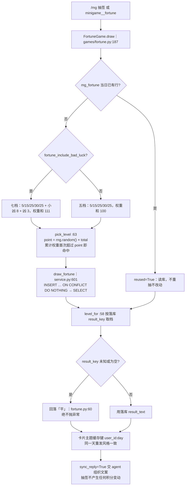

权重是**插件常量**（`fortune.py:34-46`），只有「是否含凶兆」可配。
末档兜底是 `table[-1]`（七档时是「凶」），与 `level_for` 的回落档「平」**不是同一个**：
落库 key 损坏时永远显示「平」，不会突然变成「凶」。
随机源是 `request.runtime.rng()`，与签到、接龙目标共用一个实例。

### 排行榜、流水与清理节流

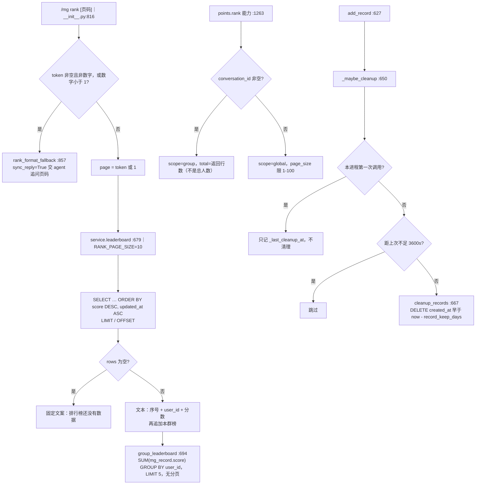

全球榜的 `total` 是 `mg_profile` 的**行数**，而 0 分行会被查询接口惰性创建
（`ensure_profile` 由 `get_profile` / `points` 触发），因此「查过积分」也会进榜尾。
发瓶 / 捞瓶写入 `mg_record.game_id` 的是 `bottle:send` / `bottle:pick`（`service.py:27-28`），
**不是** `bottle` —— 按玩法聚合流水时要留意这个口径。
清理只在 `add_record` 之后触发，且**进程启动后的第一个小时不清理**（A25 的 SQL 审计口径）。

### 漂流瓶发瓶：四道校验后才写库

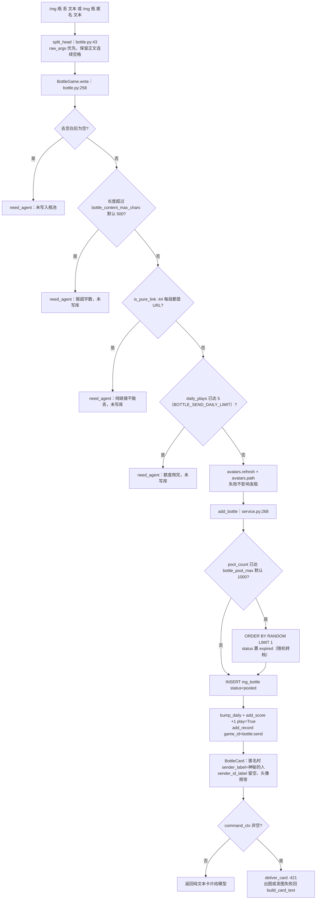

四道校验**都在写库之前**，命中任意一条都只走 `need_agent`（命令通道置 `sync_reply`，
工具通道返回「事实 + 提示」文本），瓶池、每日计数、积分三者一个都不动。
`add_bottle` 返回的 `archived_id` 只在真的转档成功时非空（`service.py:296`）；
注意它随后用 `ORDER BY id DESC LIMIT 1` 取新瓶 id —— 并发发瓶时这不是本条的 id。
发瓶积分 +1（`BOTTLE_SEND_SCORE`），`play=True` 让 `plays` 加 1，`wins` 不加。

### 漂流瓶捞瓶：排除、回落与 5 次重试

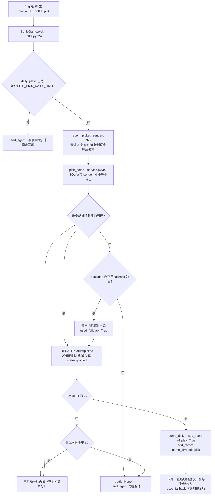

排除表是「SQL 先 LIMIT 3 行、再 Python 去重」，所以**实际排除的不同发送者可能少于 3 个**。
回落路径只去掉「最近 3 位发送者」，**仍然排除自己**。
捞瓶无冷却：连捞只受每日 5 次限制。
第 5 次重试仍被并发抢走时会返回 `bottle=None`，用户看到的是「空池」——
池子可能并不空，这是并发下的已知语义。

### 成语接龙对局态：进程内字典的生命周期

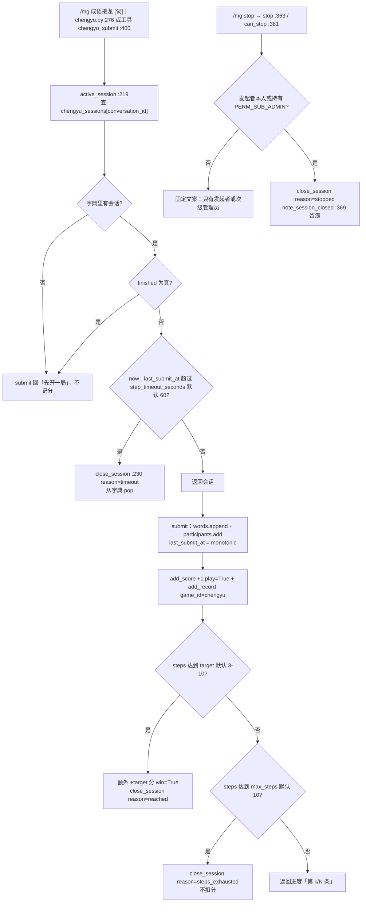

* 会话态**只在内存**（`MinigamePlugin.chengyu_sessions`:203），`unload`:273 清空；重启即无局。
* 超时**不是定时器**：只有下一次有人交互时 `active_session` 才发现过期并关局；
  没人再来，这条会话就一直躺在字典里。
* `submit` **不校验内容**（是否成语、接不接得上、是否重复全交 AI），也不校验提交者是不是参与者 ——
  `participants` 只记录、从不参与判定与计分。
* 命令入口报一个词时也只出「待判定」卡片并请 AI 判定；AI 不调工具就**什么都没记**。
* `can_stop` 里「工具通道（`command_ctx is None`）一律放行」的分支目前**没有调用方**：
  没有 stop 工具，`stop` 只被命令路径调用。

### 卡片渲染：主题选择、20 秒超时与三种降级

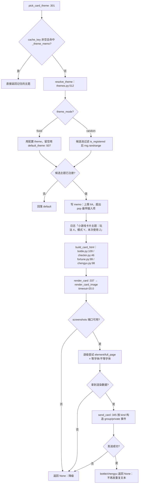

**三种降级要分清**：

| 玩法 | 渲染或发送失败时用户看到什么 |
|---|---|
| 漂流瓶 | `deliver_card` 返回 `build_card_text`，由命令通道当固定文本发出 |
| 成语接龙 | `deliver_card` 的返回值被 `run` / `stop` **丢弃**，用户只看到 agent 组织的那句话 |
| 签到 / 抽签 | 命令通道根本不调 `build_card_text`：只出图，文案一律由 agent 说 |

主题随机源是独立的 `_theme_rng`（`__init__.py:210`），**不消耗**玩法随机数
（签到分数 / 抽签档位 / 接龙目标）。`_theme_memo` 是 FIFO（`pop(next(iter(...)))`），不是 LRU。
签到 / 抽签用 `user_id:day` 作 cache_key，所以当天重复请求是同一张图；漂流瓶与接龙不缓存。

### 跨插件积分能力：四个接口的契约与错误语义

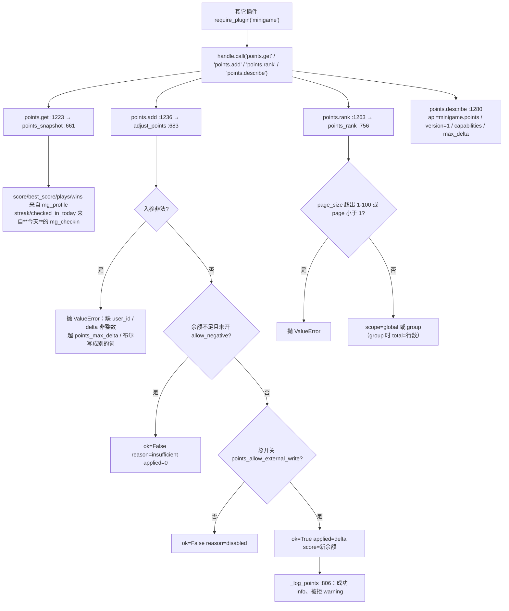

契约的分界：**可预期的业务结果一律用返回值**（`ok` / `reason`），
**参数或环境错误才抛异常**（`ValueError`；插件未加载时 `require_service`:654 抛 `RuntimeError`）。
`points.get` 的 `streak` 语义容易误读：它读的是**今天**那一行，
所以「昨天连签 5 天、今天还没签」查到的是 `streak=0` 且 `checked_in_today=false`。
写入口只有 `points.add` 一个，且**不对模型暴露**（没有加减积分的工具）。

## 关键状态

| 状态 | 谁置位 | 谁清理 | 失败时停在哪 |
|---|---|---|---|
| `_latest` 认人记录 | `remember_interaction`:381（命令 :538、关键词 :939） | 无人清理，只被下一次覆盖；过期只在读时判定 | `resolve_user` 认不出人 → 工具回 `NEED_IDENTITY_HINT`，不写库 |
| `_theme_memo` 主题记忆 | `pick_card_theme`:301（带 cache_key 时） | 超过 64 条 pop 最早插入项；`unload`:275 | 主题解析失败回落 `default`，不影响出图 |
| `chengyu_sessions` 对局态 | `start_session`:343 | `close_session`:230（timeout / reached / steps_exhausted / stopped）与 `unload`:273 | 过期只在有人再次交互时惰性关局；关局后字典无该会话 |
| `_closed_sessions` 关局留痕 | `note_session_closed`:369 | **无人清理**（`unload` 也不清），纯内存 | 只影响内存占用，不落库、不影响玩法 |
| `_keyword_hits` | `on_keyword`:946 | **无人清理** | 仅测试与观测用 |
| `mg_daily.plays` | `bump_daily`:247 | 跨日自然失效（主键含 day） | 达到 5 次时不写库、转 `need_agent` |
| `mg_checkin` 当日名额 | `_claim_checkin`:505 的 INSERT rowcount=1 | 跨日新行（旧行保留） | rowcount=0 表示并发已被占，本次不加分 |
| `mg_fortune` 当日结果 | `draw_fortune`:601（ON CONFLICT DO NOTHING） | 跨日重抽 | 已存在只读库重发，绝不覆盖 |
| `mg_bottle.status` | `add_bottle`:298 写 pooled；`pick_bottle`:382 写 picked；池满转档写 expired:293 | 没有任何 DELETE | 全程软删；捞取并发冲突重试 5 次后回「空池」 |
| `mg_profile.score` | `add_score`:151 / `apply_points`:182 / `_claim_checkin`:551 | 只由 `points.add` 的负 delta 减少 | 扣分不足整笔不生效（`insufficient`） |
| 卡片 PNG | `render_card`:337，一次一图 | 无状态 | 返回 `None` → 纯文本或交 agent（见表） |

## 易错点

* **300 秒是「工具认人窗口」，不是对局时限**：`INTERACTION_TTL_SECONDS`:72 只影响
  「工具调用认哪个用户」；对局时限是 `chengyu_step_timeout_seconds`（60 秒）。
  两者都过期时表现完全不同：前者回引导文案，后者关局并留痕 `timeout`。
* **`_latest` 是全局单槽**：多用户/多群并发用工具时会串人。要精确定位必须显式传 `user_id`；
  显式传了 id 但没传名字时，昵称只在「记录同号」的情况下才补。
* **每日上限 5 + 5 是模块常量**（`service.py:31-32`），不是配置项 ——
  想改额度只能改代码，面板里找不到。
* **上限判定是 check-then-act**：`daily_plays` 读 → 之后才 `bump_daily` 写，
  并发发瓶/捞瓶可以越过 5 次（签到用 INSERT rowcount 做到了真幂等，瓶子没有）。
* **`add_bottle` 的新瓶 id 是「表里 id 最大的行」**（`service.py:319`），
  并发下可能取到别人的 id；它只用于内部返回值，不参与业务判断，但不要拿它当审计依据。
* **`apply_points` 与 `add_score` 语义不同**：前者是给外部的安全写入口（整笔生效/整笔不生效），
  后者无任何保护；本插件内部一律用 `add_score`，因为它只写正分。
* **`streak` 在查询接口里等于「今天签到行的 streak」**：今天没签到就是 0，
  哪怕昨天已经连签 5 天；不要把它当成「历史最长连续」。
* **抽签权重和不是 100**：开凶兆后是 111，`pick_level` 用累计权重比较，本身没问题；
  但 `level_for` 的未知 key 回落是「平」，不是档位表最后一档「凶」。
* **成语接龙超时不主动关局**：没有定时器，`active_session` 只在被调用时判过期；
  `_closed_sessions` 与 `_keyword_hits` 只增不减，长跑进程里是缓慢的内存增长。
* **`deliver_card` 的纯文本回落有两个消费口径**：漂流瓶会把它发给用户，
  成语接龙把它丢掉（用户只看到 agent 的话）。改这块时别把「有返回值」当成「用户看得到」。
* **签到 / 抽签的命令通道不发降级文本**：渲染失败时用户只看到 agent 的回复，
  这是刻意的（`games/checkin.py:195`、`games/fortune.py:230` 的 `sync_reply` 语义），
  不要照抄 `bottle` 的降级写法以为它坏了。
* **`/mg help` 不出图**、`/mg help <未知玩法>` 回固定文案（`help_command`:873），
  这是唯一一处「格式错却不走 agent 追问」的分支 —— 与 `rank` / 玩法的处理哲学不一致（W4）。
* **排行榜与流水的口径**：全球榜排序是 `score DESC, updated_at ASC`（并列时先修改的在前）；
  本群榜是 `SUM(mg_record.score)`，而发瓶/捞瓶写的 `game_id` 是 `bottle:send` / `bottle:pick`。
  `points.rank` 传 `conversation_id` 时 `total` 是本次返回行数，不是该群总人数。
* **群聊里 `/mg` 必须先 @bot**（`commands/service.py:158`），否则命令不会被消费 ——
  「命令没反应」的第一排查点在这里，不在本插件。
* **命令返回 `None` 表示「已自行发图，不要再发文本」**（`commands/service.py:207`）：
  漂流瓶成功出图时走的就是这条；把返回值改成空串会让用户收到一条空消息。
* **关局理由只有内存留痕**（`timeout` / `stopped` / `reached` / `steps_exhausted`），
  不写数据库；要统计「多少局超时」需要先把它落库。
