# 12 浏览器自动化：DrissionPage 会话管理 · 动作集 · per-chat-flow 生命周期

## 范围

本图覆盖 **agent-browser 这条浏览器链路**（面向"点网页"，不是"搜网页"）：

* `browser/agent_browser/manager.py`（2262 行）：`BrowserManager` —— Chromium 启动与重建、
  可执行文件解析、实例注册表、页面/标签页、100+ 个动作方法、截图/录屏、Cookie/Storage/状态持久化；
* `browser/agent_browser/actions.py`（828 行）：`AgentBrowser` —— 薄封装层，统一
  `{"success": bool, "timestamp": ...}` 结果协议；
* `browser/agent_browser/snapshot.py`（210 行）：可访问性快照与 `@eN` 引用解析；
* `browser/__init__.py`（364 行）：`BrowserAgentWrapper`（懒启动 + 后台共享锁）与
  `BrowserScreenshotBackend`（给 `ScreenshotService` 用的 Port 后端）；
* `runtime/browser_lifecycle.py`（185 行）：`BrowserLifecycleManager` —— 每个聊天流一份
  `last_access / held_until / tab_ids`，60s 后台循环回收空闲流。

**不画什么**（边界要记牢）：

| 内容 | 去哪张图 |
|---|---|
| `skills/browser_skill.py`、`browser_network_skill.py`、`browser_video_skill.py` 的工具表与 `{skill}__{tool}` 路由 | 06 工具与技能 |
| `bootstrap/_runtime.py:121 build_browser_components` 的装配细节、`application.start/stop` 的 S11/停机步 | 01 启动装配 |
| `reply/tools.py:1041` 往技能参数里注入 `pipeline_key` 的过程 | 03b 回复管线工具面 |
| `ScreenshotService` 的 HTML 准备、字体/图片等待、`html_card` 降级 | 13 渲染与卡片 |
| `web_search/browser_channel.py`（Playwright 独立驱动） | 10 联网搜索 |

**两条浏览器链路必须分清**（同仓不共用代码、不共用进程）：

| | 本图（agent-browser） | 10 图（browser_channel） |
|---|---|---|
| 驱动 | DrissionPage 的 `ChromiumPage` | Playwright `async_playwright` |
| 可执行文件 | `_find_chrome_binary()`：`CHROME_PATH` → Playwright Chromium → 系统 Chrome/Edge | `_resolve_chromium()`：只认 `%LOCALAPPDATA%/ms-playwright`，优先 `chrome-headless-shell` |
| 会话 | 持久化 user_data_dir（`DATA_DIR/browser`）+ cookies.json | 每次 launch 新 context，无 profile |
| 用途 | 模型可见的 `browser__*` 工具、HTML 截图 | Bing 第三级回退检索 |
| 失败语义 | 方法吞异常返回 `success: False` | `available()` 为假就跳过本级 |

**spec / 直觉与现实的差异**（本图逐条落到节点上，详见「易错点」）：

1. 文档（`docs/04-功能文档/浏览器.md`）说 `browser_video` 是"视频获取（解析网页中的视频地址）"，
   实现是 **GIF 录屏**（`record_start/stop/restart`），没有任何视频地址解析。
2. `agent.browser.data_dir`（默认 `./data/browser/`）**是死配置**：`build_browser_components`
   用的是全局 `DATA_DIR / "browser"`（`bootstrap/__init__.py:856`）；同理 `headless`/`port`
   在 `AgentBrowser` schema 里根本不存在，只靠 `getattr(cfg, "headless", True)` 回落。
3. `neobot open_web` 手动登录写的是 `DATA_DIR/browser/profiles/manual_login`，而运行时
   Chromium 的 user_data_dir 就是 `DATA_DIR/browser` —— 两者不是同一个 profile，
   「登录一次后续复用」并没有实现。
4. `BrowserLifecycleManager.hold()` / `release()` / `is_held()` / `active_flow_count` 全仓
   **只有测试调用**，没有任何技能或面板暴露 hold —— 「保活 2 小时」是死路径。
5. `BrowserSkill._check_lifecycle` 调用了 **不存在** 的 `BrowserLifecycleManager.should_auto_close()`；
   该方法自身零调用点，所以现在不炸。

## 流程

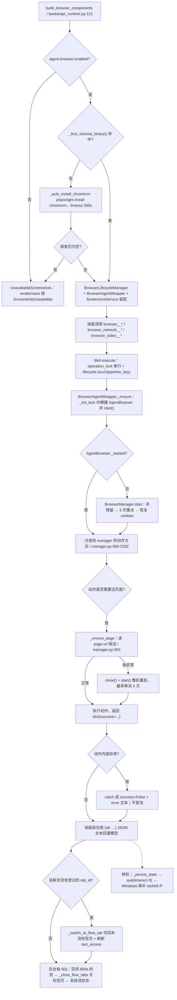

主干三句话：**装配只做对象、不启浏览器**（`_ensure` 才懒启动）；**所有动作的失败都收敛成
`success: False` 的 dict**（只有截图 Port 会抛 `ScreenshotError`）；**会话归属靠
`pipeline_key`→`tab_ids` 映射**，回收是 60s 轮询而不是引用计数。

## 时序

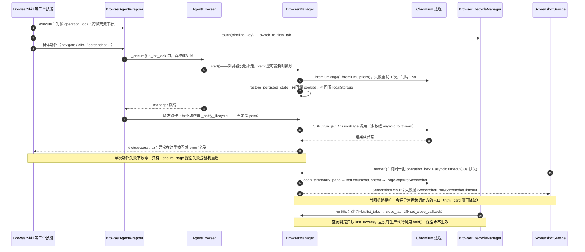

## 细节

### 三层对象：谁负责懒启动、谁负责锁、谁负责真实浏览器

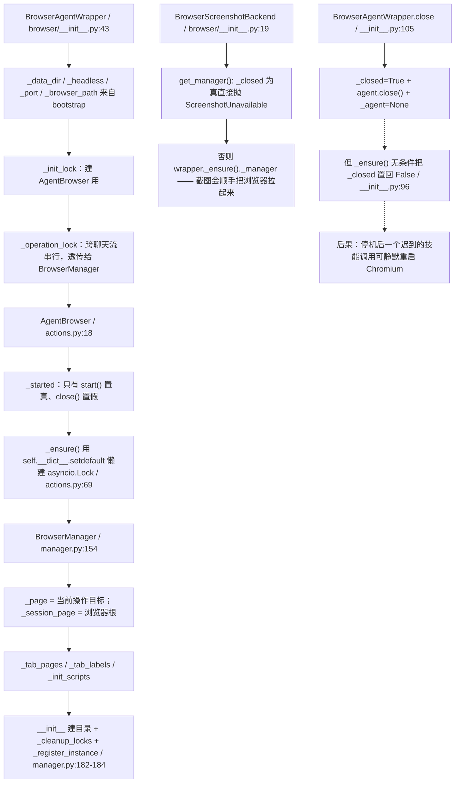

* `_ensure()` 里 `if not self._agent._started: await self._agent.start()`，
  且启动成功后调 `lifecycle.set_browser_instance(self)`（`__init__.py:90-96`）——
  同一个 wrapper 会被重复设置成 lifecycle 的 browser 实例（bootstrap 也设过一次）。
* `BrowserAgentWrapper._notify_lifecycle()` 是 **NO-OP**（`__init__.py:113-120`），
  每个动作后都 await 它一次：注释写明「不在此自动关闭浏览器，否则标签页状态会丢」。
  别把它当有效链路找日志。
* `manager.page` 是 `assert self._page is not None` 的 property（`manager.py:306-309`），
  没启动就访问会抛 `AssertionError`（不是 `RuntimeError`）。

### 可执行文件解析与启动参数：四级回退 + 一份写死的开关表

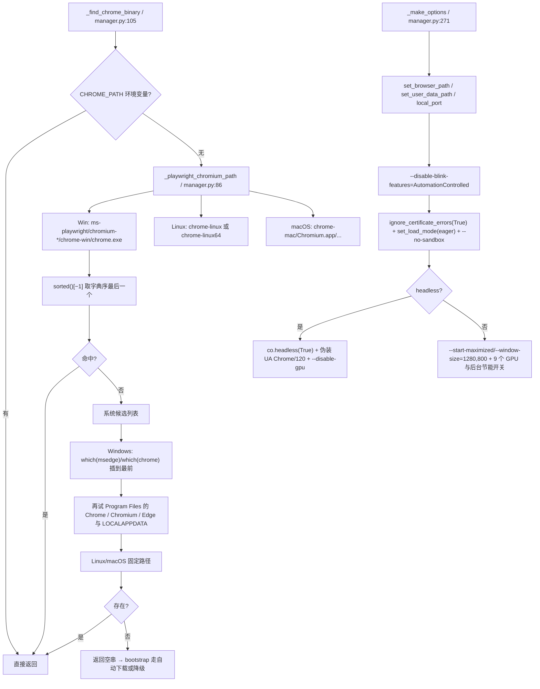

**实测（本机 `%LOCALAPPDATA%/ms-playwright`）**：同时存在 `chromium-1148/chrome-win/chrome.exe`
与 `chromium-1223/chrome-win64/chrome.exe`，而 `_playwright_chromium_path()` 的 Windows glob
只认 `chrome-win`，所以自动检测拿到的是**旧构建 r1148**；`chrome-win64` 那一份永远匹配不到。
同理 `sorted(candidates)[-1]` 是按字符串排序，`chromium-999` 会排在 `chromium-1000` 之后，
"取最新 revision" 只在位数相同时成立。

文档写"Chrome > Edge > Chromium"，实际 Windows 上 `shutil.which("msedge")` 被 `insert(0)`
到最前，**PATH 里有 Edge 就用 Edge**；而 Playwright Chromium 又整体优先于系统 Chrome。

### 启动、探活与整机重建：3 次重试与"任何异常都重启"

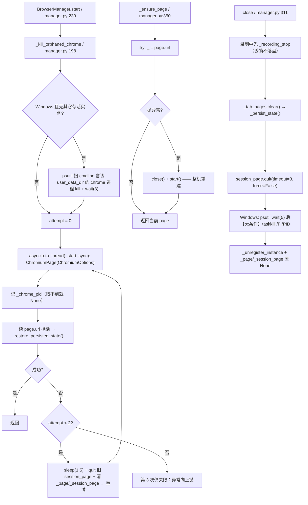

* `except (PageDisconnectedError, Exception)` 中 `Exception` 已覆盖前者，元组写法是冗余的；
  真正后果是**任何**探活异常（含页面正在跳转）都会触发 close+start，重建期间该流的标签页全丢。
* `_MAX_RETRIES = 2` / `_RETRY_INTERVAL = 1.0`（`manager.py:37-38`）**没有任何读取点**；
  真正生效的是 `start()` 里写死的 `range(3)` 与 `sleep(1.5)`。
  `bugfixes/fix(12)/fallback-inventory.md:61` 记的"导航 = DrissionPage retry=1 + 自研 2 次"与本图实测不符：
  导航路径只有 `page.get(timeout=15, retry=1, interval=1)` 一层。
* `close()` 的注释写"仅在进程残留时才强制终止"，代码里 `if self._chrome_pid:` 紧接着就 taskkill，
  **没有判断进程是否已退出** —— 正常退出也会多跑一次 `taskkill /F`（失败被吞）。
* 实例注册表是弱引用（`manager.py:47-83`），只用来让 `_kill_orphaned_chrome` 判断
  "这个 user_data_dir 是否还有别的活实例"；`launch_headed` 会换一个新 `BrowserManager`，
  旧实例尚未被 GC 时新实例会误判"还有同伴"从而跳过残留清理。

### 动作集与选择器解析：一个 `_find_element` 吃掉五种写法

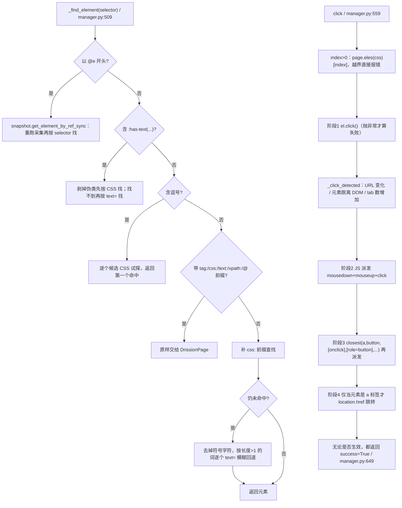

* **`_find_element` 支持 `text=` 与模糊回退，所以"选择器写错"经常表现为点到了别的元素**，
  而不是报"未找到元素"。`click` 返回的 `match_count` 是 CSS 匹配数，可以用来交叉验证。
* 输入类动作的 JS 回退：`type_text`（`manager.py:791`）在 `el.input()` 抛异常时用 JS 赋值，
  并**额外派发 Enter 的 keydown/keyup**；`press_key('Enter')`（`manager.py:819`）还会
  `form.dispatchEvent(submit)` + 点 submit 按钮 —— 一次输入失败可能顺手提交表单。
* `execute_js`（`manager.py:478`）：语句模式结果为空或含 `SyntaxError`/`Uncaught`，
  且脚本里没有 `return ` 时，会再用 `as_expr=True` 跑一次，两次都失败返回空串。
* `dblclick`（`764`）、`hover`（`942`）、`select_option`（`919`）等都直接透传 DrissionPage，
  失败一律 `{"success": False, "error": str(e)}`；`check`/`uncheck` 先读 `el.checked` 再决定是否点击。
* `upload_file`（`1009`）先 `Path(filepath).resolve()` + `exists()`，**没有任何沙箱或目录白名单**。

### 标签页与流归属：`index` 的两套口径与隔离标签页

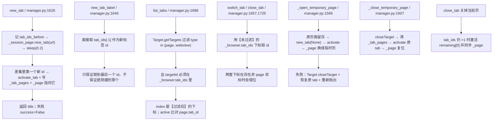

* 技能侧用 `list_tabs()` 的 `index` 再调 `switch_tab/close_tab`（`browser_skill.py:264-275`），
  所以上面那条"两套下标"的差异会直接落到**关错标签页**上；目前只在存在非 page 目标时出现。
* `_tab_pages` 只缓存"曾经激活过"的 tab；`switch_tab` 命中缓存就复用对象，否则 `get_tab()` 现取。
* `close()` 只清 `_tab_pages`，**不清 `_tab_labels`**；`close_tab` 才会按 id 删标签名。
* 截图链路专用：`ScreenshotService.render` 全程持 `operation_lock`，用临时标签页 +
  `Page.setDocumentContent` 注入 HTML，**不污染当前页面**（`screenshot.py:223-278`）。

### per-chat-flow 生命周期：touch / 空闲回收 / 空壳回收 / 关闭回调

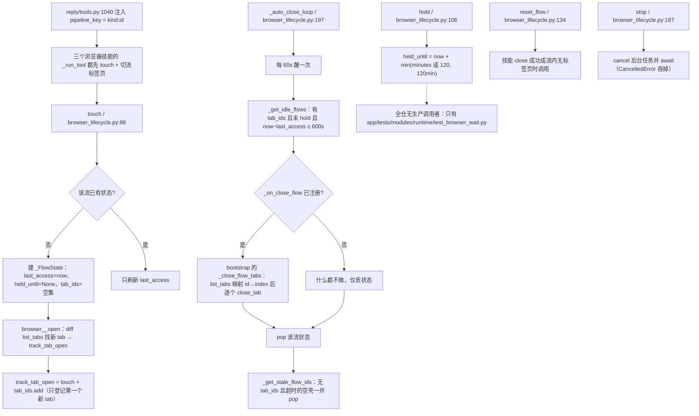

* `held_until` 的过期是**惰性**清零：`is_held`（`71`）与 `_get_idle_flows`（`151`）各自判一次；
  `_get_stale_flow_ids` 则要求 `now < held_until` 才算"还持有"。
* 回收是"先回调再 pop"，回调里的异常被 `except Exception: pass` 吞掉（`209`）——
  关标签页失败时**流状态照样被丢弃**，那些标签页从此不再被自动回收。
* `track_tab_close` 全仓只有测试调用；生产路径关标签页后靠 `reset_flow` 或 60s 循环兜底。
* `BrowserSkill._check_lifecycle`（`browser_skill.py:95`）调用不存在的 `should_auto_close()`：
  该方法没有任何调用点，所以 AttributeError 至今没被触发；接回去之前必须补这个方法。

### 截图三条链路：legacy JPEG / Port capture / 标注截图

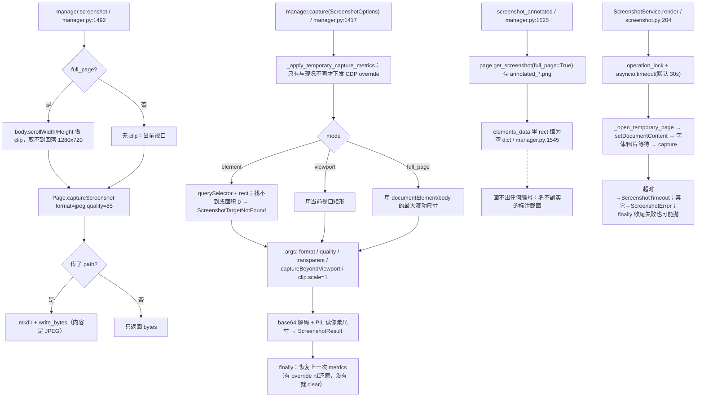

* 三条链路的**格式口径不同**：legacy 固定 JPEG q85；Port 走 `ScreenshotOptions`（默认
  `format=png, quality=90, scale=1.0`，`transparent=True` 与 JPEG 互斥，
  width/height 必须成对且 1..16384，scale 限 0.25..4 —— `contracts/ports/screenshot.py:94-129`）。
* `_apply_temporary_capture_metrics` 只在"请求尺寸/scale 与页面现况不同"时才动 CDP；
  `_device_metrics_override`（`set_viewport`/`set_device` 写的）会被当作"上一个状态"原样还原。
* `actions.shot()`（`actions.py:616`）文件名是 `.png` 但写进去的是 `screenshot()` 的 **JPEG 字节**；
  且没有生产调用点（技能里的 `shot` 走的是 `screenshot()` + PIL 转 PNG，`browser_skill.py:463-473`）。
* 停机时 `application._cleanup_browser_artifacts`（`application.py:511`）删
  `screenshots/*.jpg|png`、`annotated_*.png`、`recording_*.gif`，**不删** `cookies.json` 与
  `browser_state.json`。

### 录屏：0.5s 一帧、600 帧上限、GIF 固定 500ms

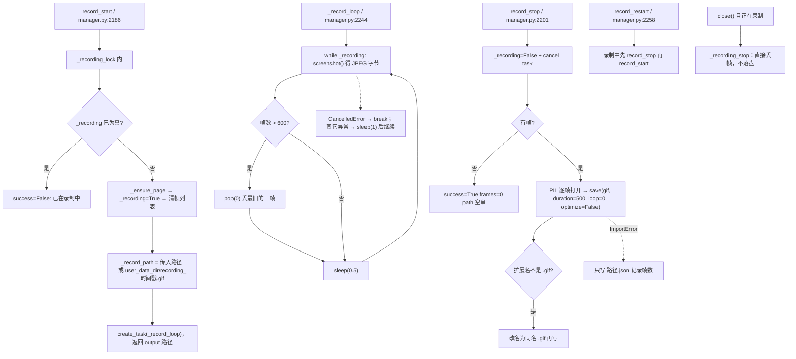

* 600 帧 × 0.5s ≈ **5 分钟**上限，与 `browser_video_skill` 的提示语一致；
  每帧都是完整 JPEG（quality 85），内存里最多压 600 份字节，长录屏是明显的内存开销。
* 帧间隔靠 `sleep(0.5)` 串行排队，截图本身耗时会让实际帧率低于 2fps，
  GIF 仍按 500ms/帧回放 —— 录出来的动作比真实更快。
* `record_stop` 里 `out_path` 取自 `self._record_path`：`record_start` 之后又 `record_restart`
  会重写该字段，最后一次的路径才是落盘位置。

### 每一层阈值总表：从技能到 CDP 的数字

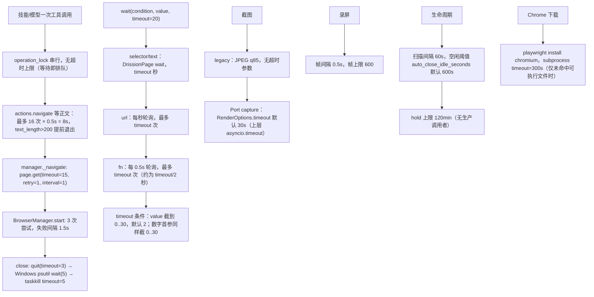

* `auto_close_idle_seconds` 在 `bootstrap/_runtime.py:154` 被整除成分钟并 `max(...,1)`，
  所以配置 30 秒实际是 **60 秒**粒度。
* 技能的 `operation_lock` 是进程级共享锁（三个技能 + 截图共用），
  单次慢动作（如 `wait` 30s）会**阻塞所有聊天流**的浏览器调用 —— 这是设计上的取舍，不是 bug。
* `_navigate` 的 15s 与 `actions.navigate` 的 8s 等待是**串联**的：最坏 23s 才返回。

### 网络拦截 / Cookie / Storage / 状态持久化：谁真的落盘

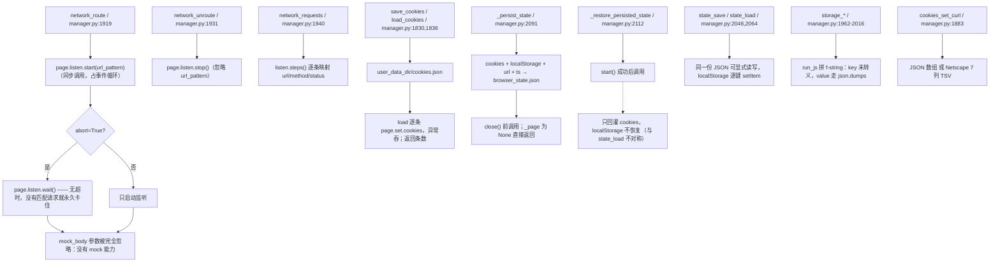

* `listen.*` 与 `page.cookies()` 是少数**没有进 `asyncio.to_thread`** 的调用；
  `listen.wait()` 无超时是明确的挂起风险（技能工具 `network_route(abort=True)` 可直达）。
* `clear_cookies`（`1870`）用 JS 逐条置过期，**改不到 HttpOnly cookie**，
  与 `page.set.cookies`/`cookies.json` 是两套作用域。
* `get_console_logs`（`2128`）、`get_page_errors`（`2148`）、`dialog_status`（`1154`）读的是
  `window.__consoleLogs` / `window.__pageErrors` / `window.__alertActive`，
  **全仓没有任何地方安装这些采集器**（`add_init_script` 也没被调用）
  → 三个工具的返回值恒为""/false，是"永远没日志"的观测黑洞。

### 安全边界：能碰到什么、哪些防线不存在

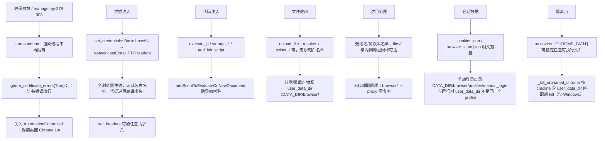

* 唯一"能访问什么"的判据来自上层：模型能不能调 `browser__*` 由技能注册与白名单决定（见 06 图）；
  **浏览器自身不做任何 URL 裁决**。
* `_kill_orphaned_chrome` 的匹配条件是 `user_data_dir.lower() in cmdline.lower()`，
  同机若有两个 NeoBot 实例用**同一**数据目录，弱引用注册表能挡住误杀；用**不同**目录则互不影响。
* 录屏/截图产物在停机时被删（`application.py:511`），但 `cookies.json`、`browser_state.json`、
  Chromium 自己的 profile 目录都会保留 —— 想彻底清会话要手删 `DATA_DIR/browser`。

### 与 agent-browser CLI / CDP 的关系：三条互不相通的入口

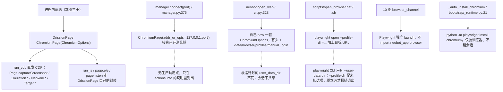

* 全仓没有任何地方调用 agent-browser 的 **Node CLI**：`agent-browser` 指的是本包目录名
  （`browser/agent_browser/`），不是外部命令；真正调 CDP 的是 `page.run_cdp(...)`。
* `actions.AgentBrowser.info()`（`actions.py:898`）列出的动作清单是**全量 API**，
  其中 `connect / launch_headed / pushstate / frame / screenshot_annotated / highlight_element /
  create_tab / state_save / set_credentials / set_headers` 等**没有任何技能暴露**，
  模型看不到；读清单时别把它当成可用工具表。

## 关键状态

| 状态 | 谁置位 | 谁清理 | 失败时停在哪 |
|---|---|---|---|
| `AgentBrowser._started` | `start()`（actions.py:38） | `close()`（actions.py:43） | `manager.start()` 三次都失败会抛穿 `_ensure`；技能层只挡 `browser_instance is None`，异常继续冒到 SkillManager 记成「工具执行失败」 |
| `BrowserAgentWrapper._closed` | `close()`（\_\_init\_\_.py:107） | `_ensure()` **无条件**置回 False（:96） | 关闭后截图抛 `ScreenshotUnavailable`；但技能调用会走 `_ensure` 静默重启 Chromium |
| `BrowserManager._page / _session_page` | `start()` 成功后（manager.py:244-245） | `close()` 置 None；`_ensure_page` 重建 | `manager.page` 断言失败抛 `AssertionError`；`_ensure_page` 捕获后整机重启 |
| `_chrome_pid` | `_start_sync`（取不到则 None） | `close()` 末尾（:345） | 取不到 pid 时跳过"等进程退出 + taskkill"整段，只 quit |
| `_tab_pages / _tab_labels` | `new_tab / switch_tab / new_tab_label` | `close_tab / close_tabs`；`close()` 只清 `_tab_pages` | 标签页被浏览器自己关掉时映射不更新，靠下一次 `switch_tab` 现取纠正 |
| `_device_metrics_override` | `set_viewport / set_device` | **没有清理点** | `capture` 只做临时覆盖并还原到它；未设置过则 `clearDeviceMetricsOverride` |
| `_recording / _recording_frames / _record_path` | `record_start` | `record_stop`（合成 GIF）、`_recording_stop`（丢帧） | 帧为空返回 `frames=0`；PIL 缺失退化成写 `.json` 帧数 |
| `_INSTANCE_REGISTRY[user_data_dir]` | `BrowserManager.__init__`（:184） | `close()`（:346） | 弱引用；实例被 GC 即消失，不清理也不泄漏 |
| `_init_scripts` | `add_init_script` | `remove_init_script` | `close()` 不清，随浏览器进程一起消失 |
| `BrowserLifecycleManager._flows[key]` | `touch / hold / track_tab_open` | `reset_flow`、60s 循环 pop、`_get_stale_flow_ids` | 关标签页回调抛异常也照样 pop（:209 吞异常）→ 标签页失联 |
| `_FlowState.held_until` | `hold()`（**无生产调用者**） | `is_held` / `_get_idle_flows` 惰性清零 | 过期即视为未持有，不影响回收 |
| `_bg_task`（生命周期循环） | `start()`（application.py:194） | `stop()`（停机 / 回滚） | `CancelledError` 直接 return；未启动时 `stop()` 是空操作 |
| `_browser_instance`（lifecycle） | `set_browser_instance`（bootstrap + wrapper 各一次） | **无清理** | 只被存起来，当前没有任何读取点 |
| `cookies.json / browser_state.json` | `save_cookies` / `_persist_state` | **无自动清理** | 停机只删截图与录屏产物（application.py:511） |

## 易错点

1. **`agent.browser.data_dir` 改了没用**：schema 里有（bot.py:1312-1315），`build_browser_components`
   却用全局 `DATA_DIR / "browser"`（bootstrap/__init__.py:856、_runtime.py:160）。
   同理 `AgentBrowser` 根本没有 `headless`/`port` 字段，`getattr(..., True/0)` 永远取默认值 ——
   想改无头/端口只能改代码。
2. **手动登录与运行时会话不是同一个 profile**：`open_web` 写
   `DATA_DIR/browser/profiles/manual_login`（cli.py:330），而运行时 Chromium 的
   `--user-data-dir` 就是 `DATA_DIR/browser`。文档「登录一次后续无头复用」在这条路径上不成立；
   真要复用只能让运行时自己有头跑一次（`launch_headed`，而它没有技能入口）。
3. **`hold()` 一族是死 API**：`hold / release / is_held / active_flow_count` 全仓只有
   `app/tests/modules/runtime/test_browser_wait.py` 调用。也就是说「保活 2 小时」永远不会发生，
   任何流只要 600s 没被 `touch` 就会被回收 —— 长任务（录屏 5 分钟上限、慢站点人工流程）要留意。
4. **`BrowserSkill._check_lifecycle` 调用不存在的方法**（browser_skill.py:98 →
   `BrowserLifecycleManager.should_auto_close`）。因为该方法自身零调用点才没炸；
   谁把它接回 `_run_tool`，谁就会立刻拿到 AttributeError。
5. **重试次数与文档不符**：`_MAX_RETRIES = 2` / `_RETRY_INTERVAL = 1.0`（manager.py:37-38）
   没有任何读取点；真实生效的是启动 `range(3)` + `sleep(1.5)`（:242-261）与导航
   `page.get(timeout=15, retry=1, interval=1)`（:360）。`fix(12)/fallback-inventory.md:61`
   把两者相加说成"导航最坏 3 次"，读图时以本图为准。
6. **`click` 几乎永远返回 `success: True`**：四阶段走完无条件返回成功（manager.py:649），
   只有"元素找不到"或"抛异常"才是失败。判断点击是否生效要看 `url` 字段与后续 `snapshot`，
   不能看 `success`。
7. **`network_route(abort=True)` 可能永久挂起**：`page.listen.wait()` 没有超时（manager.py:1924），
   且这三个方法直接同步调用 DrissionPage，会阻塞事件循环；`mock_body` 参数被完全忽略，
   工具描述里的"mock 响应体"不存在。
8. **console / page error / dialog 三个观测点是黑洞**：`get_console_logs`、`get_page_errors`、
   `dialog_status` 读 `window.__consoleLogs / __pageErrors / __alertActive`，
   全仓没有任何安装器（`add_init_script` 也无人调用）→ 恒为 `""` / `false`。
   要拿控制台日志必须自己往页面注入采集脚本。
9. **标注截图与 `shot()` 都名不副实**：`screenshot_annotated` 的 `rect` 恒为空 dict
   （manager.py:1545）所以画不出编号；`actions.shot()` 把 JPEG 字节写进 `.png` 文件名
   （actions.py:616-624），而且没有生产调用点。技能里的 `shot` 走的是另一条路。
10. **`_ensure_page` 的"任何异常都整机重启"是最大的连带影响面**（manager.py:350-356）：
    一次瞬时探活失败会 close + start，**该浏览器上所有聊天流的标签页一起消失**，
    随后各流只会在下一次 `touch` 后重新 `new_tab`。排查"我的页面怎么没了"先看这里。
11. **标签页 `index` 有两套口径**：`list_tabs` 返回的是过滤掉非 page/webview 目标后的下标，
    `switch_tab/close_tab` 用的是原始 `tab_ids` 下标（manager.py:1698-1750）。
    技能与生命周期回调都按"list_tabs 的 index → close_tab"传参，遇错位会关错页。
12. **改动连带面**（改前先想清楚）：`_find_element` 是所有元素动作的唯一入口（含模糊 `text=` 回退）；
    `list_tabs` 同时服务三个技能与生命周期回调；`operation_lock` 是进程级串行点，
    任何新增的慢动作都会拖住全部聊天流；`browser_lifecycle` 的回收阈值直接决定会话复用体验，
    且没有 `hold` 兜底可用。
