# 13 渲染与卡片：自包含 HTML 卡片 · /help 预渲染缓存 · Markdown 转图 · 截图链路 · 图片暂存池

## 范围

本图画「结构化数据与文本 → 图片」这一层，以及这条链路上的缓存与暂存池：

* **卡片渲染器本体**：`app/src/neobot_app/runtime/html_card.py`（1832 行）—— 主题注册与自包含校验、渲染 DSL、
  内嵌字体清单、slot/marker 注入、`render_card_html` / `render_card_image`；
* **/help 内容层**：`app/src/neobot_app/runtime/help_card.py`（340 行）—— 列表分页（30 条/页）、详情、markdown 与
  纯文本两级降级文案；
* **/help 预渲染缓存**：`app/src/neobot_app/runtime/help_cache.py`（484 行）—— 命令指纹、index.json、三个权限维度
  预渲染、60 张容量淘汰；
* **Markdown 转图**：`app/src/neobot_app/reply/markdown_image.py`（400 行）—— 浏览器优先 + pillowmd 降级 + 画布高度探针；
* **截图 façade 与契约**：`app/src/neobot_app/screenshot.py`（413 行）、
  `packages/contracts/src/neobot_contracts/ports/screenshot.py`（170 行）；
* **图片暂存池**：`app/src/neobot_app/image_pool.py`（119 行）。

**不画什么**（避免与相邻图重叠）：

| 相邻子系统 | 去哪张图 |
|---|---|
| 小游戏卡片的主题选择、美术片段（art.py / themes.py / avatars.py）与三种降级口径 | 11-minigame（本图只画它调用的 `render_card_image` 内部） |
| `/help` 命令注册、权限判定、命令路由与 `CommandService` 生命周期 | 17-commands、03-reply-pipeline |
| 回复管线的长文判定与发送（`process_reply_text`、sender 分段/冷却） | 03-reply-pipeline（本图只画它调 `convert()` 的那一步） |
| BrowserManager 的启动、标签页生命周期、浏览器技能 | 12-browser-automation（本图只画 `ScreenshotService` 调它的四个私有方法） |
| 面板 `status_card.py`（同一渲染器的另一个消费者） | 09-dashboard |
| 头像、表情与文件服务 | 20-avatar-files、14-emoji-image-parse（本图只画 `image_pool` 池本体） |

**与 spec / 直觉不符的提示**（细节见「易错点」与文末清单）：

* 卡片是**自包含**的（无 JS、无外链，`html_card.py:15-23` 的硬红线），但 **Markdown 转图的模板不是**：
  它带两个 `cdnjs.cloudflare.com` 外链和一个内联脚本（`markdown_image.py:34/40-41`）；
* 模块级截图端口 `html_card.set_screenshots` 在生产代码里**零调用**（只有单测调用），
  真正生效的注入点是 `bootstrap/__init__.py:977 command_service.set_screenshots(...)`；
* `index.json` 里的 `pages`（各维度页数）**只写不读**；
* 没有任何配置项能改卡片主题或图片池 TTL（`config/` 下 `theme` / `image_pool` / `ttl_seconds` 零命中）。

## 流程

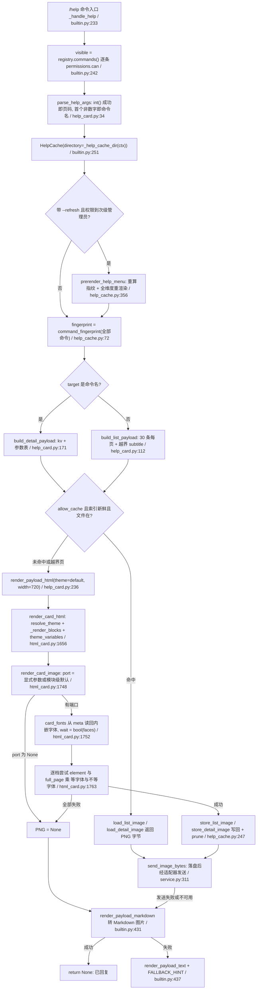

主干的判据只有四个：**要不要重建缓存**（`--refresh`）、**目标是什么**（命令名还是页码）、
**缓存能不能命中**（指纹 + 渲染器版本 + 页大小 + 文件存在）、**渲染成不成功**（None 即降级）。
任何一级失败都不允许抛给用户：最差也有一张纯文本。

## 时序

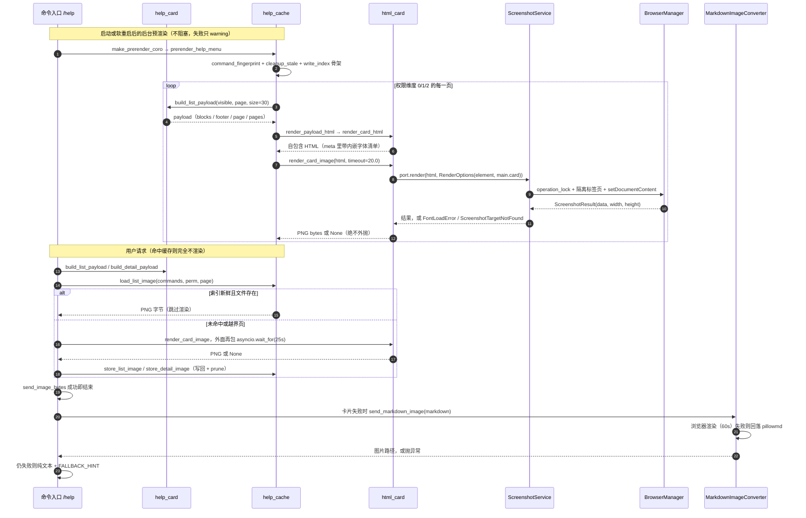

三条「不致命」的线：**预渲染失败**只影响缓存新鲜度（下次即时渲染）；
**截图失败**只降一级（卡片 → Markdown 图 → 文本）；**清理失败**（缓存淘汰、临时文件）
只留垃圾，不改变发送结果。

## 细节

### 主题注册与自包含红线：三张禁令表、缺键补齐与字体的两件事

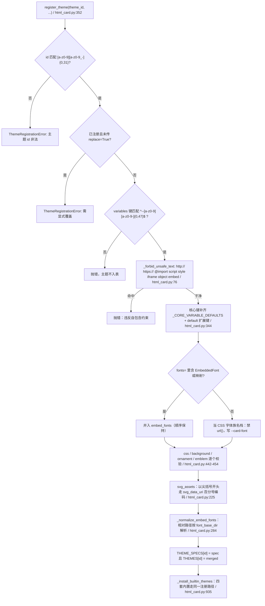

三张禁令表（注册期硬校验，违反即 `ThemeRegistrationError`）：

| 表 | 常量 | 命中即拒 |
|---|---|---|
| 文本片段 | `_FORBIDDEN_TEXT`（html_card.py:76） | `http://`、`https://`、`@import`、`<script`、`</style`、`javascript:`、iframe/object/embed |
| SVG 片段 | `_FORBIDDEN_MARKUP`（87） | 脚本、`foreignobject`、`xlink:href`、`<image`、iframe/object/embed |
| 事件处理器 | `_EVENT_HANDLER`（97） | `onxxx=` 形态（正则 [\s"']on[a-z]{3,}\s*=） |

补充口径：

* `variables` 缺键用 `_CORE_VARIABLE_DEFAULTS`（7 个核心键，177）补齐，再叠 `default` 主题的非核心扩展键
  （`_builtin_variable_defaults`，344）—— 因此插件主题永远能出图；
* 字体有**两件独立的事**：CSS 族名栈（`font_stack=` 或纯字符串 `fonts=` → `--card-font`）与要内联进临时页的
  字体文件（`embed_fonts=` 或 `fonts=` 传 `EmbeddedFont` 或映射）；`_looks_like_font_files`（331）负责分流；
* 字体文件缺失**不算错**：注册期只做路径解析（`_resolve_font_source`，267），缺失留到渲染期 warning 并回落系统字体；
* `unregister_theme`（476）拒绝删除内置主题；`registered_themes`（486）顺序 = 内置在前 + 插件按注册顺序；
* `resolve_theme`（493）对未知名回落 `default` 并 warning —— 不会抛，也不会空白。

### render_card_html：块分派、转义口径与 slot/marker 占位

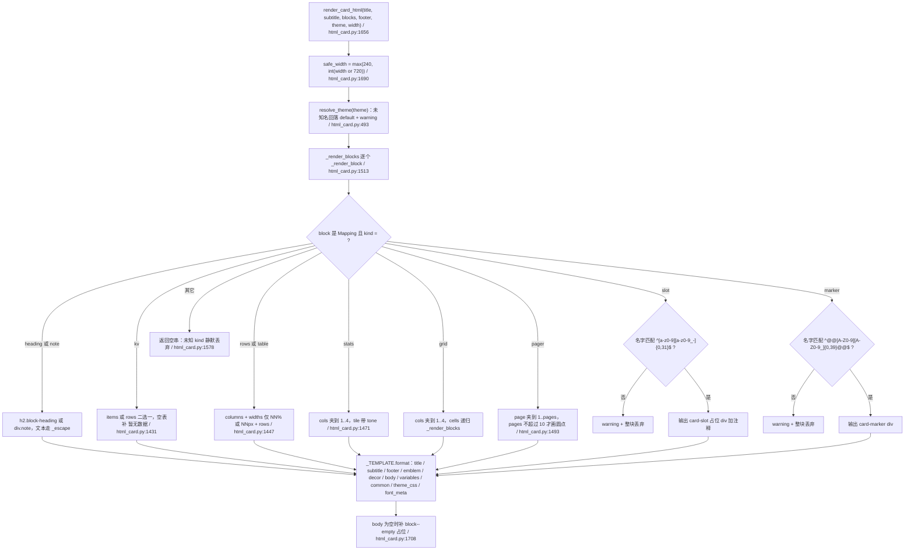

* 转义口径：所有用户可控文本经 `_escape`（`html.escape(..., quote=True)`，1360）；单元格另有
  `_escape_cell`（1381）—— 映射可带 `tone` / `mono` / `chip`，序列按多行堆叠，其它一律当标量转义；
* tone 白名单只有 5 个（`_TONES`：accent/ok/warn/danger/muted，73），variant 必须匹配
  `^[a-z0-9][a-z0-9-]{0,23}$`（70），不合法一律丢弃而不是报错；
* 列宽只接受 `NN%` 或 `NNpx`（`_WIDTH_VALUE`，69），非法项留空列；
* `main class="card" style="width: {width}px"` 是固定外层（`_CARD_SELECTOR = "main.card"`，52），
  `render_card_image` 的 element 档裁的就是它；
* slot 与 marker 是**可信片段注入**：占位串由 `slot_placeholder`（1588）生成，`has_slot`（1594）用字符串包含判定，
  `inject_slot`（1599）找不到占位符时 warning 并插到内容区开头（内容不丢）；
  `inject_marker`（1620）依次尝试 marker 块 → note 块 → 裸标记串 → 内容区开头（漂流瓶头像用法）。

### 内嵌字体往返：meta 清单 → card_fonts → @font-face，以及校验抖动的兜底

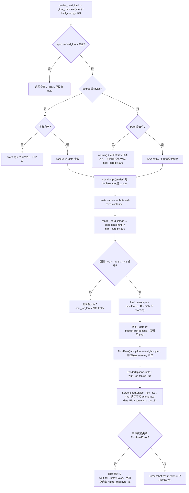

* meta 标签名是公开常量 `FONT_META_NAME = "neobot-card-fonts"`（58），测试与调用方都按它读回；
* HTML 是「渲染 → 再读回字体」的**唯一通道**：`render_card_image` 不接收主题对象，只接收 HTML；
  调用方也可用 `fonts=` 显式覆盖（此时不再解析 meta）；
* 内嵌字体格式白名单：`woff2` / `woff` / `truetype` / `opentype`（`_normalize_embed_fonts`，314）；
* 权重与风格在截图契约层再校验一次：`_FONT_WEIGHT` 正则与 `{normal, italic, oblique}`（screenshot.py:71、153）。

### render_card_image：四级尝试、返回 None 的三种情形与超时叠加

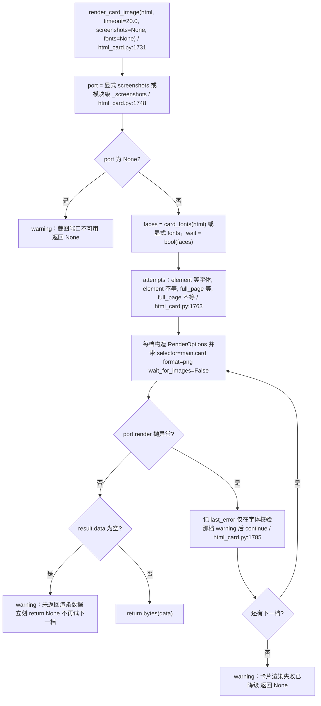

三种返回 None（契约「绝不外抛」，docstring 与 html_card.py:1738-1747）：

| 情形 | 触发点 | 调用方看到 |
|---|---|---|
| 端口不可用 | `port is None`（模块级默认端口生产恒 None） | 直接 None，一次都不尝试 |
| 渲染全失败 | 四档都抛异常（含 `UnavailableScreenshots` 抛的 `ScreenshotUnavailable`） | None 加一条 warning |
| 端口返回空 data | `result.data` 为空（1793） | None，**不再试下一档** |

超时叠加（反直觉，改超时前必读）：

* 单档 `timeout` 默认 20s（html_card.py:1734），`wait=True` 时最多 4 档，理论最坏 80s 才返回；
* `/help` 命令在 `asyncio.wait_for(..., 25s)` 里调用它（builtin.py:391-399），因此第 ③④ 档
  （full_page）只在「前两档是**瞬时**失败」时才可能被走到；
* 预渲染路径（help_cache.py:404）没有外层预算，单张最坏 80s，但整条预渲染是后台协程，不阻塞启动；
* `render_card_image` 与 Markdown 转图共享 `ScreenshotService._render_locked` 里的同一把
  `operation_lock`（screenshot.py:218），两者天然串行，不会并发开 Chromium；
  但这也意味着：**卡片渲染排队时，长文转图要等**。

### /help 列表与详情：30 条一页的翻页、越界提示与 mono/chip 微调

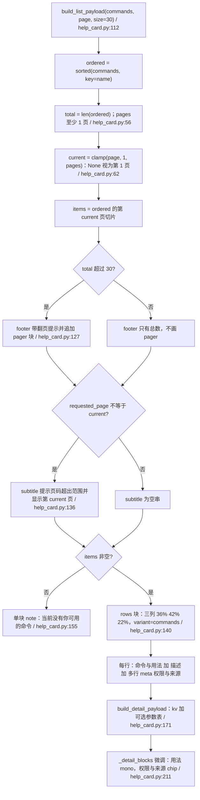

* 每页 30 条是常量 `PAGE_SIZE = 30`（help_card.py:18），缓存与预渲染共用（`HELP_PAGE_SIZE = help_card.PAGE_SIZE`，help_cache.py:37）；
* 列表卡只读**命令自身元数据**（命令名 / 描述 / 权限 / 用法 / 别名 / 参数 / 来源），
  不含配置值、token、用户标识（spec(5) R7 / A12，help_card.py:5-7）；
* 页码解析：逐个 token 试 `int()`，成功即当页码（多个数字取最后一个），首个解析失败的 token 当命令名并
  `lstrip("/")`（`parse_help_args`，34）—— 因此「/help 2 ping」里页码会被后一个 token 覆盖前一个；
* 越界页有两个可见效果：subtitle 提示，且该次请求 **不写缓存**（`allow_cache=False`，builtin.py:275）；
* 空态文案 `EMPTY_TEXT`（25）在三处复用：列表 note 块、纯文本降级、markdown 降级。

### /help 三级降级链：卡片 → Markdown 图片 → 纯文本，谁失败停在哪

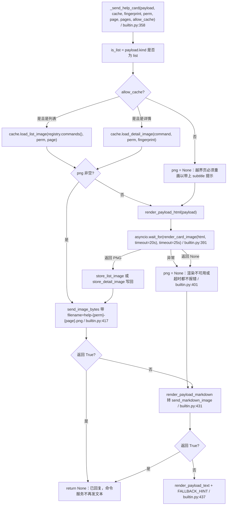

三级的产物与口径：

| 级别 | 产物 | 关键实现 | 失败即 |
|---|---|---|---|
| ① HTML 卡片 | PNG 字节 | `render_payload_html` 加 `render_card_image`（20s，外层 25s） | png 为 None 转 ② |
| ② Markdown 图片 | 长图 | `render_payload_markdown`（列表用短横线行；详情改成两列表格）转 `CommandService.send_markdown_image` | False 转 ③ |
| ③ 纯文本 | 文本消息 | `render_payload_text` 加 `FALLBACK_HINT`（「图片渲染不可用，已回退为文字版。」） | 由命令服务发出，用户一定有反馈 |

* 级别②依赖 `markdown_image_converter`、`file_server`、`adapter` 三者齐全，缺一即 False（service.py:295-300）；
* 级别③由命令服务发送：`_send_help_card` 返回文本，命令框架负责回复；
* 「任一级成功即视为已回复」（返回 None），这是 spec(5) R8 / A13 的落地口径。

### 预渲染缓存：命令指纹、三个权限维度、index.json 与 60 张容量

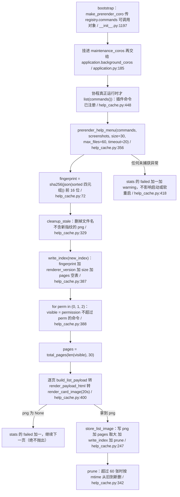

* 目录：`<DATA_DIR>/cache/help/`（`HELP_CACHE_DIR = CACHE_DIR / "help"`，constants.py:31-33）；
  `cache_dir(data_dir)` 支持注入覆盖，`/help` 命令从 `ctx.service.help_cache_dir` 取（生产为 None）；
* 文件名：列表 `help-{perm}-p{page}-s{size}-{fingerprint}.png`，详情 `detail-{safe_name}-{perm}-{fingerprint}.png`
  （`_safe_component` 只留字母数字与短横线、下划线，87）；
* 只预渲染**列表**（3 维度乘页数）；详情按需渲染并写回（`store_detail_image`，293）；
* 索引骨架先落盘再渲染（387），避免「半新半旧」缓存被当成命中；渲染失败的页留给请求时即时渲染并写回（自愈）；
* 预渲染触发点两处：启动或软重启的后台协程（bootstrap/__init__.py:1193-1202，软重启会重跑）与
  `/help --refresh`（次级管理员及以上，builtin.py:253-261）。

### 缓存命中与失效：RENDERER_VERSION 是唯一的手工开关

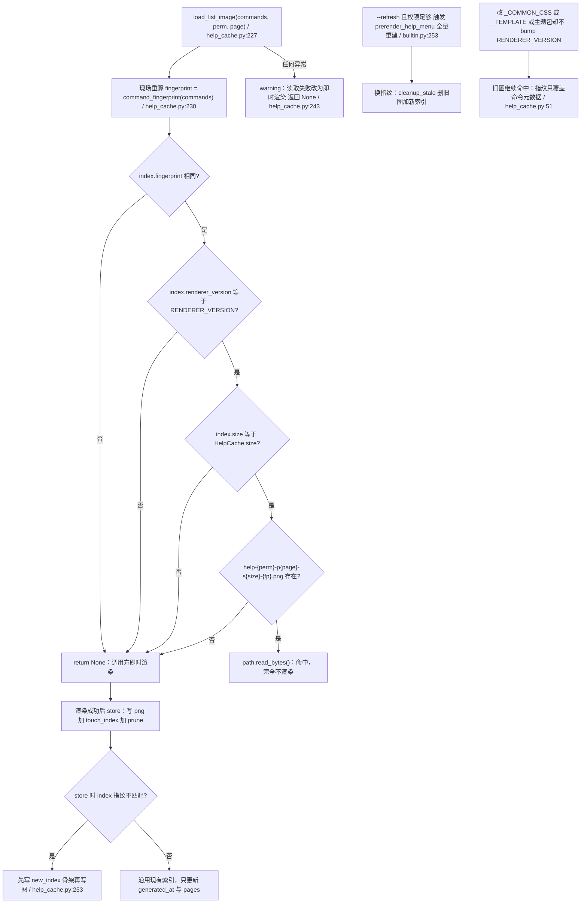

失效条件清单（改渲染器前逐条对照）：

| 变化 | 是否会失效 | 机制 |
|---|---|---|
| 插件加载 / 卸载 / 热重载改变命令集（name/usage/description/permission） | 会 | 指纹变，`is_fresh` 返回 False |
| 改命令描述文案 | 会 | 描述进指纹四元组 |
| 改 `_TEMPLATE` / `_COMMON_CSS` / 主题包 / 版式 | **不会** | 必须手工 `RENDERER_VERSION += 1`（现为 "2"，help_cache.py:48-51） |
| 改每页条数 | 会 | `is_fresh` 校验 `size` |
| 删 `<DATA_DIR>/cache/help/` | 会 | 未命中转即时渲染并写回（文档化的回滚手段） |
| 改 `config.toml` | **不会** | 没有任何配置进入缓存键（也没有卡片主题配置项） |

另外两处细节：`store_list_image` 的 `pages[str(perm)]` 取 `max`（265）而**没有任何读取点**；
越界页请求 `allow_cache=False` 时即使渲染成功也不写回（builtin.py:404-415）。

### Markdown 转图：浏览器优先、探针视口量高与 pillowmd 降级

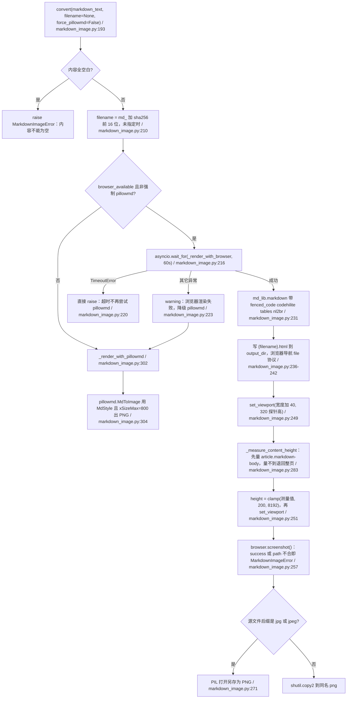

* 画布口径：`documentElement.scrollHeight` **不会小于视口高度**，直接量会把短内容出成「整屏高加大片空白」；
  所以先压到 `_PROBE_VIEWPORT_HEIGHT = 320`（119）再量内容元素，上下限 `_MIN_CANVAS_HEIGHT = 200` 与
  `_MAX_CANVAS_HEIGHT = 8192`（121-123）；
* 触发场景（阈值属 03 的图，这里只记口径）：`process_reply_text` 判定 `fallback_used` 才转图
  （sender.py:852-862，默认 `long_reply_max_length=300` 与 `long_reply_max_sentence_count=12`，
  orchestrator.py:1601-1612）；回复管线外层再包 `_MARKDOWN_RENDER_TIMEOUT_SECONDS = 60.0`（sender.py:25、377）；
  这里**没有「切分」步骤**：整段清洗后的正文渲染成**一张**图，长度只受 8192px 画布上限约束；
* `convert` 按内容哈希命名（同内容复用文件名），`_render_lock`（175）保证同一实例内不并发导航；
* 清理：6h 巡检删 24h 前的 png/jpg/jpeg/webp/html（`_CLEANUP_INTERVAL_SECONDS` 与 `_TMP_MAX_AGE_SECONDS`，154-155），
  `stop()` 时 `_cleanup_all` 全删（`_CLEANUP_ALL_ON_STOP = True`）；
* 注意：`_style` 在 `start()` 里创建 —— 不 `start()` 就 `convert(force_pillowmd=True)` 会把 `style=None` 交给 pillowmd。

### 截图链路：共享锁、隔离标签页、字体校验与错误映射

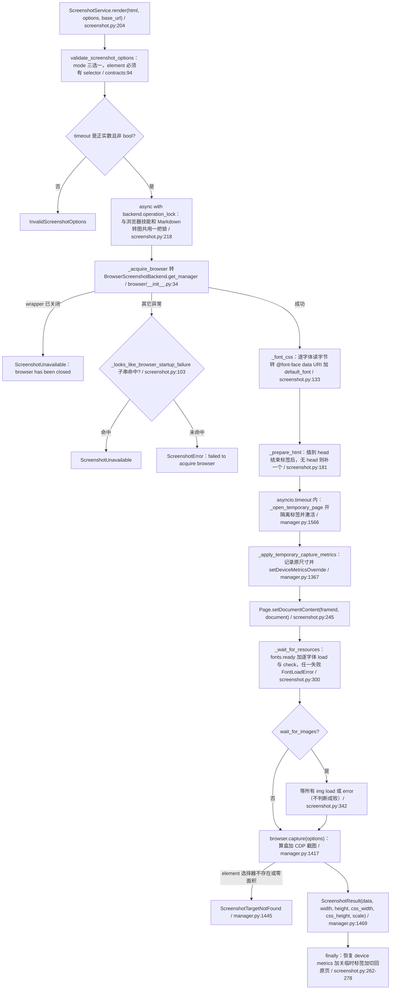

* 契约错误家族（`neobot_contracts.ports.screenshot`）：`ScreenshotError` 之下是 `ScreenshotUnavailable`、
  `InvalidScreenshotOptions`、`ScreenshotTargetNotFound`、`ScreenshotTimeout`、`FontLoadError`；
  `ScreenshotService` 把超时映射成 `ScreenshotTimeout`、其它裸异常包成 `ScreenshotError`（254-261）；
* 关闭语义：`BrowserScreenshotBackend.get_manager` 在 `wrapper._closed` 时抛 `ScreenshotUnavailable`（browser/__init__.py:35-38），
  但 `_ensure()` 成功启动后会把 `_closed` 清回 False（96）—— 「关闭后拒绝重启」只在 close 到下次 ensure 之间成立；
* `UnavailableScreenshots`（screenshot.py:387）是浏览器禁用或 Chromium 缺失时的占位端口：
  属性永不为 None，`render` 与 `save` 一律抛 `ScreenshotUnavailable` —— 因此 `render_card_image` 的
  `port is None` 分支在真实装配里**走不到**，走的是「四档都抛异常」那条；
* 临时标签页是隔离的：`_open_temporary_page` 记录原页并在 finally 里 `activate_tab` 切回（manager.py:1566-1624），
  卡片渲染不会污染用户在浏览器技能里的当前页。

### 截图尺寸口径与 verify_browser_screenshot_size.py 的四个用例

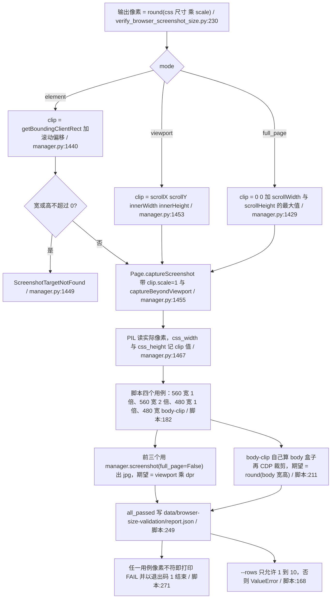

* 卡片路径的坐标口径：`render_card_image` 不设 `width` 与 `height`、`scale` 取默认 1.0，
  `_apply_temporary_capture_metrics` 只在「当前窗口尺寸或 dpr 与请求不一致」时才覆盖
  （manager.py:1383-1397）—— 所以卡片出的图像素 = 元素 CSS 尺寸乘 1，不会跟着显示器 dpr 放大；
* 脚本是**离线校验工具**（自带 BrowserManager，不进主链路）：改 `capture` 的裁剪逻辑或
  `setDeviceMetricsOverride` 之后跑它，四个用例全 PASS 才算尺寸口径没回归；
* 依赖 `scripts/fixtures/leaderboard.html` 与 `PIL`；找不到 Chromium 直接 RuntimeError（脚本:172-175）。

### 图片暂存池：TTL 生命周期、消费方与「不删文件」

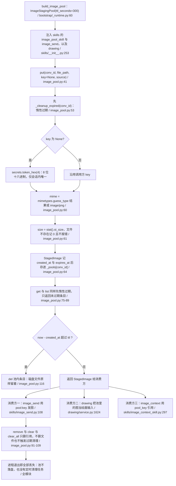

* 隔离维度是 `conv_id`（聊天流键）：不同会话即使 key 撞车也互不可见；
* 过期判据看的是 `created_at`，`StagedImage.expires_at` 字段**只写不读**（12-22 定义、64-72 写入、116 判定）；
* `remove` 与 `clear` 与 `clear_all` 不做惰性清理（与 `put` / `get` / `list` 不对称，无害）；
* TTL 300s 是**硬编码**（`config/` 下 `image_pool` 与 `ttl_seconds` 零命中），面板改不了；
* 池不发图、不下载：`put` 只登记路径与元数据，真正的下载与落盘在调用方（如 `image_pool_skill._handle_put`）。

## 关键状态

| 状态 | 谁置位 | 谁清理 | 失败时停在哪 |
|---|---|---|---|
| `THEME_SPECS` 与 `THEMES` 主题表 | `register_theme`（内置四套在导入时 `_install_builtin_themes`，html_card.py:941） | `unregister_theme` 只删插件主题，内置拒绝删除 | 注册校验不过抛 `ThemeRegistrationError`，主题不入表；`resolve_theme` 未知名回落 `default` 加 warning |
| 模块级 `_screenshots` 端口 | `set_screenshots`（html_card.py:1721） | 无（进程级） | 生产零调用，`get_screenshots()` 恒 None；`render_card_image` 立即返回 None |
| `CommandService._screenshots` | `bootstrap/__init__.py:977` 注入（软重启重建后重新注入） | 重建即替换 | 未注入时属性回落 `get_screenshots()`（恒 None），/help 直接走 Markdown 或文本 |
| `<DATA_DIR>/cache/help/index.json` | `prerender_help_menu:387` 与 `store_*` 里的 `touch_index` | `--refresh` 重写；删目录即整体回滚 | 读写异常只 warning；索引不新鲜则当作未命中，即时渲染 |
| `cache/help/*.png` | `store_list_image` 与 `store_detail_image` | `cleanup_stale`（换指纹）加 `prune`（超过 60 张按 mtime） | 文件缺失或读失败返回 None，转即时渲染并写回 |
| `data/markdown_images/` 目录 | `convert` 写 png 与 html；`CommandService._write_image_bytes`（卡片图也落这里） | 6h 巡检删 24h 前文件；`stop()` 全删 | 清理异常只 warning，文件残留；不影响已发出的图 |
| `converter._cleanup_task` | `start()` | `stop()` 取消并全删 | 未 `start()` 就 `convert(force_pillowmd=True)` 会把 `style=None` 交给 pillowmd |
| `image_pool` 池条目 | `put` | 惰性过期（put/get/list 触发）、`remove` 与 `clear`、进程退出 | key 不存在或已过期则 `get` 返回 None，消费方回「未配置或不存在」 |
| `BrowserAgentWrapper._closed` | `close()` | `_ensure()` 启动成功后清位 | `get_manager` 抛 `ScreenshotUnavailable`，卡片降级为文字 |
| slot 与 marker 注入结果 | `inject_slot` 与 `inject_marker`（纯字符串替换，无状态） | 不适用 | 找不到占位符则 warning 加插到内容区开头（内容不丢） |
| `HelpCache` 实例 | 每次 /help 命令新建（builtin.py:251） | 随作用域回收 | 没有长生命周期状态；缓存真身在磁盘 |

## 易错点

1. **「绝不外抛」是渲染契约**：`render_card_image` 的三种失败（端口 None、全档异常、空 data）都返回
   `None`（html_card.py:1748-1798），调用方只能按 None 降级；`_send_help_card` 的
   `try` 与 `except`（builtin.py:391-403）是第二道保险，不是主判据。
2. **element 档不是可选优化**：`full_page` 的画布下限是浏览器视口（注释实测约 1036x905，html_card.py:1754-1756），
   不裁 `main.card` 就会出「右侧与下方大片空白」的图；Markdown 转图用「探针视口加量内容元素」绕同一个坑
   （markdown_image.py:112-119）。**改动裁剪必须同步**这两处。
3. **字体校验会抖动**：中日韩 woff2 的 `document.fonts.check` 概率性失败，于是有第 ② 档「不改 mode、只把
   `wait_for_fonts` 置 False」的重试（html_card.py:1764-1765，测试 test_html_card.py:531）。删掉这一档，
   字体一抖动卡片就整体降级成文字。
4. **超时是叠加的**：单档 20s 乘最多 4 档（html_card.py:1763）。`/help` 外面再包 25s（builtin.py:291），
   所以「20 秒超时」不是整次渲染的上限；预渲染路径没有外层预算，单张最坏 80s。
5. **缓存只认命令元数据**：指纹 = `name` 与 `usage` 与 `description` 与 `permission`（help_cache.py:72-84）。
   改模板、改 CSS、改主题都**不**失效；必须手工 `RENDERER_VERSION += 1`（现为 "2"，help_cache.py:51），
   否则 /help 会继续发美化前的旧图。
6. **`index.json` 的 `pages` 是只写字段**（help_cache.py:263-265 写，全模块无读取点）：
   别用它判断维度页数，`is_fresh` 只看 fingerprint 与 renderer_version 与 size。
7. **越界页不写缓存**：`allow_cache=False`（builtin.py:275）时即使渲染成功也不 store，
   避免把带「页码超出范围」提示的图当成正常页缓存。
8. **Markdown 转图模板不是自包含的**：`_MD_HTML_TEMPLATE` 带两个 `https://cdnjs.cloudflare.com` 外链与内联
   `hljs.highlightAll()`（markdown_image.py:34、40-41），与 `html_card` 的「无外链无脚本」红线是两套口径；
   离线时高亮样式缺失但出图不受影响（该模板会执行页面脚本，是仓内唯一允许脚本的渲染路径）。
9. **`convert` 对超时不降级**：`except asyncio.TimeoutError: raise`（markdown_image.py:220-221）——
   只有非超时异常才落 pillowmd。浏览器卡死等于直接失败，靠调用方（sender 60s、tools、commands）再降级。
10. **卡片图与 Markdown 图共目录**：`_card_image_dir` 未显式注入时回落 `converter._output_dir`
    （service.py:335-344），而该目录是 24h 清理加 `stop()` 全删；`data/cache/help/` 的缓存图是另一份，不受影响。
11. **`html_card.set_screenshots` 是死接口**：生产只有 `command_service.set_screenshots`
    （bootstrap/__init__.py:977）与显式传参两条注入路径（详见文末清单第 1 条）。
12. **`image_pool` 不删文件**：TTL 只清内存引用（image_pool.py:111-119），磁盘文件留在原处；
    TTL 300s 硬编码（bootstrap/_runtime.py:60-61），配置层无开关。
13. **`ScreenshotUnavailable` 的判定很宽**：`_looks_like_browser_startup_failure` 用子串匹配，
    含 `not found` 与 `chrome` 与 `playwright` 等（screenshot.py:103-126）——非 `ScreenshotError`
    的异常只要消息里带这些词，就会被当成「浏览器不可用」而不是普通渲染错误。
14. **slot 占位符是字符串相等**：`has_slot` 用 `slot_placeholder(name) in html`（html_card.py:1594）。
    改占位串必须同时改 `_render_block` 的 slot 分支、`slot_placeholder`、`inject_slot`，
    否则注入静默退化成「插到内容区开头」（有 warning，但卡片看起来正常）。
15. **未知 `kind` 静默丢弃**：`_render_block` 对不认识的 kind 返回空串（html_card.py:1578-1579）；
    非法 slot 名与 marker 名也只 warning。卡片不会报错，只会少一块 —— 排查「内容不见了」先看 warning 日志。
16. **预渲染先删旧图再写新索引**（help_cache.py:386-387）：若渲染全失败会出现一段缓存空窗，
    此时用户请求走即时渲染并写回（自愈），不会报错；但 `stats` 里的 `failed` 要盯着看。

---

## 与 spec 或直觉不符的代码事实（新发现，未登记在 SPLIT-MAP 第 3 节）

| # | 事实 | 位置 | 影响 |
|---|---|---|---|
| N1 | `html_card.set_screenshots` 与模块级 `_screenshots` 在生产代码里**零调用**（只有 app/tests/modules/runtime/test_html_card.py:556 与 561 调用），于是 `get_screenshots()` 恒 None，`commands/service.py:120-127` 的「回落到模块级默认」是死分支；真正生效的注入只有 `bootstrap/__init__.py:977` | runtime/html_card.py:1717-1728、commands/service.py:114-131 | 任何直接 `render_card_image(html)` 而不传 `screenshots=` 的调用方（插件、脚本）必然降级；反过来改「默认端口」不会影响生产 |
| N2 | `index.json` 的 `pages`（各维度页数）只写不读：`new_index` 与 `touch_index` 与 `store_list_image` 维护它，全模块无读取点；`is_fresh` 只看 fingerprint 与 renderer_version 与 size | runtime/help_cache.py:205-217、263-265 | 文档里「记录各维度页数」目前没有消费者；想用它做「缓存是否完整」的判断必须先补读取点 |
| N3 | `image_pool.StagedImage.expires_at` 只写不读（过期判定用 `now - created_at > ttl`），且 TTL 300s 硬编码、配置层零命中 | app/src/neobot_app/image_pool.py:12-22、64-72、116；bootstrap/_runtime.py:60-61 | 面板改不了暂存时长；`expires_at` 不能作为外部观测字段 |
| N4 | Markdown 转图模板带两个 `cdnjs.cloudflare.com` 外链加内联脚本，与卡片渲染器的「自包含、无外链、无脚本」硬红线相反 | reply/markdown_image.py:34、40-41 | 离线环境下高亮样式与脚本静默缺失；安全评审时两条渲染路径的口径必须分开说明 |
| N5 | `convert` 对浏览器渲染的 TimeoutError **不降级**（只有其它异常才落 pillowmd） | reply/markdown_image.py:214-225 | 「浏览器卡死」与「浏览器报错」的用户可见结果不同：前者直接失败，后者还能出一张 pillowmd 图 |
| N6 | `CommandService._card_image_dir` 未注入时回落 `markdown_image_converter._output_dir`，卡片图与长文转图共用目录与清理器（24h 删除加 stop 全删） | commands/service.py:335-344；reply/markdown_image.py:154-156、342-385 | 「卡片图突然没了」多半是清理器或 `stop()` 干的；`data/cache/help/` 的缓存不受影响 |
| N7 | `render_card_image` 四档尝试共用调用方传入的单个 timeout，`/help` 只用 25s 外包，full_page 两档在真实超时场景下几乎走不到 | runtime/html_card.py:1763-1768；commands/builtin.py:289-291、391-399 | 「有 full_page 兜底」在超时场景下不成立；调整档位或顺序时要重算最坏耗时 |

（以上为写图过程中逐个 grep 与 read 核对的结果，尚未开 bugfix。）
