# 14 表情包与图像解析：入站图片解析 · 表情包库 · 本地 YOLO 检测

## 范围

本图覆盖三条共用「图片字节」这一输入形态的链路：

* **入站图片解析**：`image/parser.py` 的 `ImageParseService`（下载 → md5 缓存 → 视觉模型 → 消息段原位替换）与它的等待闸门；`message/image_pipeline.py` 的 `prepare_local_image`（本地图片哈希 + 压缩，emoji 与视觉请求共用）。
* **统一取图入口**：`image/source.py` 的 `ImageSourceResolver.resolve`（六种图片来源参数、队列 / Adapter 回源）。`vision_detect`、`emoji_add`、`image_context` 三个工具面共用它。
* **拉不到的聊天图片**：`image/unavailable.py` 的 `ImageUnavailableRegistry`（引用键 → 「拉不到」的**进程内**登记，LRU 512；命中即失败返回、一个请求都不发）与随后的 `image_refs` 引用索引（迁移 0028，引用摘要 → 描述，仅供过期时回显）—— issue #80。
* **表情包库**：`emoji/service.py` 的 `EmojiService`（目录扫描、内容哈希去重、编号映射、`.txt` 侧文件、视觉解析、发送与使用次数；视觉 provider 由 `install_vision_provider` 换装，热重载 `emoji` 消费者调用 —— issue #75）；`emoji/mapping.py` 是 QQ 表情静态表（`lookup_emoji` / `search_emoji` / `list_all_emoji`，纯数据、无状态、不进提示词）。
* **本地视觉检测**：`vision_detect/` 的 `ModelLibrary`（扫 `models/` 目录与 `models.toml` 索引合并）、`OnnxDetector` 与 `TorchYoloDetector`（双推理栈）、`VisionDetectService`（检测器池、热重载、中文摘要）。

**不画什么**（避免与相邻图重叠）：

* 工具表下发、白名单、`native_vision` 双向工具可见性规则 → `03b-reply-tools`。本图只画「谁在什么时候调用服务」，不画工具 schema 怎么进模型。
* 原生视觉 provider 的能力上报与降级、`ReplyVisionContext` 的图片附录 → `05b-provider-native-vision`、`03b`。
* 技能注册表本身（`skills/__init__.py` 的注册顺序与 `disabled` 名单）、`image_parse_skill.py` 的工具定义与 session 工具包装 → `06-tools-skills`、`03b`。本图只在它取图时标注一句。
* `image_pool` 暂存池（`build_image_pool` 里 TTL 300s，`bootstrap/_runtime.py:61`）、`html_card` 与 `markdown_image`、图库 `creator_image` → `13-render-cards`、`15-drawing`、`20-avatar-files`。
* 存储实现细节（`SqlAlchemyEmojiAccess.*`、`ImageAnalysisService` 的表结构与迁移）→ `22-storage-migrations`。

**spec 与现实的差异提示**：

1. `VisionDetectService.inspect_image` 自称「备用接口」，docstring 写着「未来在 `image/parser.py` 的 `_parse_single_image` 视觉模型调用之前插入检测」（`service.py:435-443`）—— **HEAD 上这条插入不存在，全仓零调用点**。本地检测只由 agent 显式调用 `vision_detect__detect` 触发，不参与入站图片解析。
2. emoji 目录的「即时感知」不是文件监听：它是**读取时**比对 `(目录下文件名元组, 目录 mtime_ns)` 快照（`service.py:848-883`）。没有读操作就不会感知，写操作仍然靠 300s 定时刷新兜底。
3. 运行期生效的推理阈值来自 `models.toml` 的 `[library]` 段，不是 `config.toml`：`agent.vision_detect.default_conf / default_iou / imgsz` 只是首次生成骨架的初值，`refresh()` 之后会被索引里的值覆盖（`service.py:140-149`）。

## 流程

```mermaid
flowchart TD
    subgraph INB["入站图片解析"]
        A["群 / 私聊消息入队后 / event_pipeline.py:366 与 :562"] --> B["ImageParseService.parse_message_images / parser.py:70"]
        B -- native_vision_provider.native_vision is True --> B1["原图保留 不替换段 交原生视觉附录 见 03b"]
        B --> D{"消息段含 image / cardimage 无则 NO-OP"}
        D -- 有 --> E["create_task(_parse_and_replace) 并按 queue_key 记账 / parser.py:91"]
        E --> F["多张图并发 _parse_single_image 下载 15s 放大到至少 29px 取 md5 / parser.py:150"]
        F --> G{"ImageAnalysisService.get(md5) 命中"}
        G -- 命中 --> G1["返回 [图片：缓存描述]"]
        G -- 未命中 --> H{"vision_provider 已配置"}
        H -- 否 --> H1["[图片解析失败：未配置视觉模型]"]
        H -- 是 --> I["_build_vision_image_part 后 chat timeout 60s / parser.py:237"]
        I --> J["写缓存 source=chat_image 失败只 warning / parser.py:180"]
        J --> K["段原位替换为文本段 / parser.py:148"]
        G1 --> K
        H1 --> K
        K --> L["reply 侧 wait_for_queue 闸门 群 120s 私聊 90s / orchestrator.py:4339"]
        L -. 超时 .-> L1["cancel 未完成任务 + warning 未替换段按原样进 prompt"]
    end
    subgraph EMO["表情包库"]
        R["回复前随机触发 _maybe_trigger_sticker / orchestrator.py:1912"] --> R1{"random 小于 random_sticker_probability 默认 0.1"}
        R1 -- 命中 --> R2["send_image + record_usage 失败只 debug / orchestrator.py:1952"]
        T["工具 send_emoji / list_emojis / emoji_add"] --> T1["EmojiService 编号映射与 emoji 目录 发送走 prepare_image_segment 再 adapter.send / service.py:199"]
    end
    subgraph VIS["本地视觉检测"]
        V["工具 vision_detect__detect 模型必须显式指定"] --> V1["detect_bytes_async 线程池执行 / service.py:413"]
        V1 --> V2["_maybe_refresh 指纹变化则重扫 models.toml 并清空检测器池 / service.py:157"]
        V2 --> V3["OnnxDetector 或 TorchYoloDetector 推理"]
    end
```

三条链路的共同点：**入站解析是「不阻塞分发、只在构建 prompt 前等」**，失败一律降级为文本占位；**表情包与本地检测都是工具面主动调用**，失败只回一句错误文案，不影响回复。

## 时序

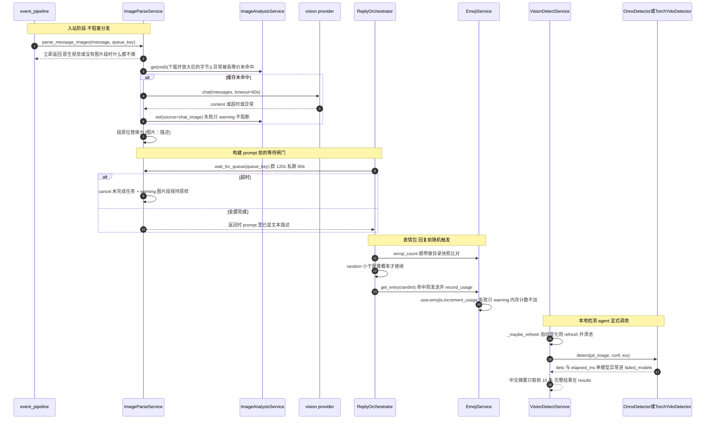

两条「不致命」要记牢：**图片解析失败只把段落替换成占位文本**（回复照发，模型只是看不到图）；**表情包 / 检测失败只影响这一次工具调用或这一次随机发送**，不改变回复状态机。真正会挡住回复的只有一件事：`wait_for_queue` 在没有超时上限时被一张下不动的图卡住（见细节 4）。

## 细节

### 入站图片下载：URL 直下失败才回源 get_image，两道魔数校验

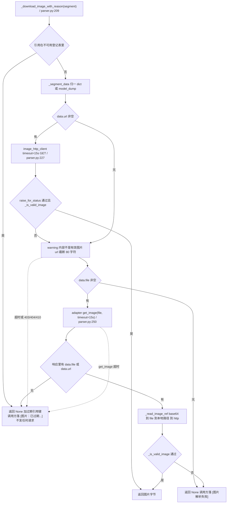

* 魔数校验是 `utils/image_bytes.py:18 looks_like_image`：长度小于 16 字节直接 False；`RIFF` 开头还必须第 8-12 字节是 `WEBP`；其余按 `IMAGE_MAGIC_PREFIXES`（JPEG / PNG / GIF87a / GIF89a / BMP）前缀匹配。它不引入 Pillow 解码开销，代价是**只认容器头**。
* URL 分支失败**不抛异常**，只 warning 后落到 `file` 分支；两段都失败返回 `None`。
* **先查登记表再动手**：引用键（`file:` / `url:` / `msg:<id>:<index>`，内联 `base64://` 与 `data:` 不算引用）命中登记表就直接返回过期 —— 预热灌进来的历史图片里，那些设备侧已经清掉的那些，每轮都要白等一个超时窗口（见本图「拉不到的图片」小节）。
* **只在「这张图没了」时登记**：`is_expiry_failure` 只认超时与 `403 / 404 / 410`，`get_image` 返回空数据也算；断线一类的普通异常**不登记** —— 登记了会把还能拉的图一并废掉。
* 注释里写明了为什么只包一层超时（`parser.py:219-222`）：外层再包 `asyncio.wait_for` 会与 `get_image` 内层超时互相 cancel，迟到的 echo 打中已取消的 future 会抛 `InvalidStateError` 并回收连接。改这里前先读这段注释。
* 图片字节没有任何大小上限：`ImageParseService` 不走 `image/source.py` 的受限读取（`read_image_ref(..., max_bytes=...)`），下载多大就吞多大。

### 本地图片准备：prepare_local_image 的 1M 像素压缩与两套哈希口径

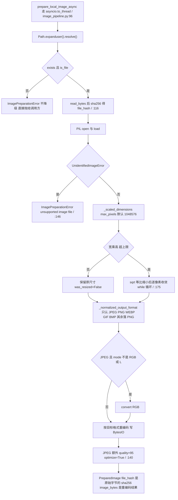

* **两套哈希口径**：这里是 `sha256(磁盘原始字节)`；`image/parser.py:159` 的入站缓存键是 `md5(放大后的字节)`。同一张图在「表情包库」和「图片描述缓存」里是两条互不相干的记录。
* `to_thread` 不是可选项：函数体是 read_bytes 加 PIL 解码加 LANCZOS 重采样重编码，留在事件循环上会卡住整个 Bot（含其它会话与心跳），注释写在 `image_pipeline.py:74-77`。
* JPEG 的 `quality=95, optimize=True` 只在保存格式为 JPEG 时加；PNG / WEBP / GIF / BMP 走 Pillow 默认参数。
* 只捕 `UnidentifiedImageError`：截断文件等其它 Pillow 异常会原样抛穿，调用方（emoji 的 `_scan_folder`、`_parse_batch`）各自有 `except Exception` 兜底。
* 这个函数的输出同时服务三处：emoji 目录扫描的哈希与宽高、emoji 视觉解析的 base64 载荷、`EmojiService.record_usage` 反查哈希。改压缩策略会同时改这三处的行为。

### 视觉请求载荷与描述缓存：GIF 转 PNG、放大缩小与 md5 写回

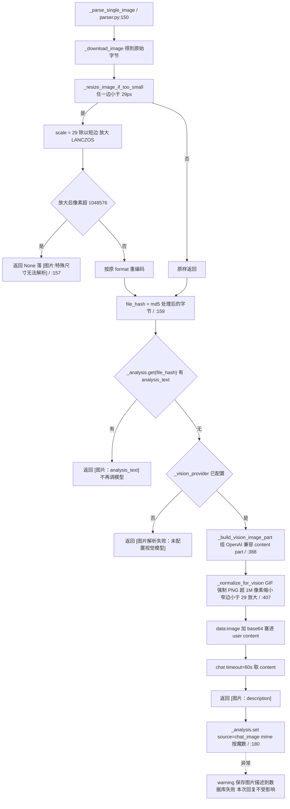

* 两级尺寸常量都写死在文件里：`_MIN_IMAGE_DIMENSION = 29`（注释：Qwen VL 系列要求宽高大于 28，`parser.py:341`）与 `_MAX_IMAGE_PIXELS = _VISION_MAX_IMAGE_PIXELS = 1024*1024`。
* 两次处理的分工不同：`_resize_image_if_too_small` 只处理**过小**，且失败会直接给出「特殊尺寸无法解析」；`_normalize_for_vision` 才做完整的「小了放大、大了缩小、GIF 转 PNG」，且**不会**因为超像素而失败（它按比例缩到上限内）。
* 缓存键取的是第一次处理后（可能被放大）的字节，写回的也是同一个键，所以自洽；但只要有人改了放大常量，历史缓存全部失配，等于清空缓存。
* `_normalize_for_vision` 对无法解码的字节是「原样发给模型」（`parser.py:416-419`），把失败留给 API 报错，而不是在这里拒绝。
* 视觉调用固定 60s 超时（`parser.py:258`），且**不使用** `asyncio.to_thread`：编码 base64 与压图仍发生在事件循环上（图片已受 1M 像素约束，代价可控，但与 `prepare_local_image` 的口径不一致）。

### 排队与等待：wait_for_queue 的 0 值陷阱与群聊私聊两档超时

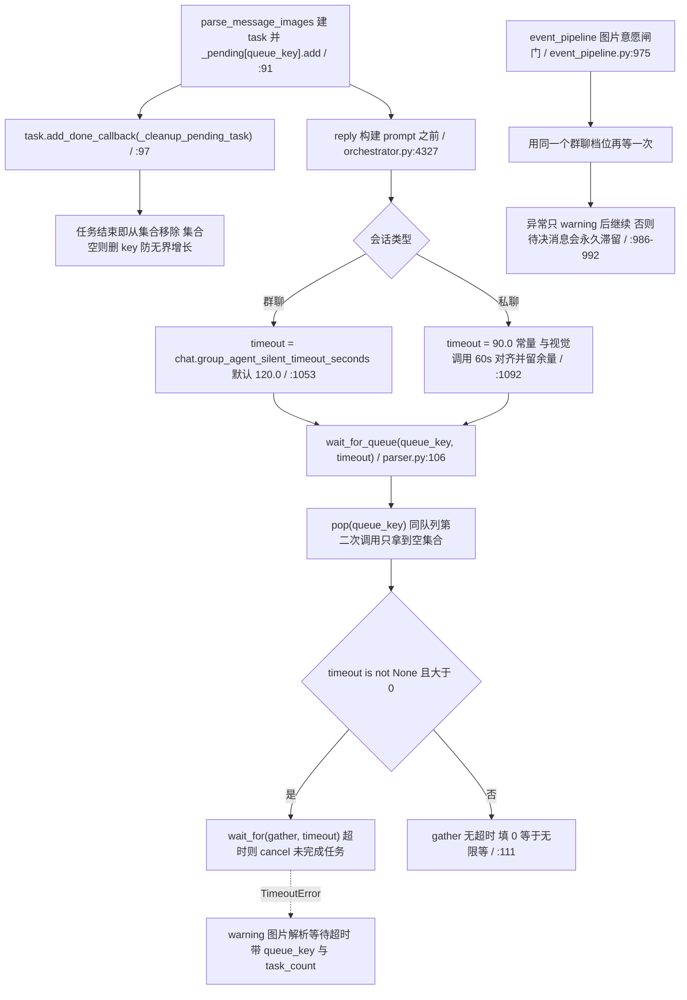

* **两处等待、一个队列**：reply 侧等的是「构建 prompt 前」，图片意愿闸门等的是「拿到图再做意愿判断」。两者都 `pop` 同一个 `_pending[queue_key]` —— 谁先到谁拿走这批任务，后来者拿到空集合直接通过。
* **0 值不是「不等」而是「无限等」**：`wait_for_queue` 只在 `timeout > 0` 时才加超时。群聊档位把配置值原样传下来（`orchestrator.py:4333`），所以 `group_agent_silent_timeout_seconds = 0`（本意通常是「关掉沉默超时」）会让图片等待彻底失去上限，回复停在这一步。
* 私聊档位是硬编码 90.0，没有配置项；群聊档位同时被「模型单次响应超时」复用（`orchestrator.py:1105`），改它会影响多处。
* 超时后未替换的图片段保持原始「图片 [url]」形态进 prompt —— 模型会看到占位而不是描述，这不是错误，是设计好的降级。

### 表情包目录扫描：去重、txt 侧文件与视觉解析的全流程

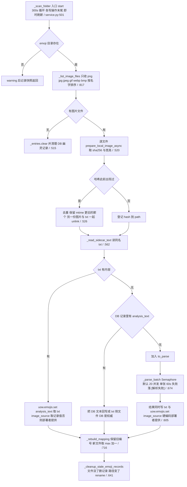

* **描述有两个持久化副本**：图片同名 `.txt` 侧文件与 `emoji_data` 表。读写优先级是「txt 优先于 DB」（`service.py:568-582`），但 DB 有而 txt 没有时会回写 txt。
* **视觉模型缺失也会写盘**：`_parse_batch` 在 `_vision_provider is None` 时**不报错**，直接返回 `[未配置视觉模型]`（`:679-680`），异常路径返回 `[解析失败]`（`:711`），两者都会经 `:612` 写进 `.txt`。下次扫描读到非空 txt 就当作最终描述，**永不重试**。
* `_parse_batch` 的并发默认 20（`max_concurrency`，`build_emoji_service` 没有覆盖它），单张超时 60s，`asyncio.gather` 全收不抛。
* 去重删的是**后落盘名字**那一份（保留 mtime 更小者），并把它的 `.txt` 一并删除；日志里两条分支都写「保留较旧文件」，看日志时别被文件名绕晕。
* 整段扫描被 `_scan_lock` 串行化（`_scan_safe`，`:841`），定时刷新与即时刷新不会并发。

### 表情包编号与随机触发：编号不复用、randint 会打空

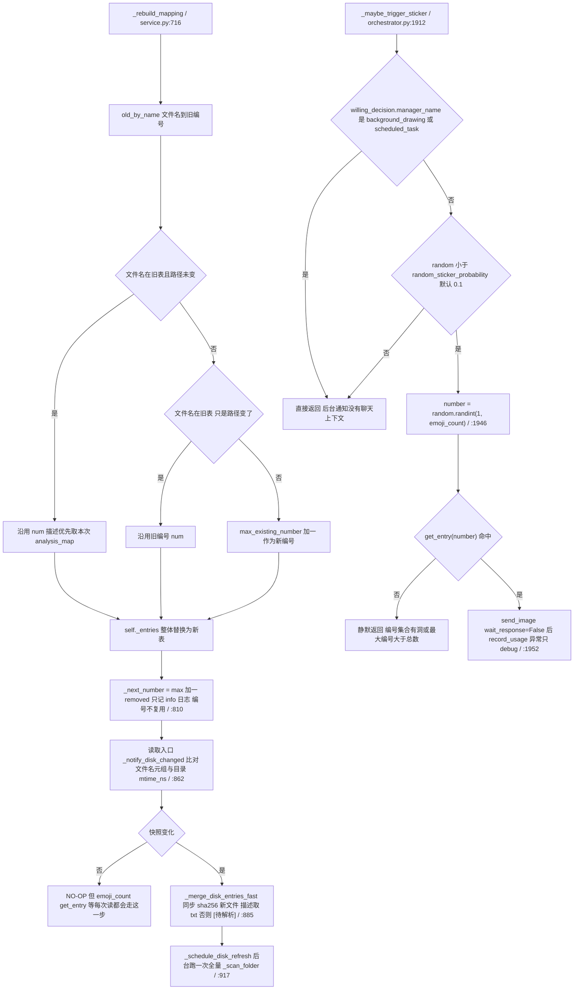

* **编号永不复用、只增不减**：重建时新文件取 `max(已用编号) + 1`，删掉的编号留成空洞。所以「编号集合」既不连续，最大编号也可能大于 `emoji_count`。
* **`random.randint(1, emoji_count)` 因此会打空**：命中空洞或越界编号时 `get_entry` 返回 `None`，函数**静默返回**——不下发任何东西，也不记日志。用户说的「这次没发表情包」如果反复出现，先看这里，而不是概率配置。
* 快照包含**目录下所有文件名**（不只图片）与目录 `mtime_ns`：放进一个 `.txt` 或任何文件都会触发一次后台全量刷新。
* `_merge_disk_entries_fast` 在**同步**读接口里对新文件做 `sha256(path.read_bytes())`（`:900`），注释写明「不能 await，所以直接算哈希」。大图放进目录后第一次 `emoji_count` 会有磁盘抖动。
* 服务未 `start()` 时 `_last_dir_snapshot` 为 `None`，`_notify_disk_changed` 只记基线不触发刷新（`:874-878`）——这是防止未初始化场景起数据库任务的安全阀。

### 表情包增删改与发送：哈希幂等、失败回滚与使用次数

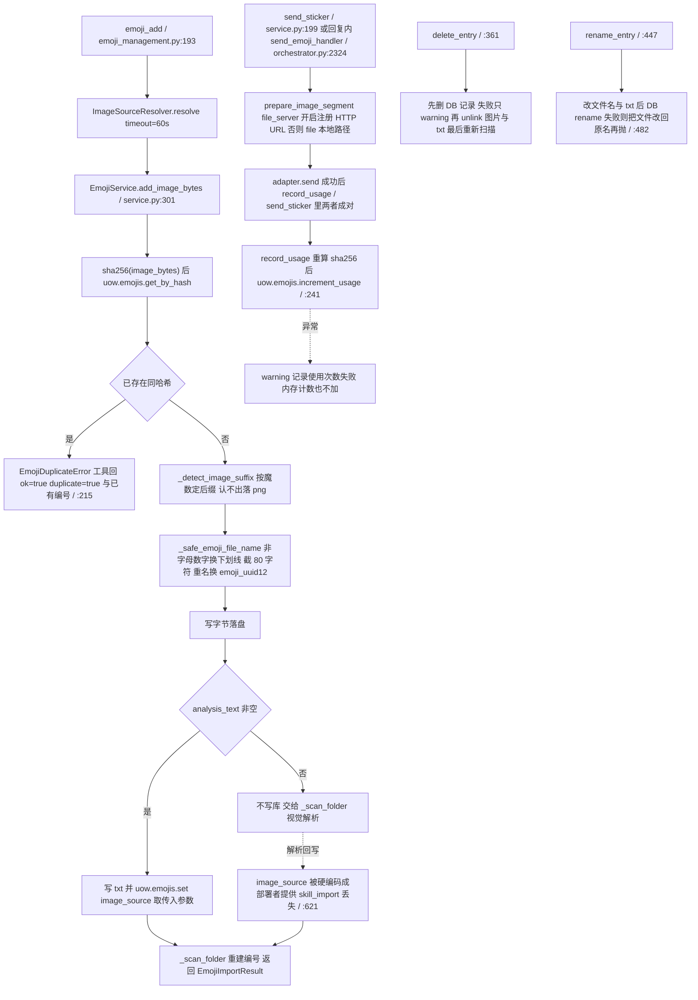

* `increment_usage` 是一条 `UPDATE ... SET use_count = use_count + 1`，**记录不存在时静默无效果**（`repositories/emoji.py:186-192`）：没有 `.txt` 描述、视觉解析又失败的表情包可能根本不在库里，`use_count` 永远是 0。
* 重复加入是**幂等成功**而不是错误：`EmojiDuplicateError` 继承 `ValueError`，工具层转成 `ok=true, duplicate=true`（`emoji_management.py:215-225`）。这是 `fix(1)` 的产物——当时同一张图跨 4 个事件反复失败，占工具失败率 35.5%。
* `send_sticker` 的前置校验是三道：能力未注入抛 `RuntimeError`、编号不存在抛 `LookupError`、文件不在磁盘抛 `FileNotFoundError`；工具层统一转成 `ok=false, error`。
* 回复内发的表情包（`send_emoji_handler`）与随机触发的都走 `record_usage`，但**随机触发那条把异常吞成 debug 日志**（`orchestrator.py:1967-1972`），排查「使用次数没涨」时两条路径分开看。
* `update_entry_description` 与 `rename_entry` 都以文件名为主键重建索引；`delete_entry` 先删库再删文件，因此库删失败会留下「文件已删、记录还在」的状态，由下次 `_scan_folder` 的幽灵清理收尾。

### 统一图片来源解析：六种参数与 Adapter 回源链

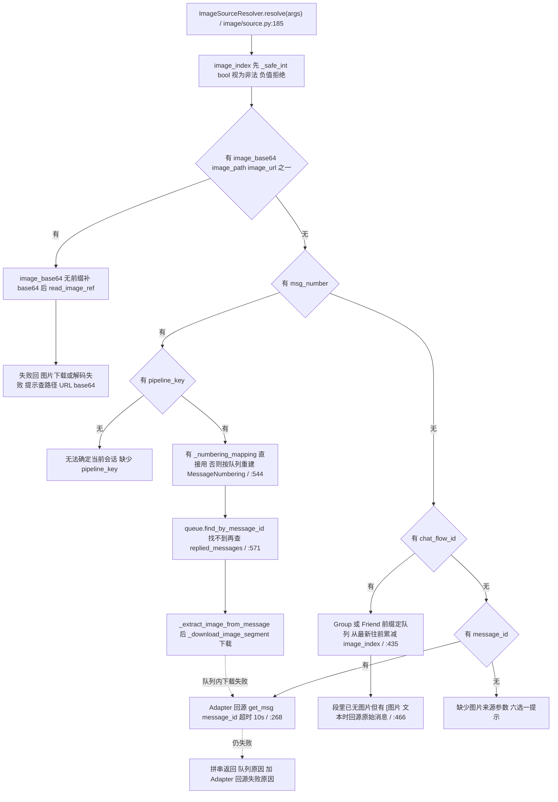

* 参数优先级是**写死的顺序**：`image_base64` 或 `image_path` 或 `image_url` 先看，其次 `msg_number`，再 `chat_flow_id`，最后 `message_id`；同时给多个只认靠前的那个，不合并。
* `_download_image_segment` 的 URL 分支会**吞掉异常继续走 `file` 回源**（`:396-404`），而 `get_image` 分支的异常会带原因返回，所以同一张图两条路的错误文案不同。
* **只有 `image_context` 传了 `max_bytes`**（`image_context_skill.py:179`，10 MiB），此时才启用 `_read_bounded_image_ref`：`data:` 头必须形如 `data:image/...;base64`、base64 严格校验、HTTP 流式累计限长、本地文件先查 st_size。`vision_detect_skill.py:35` 与 `emoji_management.py:49` 都**不传**，即无大小上限。
* `_may_be_auto_parsed_image` 是回源的判据：自动解析会**原地**把 image 段换成 `[图片：...]` 文本，导致队列里再也数不出图片，只能凭 `message_id` 回源（`:313-326`、`:466-473`）。
* `chat_flow_id` 的 `image_index` 是**跨消息累计**的：从最新消息往前逐条扣减图片数，找到第 N 张为止（`:454-478`）。
* **入口先查登记表**（`_download_image_segment` 开头）：命中即 `return None, 过期说明`，连 `image_http_client` 都不进；终端失败才登记。

### 拉不到的图片：进程内登记表 + 过期时的描述回显

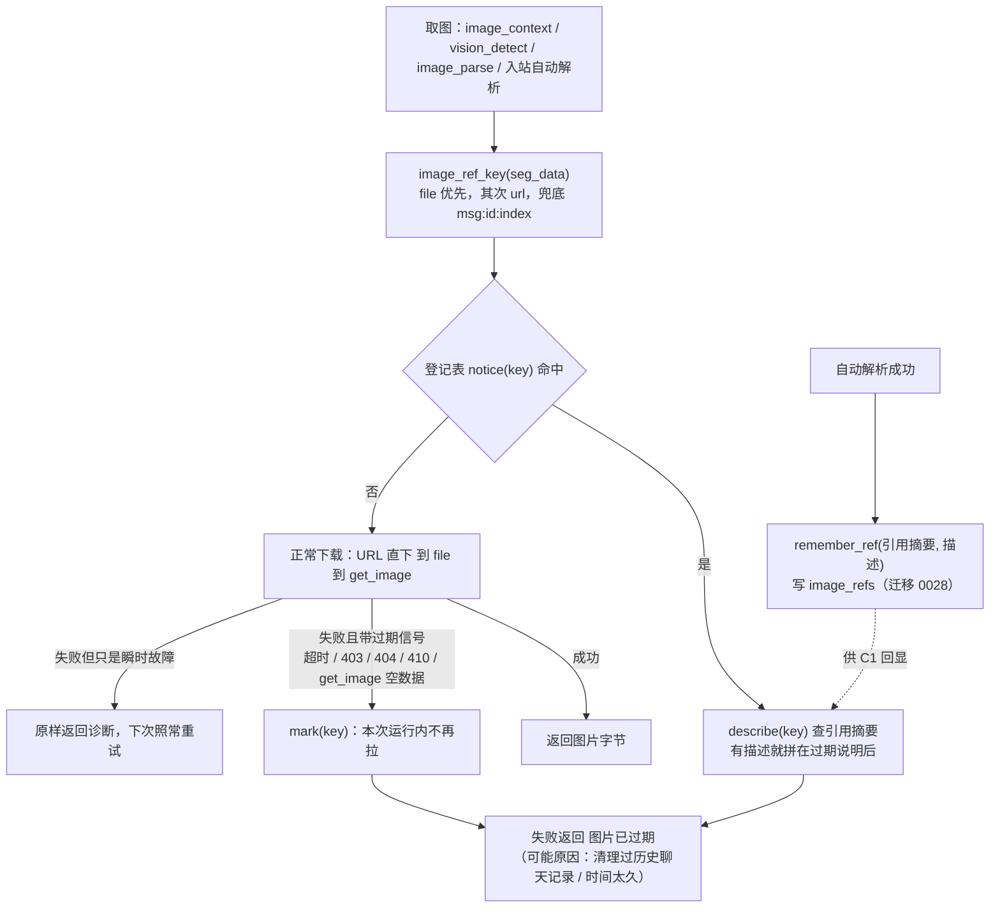

* **登记表只在内存里**（`ImageUnavailableRegistry`，容量 512，LRU）：语义就是「本次运行内不再拉」。进程重启即清空 —— 设备侧补回了历史记录，重启一次就能重新尝试。
* **超时单价 15 秒、多张并发**：`IMAGE_FETCH_TIMEOUT_SECONDS = 15`（`image/source.py`，下载超时统一口径）；
  一轮多张图、一条消息多张图都并发（`refresh_defaults` / `_parse_and_replace`），最坏只等一次超时。
* **为什么要登记**：带预热时队列里灌入大量历史消息，其中一部分图片的设备侧聊天记录已被清理（或图片过久被服务器回收），URL 与 `get_image` 两条路都拿不到字节。原生视觉的默认加载（`ReplyVisionContext.refresh_defaults`）只把**成功**的图缓存下来，失败的下轮还会再挑中，单张要烧满一个 30 秒窗口、默认一次 4 张 —— 最坏一轮 120 秒纯等待，正好等于群聊静默熔断阈值。
* **描述回显走引用摘要**：解析结果本体仍按内容哈希存 `images` 表；拉不到的图算不出哈希，所以另用 `image_refs` 存「引用摘要（`sha1(key)` 前 32 位）→ 描述」。查不到就只报过期，不影响主流程；`install_description_lookup` 由 bootstrap 接上（`bootstrap/__init__.py`）。
* **过期文案有两种形态**：独立成句的 `EXPIRED_NOTICE`（工具结果）与塞进正文的 `EXPIRED_INLINE`（`[图片：已过期…]` 消息段）。两者都不带原始 file id / 临时 URL —— 工具结果与模型上下文只该看到「过期」这件事。

### 本地检测模型库：目录扫描与 models.toml 索引合并

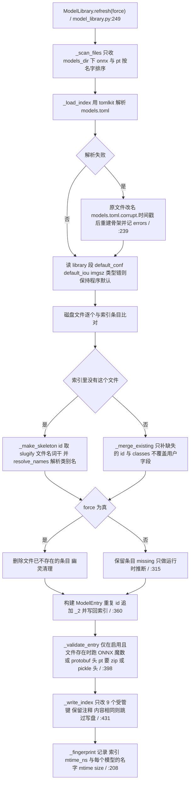

* 受管键固定为 `file id name description classes conf iou imgsz enabled`（`_MANAGED_KEYS`），用户自加的键与手写注释在写回时保留；`file` 与 `id` 不会被删键逻辑删掉。
* `classes` 解析支持三种写法：TOML 列表、逗号分隔字符串；留空则尝试 `resolve_names`（模型同目录 / 上一级的 `data.yaml`、`classes.txt`、`args.yaml` 指向的 yaml，UTF-8 失败回退 GBK）。
* `_validate_entry` 的头检查会把「文本文件冒充模型」挡下来：ONNX 要么 `ONNX` 魔数、要么合法 protobuf field 头（`0x08 / 0x10 / 0x0A / 0x12`）且不小于 1 KiB；`.pt` 要 `PK` 或 pickle 头。**只有 `enabled` 且文件存在的条目才校验**，`enabled=false` 的坏文件不会进 `report.errors`。
* `needs_refresh` 的指纹含**文件自身 mtime 与 size**，同名覆盖模型权重也能被感知（注释在 `:193-198`）；`_write_index` 内容无变化时不写盘，避免 mtime 抖动引发无限刷新。
* `missing` 只是运行时推断，不写回索引：文件删了再放回来，条目自动复活。

### 引擎可用性与安装引导：onnx 优先、torch 备选与启动期不扫描

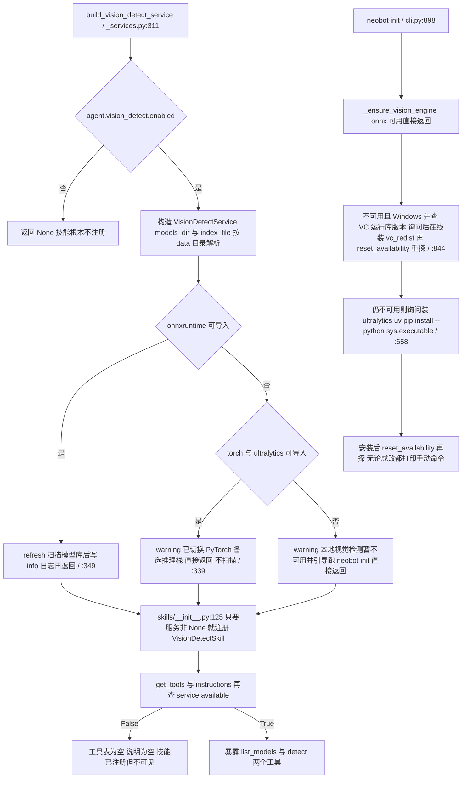

* `available` 的判据是「模型库有启用条目」且「onnx 或 torch 至少一个可用」（`service.py:124-129`）。库是**进程内状态**，只有 `refresh()` 会填充。
* **onnxruntime 不可用的分支直接 return，跳过了启动期扫描**（`_services.py:339-348` 的 early return 在 `try: service.refresh()` 之前）。于是纯 torch 环境（或两个引擎都缺的环境）启动后 `_entries` 为空、`available` 为 False、工具表为空；`neobot init` 只把索引写到磁盘，**新进程里库依然是空的**，工具依旧不出现。这是「装好了 ultralytics 却没有 vision_detect 工具」的直接原因。
* `engine_error(name)` 会先触发探测再返回缓存的导入异常文本，用来区分「未安装」与「装了但 DLL 加载失败（如 1114）」；`reset_availability()` 是修复后的重探开关，只有 `cli.py` 的安装引导会调。
* VC++ 运行库检测是 Windows 专属（`_VC_DLLS` 六个 DLL，版本基线 14.40.0.0，`cli.py:685-693`），非 Windows 直接走 ultralytics 分支。
* `neobot init` 走 `IndexRunner.run_sync(force=args.force)`，注册的任务只有 `vision_detect` 一个（`indexer.py:95-105`）；`--force` 才会清幽灵条目。

### 推理输入输出与摘要：letterbox、阈值、NMS 与阈值口径不一致

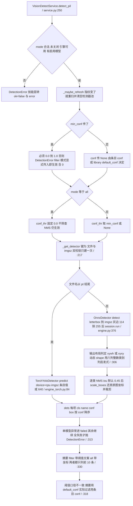

* 输入侧有三道闸：解码前按 `max_pixels = 40_000_000`（约 6300 见方）拒绝超大图、`ImageOps.exif_transpose` 应用手机竖拍方向、`convert(RGB)`；解码失败返回 `ok=false` 而不是抛（`service.py:389-407`）。
* 类别名的三级来源：`OnnxDetector` 有 `names` 就用它，否则从输出 shape 推断 `nc` 并生成 `cls0`、`cls1`；`TorchYoloDetector` 优先自定义 `names`，再退回权重自带 `model.names`，再退回字符串化的类别号。
* 输出布局是启发式判定：静态 shape 满足「第 1 维大于第 2 维且第 2 维不小于 6」按 `xyxy`（NMS 后导出），否则 `xywh`；动态 shape 时用「六列且类别列近似整数」判断（`engine.py:305-316`），再不行就转置重试一次。
* `mode=all` 的 `conf=0.0` 会让 `mask = confs >= 0` 全通过，因此 `results` 可能很长，但摘要固定只列 10 条；`filter` 模式未命中时的文案会写出阈值百分比——**这个百分比取的是 `[library].default_conf`**，模型条目自定义 `conf` 时数字与实际过滤阈值不一致。
* `elapsed_ms` 只累计**成功模型**的推理耗时（`total_ms += elapsed_ms` 在 except continue 之后），失败模型不计入。

## 关键状态

| 状态 | 谁置位 | 谁清理 | 失败时停在哪 |
|---|---|---|---|
| `EmojiService._entries` 编号映射 | `_scan_folder` 走 `_rebuild_mapping`；读接口走 `_merge_disk_entries_fast` | 目录无图片时 `_entries.clear()`；`_rebuild_mapping` 整体替换 | DB 查询或写入异常只记 error 日志，索引仍重建（编号可能暂时与库不一致） |
| `_last_dir_snapshot` | `start()`、每次 `_scan_folder` 末尾、`_notify_disk_changed` | `stop()` 置 None | 为 None 时只记基线不触发刷新（服务未 start 的安全阀） |
| `_disk_refresh_task` 即时刷新 | `_schedule_disk_refresh`（读接口触发） | 任务自身结束；`stop()` 先 shield 等 5s 再 cancel | 刷新异常只 error 日志，不影响读取 |
| `_refresh_task` 300s 定时循环 | `start()` | `stop()` cancel 并 await | 单轮异常只 error，循环继续 |
| `.txt` 侧文件（描述副本） | 视觉解析回写、`update_entry_description`、`add_image_bytes`（有 description 时） | `delete_entry`、去重删除时一并 unlink | `[解析失败]` 与 `[未配置视觉模型]` 也会落盘并被当成权威描述 |
| `ImageParseService._pending[queue_key]` | `parse_message_images` | 任务 done 回调；`wait_for_queue` 开头 pop | 无人等待时靠 done 回调回收，集合空即删 key |
| `ImageAnalysis` 描述缓存行 | `_parse_single_image`（`source=chat_image`） | 本图范围内没有 TTL 与清理 | set 失败只 warning，同一张图下次再调一次视觉模型 |
| `VisionDetectService._detectors` 池 | `_get_detector` 双检锁 | `refresh()` 清空；`close()` 清空并重建 ModelLibrary | 构建或推理异常进 `failed_models`，全部失败才抛 `DetectionError` |
| `ModelLibrary._fingerprint` | `refresh()` 末尾 | `close()` 换新实例（回到 None） | 指纹不一致即触发一次全量 refresh |
| `models.toml` | `_write_index` 增量更新 9 个受管键 | `force` 刷新时删除幽灵条目 | 写失败只进 `report.errors`（只读目录不阻断启动） |
| 引擎可用性缓存 `_usable` 与 `_torch_usable` | 首次读 property 时探测并缓存异常文本 | `reset_availability()`（`neobot init` 修复后重探） | 两者都 False 时 `available` 为 False，工具表为空 |
| 会话级图片等待闸门 | `wait_for_queue` 的 `pop`（谁先调用谁拿走） | 超时后 cancel 未完成任务 | 超时只 warning，未替换的图片段按原样进 prompt |
| `ImageUnavailableRegistry`（进程内） | 取图终端失败且带过期信号时 `mark` | 无 TTL；LRU 挤掉最久未命中；进程重启清空 | 命中即失败返回、不发请求；描述回显查询失败只当「没有描述」 |
| `image_refs` 引用索引行（迁移 0028） | 自动解析成功后 `remember_ref`（引用摘要 → 描述） | 写入时顺手清掉超过 30 天的行 | 写失败只 warning；查不到描述时过期说明照常返回 |

## 易错点

* **解析失败会被固化**：`[未配置视觉模型]` 与 `[解析失败]` 会被写进 `.txt` 侧文件（`service.py:612`），而 `_read_sidecar_text` 非空即视为权威描述（`:562-568`），这张图**永不重试**。恢复只能删 `.txt` 或走 `emoji_update` 覆盖。
* **`random.randint(1, emoji_count)` 会打空**：编号不复用、只增不减，删除后集合有洞且最大编号可大于总数；命中空洞是**静默不发**（`orchestrator.py:1946-1949`）。「偶尔这次没发表情包」先看这里。
* **`group_agent_silent_timeout_seconds = 0` 会让图片等待变成无限等**：`wait_for_queue` 只在 `timeout > 0` 时加超时（`parser.py:111`），群聊档位把这个值原样传下去（`orchestrator.py:4333`）。想让群聊「不等图」不能填 0。
* **onnxruntime 不可用时启动期不扫描模型库**（`_services.py:339-348` 的 early return 跳过 `refresh()`）：纯 torch 环境里 `available` 恒 False、工具表为空，跑过 `neobot init` 也不会好——索引在磁盘上，进程内模型库仍是空的。
* **摘要阈值与实际过滤阈值不是一个来源**：过滤用条目 `conf`（`service.py:231-241`），摘要文案用 `[library].default_conf`（`:318`）。模型自定义阈值时，「未检测到任何目标（阈值 35%）」里的数字是错的。
* **`emoji_add` 的 `image_source` 参数会被丢掉**：只有带 `description` 时才写库（`service.py:338-353`），否则交给 `_scan_folder`，而解析回写硬编码 `image_source="部署者提供"`（`:621`）。想保住 `skill_import` 必须同时给描述。
* **两套哈希口径别混用**：emoji 与 `prepare_local_image` 用 `sha256(原始字节)`，入站图片描述缓存用 `md5(放大后字节)`（`parser.py:159`）。同一张图在两条链路里是两条独立记录，不会互相命中。
* **`parse_image` 工具不吃描述缓存**：`image_parse_skill.py` 全程没有 `ImageAnalysisService` 调用，与自动解析各付一次视觉模型调用；`image_context__add_image` 与它是两种能力（前者塞原图，后者要描述），见 `03b`。
* **`parse_image` 的 `timeout_seconds` 被当成下载超时**：默认 300s、夹在 1 到 1800s（`image_parse_skill.py:809-812`），并直接传给 `_resolve_by_*`（`:887 / :897 / :908 / :923 / :934 / :941`）。单张图下载可阻塞 5 分钟。
* **读接口有副作用**：`emoji_count`、`get_entry`、`list_entries`、`search_entries` 都先走 `_notify_disk_changed`，快照变化时**同步**对新文件做 `sha256(read_bytes())`（`service.py:900`）再起后台任务。别在热路径上反复读。
* **`inspect_image` 是死接口**：docstring 写着「计划在 `_parse_single_image` 之前插入检测」，HEAD 上零调用点，本地检测不参与自动图片解析。别把它当有效链路。
* **`neobot init` 默认不清幽灵条目**：`force=False` 时文件已删的索引条目保留（只在 `report.missing` 里计数），只有 `--force` 才移除（`cli.py:965` → `indexer.py:48` → `model_library.py:313-315`）。
* **去重保留 mtime 更旧的那份**（`service.py:526-540`）：同一内容两个文件名时，被删掉的是后落盘的那个名字，日志两条分支文案相同。
* **`fix(1)` 的语义变更**：`emoji_add` 由「重复即拒绝」改成幂等成功（`ok=true, duplicate=true` 加已有编号），因为旧语义下同一张图跨事件反复失败、占工具失败率 35.5%。改回去会重现那批无意义重试。
* **别把瞬时故障登记成「图没了」**：登记后本次运行内**不会**再拉这张图，判据放宽（比如把任意异常都算过期）会一次性废掉一批本来还能取的图。判据只该认超时与 403/404/410（`unavailable.py` 的 `is_expiry_failure`），恢复手段是重启进程。
* **过期 ≠ 解析失败**：拉不到的图现在落 `[图片：已过期…]` 而不是 `[图片解析失败]`，两者语义不同 —— 前者说明这张图**已经取不到**（别重试），后者只是这一次没解析出来。
* **`image_refs` 存的是摘要不是原文**：`ref_digest` 取 `sha1(引用键)` 前 32 位，临时 URL 里的令牌与 file id 都不落盘；不要为了「看起来可读」把原文塞回去。
* **`image_parse` 的引用加载器按设计可读任意本地路径与 URL**（`fix(12)` P1-5 定为设计特性，只写文档不改代码）：写新的图片读取入口时不要照抄 `image_parse_skill._read_image_ref`，需要边界就用 `image/source.py` 的 `max_bytes` 受限读取。
