# 15 绘画子系统：提交判据 · 参考图接口分派 · 落盘清理 · 通知回执

## 范围

本图覆盖 `app/src/neobot_app/drawing/` 这 5 个文件（2792 行）：

* `service.py`（2017 行）：`CreatorImageService`——生图请求组装、参考图解析、`/images/edits` 与
  `/images/generations` 分派、结果落盘与命名、图库/暂存区记录、失效清理、本地图片后处理；
* `manager.py`（653 行）：`BackgroundDrawingManager`——提交判据（未启用 / busy / cooldown）、
  冷却、任务容量、后台执行、通知投递与通知重试；
* `config.py`（63 行）：`DrawServiceConfig.from_schema` 与 `ImageGenerationError`；
* `tasks.py`（34 行）：`DrawTask` 数据结构；
* `__init__.py`：包导出。

**不画什么**（相邻图）：

* `skills/drawing_skill.py` 的工具定义与提示词（06-tools-skills）；
* `reply/tools.py` 的 `drawing__inspect_image`、`check_last_drawing`、
  `cancel_task(drawing_cooldown)` 与视觉工具隐藏规则（03b-reply-tools）；
* `image_pipeline.prepare_local_image_async`、`ImageStagingPool`、`file_server`、
  `media_sender`（14-emoji-image-parse、13-render-cards、20-avatar-files）；
* `[models.assignments].creator_image_models` 的配置与模型注册（05-llm-routing、01b-config-system）；
* `BackgroundNotificationHub` 的队列实现与消息队列镜像（03、16）。

**spec / 直觉与现实的差异**（逐条落到节点上）：

1. **没有绘图任务队列**：管线忙时 `submit` 直接回 `status=busy`，不排队、不合并、不覆盖；
   模型要自己稍后再试。
2. **没有任务级超时、没有取消接口**：能取消的只有冷却；在途生图只能等 httpx 超时或
   进程 `shutdown()`。`DrawTask.status` 的 `timeout` 只在关停与通知超时时写入。
3. **默认尺寸对不上**：代码 `DEFAULT_IMAGE_SIZE="512x512"`（`config.py:15`），工具提示词里
   写的是「未指定时默认 1024x1024」（`skills/drawing_skill.py:102`）。
4. **`draw_max_retries` 不是绘图重试次数**：它只控制**通知**重试；绘图本身失败从不自动重提。
5. **完全没有计费/用量记录**：本目录 0 处 `usage/billing/cost` 写入；生图走裸 httpx 不经过
   chat Provider；连图库自动描述调 `vision_provider.chat` 也没有 `record()`（详见细节块 11）。
6. **hub 存在时 `manager.poll_notification` 是死分支**：bootstrap 无条件创建
   `BackgroundNotificationHub`，orchestrator 命中 hub 分支后直接 `return`（`orchestrator.py:3818-3831`），
   `_notification_queues` 只有在 `notification_hub is None` 的旧装配下才会用到。
7. SPLIT-MAP 标注 `drawing/service.py` 为 1821 行，实际 2017 行（`wc -l` 口径）。

## 流程

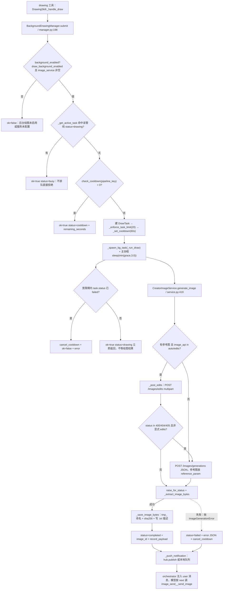

## 时序

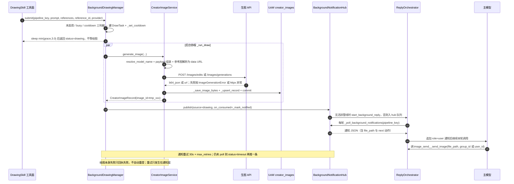

## 细节

### 提交判据：三种拒绝与 3 秒宽限期

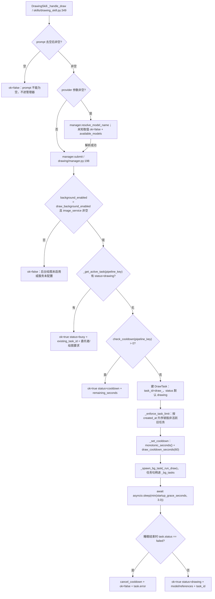

要点：`provider` 在工具层**先校验后提交**，未知取值不会白跑一次任务并吃掉冷却（注释就写在
`drawing_skill.py:370`）。宽限期是「启动期失败不占冷却」的窗口，代码把配置值再夹到 3.0 秒，
所以 `startup_grace_seconds` 配大于 3 也不会有更长窗口；宽限期失败直接回
`{"ok": false, "error": ...}`（`manager.py:263-265`）。`min(grace, 3.0)` 是提交路径上唯一的等待，
它**不保证**绘图已经开始——生图 HTTP 在后台协程里。

### 并发、容量、超时与取消：四个「没有」

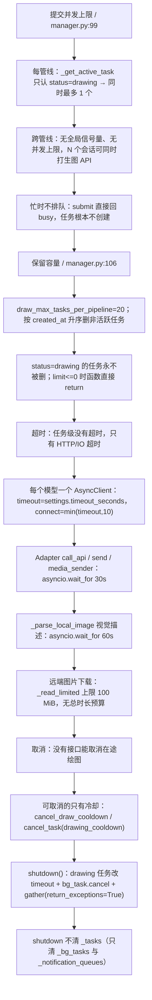

`_tasks` 是**内存字典**：进程重启即全部丢失，没有任何持久化（`DrawTask` 不落库）。
因此 `check_last_drawing` 在重启后必然回 `found=false`。`shutdown()` 由
`runtime/application.py:243/465` 与 `orchestrator.py:950` 挂进停机/回滚步骤。

### 参数组装：payload 的每个字段从哪里来

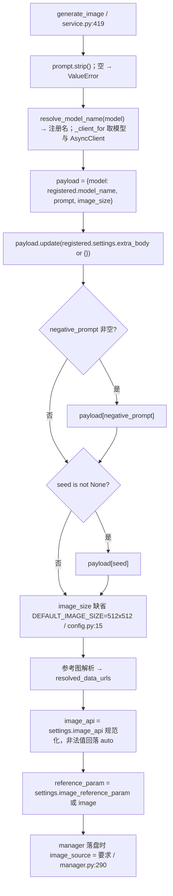

工具面只暴露 `prompt / negative_prompt / image_size / reference_id / references / seed /
requester / requirements / provider`（`drawing_skill.py:157-182`），风格与尺寸都靠 `image_size`
字符串与提示词表达，没有独立的 style 字段。`extra_body` 是模型级兜底：会被**展开进顶层**，
所以配置里能覆盖 `model` 之外的任意键。

### 参考图解析：一个数字、七种前缀、两条兜底

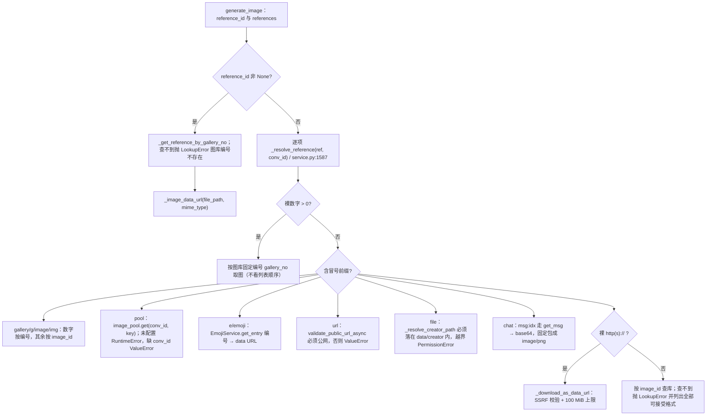

前缀解析与 `resolve_source_to_path`（`service.py:1673`，供图片暂存池 `put` 用）是**两套独立实现**：
前者产出 data URL、后者产出本地路径，能接受的前缀集合不同（后者没有 `pool`/`image` 别名，
`url:` 分支会落盘到 `creator/tmp/pool_url_<md5前12>.<ext>`）。

### /images/edits 还是 /images/generations：分派、字段名与回退

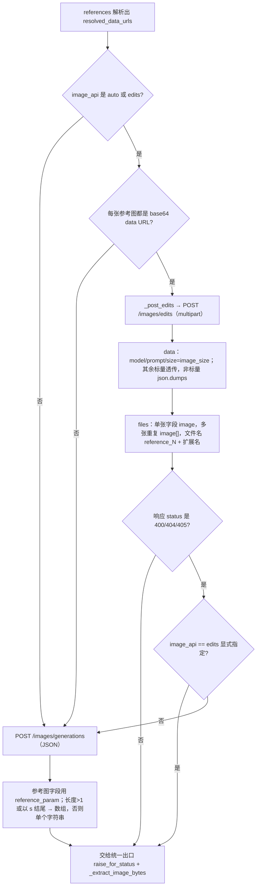

`edits` 用 `size`、`generations` 用 `image_size`——两个端点参数名不同，这是有意为之（中转站
普遍只认 `image_size`）。回退只覆盖 400/404/405：`401/403/429/5xx` 一律不重试、直接抛
`ImageGenerationError`，错误体里带 `response_body` 供 agent 诊断。

### 失败分级：抛什么、怎么序列化、谁重试

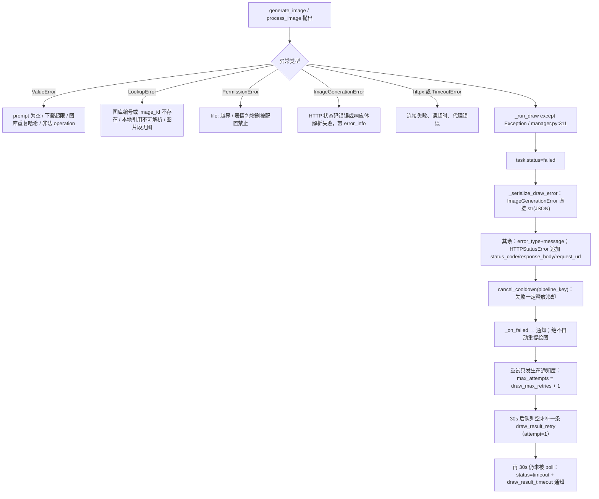

文件级失败语义对照：**抛异常**＝上表；**降级**＝`image_api` 非法值回落 `auto`、`edits` 404 回退
`generations`（400/404/405）、无视觉模型时描述写占位符；**丢弃**＝hub 队列满时丢最旧通知、超限时删最旧非活跃
任务；**重试**＝只有通知层有重试。

### 结果落盘、命名与描述：tmp_xxx / g_xxx 与 .txt 伴生文件

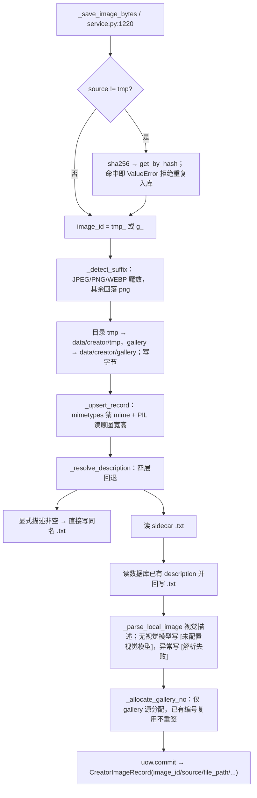

`_record_payload`（`service.py:1918`）决定回执字段：`image_id/source/file_path/prompt/
description/mime_type/width/height`；`description` 在 DB 为空时会现读 .txt。图库编号是
**高水位消耗品**：删除与重命名都不回填，编号只增不复用（`_allocate_gallery_no` 注释）。
`gallery_rename` 会连带改 .txt，DB 改名失败时把文件改回去（`service.py:846-854`）。

### 清理策略：12 小时过期、哈希去重、停机清空 tmp

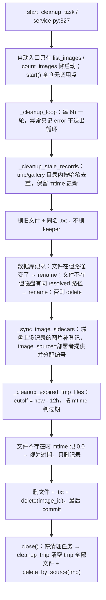

常量在 `service.py:88-89`：`_CLEANUP_INTERVAL_SECONDS = 6*3600`、`_TMP_MAX_AGE_SECONDS = 12*3600`。
手工往 `creator/tmp` 或 `creator/gallery` 目录丢图后，靠 `_sync_image_sidecars` 补登记：
它会给没有记录的图片生成 `g_xxx`/`tmp_xxx` 记录、写 .txt 描述并分配图库编号
（`_cleanup_stale_records` 只处理已有记录，不做磁盘扫描登记）。

### 多模型分派：注册名、客户端与选择解析

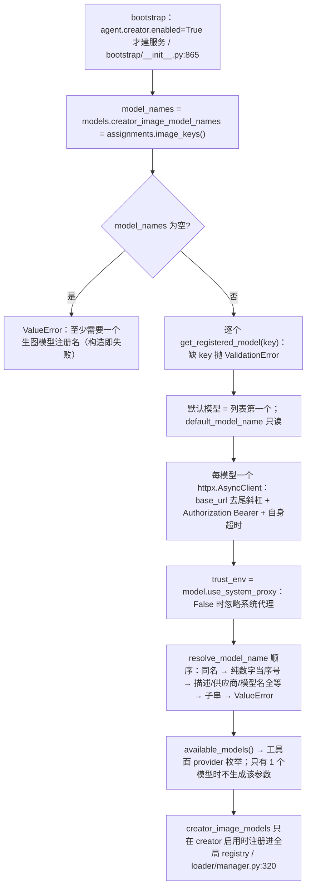

`null`（未指定）与空串都解析为默认模型；**纯数字是 0 基序号**，不是图库编号——同一串数字
在 `references` 里是图库编号、在 `provider` 里是序号，这是最容易读错的一处。
`manager.resolve_model_name` 只是转调 `service.resolve_model_name`（服务未注入时返回空串）。

### 通知投递与工具面回执：从 image_id 到用户看到图

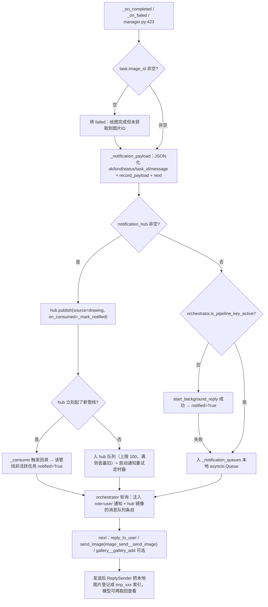

`next` 里的工具名与参数是**给模型照抄的**（`manager.py:372-414`）：群聊填 `group_id`、私聊填
`user_id`，两者都取自 `task.conversation_id`；失败分支明确写了「不要在未询问用户的情况下
自动重新提交绘图」。主模型侧还有两个查询口：`check_background_tasks` 合并
`get_pipeline_status`（冷却 + 活跃任务 + 最近 5 条），`check_last_drawing` 走 `get_last_draw_info`
（只回最近一条非 drawing 任务，含 `record_payload` 与错误）。

### 安全、成本与观测：密钥从哪来、什么完全没记录

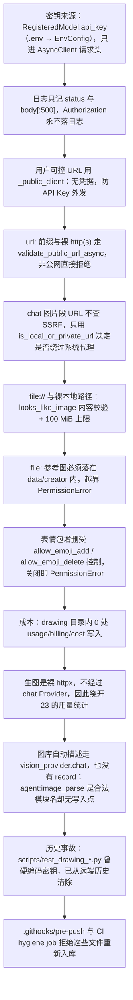

观测点（排查第一手线索）：日志 logger 名 `app.creator_image` / `app.drawing`；关键事件
「生图接口返回错误状态码」「生图接口返回数据解析失败」「后台绘图任务失败」「推送绘图完成通知」
「绘图通知超时」「后台绘图任务超出上限已自动销毁」「creator 过期临时图片已清理」。
任务回执里的 `error` 字段就是 `_serialize_draw_error` 的 JSON 字符串。

## 关键状态

| 状态 / 字段 | 谁置位 | 谁清理 | 失败时停在哪 |
|---|---|---|---|
| `DrawTask.status` = drawing | `submit` 建任务时默认值 | `_run_draw` 改 completed/failed；`shutdown` 与通知重试改 timeout | 卡在 `drawing` 只可能是进程在途或已崩溃；无任务级超时兜底 |
| `DrawTask.status` = completed | `_run_draw` 拿到 record 后 | 无（任务只是记录） | `image_id` 为空会被 `_on_completed` 改回 failed |
| `DrawTask.status` = failed | `_run_draw` except 分支 | 无 | error 是 JSON 字符串，最终随通知交给模型 |
| `DrawTask.status` = timeout | `_retry_notification` 结束仍未被 poll；`shutdown()` 对在途任务 | 无 | 通知链路失败停在这里；图片其实已生成 |
| `DrawTask.notified` / `notification_count` | `_mark_notified`（轮询取出或 hub 消费回调）；重试循环自增 | 随任务被 `_enforce_task_limit` 删除而消失 | 到达 `max_attempts` 仍未 notified → timeout |
| `_cooldowns[pipeline_key]` | `submit` 里 `_set_cooldown`（提交前） | `cancel_cooldown`：宽限期失败、`_run_draw` 失败、`cancel_draw_cooldown`、自愈钩子、`shutdown` | 成功后**不清理**，靠 60s 自然到期 |
| `_tasks` / `_bg_tasks` / `_notification_queues` | `submit` / `_spawn_bg_task` / `_push_notification` | `_enforce_task_limit`、`shutdown`（后两者整体清空） | 内存态，重启即丢；无持久化 |
| `creator_images` 行 + 磁盘文件 | `_save_image_bytes` → `_upsert_record` | `gallery_delete`、`_cleanup_expired_tmp_files`、`_cleanup_stale_records`、`cleanup_tmp` | 文件缺失的记录在下一轮清理被删；`_list_image_records` / `_search_single` 已先按 `is_file()` 过滤 |
| `creator_images.gallery_no` | `_allocate_gallery_no`（仅 gallery 源，高水位 +1） | 删除记录后**不回填**，编号留空洞 | 引用失效编号 → `LookupError 图库编号不存在` |
| 同名 `.txt` 伴生描述 | `_resolve_description` / `_sync_image_sidecars` | 随图片删除（unlink + with_suffix） | 写入的是占位符时，之后会被当成正式描述读回 |
| hub 通知队列 | `hub.publish` | `hub.poll`；空闲 1800s 惰性清理；满 100 丢最旧 | 无活跃管线且启动失败 → 留在队列等轮询 + 通知重试 |

## 易错点

1. **busy 不是排队**：`submit` 在管线已有 `drawing` 任务时直接回 `status=busy`，不创建任务、
   不进任何队列，冷却也不刷新。模型必须自己稍后再提交。
2. **`draw_max_retries` 重试的是通知不是绘图**：默认 1 → 首次通知后 30s 补一条
   `draw_result_retry`，再 30s 置 `timeout` 并发 `draw_result_timeout`。绘图失败从不自动重提。
3. **默认尺寸对不上文档**：`DEFAULT_IMAGE_SIZE="512x512"`（`config.py:15`），而工具提示词写
   「未指定时默认 1024x1024」（`skills/drawing_skill.py:102`）。调模型别信提示词这一句。
4. **冷却先设后跑**：`_set_cooldown` 在启动后台任务之前执行；失败会在两处被清（宽限期分支
   与 `_run_draw` 的 except），但**成功**保留满 60s。用户问「刚画完为什么不能再画」时看这里。
5. **hub 存在时 manager 的队列与 `poll_notification` 不可达**：bootstrap 无条件建 hub，
   orchestrator 命中 hub 分支即返回。排障要看 `BackgroundNotificationHub` 的队列与
   `on_consumed` 回调，而不是 `_notification_queues`。
6. **哈希去重会真删文件**：`_cleanup_stale_records` 在同一目录内按哈希保留 mtime 最新者，
   删掉其余文件与记录。手工复制过图片的部署会在 6h 后「少图」。
7. **占位描述会被持久化**：无视觉模型时写 `[未配置视觉模型]`、描述失败写 `[解析失败]`，
   都落进 `.txt`；而 `_read_sidecar_description` 优先读该文件，于是占位符变成正式描述。
8. **`close()` 清空 tmp**：正常停机后所有 `tmp_xxx` 文件与记录消失，历史消息里的
   `tmp_xxx` 引用失效（`file:` 退化路径还可能越出 `data/creator` 被 `PermissionError` 拒）。
9. **清理循环是懒启动的**：`CreatorImageService.start()` 全仓无调用点，6h 循环只在第一次
   `list_images`/`count_images` 后才启动；纯生图不列图库的部署只有停机时清 tmp。
10. **图库容量是 check-then-act**：`_ensure_gallery_capacity` 先 `count` 再写，并发导入可越过
    `gallery.capacity`（默认 10）；`gallery_add` 本身也不做哈希查重（只有 `_save_image_bytes`
    对非 tmp 源查重），同一张图可以先 `gallery_add` 再 `import_chat_image` 成两份。
11. **显式 `image_api=edits` 时没有回退**：400/404/405 直接 `raise_for_status` 报错；只有
    `auto` 才回退 `generations`。中转站不认 `/images/edits` 时改配置而不是改代码。
12. **绘图调试脚本禁止硬编码密钥**：`scripts/test_drawing_*.py`、`scripts/test_image_reference.py`
    曾带硬编码密钥，2026-09-11 已从远端历史彻底清除（force-push 重写）；
    `.githooks/pre-push` 与 CI hygiene job 会拒绝这些文件名重新入库。密钥唯一来源是
    `RegisteredModel.api_key`（`.env → EnvConfig`，SPLIT-MAP W59：`credentials/` 不是密钥仓库）。
13. **生图与图库自动描述都不计费**：本目录零处 `usage/billing/cost`；生图走裸 httpx 绕过
    chat Provider，`_parse_local_image` 虽走 `vision_provider.chat` 也没有 `record()`。
    `statistics/tracker.py:29` 的 `agent:image_parse` 是**没有写入点的合法模块名**，
    别把它当成已有的统计口径。
14. **面板看不到后台绘图**：`dashboard/api.py:788` 用 `getattr(drawing_manager, "list_active")`
    探测，而 `BackgroundDrawingManager` 没有这个方法 → `payload["background"]` 静默为空
    （相邻图 09b 的范围，改动时记得同步）。
