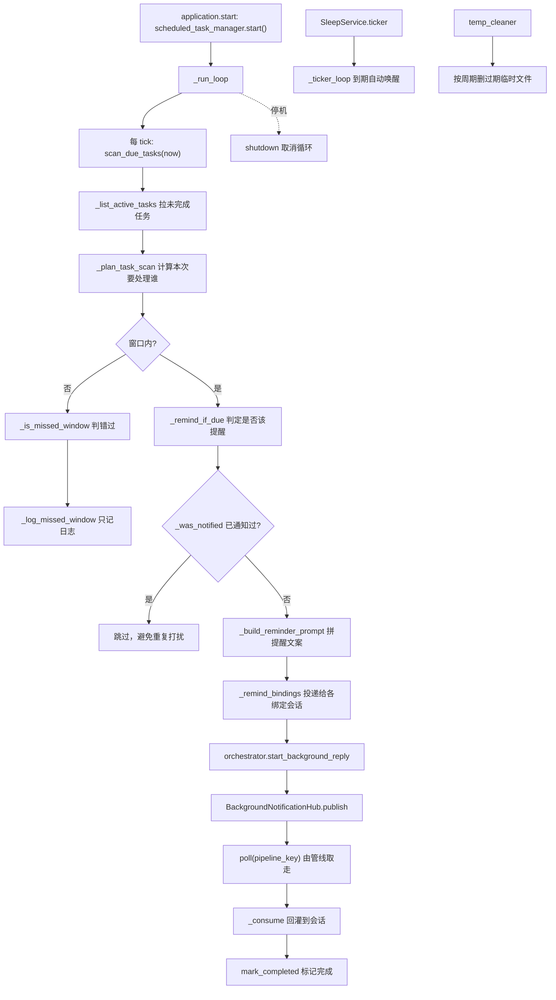
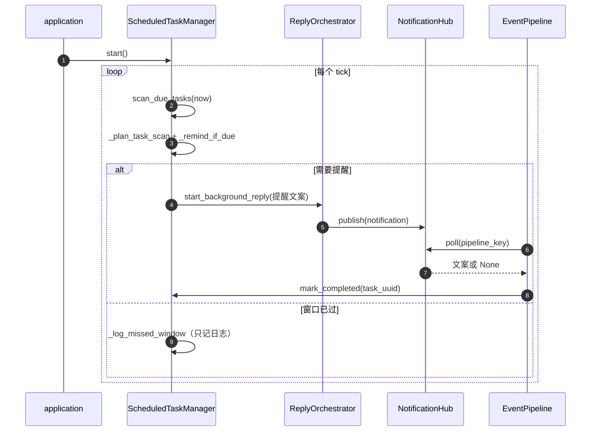
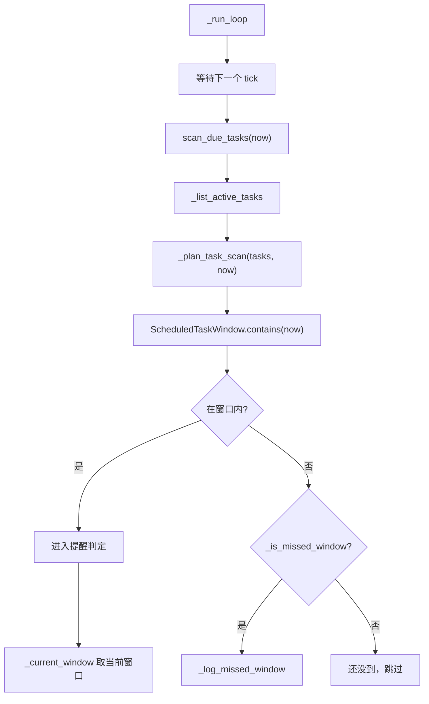
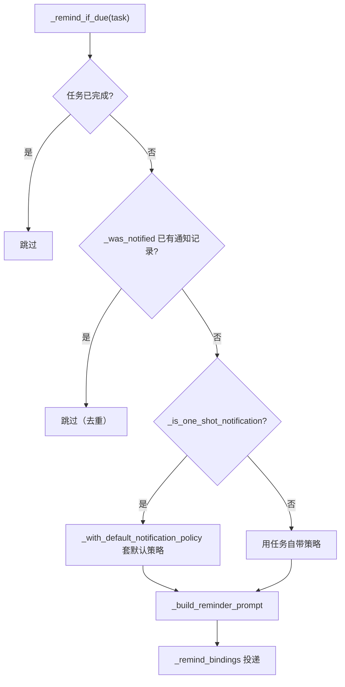
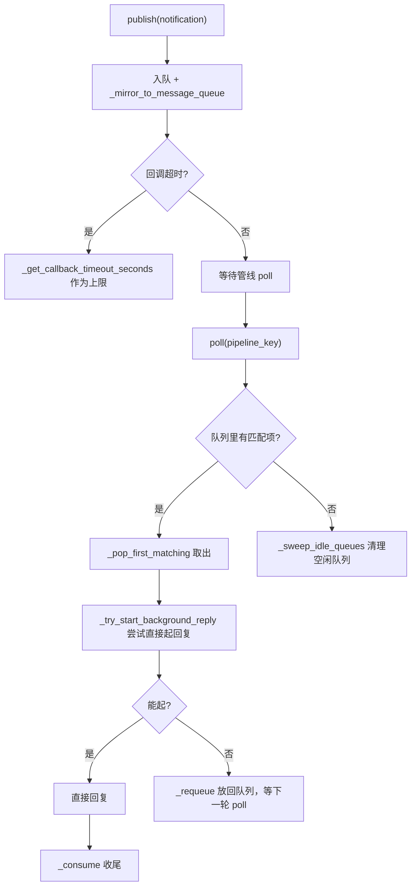
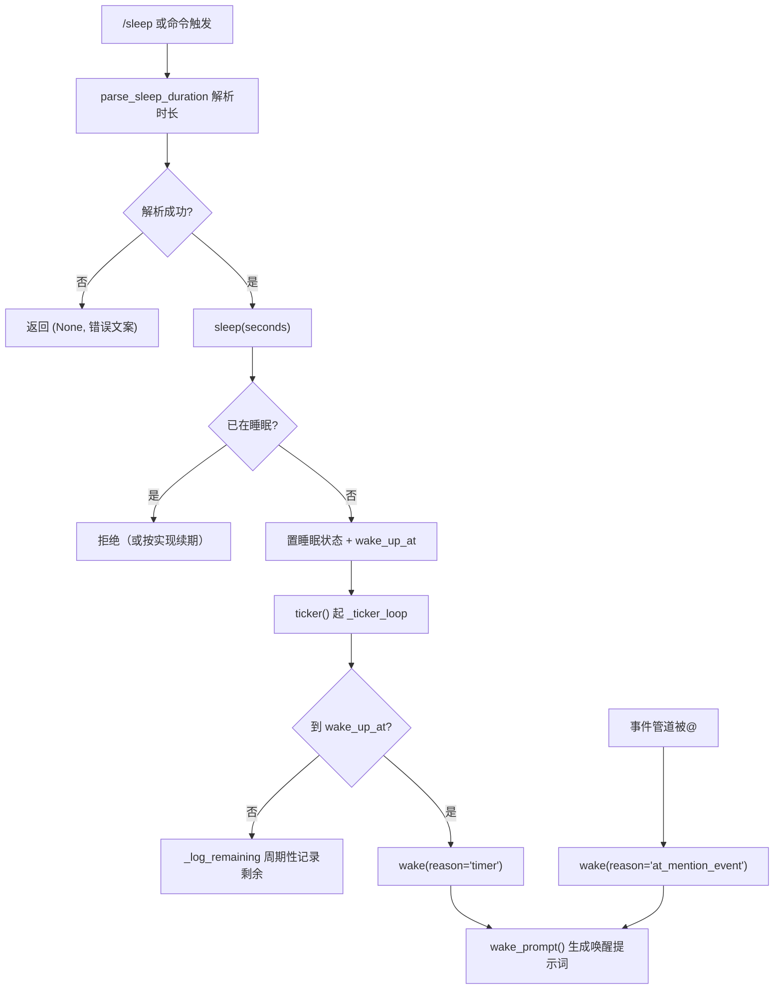
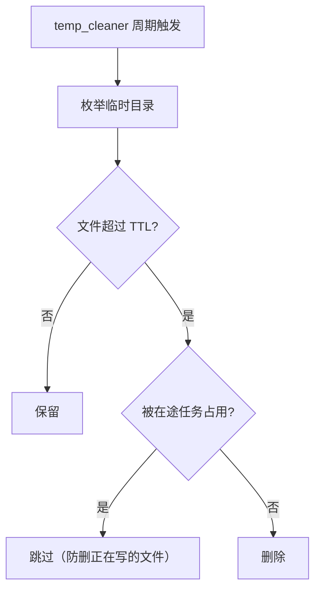

# 16 定时任务 · 睡眠 · 后台通知 · 临时清理

## 范围

四条与「时间」相关的链路：

* `ScheduledTaskManager`（888 行）：定时任务的扫描、到点判定、错过窗口、提醒投递与完成标记；
* `SleepService`（307 行）：`/sleep` `/awake` 的睡眠状态机与 ticker；
* `BackgroundNotificationHub`（344 行）：后台任务（绘画/解题等）完成后如何回到会话；
* `temp_cleaner`（191 行）：临时文件清理周期。

不在这里：/sleep、/awake 命令的解析与权限见 `17-commands.md`；睡眠期「仅被@可唤醒」的意愿判定
见 `02b-willing-probability.md`；面板的定时任务接口见 `09b-dashboard-api.md`。

## 流程

## 时序

## 细节

### 扫描循环与到点判定

到点判定是**窗口**而不是精确时刻（`ScheduledTaskWindow`，`scheduled_tasks.py:79`）：
窗口内的第一次扫描就会提醒，所以 tick 间隔直接决定提醒的及时性。
错过的任务**只记日志**（`_log_missed_window`，`:500`）不会补发 —— 进程停机期间错过的提醒不会补。

### 提醒判定：三重条件与去重

去重依据是任务记录里的通知字段（`_was_notified`，`:515`），不是内存标记 —— 进程重启后
仍不会重复提醒同一次。
不主动重试：投递失败只记日志，下一次扫描会重新判定（因为 `_was_notified` 尚未置位）。

### 后台通知中枢：publish / poll / consume

`_mirror_to_message_queue`（`:131`）是关键设计：通知同时镜像进会话消息队列，
这样**即使 poll 没被调用**，通知也不会凭空消失（下一次构建上下文时它已在队列里）。
`_sweep_idle_queues`（`:196`）按空闲时间清理，避免长期无人取的队列常驻内存。

### 睡眠状态机与 ticker

`is_sleeping` / `remaining_seconds` / `wake_up_at` / `wake_up_time_text`（`:148-184`）是只读观测面，
面板与意愿判定都靠它们。`wake_prompt` / `sleep_prompt` / `awake_prompt` 三个提示词方法
（`:260-293`）决定「睡眠/唤醒」时给模型什么上下文。
**睡眠不阻断命令**：命令解析在事件管道里早于意愿判定（见 `02c-event-pipeline.md`）。

### 临时清理：阈值与竞态

临时清理与 13 的 `image_pool`（300s TTL，只删引用不删磁盘文件）、14 的图片缓存是**三套独立阈值**：
清理临时文件不会清图片暂存池引用的文件，反之亦然。排查「文件莫名消失」时先确认是哪一套删的。

## 关键状态

| 状态 | 谁置位 | 谁清理 | 失败时停在哪 |
|---|---|---|---|
| 任务通知标记 | `_remind_if_due` 投递成功 | `mark_completed` | 投递失败不置位，下一轮重试 |
| 任务完成状态 | `mark_completed(task_uuid)` | 不清理（终态） | 完成后再扫描直接跳过 |
| 扫描循环 | `start()` -> `_run_loop` | `shutdown()` 取消 | 异常退出会让任务不再被扫描（无自愈） |
| 睡眠状态 | `sleep(seconds)` | `wake(reason)` 或 ticker 到期 | 到点自动唤醒，不依赖外部调用 |
| 通知队列 | `publish` | `poll` 取走 / `_sweep_idle_queues` 清理 | 无消费者时镜像进消息队列兜底 |
| 临时文件 | 各子系统写入 | `temp_cleaner` 按 TTL | 被占用时跳过 |

## 易错点

* **错过的窗口不补发**：`_is_missed_window` 只记日志；停机期间到点的提醒永久消失，需要补发得改这里。
* **任务扫描循环没有自愈**：`_run_loop` 异常退出后不会自动重启 —— 表现为「定时任务全部不再触发」，
  排查时先看循环任务是否还活着。
* **通知有两条路**：`poll` 正常取走 + 镜像进消息队列兜底。改其中一条要同时想另一条，
  否则会出现「重复回复」或「通知丢失」。
* **睡眠不阻断命令**：别把「睡眠 = 全静默」当成事实，命令解析在它之前。
* **三套临时清理阈值**（temp_cleaner / image_pool / 图片缓存）互不影响，排查文件消失要看来源。
* **`ticker` 是协程**：由 `application.background_coros` 拉起，停机时随应用一起取消；
  手工调用 `sleep()` 而不启动 ticker 会导致永不到点自动唤醒。
