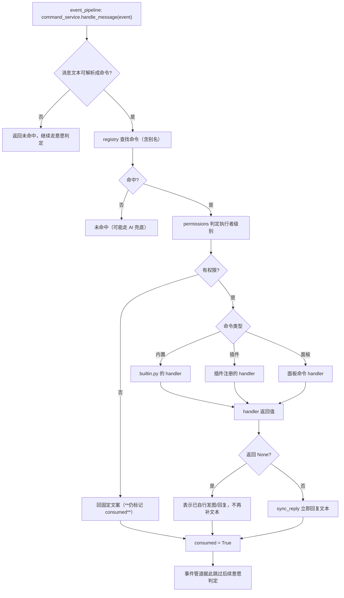
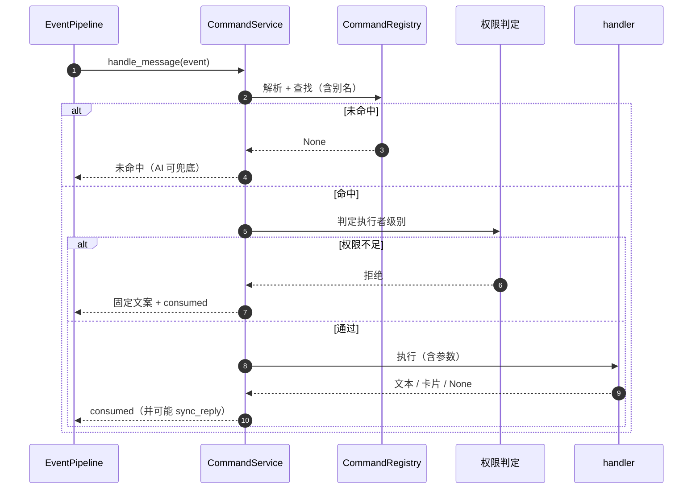
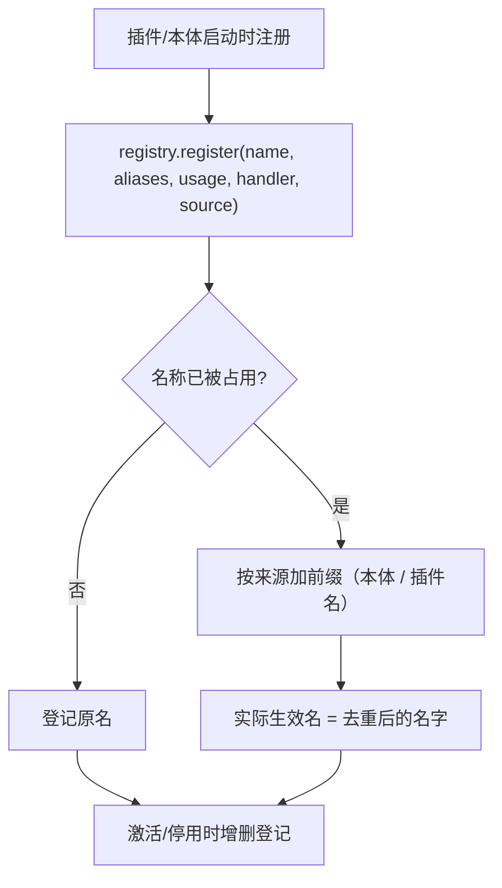
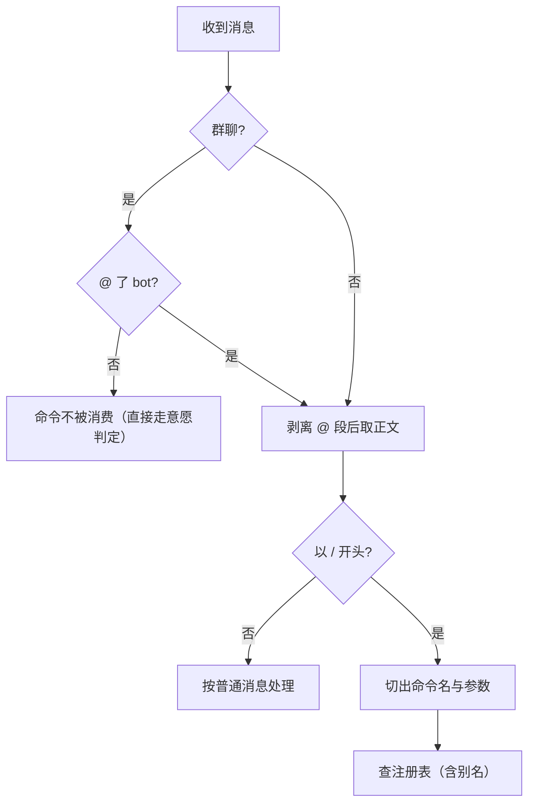
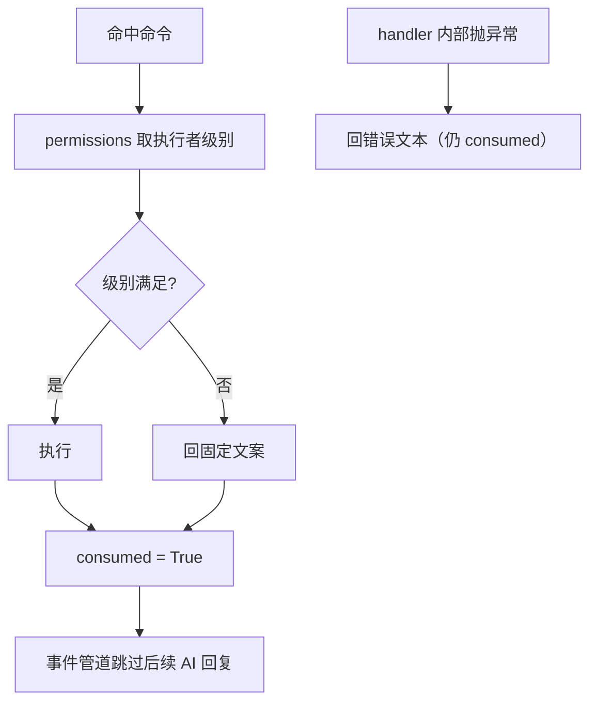
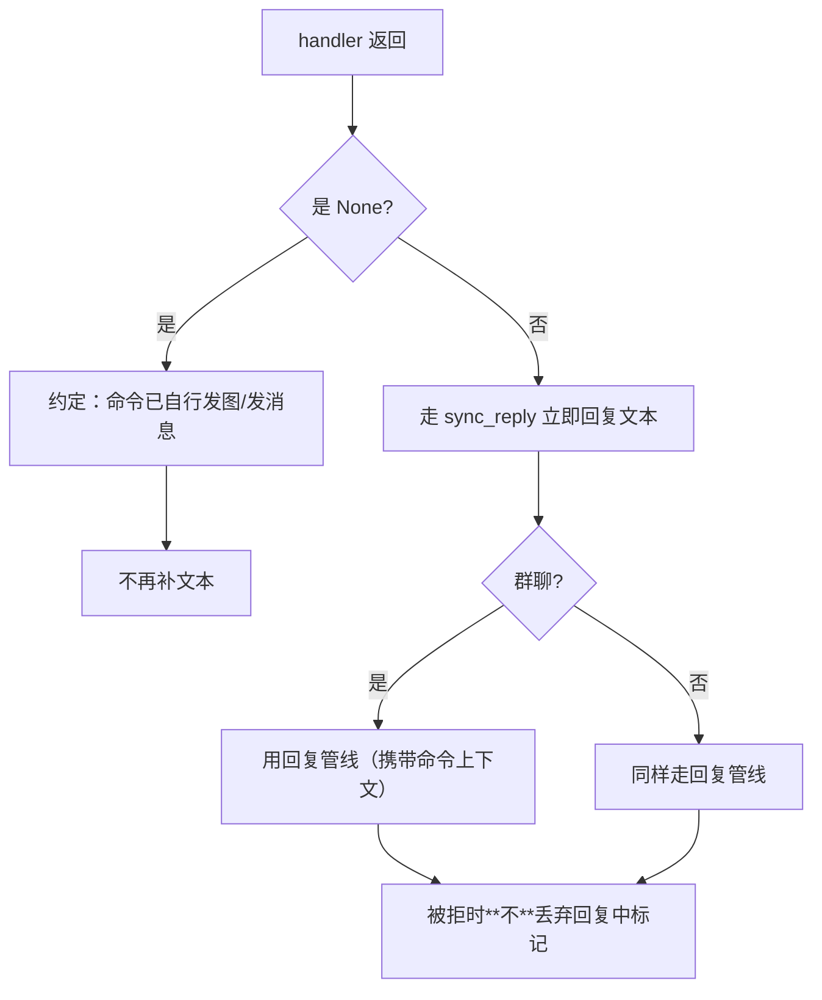
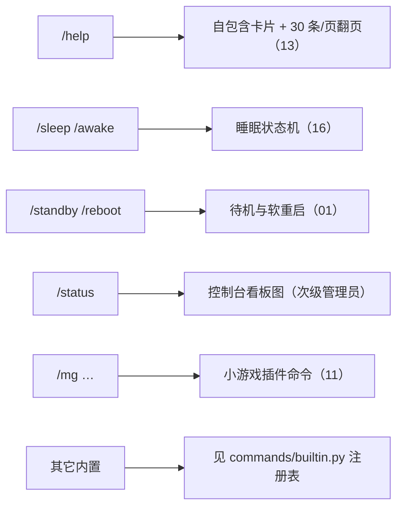
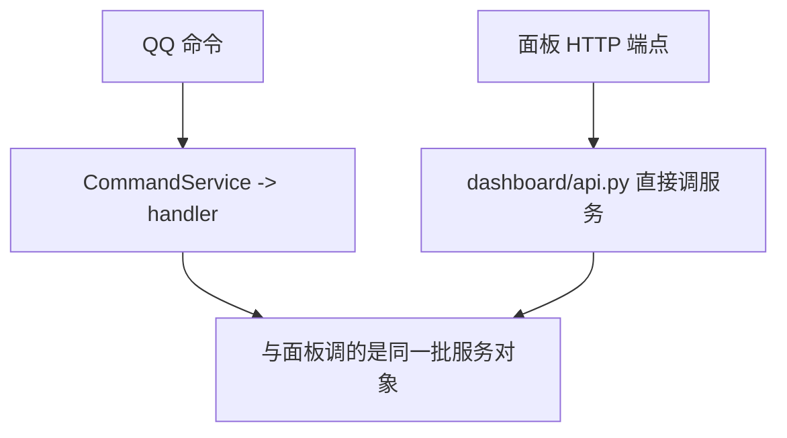

# 17 命令系统：注册 / 解析 / 权限 / 内置命令

## 范围

一条消息被判定成「命令」之后的全部流程：注册表匹配、别名与重名去重、权限判定、
执行（本体命令 / 插件命令 / 面板命令）、`consumed` 语义与 `sync_reply` 分叉。
不在这里：命令的**触发时机**（去重、@ 前置、待机跳过）见 `02c-event-pipeline.md`；
卡片渲染见 `13-render-cards.md`；插件命令的注册来源见 `08-plugins.md`。

## 流程

## 时序

## 细节

### 注册表：名称、别名与来源前缀

重名去重的产物是**实际生效名**：插件与本体命令同名时，插件侧会带上来源前缀（spec(4) R26），
面板会展示「原 X → 实际 Y」。排查「命令名对但没反应」时先确认实际生效名。
命令在插件**激活/停用**时会动态增删（`08-plugins.md`），所以「命令消失」多半是插件没加载。

### 解析：@ 触发与 / 前缀的差异

**群聊里命令必须先 @bot**（`commands/service.py` 约 `:158`）：这是与私聊最大的行为差异。
私聊则直接识别 `/` 前缀。命令名与参数的分割在解析阶段完成，参数原样交给 handler。

### 权限判定与 consumed 语义

两条容易误判的行为：

1. **权限被拒也 `consumed=True`**：发错命令时 AI **不会**兜底解释，用户只会收到固定拒绝文案；
2. **handler 抛异常也算已消费**（`commands/service.py` 约 `:197-199`）——
   异常被转成一条错误文本回给用户，同样不再走 AI。

这是刻意的：命令一旦被识别，就不该再让模型自由发挥（否则 `/help` 可能被解释成闲聊）。

### sync_reply 与「返回 None 表示我自己发了」

`返回 None` 是**命令与管线之间的契约**：`/mg`、`/help` 这类自带卡片渲染的命令用它表示
「图我自己发了」。事件管道里对应的分支是 `_start_command_sync_reply`，
注释明确写了「被拒（None）时**不** discard 回复中标记」—— 丢掉标记会把同会话另一条
正在跑的管线一起解锁（见 `02c-event-pipeline.md` 的同类坑）。

### 内置命令总表

内置命令的完整清单以 `commands/builtin.py` 的注册代码为准（本图不复制全表，避免漂移）。
注意 `/status` 出自面板插件（spec(4)）而不是本体 —— 排查「命令不见了」要同时看
本体注册表与插件注册表。

### 面板与命令的两条入口

同一动作（如待机、重载插件）在面板与命令里走的是**同一个服务对象**，但：
面板路径受 `_require_manage` 与 loopback 限制（见 `09b`），命令路径受权限树限制。
两条路的错误文案与副作用范围不同 —— 排查「面板能点但命令不行」时按这条线查。

## 关键状态

| 状态 | 谁置位 | 谁清理 | 失败时停在哪 |
|---|---|---|---|
| 命令注册项 | 本体/插件注册 | 插件停用时移除 | 名字冲突时改为带来源前缀的实际名 |
| `consumed` 标记 | 命令命中（含权限拒绝、handler 异常） | 每条事件独立 | 已消费即不再走 AI 兜底 |
| 执行者级别 | 每次判定时现取 | 不缓存 | 级别不足回固定文案，不进 AI |
| 回复中标记 | `sync_reply` 成功启动管线 | `on_reply_done` | 管线被拒时**不**丢弃（否则会解锁别的管线） |

## 易错点

* **群聊命令必须先 @bot**：不 @ 的命令会被当普通消息，直接进意愿判定。
* **权限拒绝也消费命令**：用户看到的是固定文案，AI 不会补救 —— 这是设计不是 bug。
* **`返回 None` 有特殊含义**：写成 `return`（隐式 None）会让命令静默不回复。
* **重名命令的实际名字可能带前缀**：面板会显示映射关系，别按注册名断言。
* **插件停用会连带命令消失**：命令与插件生命周期绑定，不是永久注册。
* **`sync_reply` 被拒时不要丢标记**：这是 `02c` 里同一类坑的命令侧版本。
