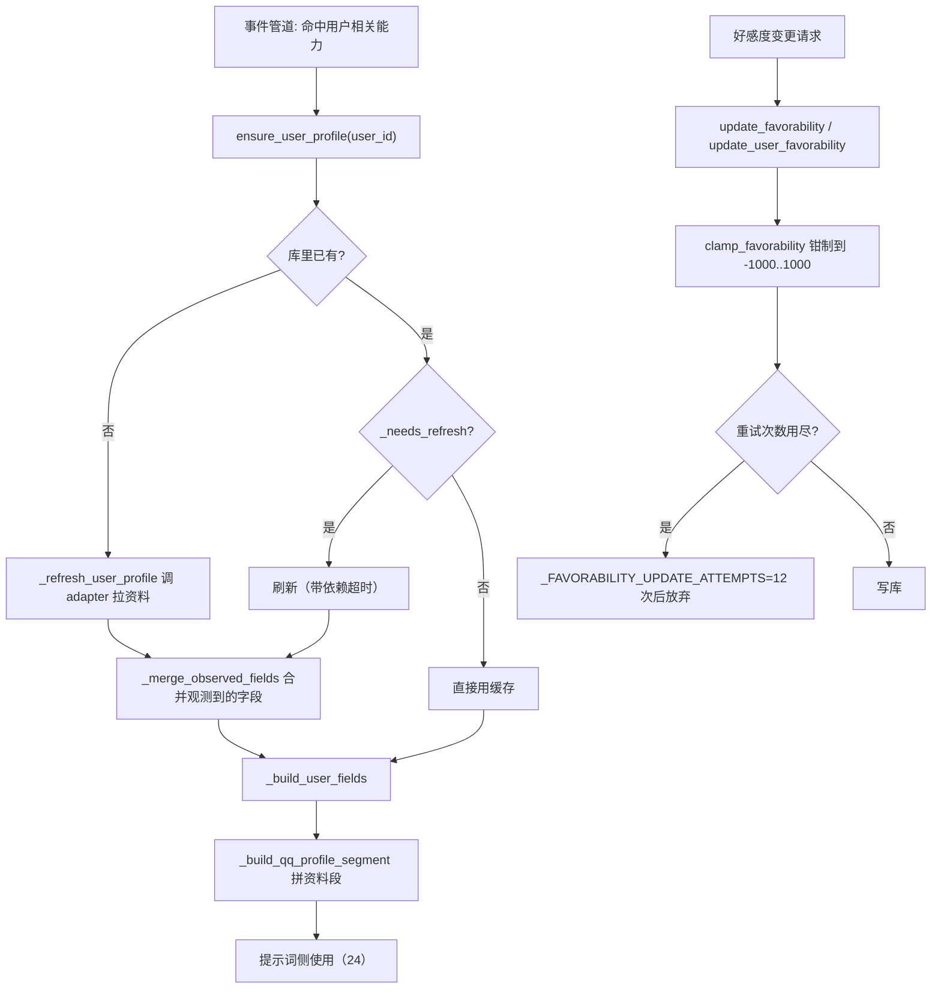
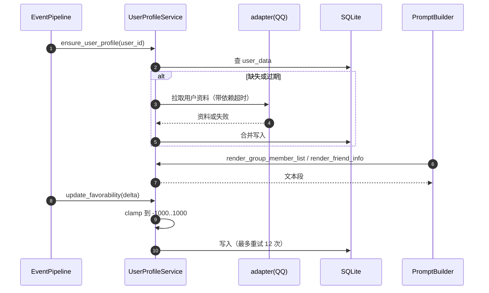
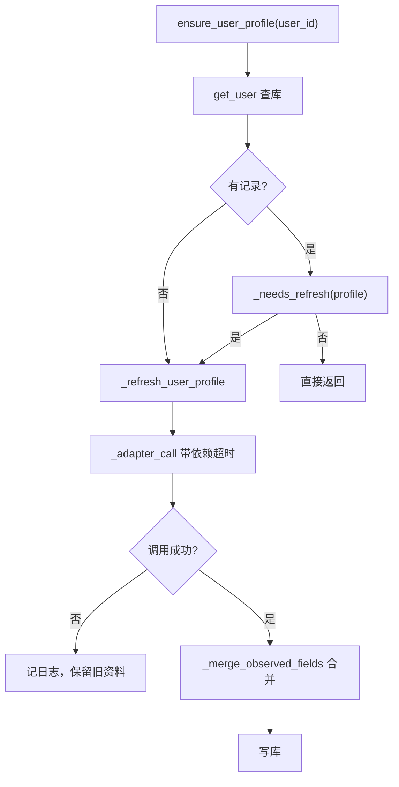
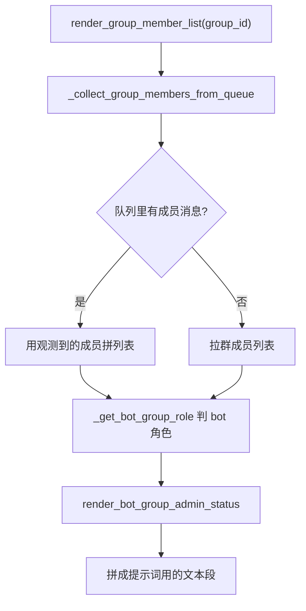
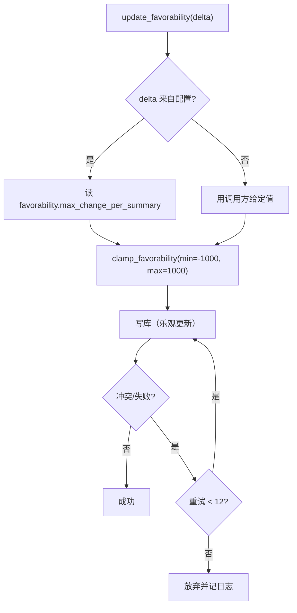
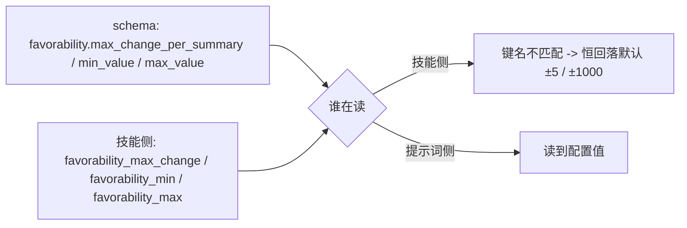
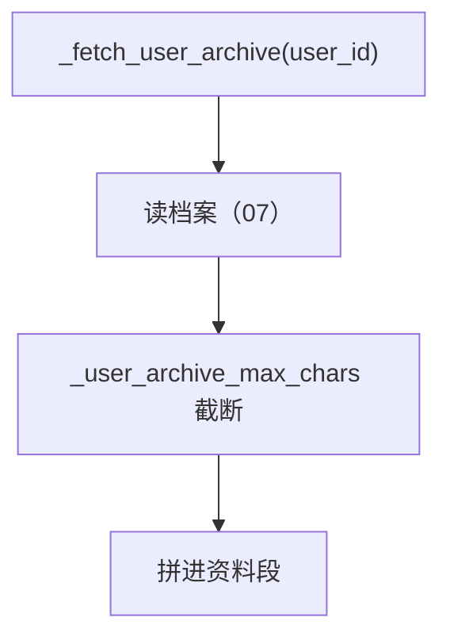

# 18 用户画像与好感度

## 范围

`UserProfileService`（871 行）与 `favorability`（52 行）：
用户/群资料的获取与刷新、QQ 资料段的拼装、群成员列表渲染、好感度的读写与钳制。
不在这里：档案（archive memory）本身的读写与压缩见 `07` / `07b`；
面板的档案页见 `09b`；头像存储见 `20-avatar-files.md`。

## 流程

## 时序

## 细节

### 资料获取：缺则拉、旧则刷

`_adapter_call`（`user_profiles.py:63`）是**统一的依赖调用包装**：加超时、记日志、失败不抛。
`_needs_refresh`（`:575`）决定什么时候重新拉 —— 它只看资料里的时间戳字段。
拉取失败时**保留旧资料**（不清空），所以「资料是旧的」通常意味着 adapter 一直在失败。

### 群成员列表：从队列观测 + 按需刷新

成员列表**优先用消息队列里观测到的成员**（`_collect_group_members_from_queue`，`:406`），
只有队列信息不足时才去拉全量 —— 这是省 adapter 调用的设计。
`render_group_owner_text` / `render_specific_members` / `render_friend_info` 是另外三个渲染入口，
共同服务于提示词的可读性（`24-prompt-chatflow.md`）。

### 好感度：钳制与重试

`FAVORABILITY_MIN=-1000` / `FAVORABILITY_MAX=1000`（`favorability.py:29-30`）是硬边界，
`favorability_to_text` 负责把数值转成可读文案。
`_FAVORABILITY_UPDATE_ATTEMPTS = 12`（`user_profiles.py:25`）说明这是一条**会重试**的写路径 ——
排查「好感度没变」时要看是不是 12 次都撞了锁。

### 配置键名不一致（已知坑）

这是 FINDINGS 07b-9 记录的同一处不一致：**技能侧读的键名与 schema 不匹配**，
所以工具侧钳制恒为默认（±5 / ±1000），而总结提示词里写的是配置值 ——
改配置会让两边口径分叉。修之前不要按「配置说了算」推断工具行为。

### 档案注入：用户档案段与长度上限

用户档案被拼进提示词时有独立长度上限（`_user_archive_max_chars`，`:393`），
与档案系统自己的 `max_chars=500` 不是同一个值（同 07-2 的「两个 max_chars」问题）。

## 关键状态

| 状态 | 谁置位 | 谁清理 | 失败时停在哪 |
|---|---|---|---|
| 用户资料行 | `ensure_user_profile` / `_refresh_user_profile` | 不清理（长期存在） | 拉取失败保留旧资料，只记日志 |
| 资料刷新时机 | `_needs_refresh` 按时间戳判定 | 刷新后新时间戳覆盖 | 时间戳不动就一直不刷 |
| 好感度值 | `update_(user_)favorability` | 不清理 | 钳制到 ±1000；写冲突最多重试 12 次 |
| 群成员观测缓存 | 消息队列（见 02c） | 队列容量驱逐 | 队列空时回落全量拉取 |

## 易错点

* **拉取失败不清空旧资料**：资料「看起来没更新」时先查 adapter 调用日志，而不是查库。
* **好感度配置有两套键名**：技能侧读的键名与 schema 不一致（FINDINGS 07b-9），
  工具侧钳制恒为默认值 —— 改配置不会改变工具行为。
* **群成员列表优先吃队列观测**：成员列表不全是拉取失败，可能只是队列里没有该成员的消息。
* **好感度写路径会重试 12 次**：高并发下写失败是「重试耗尽」而不是「没触发写」。
* **档案注入有独立长度上限**：与档案系统的 `max_chars` 不同源，改一个不影响另一个。
