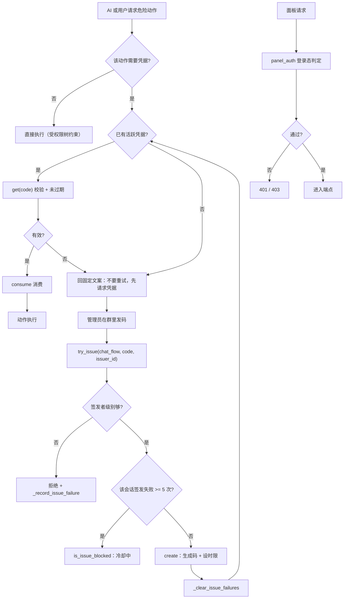
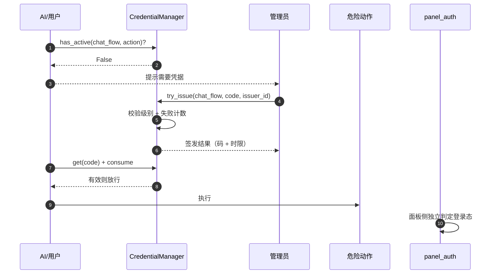
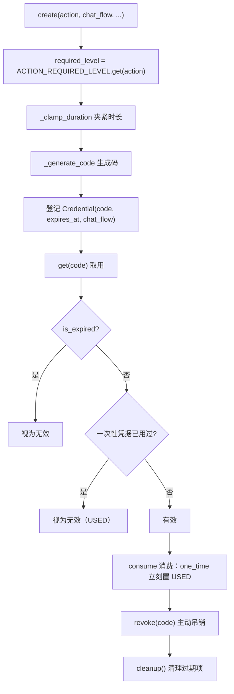
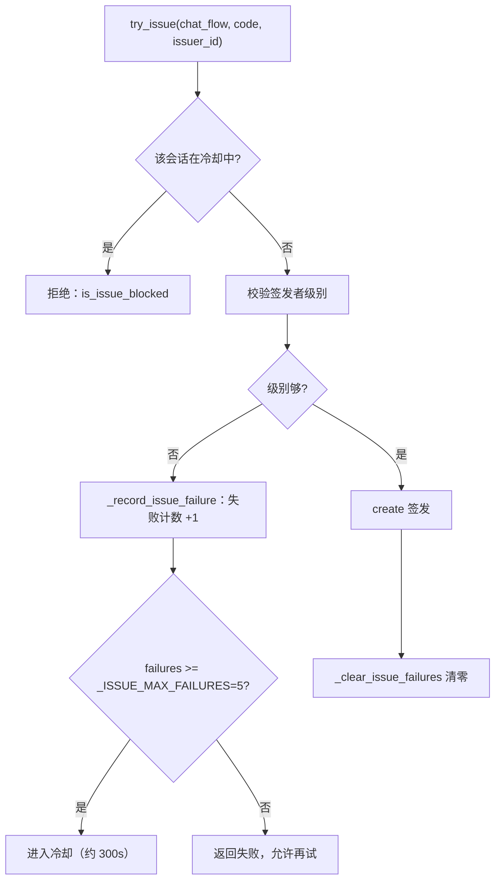
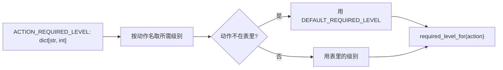
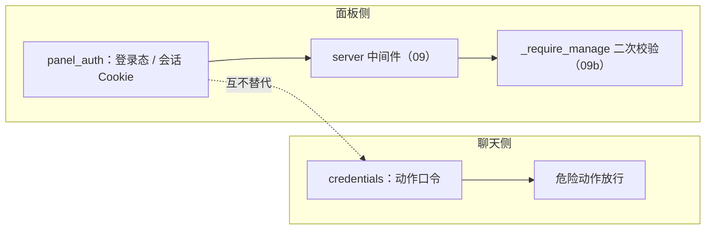
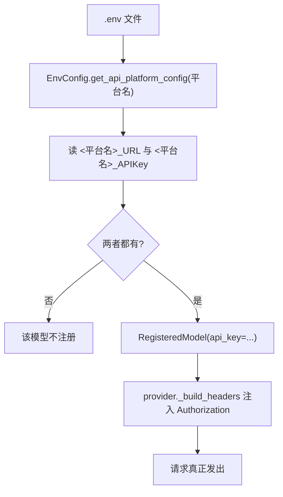
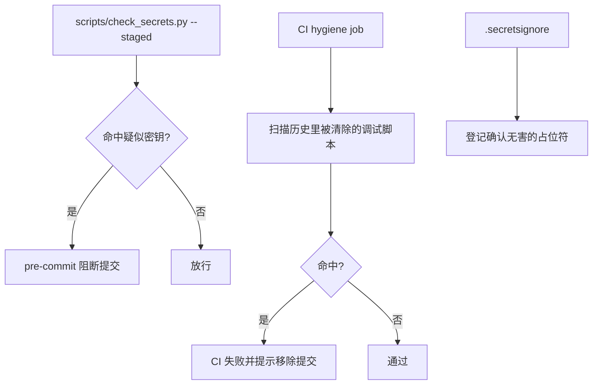

# 19 凭据、面板鉴权与安全边界

## 范围

两个**完全不同**的「认证」以及仓库的密钥防线：

* `credentials/`：**不是 API Key 仓库**，而是「聊天动作口令」——危险动作前要管理员在群里发一串码；
* `panel_auth.py` / `panel_web.py`：网页面板的登录鉴权与静态资源鉴权判定；
* 钥匙真正的来源与脱敏规则（`.env` -> EnvConfig -> RegisteredModel.api_key）、
  密钥扫描脚本与 pre-commit/CI 防线。

不在这里：面板中间件与端点的完整鉴权流见 `09-dashboard.md` / `09b-dashboard-api.md`；
沙箱路径裁决见 `06-tools-skills.md`；日志脱敏的落地见 `23-billing-stats.md`。

## 流程

## 时序

## 细节

### 凭据生命周期：create / get / consume / revoke / cleanup

四种状态要分清（`credentials/service.py`）：**不存在 / 已过期 / 已消费（一次性）/ 有效**。
`is_expired`（`model.py:72`）只看时间；`consume`（`service.py:199`）负责把一次性凭据置为已用。
`cleanup`（`:239`）是清理入口，但不保证被周期调用 —— 长期不清理不会导致功能错误（`get` 会判过期），
只是内存里会留垃圾项。

### try_issue：级别校验 + 失败冷却

`_ISSUE_MAX_FAILURES = 5`（`service.py:26`）与冷却窗口是**防爆破**设计：
失败 5 次后该会话在冷却期内无法再尝试签发。
注意冷却键是 **chat_flow**（会话维度）不是全局 —— 一个群被冷却不影响其它群。

### ACTION_REQUIRED_LEVEL：动作到级别的映射

`credentials/model.py:23` 是唯一映射表，`required_level_for`（`service.py:263`）是唯一读法。
新增危险动作**必须**同时加表项与调用点，否则会落到 `DEFAULT_REQUIRED_LEVEL` —— 表现为
「该拦的没拦」。回执文案里明确写了「不要重试」（见 FINDINGS 06 节的凭据语义）。

### 面板鉴权与凭据的边界（两个「认证」）

两者**不通兑**：拿到面板登录态不等于能在群里执行危险动作；反之亦然。
`panel_web.py` 只负责静态资源/Web 扩展的鉴权判定（哪些路径公开、哪些需要登录），
真正的中间件在 `server.py:448`（见 `09-dashboard.md`）。

### 钥匙真正的来源：.env -> EnvConfig -> RegisteredModel

**这里才是 API Key**，不是 `credentials/`。环境变量名大小写不敏感（`EnvConfig` 查 `os.environ`）。
面板侧对密钥有三条脱敏路径：结构化 config 载荷给空串 + `secrets_set`、TOML 原文给占位符、
只读会话隐藏 `source/raw` —— 但 `.env` 恒为掩码（`09c` 记录了两个占位符样式）。
本图与文档**不记录任何真实密钥值**。

### 密钥防线：扫描脚本 + pre-commit + CI

历史事故：`scripts/test_drawing_*.py` 等曾带硬编码密钥，已从远端历史彻底清除，
`.githooks/pre-push` 与 CI hygiene job 各有一道兜底（见 `.githooks/pre-push` 注释）。
**新增调试脚本前先读这两个文件** —— 它们列了禁止回流的文件清单。

## 关键状态

| 状态 | 谁置位 | 谁清理 | 失败时停在哪 |
|---|---|---|---|
| 凭据项 | `create` | `consume` / `revoke` / `cleanup` | 过期与已消费都按无效处理 |
| 签发失败计数 | `_record_issue_failure` | `_clear_issue_failures`（成功签发时） | 达 5 次进入冷却，冷却按 chat_flow 维度 |
| 面板登录态 | `panel_auth` 登录 | 登出/过期（前端登出不调后端，见 09c） | 未登录 401 / 无权限 403 |
| 密钥 | `.env` + `EnvConfig` | 改 `.env` 需 reload 才重建注册表 | 平台名/密钥缺一即不注册该模型 |

## 易错点

* **`credentials/` 不是 API Key 仓库**：排查「密钥无效」不要进这个模块（FINDINGS W59）。
* **凭据不是重试型错误**：无凭据时每次同样失败，必须先 `credential__request`；
  一次性凭据一消费就 USED，时限凭据持续有效不消费（FINDINGS 06 节）。
* **签发冷却按会话**：一个群被冷却不影响其它群，但同一群内所有动作一起被挡。
* **新增危险动作必须登记 `ACTION_REQUIRED_LEVEL`**：漏登记会落到默认级别，表现为「该拦的没拦」。
* **面板登录态与凭据不通兑**：两套体系独立判定。
* **密钥只从 `.env` 来**：面板保存后需要 reload 才让注册表用上新密钥。
