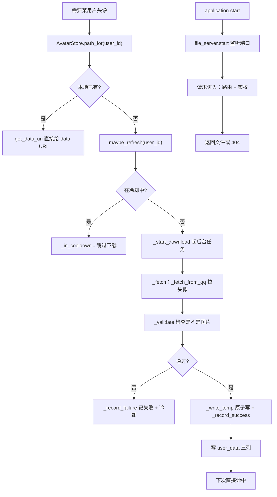
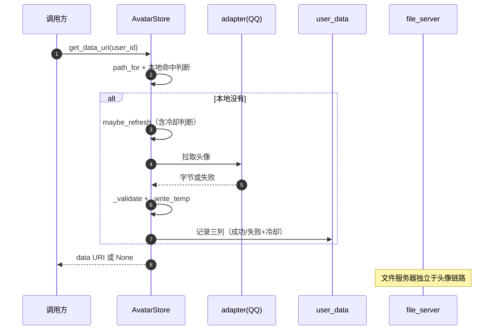
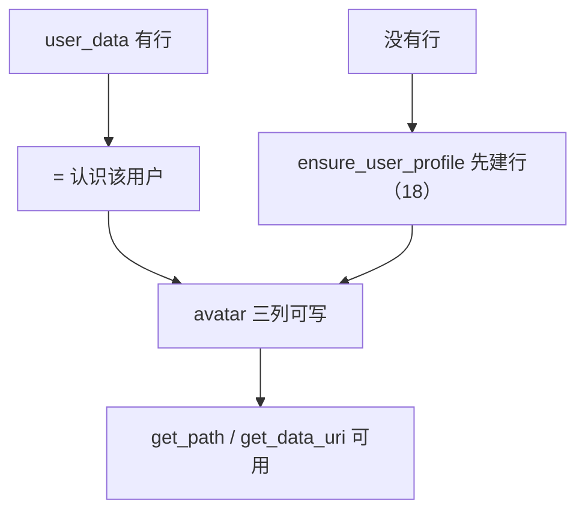
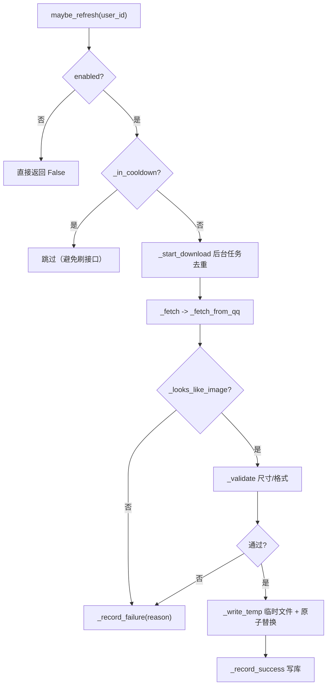
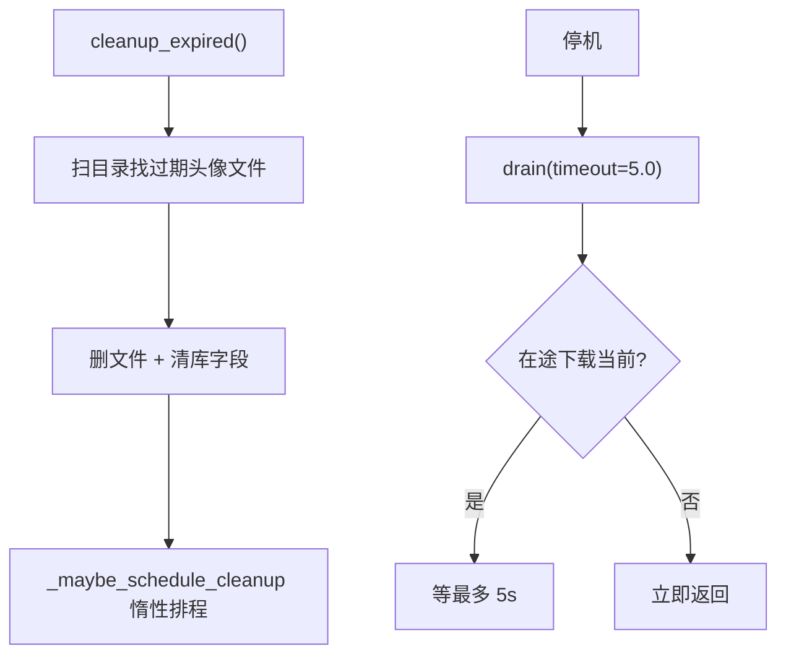
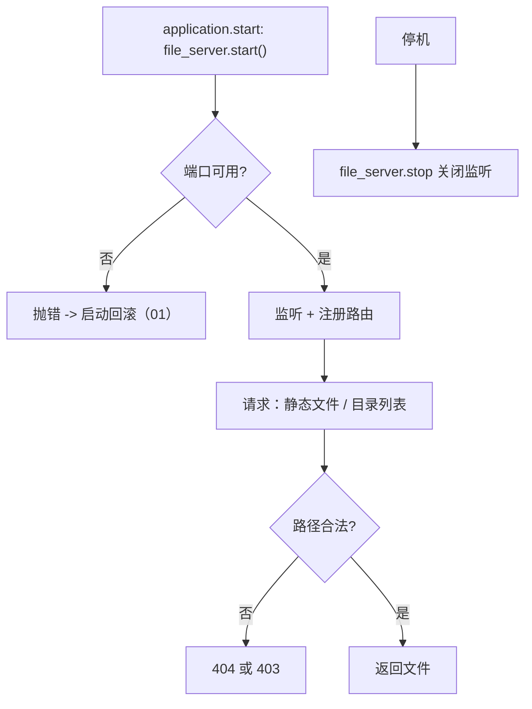
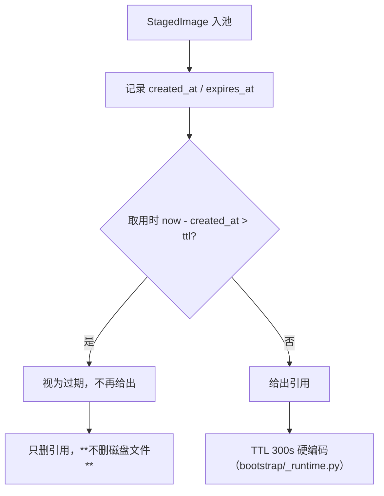
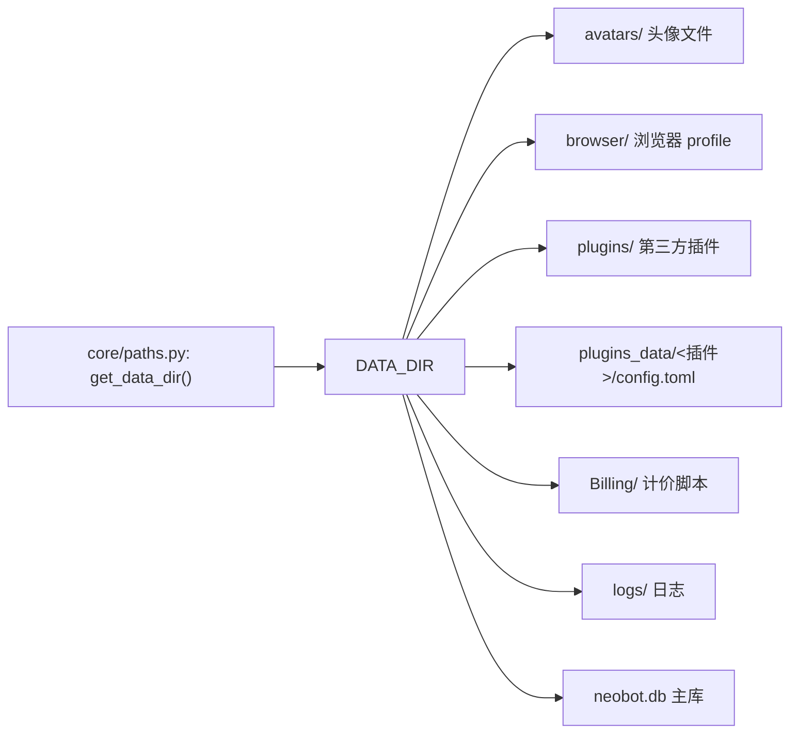

# 20 头像存储与文件服务

## 范围

三件与「文件」有关的基础设施：

* `AvatarStore`（557 行）：本体级头像存储 —— 三列落在 `user_data` 上，谁有资料行谁有头像；
* `core/file_server.py`（406 行）：本地文件服务器（启动、路由、鉴权、生命周期）；
* `image_pool.py` + `core/paths.py`：图片暂存池与数据目录路径解析。

不在这里：卡片的渲染与缓存见 `13-render-cards.md`（那里也讲图片暂存池的使用侧）；
图片下载与解析见 `14-emoji-image-parse.md`；面板的头像展示见 `09b-dashboard-api.md`。

## 流程

## 时序

## 细节

### 头像与 user_data 的耦合

「有 `user_data` 行 = 认识该用户」是 spec(5) R33–R37 的实现口径：头像就存在 `user_data` 上，
所以**软重启复用同一个 `AvatarStore` 实例**（内存缓存与在途下载都不重建）。
反过来说：**删掉 `user_data` 行 = 头像也一起没了**，排查「头像消失」要先看资料行是否还在。

### 下载：冷却、校验与原子写

四个防呆点：**冷却**（`_in_cooldown`）、**去重**（同时多个调用只起一个下载）、
**内容校验**（`_looks_like_image` 看魔数，避免把 HTML 错误页存成头像）、
**原子写**（先写临时文件再替换，避免半截文件被当成头像）。
`_validate`（`:408`）返回错误字符串而不是抛异常，失败走 `_record_failure`。

### 清理与排空：expired / drain

`drain`（`:512`）是停机路径的一部分：给在途下载最多 5 秒收尾，超时即放弃（不阻塞停机）。
`_maybe_schedule_cleanup`（`:490`）说明清理是**惰性触发**的 —— 长期没有头像访问就不会清理。

### 文件服务器：启动与失败语义

文件服务器是 `application.start` 的**第一步**（见 `01-startup-shutdown.md`），
端口占用会直接导致启动失败并触发回滚 —— 这是启动失败最常见的原因之一。
它服务于图片/音频等产物的外链，与面板（`09`）是两套 HTTP 服务。

### 图片暂存池：TTL 与磁盘文件的关系

三处与直觉不符（FINDINGS 13-3，本图复核确认）：

1. `expires_at` **只写不读**：判定实际用 `now - created_at > ttl`；
2. TTL 300s **硬编码**，配置层没有 `image_pool` / `ttl_seconds` 这两个键；
3. 池**只删引用不删磁盘文件** —— 磁盘占用要靠别的清理链路（见 `16` 的 temp_cleaner）。

### 路径解析：DATA_DIR 与目录布局

`get_data_dir()` 是**唯一**的数据目录来源；注意 `agent.browser.data_dir` 是死配置
（FINDINGS 12-1），浏览器数据实际固定落在 `DATA_DIR/browser`。
写新功能时用 `get_data_dir()`，别自己拼相对路径。

## 关键状态

| 状态 | 谁置位 | 谁清理 | 失败时停在哪 |
|---|---|---|---|
| 头像文件 | `_write_temp` + `_record_success` | `cleanup_expired` | 校验不过不落地，只记失败与冷却 |
| 下载冷却 | `_record_failure` | 冷却窗口自然过期 | 冷却期内不再发起下载 |
| 在途下载 | `_start_download`（去重） | 任务结束 / `drain` | 停机时最多等 5s |
| 文件服务监听 | `file_server.start` | `file_server.stop` | 端口占用 -> 启动回滚 |
| 暂存池引用 | 入池 | TTL 到期 / 显式移除 | 只删引用，磁盘文件另行清理 |

## 易错点

* **头像寄生在 `user_data`**：删资料行会连头像一起丢；软重启必须复用 `AvatarStore` 实例。
* **下载有冷却与去重**：头像「长时间没更新」可能是冷却中，不是坏了。
* **暂存池 TTL 不可配**：300s 硬编码，且 `expires_at` 是死字段（判定用 `created_at`）。
* **暂存池不删磁盘文件**：磁盘占用要靠 temp_cleaner 等链路，别指望池子自清。
* **文件服务器端口占用会让启动失败**：这是 `start()` 第一步，报错信息会指向端口。
* **`agent.browser.data_dir` 是死配置**：浏览器数据固定用 `DATA_DIR/browser`（FINDINGS 12-1）。
