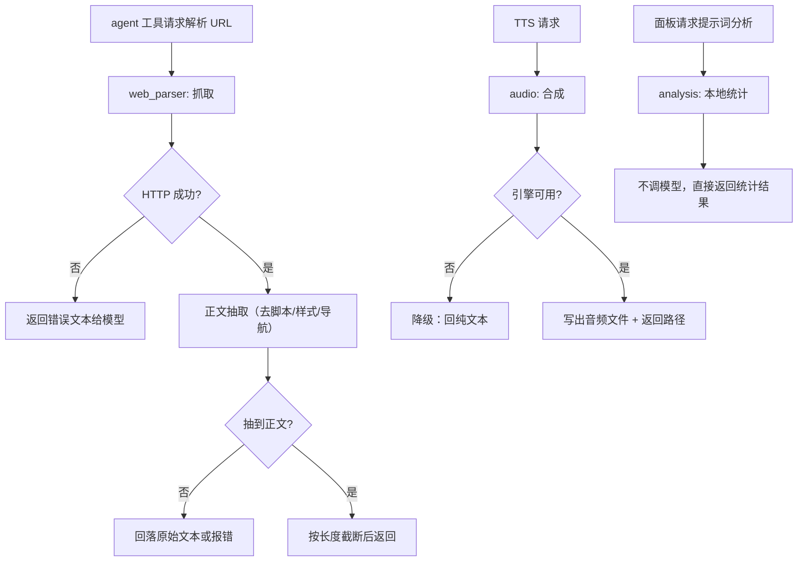
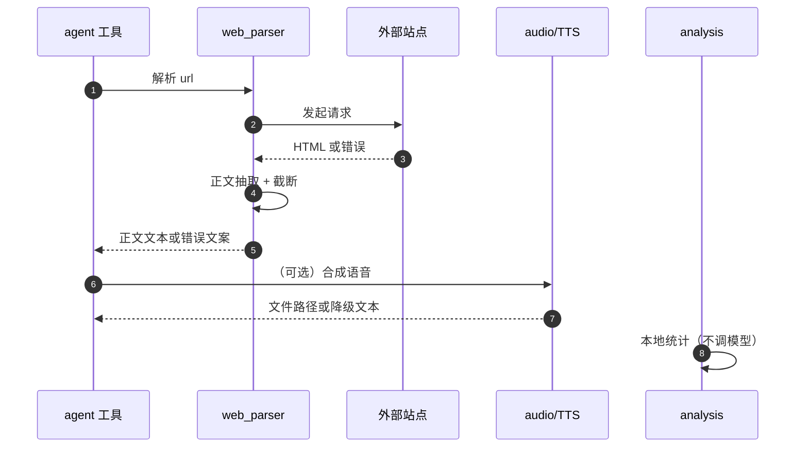
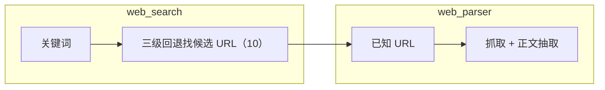
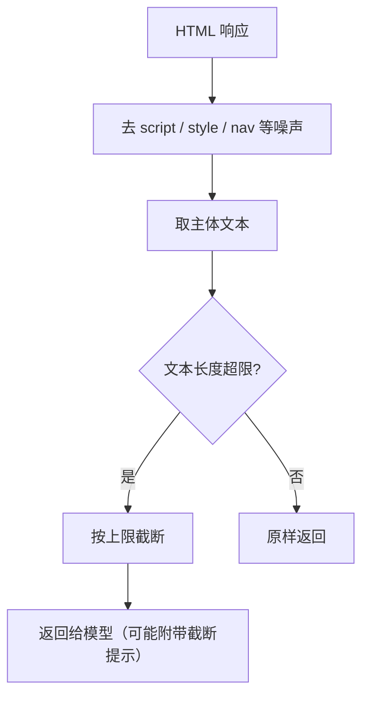
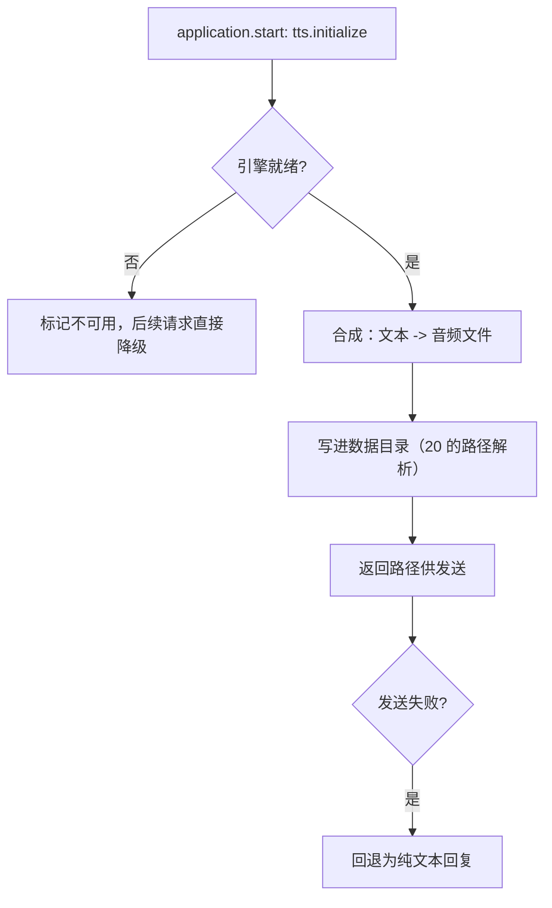
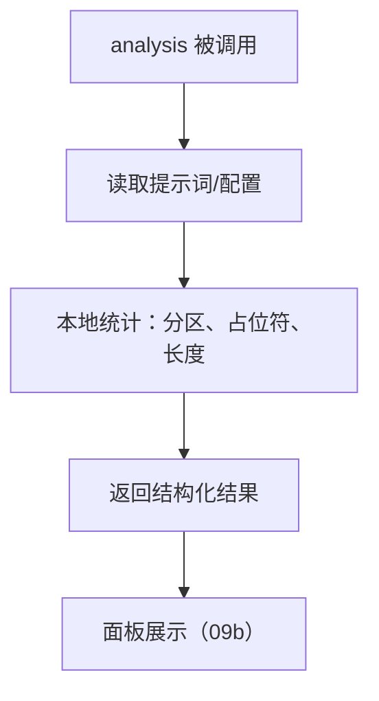
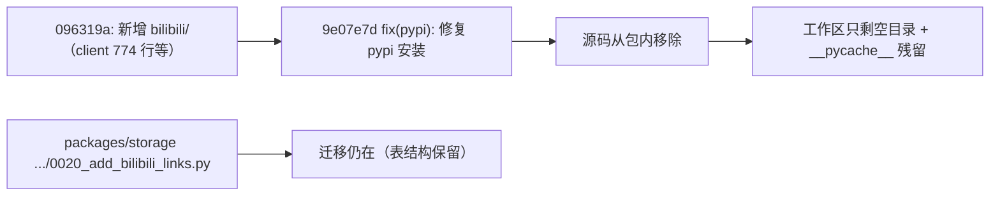

# 21 网页解析 · 音频 · 本地分析

## 范围

三个体量不大但与外部内容打交道的小子系统：

* `web_parser/`（5 文件 543 行）：把 URL 抓成可读正文，供 agent 工具使用；
* `audio/`（3 文件 466 行）：TTS 与音频产物；
* `analysis/`（3 文件 334 行）：本地提示词分析（不调模型）；
* `bilibili/`：**目录为空**（0 个 py 文件），本图如实记录。

不在这里：联网搜索的三级回退见 `10-web-search.md`（与网页抓取是两条链路）；
卡片与音频渲染见 `13-render-cards.md`；工具面见 `06-tools-skills.md`。

## 流程

## 时序

## 细节

### 网页抓取与搜索链路的区别

两者**不共享实现**：`web_search` 负责「找到 URL」（HTTP -> 浏览器 -> DDG 三级回退），
`web_parser` 负责「把已知 URL 变成正文」。排查「搜到了但读不出内容」要进 `web_parser`，
排查「搜不到」进 `web_search`。

### 正文抽取与截断

抽取失败时**回落到原始文本或错误文案**（而不是抛异常）—— 这是给模型看的工具，
错误也要以文本形式返回，模型才能继续决策（与 `06` 的工具失败语义一致）。

### 音频 / TTS：可用性与降级

TTS 初始化在 `start()` 的第 2 步（见 `01-startup-shutdown.md`），**初始化失败不阻断启动**。
降级路径是「回纯文本」，所以用户看到「没有语音」时先确认引擎是否就绪，而不是看发送环节。

### 本地分析：不调模型的统计

关键性质：**它不调用模型**（面板「分析」页因此不会产生费用，也不受速率限制）。
它读的是装配期的提示词结构，属于诊断工具 —— 排查「提示词为什么这么长」可以从这里入手。

### bilibili：代码已因 PyPI 打包问题移除，只剩空目录

实测事实（本轮核对）：

* 当前 **HEAD / origin/main / dev/next-1.0.x 三个分支上，`app/src/neobot_app/bilibili/` 里有 0 个被 git 跟踪的文件**；
* 本地磁盘上该目录**只剩空目录与 `__pycache__` 残留**（曾经 import 过的字节码），没有任何 `.py`；
* 源码由提交 `096319a` 引入（`client.py` 774 行、`cookie_provider.py` 315 行、`prompts.py` 355 行等），
  后被 `9e07e7d fix(pypi): 修复 pypi 安装` 移除 —— 属于打包修复的连带结果；
* 但 `packages/storage/.../alembic/versions/0020_add_bilibili_links.py` **仍在**，表结构保留。

因此：**B 站能力当前不可用**（没有实现代码），数据表字段还在。
要恢复或重做该能力，请新建图并登记到 `SPLIT-MAP.md`，不要往本图里塞。

## 关键状态

| 状态 | 谁置位 | 谁清理 | 失败时停在哪 |
|---|---|---|---|
| 抓取结果 | 每次请求实时获取 | 不缓存（按调用方决定） | 失败以错误文本返回给模型 |
| TTS 引擎就绪 | `tts.initialize`（启动第 2 步） | 停机 | 未就绪即降级为纯文本，不阻断启动 |
| 分析结果 | 每次调用现算 | 不缓存 | 本地统计不会失败（除文件读取） |

## 易错点

* **抓取与搜索是两条链路**：别把「读不出正文」当成搜索失败。
* **抽取失败返回文本而不是抛异常**：工具错误以文本形式回灌，模型据此继续决策。
* **TTS 初始化失败不阻断启动**：表现为「没有语音但一切正常」，先查引擎就绪状态。
* **本地分析不调模型**：面板「分析」页不计费、不受限速。
* **bilibili 目录为空**：该能力当前不存在，别按历史文档推断（本图已如实记录）。
