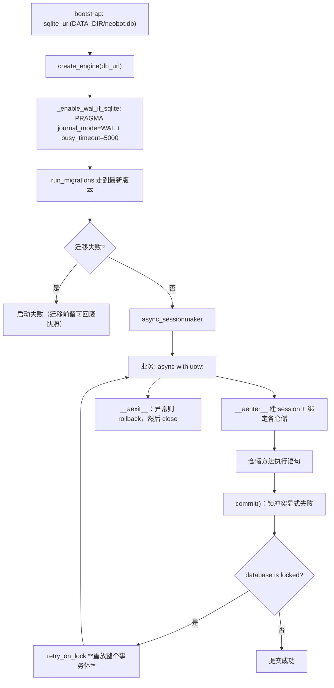
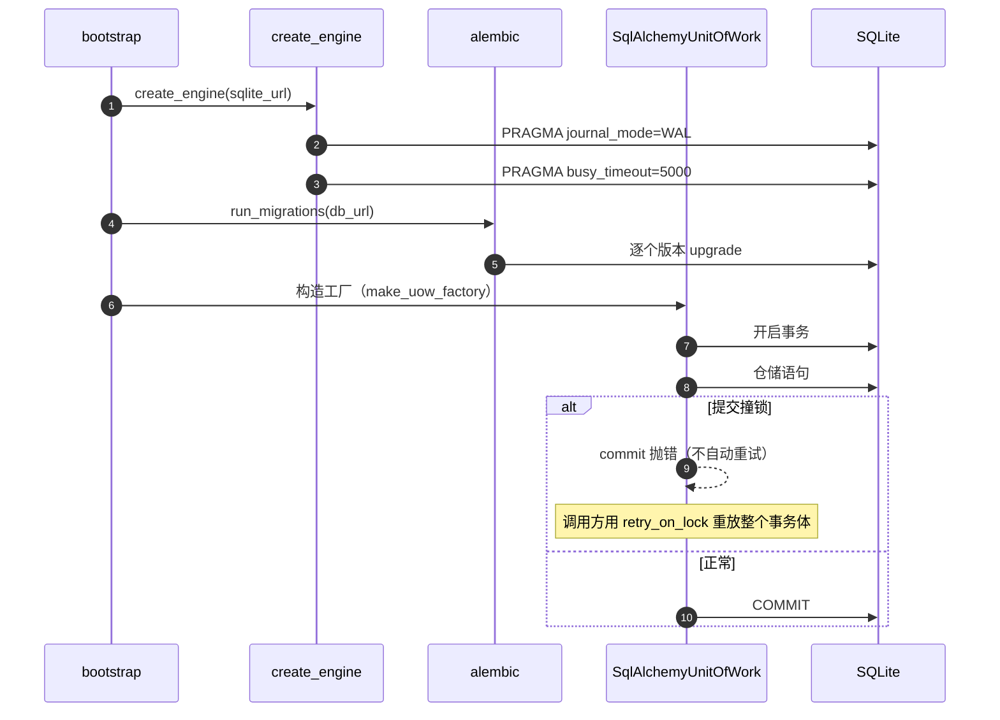
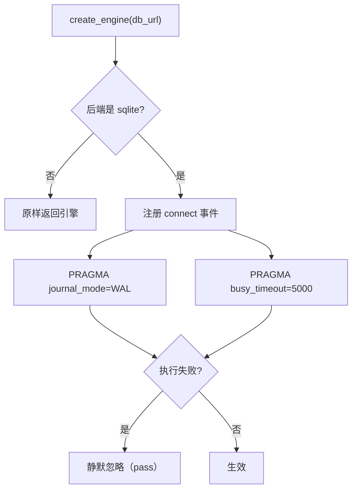
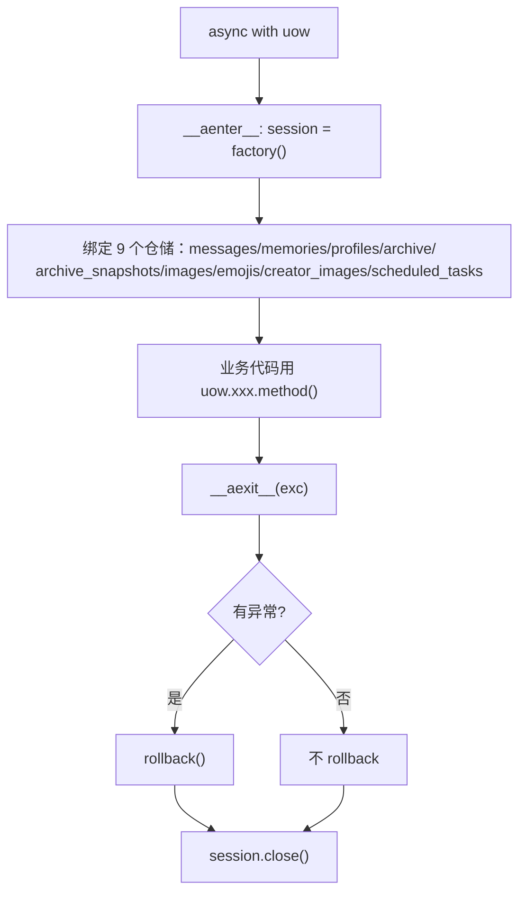
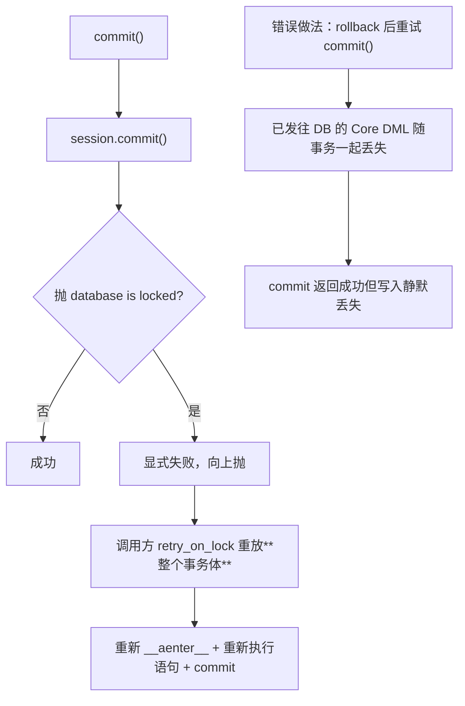
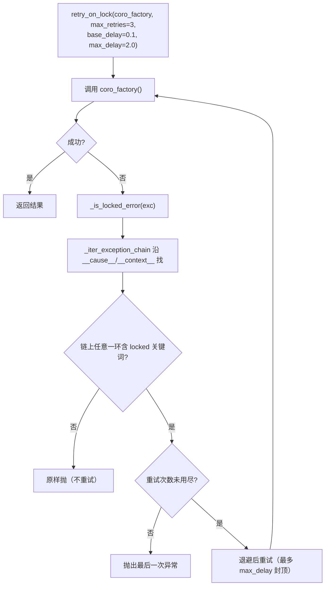
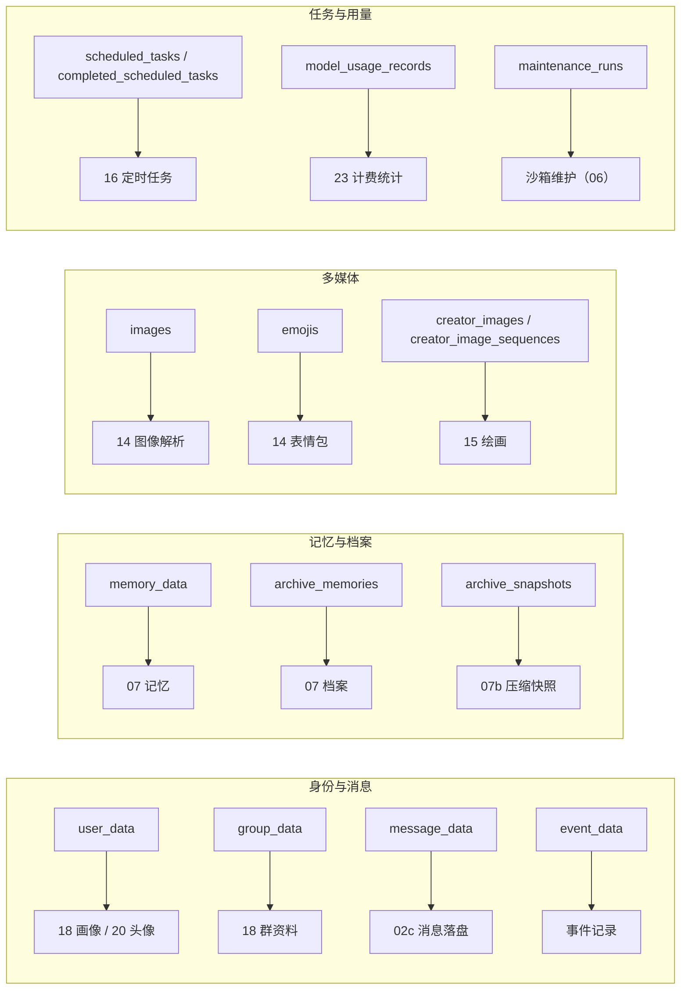
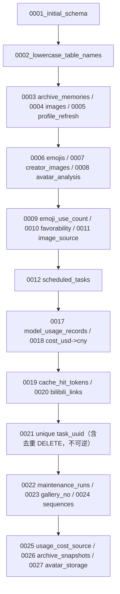
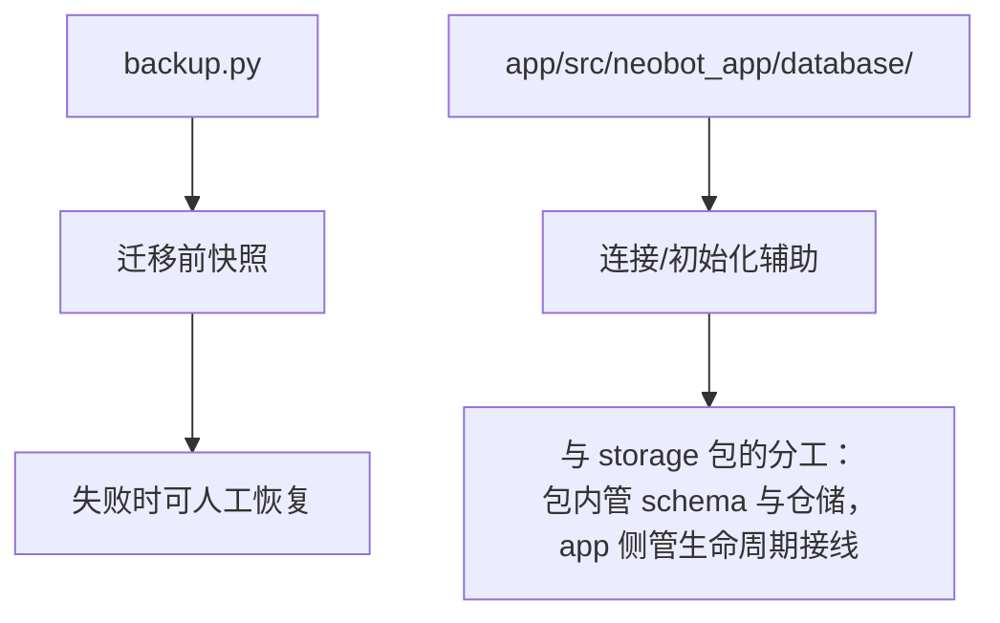

# 22 存储与迁移

## 范围

`neobot_storage` 包（32 个 py 文件）：异步引擎与 PRAGMA、UoW 事务边界、15 张表、
27 个 Alembic 迁移、仓储层与锁重试。所有上层（档案、画像、用量、定时任务、头像）
都通过它读写 SQLite。

不在这里：档案的业务语义见 `07` / `07b`；用量与计费见 `23-billing-stats.md`；
头像三列的业务含义见 `20-avatar-files.md`。

## 流程

## 时序

## 细节

### 引擎：两个 PRAGMA 决定并发行为

**WAL** 让「读不阻塞写」，**busy_timeout=5000** 让撞锁时最多等 5 秒再报错
（`engine.py:25-41`）。两个 PRAGMA 都包在 `try/except: pass` 里 ——
失败**不会**导致启动失败，表现为「偶发 database is locked」而不是「起不来」。

### UoW：进入即绑定仓储，退出必关会话

仓储**按需绑定**在 `__aenter__`（`uow.py:27-38`），一次进入拿到全部 9 个入口。
`__aexit__` 只在有异常时 `rollback`，两种情况都会 `close`（`:40-43`）——
漏掉 `async with` 手工管理 session 会泄漏连接。

### commit 的锁语义：为什么不允许「rollback 后重试 commit」

`uow.py:45-52` 的 docstring 是这条规则的**唯一权威说明**：仓库层大量使用
`session.execute(insert(...))`（Core DML，不经 ORM 身份映射），
所以「rollback 后重试 commit」会静默丢写。
正确用法见 `statistics/tracker.py`（把整个事务体放进 `retry_on_lock` 的工厂函数里）。

### 锁重试：异常链匹配与退避

匹配关键词是 `database is locked` / `database table is locked` / `locking protocol` / `deadlock`
（`_retry.py:11-17`）。**沿异常链匹配**是为了覆盖 `PendingRollbackError` 把原始 flush 异常
嵌在 message 里的情况（注释明确写了），同时避免对含 "rolled back" 的普通错误过度匹配。

### 15 张表与谁在写

表名全部**小写复数**（迁移 `0002_lowercase_table_names` 统一过）。
`completed_scheduled_tasks` 上有 `task_uuid` 唯一约束（迁移 0021）——
这是「同一任务不会被重复标记完成」的数据库级保证（见 `16` 的去重）。

### 迁移链：27 个版本与不可逆操作

两个要注意的点：

1. **编号有跳号**（0013-0016 不存在）：这是历史合并的结果，不要以为是文件丢失；
2. **存在不可逆迁移**（如 0021 里的去重 DELETE）——所以 bootstrap 在迁移前会留一份可回滚快照，
   失败时能人工恢复而不是只剩半个 schema。

### 备份与恢复入口

改 schema 的标准动作：**加迁移文件 -> 本地先跑一遍 -> 确认能升级也能回滚**。
直接改 `models.py` 而忘了迁移，表现为「新库正常、老库启动报缺列」。

## 关键状态

| 状态 | 谁置位 | 谁清理 | 失败时停在哪 |
|---|---|---|---|
| 引擎 PRAGMA | 引擎首次连接（connect 事件） | 连接关闭 | 执行失败被静默忽略，不阻断启动 |
| 会话 | `__aenter__` 创建 | `__aexit__` 关闭 | 异常路径先 rollback 再 close |
| 事务 | 仓储语句执行中 | `commit` / `rollback` | 锁冲突显式失败，由调用方重放整个事务体 |
| 迁移版本 | `run_migrations` | 不回退（除非人工） | 迁移失败 -> 启动失败（迁移前有快照） |
| 完成标记唯一性 | 迁移 0021 的唯一约束 | 约束长期有效 | 重复标记被数据库拒绝 |

## 易错点

* **不要「rollback 后重试 commit」**：会静默丢 Core DML 写入，必须重放整个事务体（`uow.py:45`）。
* **两个 PRAGMA 失败是静默的**：偶发 `database is locked` 而不是启动失败，排查时容易漏。
* **改 `models.py` 必须配迁移**：老库不会自动加列，表现为启动报缺列。
* **迁移编号有跳号（0013-0016 缺失）**：历史合并的结果，不是文件丢失。
* **存在不可逆迁移**：迁移前快照是唯一回退手段，别删它。
* **`async with uow` 是必须的**：手工管理 session 容易泄漏连接。
