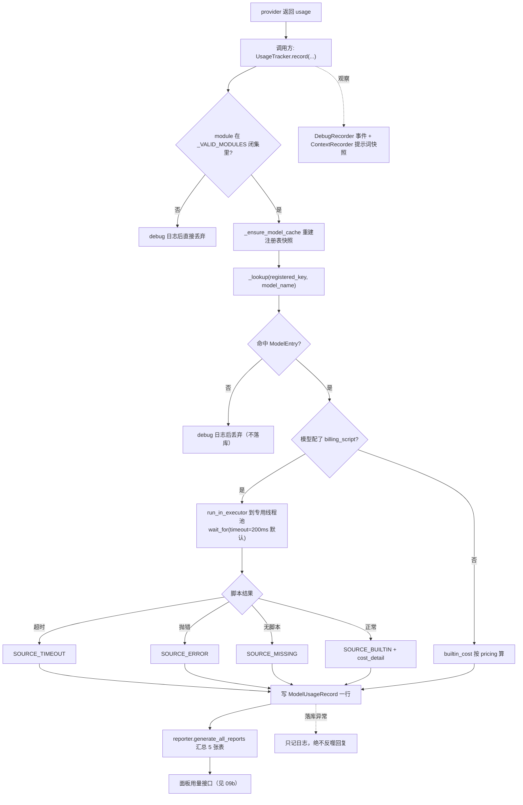
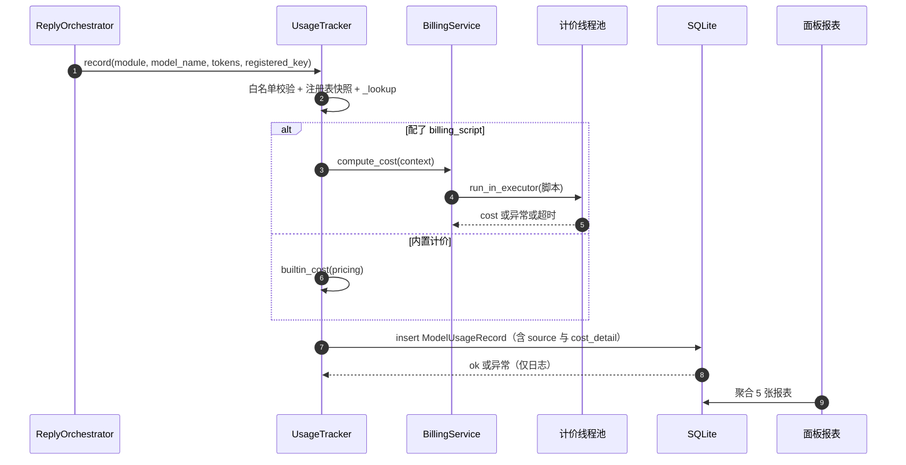
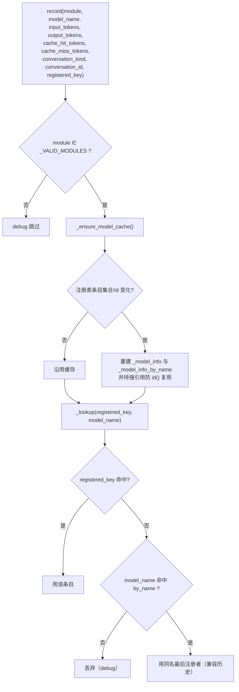
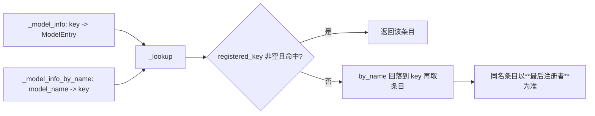
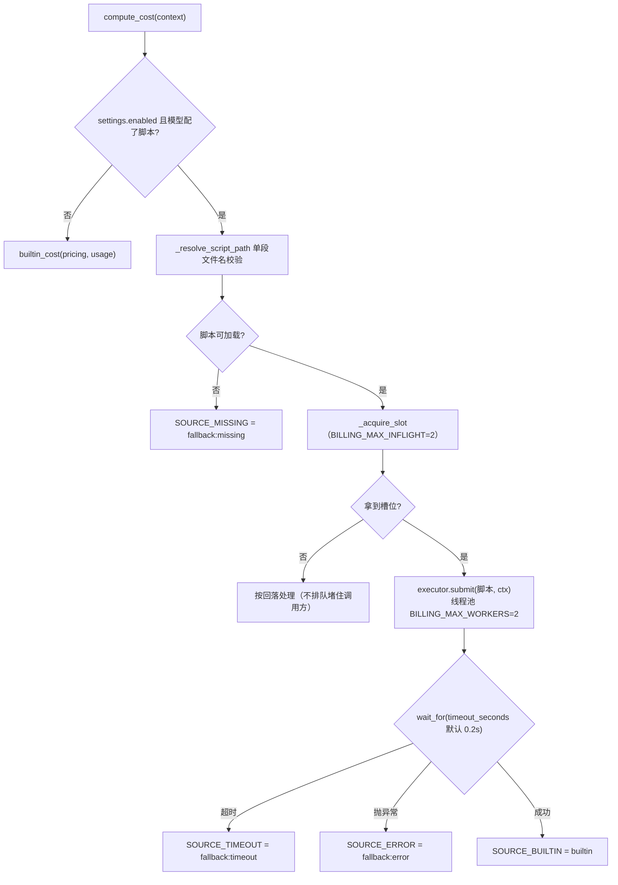
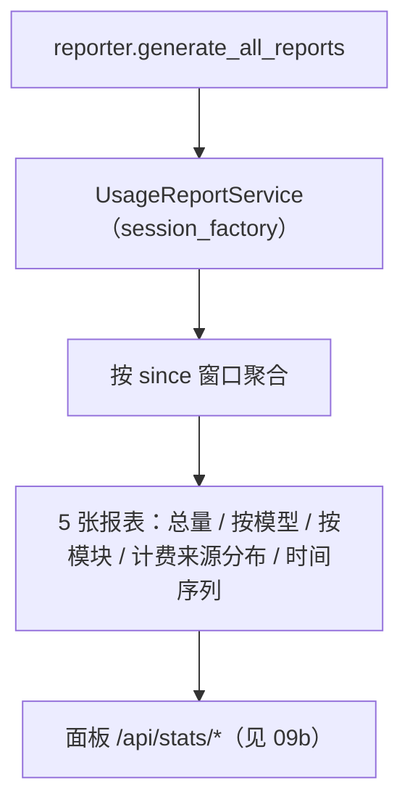
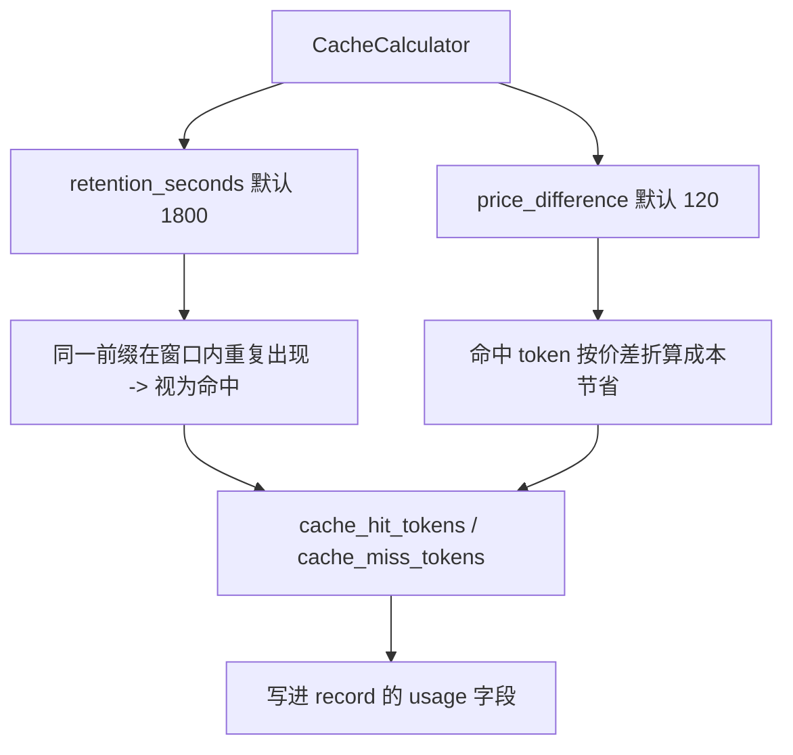
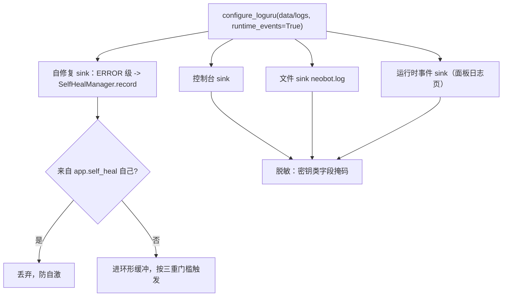
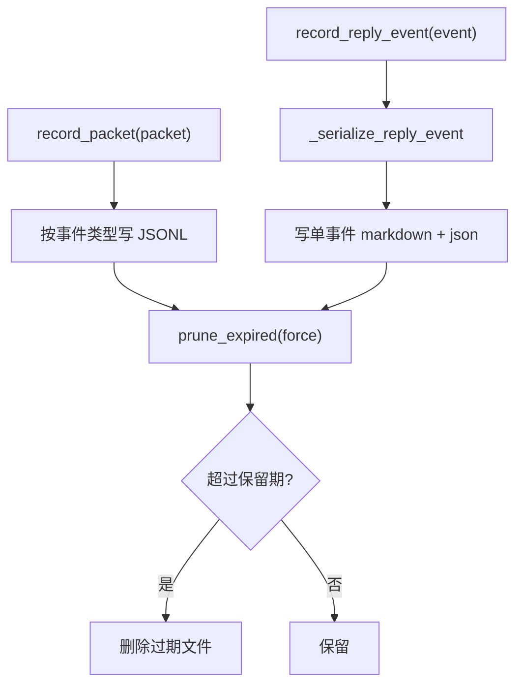
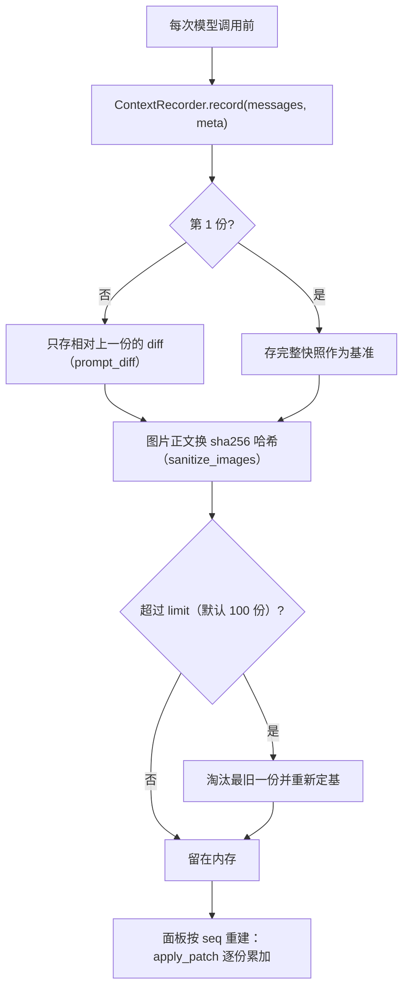

# 23 计费、用量统计与可观测性

## 范围

一次模型调用结束后「钱怎么算、量怎么记、日志怎么留」的完整链路：
`UsageTracker.record`（唯一落点） -> 计费脚本/内置计价 -> `ModelUsageRecord` 落库 -> 报表；
以及日志四类 sink、脱敏、DebugRecorder 事件录制、ContextRecorder 提示词历史、缓存命中计算。
不在这里：模型路由与 provider 契约见 `05-llm-routing.md` / `05b-provider-native-vision.md`；
面板的用量接口见 `09b-dashboard-api.md`。

## 流程

## 时序

## 细节

### record 的入参与两道丢弃闸门

`_VALID_MODULES`（`tracker.py:24`）是**闭集**：`reply_agent` / `reply_common` / `agent:memory` /
`agent:chat_interaction` / `agent:image_parse` / `agent:willingness` / `agent:scheduled_task` /
`agent:problem_solver` / `agent:self_heal` / `memory_compaction`。
其中 5 个模块（`agent:image_parse` / `agent:chat_interaction` / `agent:willingness` /
`agent:scheduled_task` / `memory_compaction`）全仓**没有任何写入点** —— 只有白名单本身在引用它们，
所以这些能力即使被调用也不会进账（见 FINDINGS 15-2）。

### 两级索引：注册 key 优先，同名回落最后注册者

这段是 spec(4) D19 的产物：默认模型库 4 个 chat 条目的 `model_name` 都是 `deepseek-flash`，
按名字建索引会互相覆盖，所以改成按**注册 key** 建索引（`tracker.py:38-101`）。
但回落仍然存在 —— 而 `NativeVisionFallbackProvider` 不代理 `registered_key`（见 FINDINGS W21），
开原生视觉后这条回落会被真实命中，**计价脚本可能串到别的注册条目**。

### 计价三态：脚本 / 内置 / 回落，以及 source 的四个取值

**默认 200ms**（`billing.py:47-48 DEFAULT_TIMEOUT_MS`）是硬事实：计价脚本一旦超过 200ms
就静默变成 `fallback:timeout`，报表上的「计费来源分布」里 `fallback:*` 占比高就说明这个。
线程池只有 2 个 worker、同时在跑或排队的上限也是 2（`billing.py:50-52`），
并发高时脚本计价会大量落进回落分支。

### cost_detail 与落库字段

`cost_detail` 上限是为了「永不因分项过大导致落库失败」（`billing.py:44`）。
落库走 `retry_on_lock`（SQLite 锁重试必须重放整个事务体，见 `22-storage-migrations.md`）。

### 报表与聚合口径

「计费来源分布」是排查计价问题的第一手材料：`builtin` 占比突然升高 = 脚本没生效；
`fallback:*` 升高 = 脚本超时/抛错/找不到。默认模型库 `pricing` 全为 0（见 FINDINGS W27），
所以**不配脚本时 `builtin_cost` 恒为 0**。

### 缓存命中计算：字符级近似

这是**字符级估算**，不是供应商返回的真实缓存命中数：它按文本前缀在保留窗口内的重复度推断。
报表里的缓存命中率因此是近似值，不要与供应商账单逐字对齐。

### 日志：四类 sink 与脱敏

自修复的完整触发链见 `04-agent-loop.md`。脱敏在写入前做（面板只读会话另有裁剪，见 `09b`）。

### DebugRecorder：事件录制与保留期

保留期与开关来自 `debug` 配置；`prune_expired` 是**被动触发**（写入时顺带清理），
没有独立定时器 —— 长时间不产生事件就不会清理。

### ContextRecorder：提示词历史为什么「看起来在盘上」其实不在

三条容易记错的性质（`context_recorder.py` 模块 docstring 写明）：

1. **纯内存**：重启即清空，没有 `ctx_*.json` 残留；`legacy_dir` 只用于「清空历史」时删旧文件；
2. **逐份 diff**：回复管线的 messages 逐轮追加，所以补丁极小，100 份常驻约 1–2 MB；
3. **图片只留哈希**：`data:image/...;base64` 换成 sha256（与图库去重同口径），面板不搬 MB 级 base64。

读写异常一律只记 debug，**绝不反噬回复管线** —— 这与聊天流登记的三处 try/except 是同一设计取向。

## 关键状态

| 状态 | 谁置位 | 谁清理 | 失败时停在哪 |
|---|---|---|---|
| 注册表快照缓存 `_cache_stamp` | `_ensure_model_cache`（条目或 id 变化） | 下次重建覆盖 | 持强引用防 `id()` 复用，缓存永不过期式失效 |
| 计费来源 `source` | `compute_cost` 的四条出口 | 不清理（每行独立） | `fallback:missing/error/timeout` 都算「记了账但没算出准确价」 |
| 线程池槽位 | `_acquire_slot` | `_release_slot`（finally） | 拿不到槽位即按回落处理，不阻塞调用方 |
| 自修复环形缓冲 | loguru ERROR sink | 触发后不清空（按窗口计数） | 来自 `app.self_heal` 自身的事件直接丢弃 |
| 提示词历史 | `ContextRecorder.record` | 超限淘汰最旧 + 重启清空 | 读写异常只记 debug |
| DebugRecorder 文件 | `record_*` 写入 | `prune_expired`（写入时被动触发） | 无定时器，长期无事件则不清理 |

## 易错点

* **`_VALID_MODULES` 是闭集且 5 个模块无写入点**：新增能力要记账，必须同时加白名单**和**调用点，
  否则 `record` 静默丢弃（只 debug 日志）。
* **计价超时默认 200ms**：脚本里做网络请求或复杂计算必然落 `fallback:timeout`，
  表现为「费用突然变 0 / 变小」。先看报表的计费来源分布，别先怀疑模型价格。
* **`registered_key` 恒空会让计价串条目**（原生视觉包装器不代理该字段，W21）——
  这是「按模型绑定计价脚本」目前唯一的漏网路径。
* **默认 pricing 全 0**：不配脚本时 `builtin_cost` 恒为 0，「费用为 0」多半是配置缺省而不是 bug。
* **提示词历史不落盘**：面板看到的完整提示词重启即失；想长期留存必须另接（当前不提供）。
* **DebugRecorder 清理是被动的**：保留期到了但进程没写入新事件就不会删文件。
* **缓存命中是字符级估算**：不要用它去核对供应商账单。
