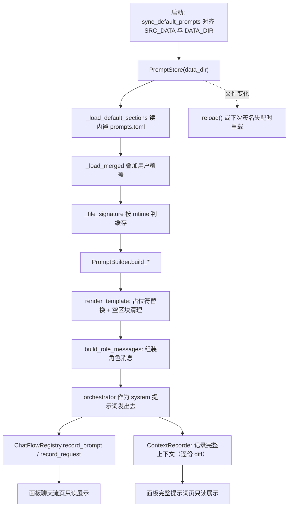
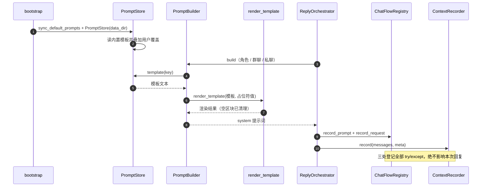
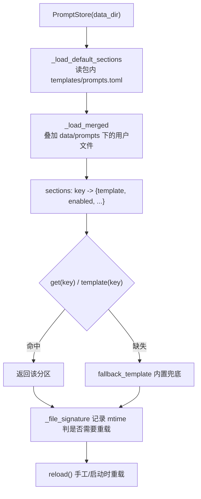
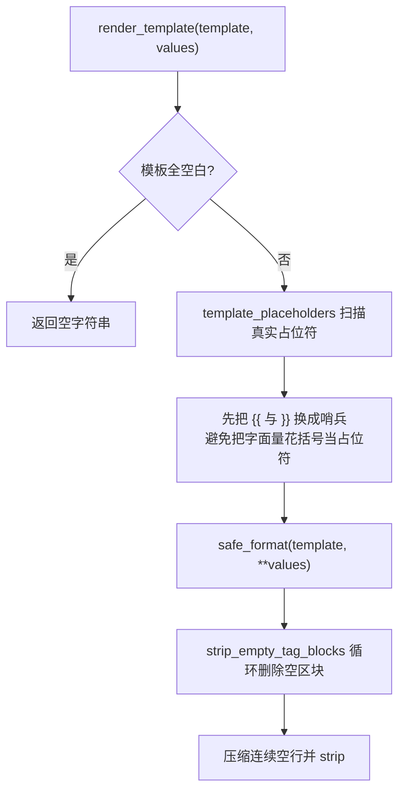
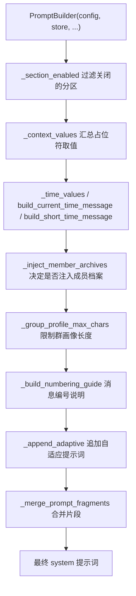
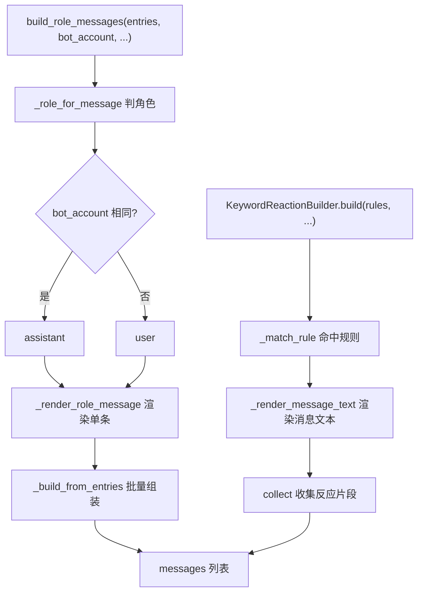
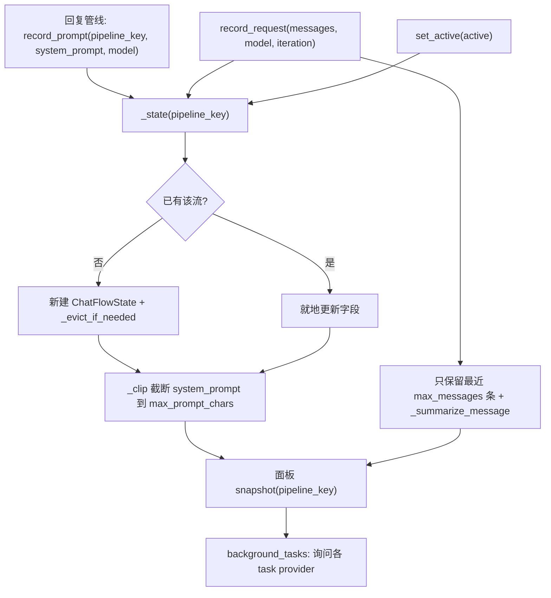
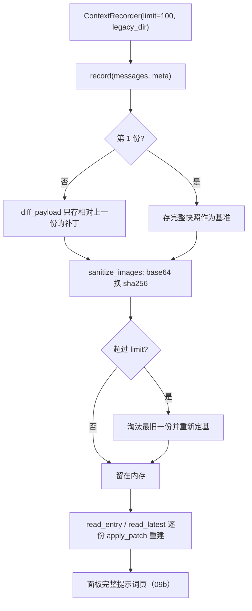
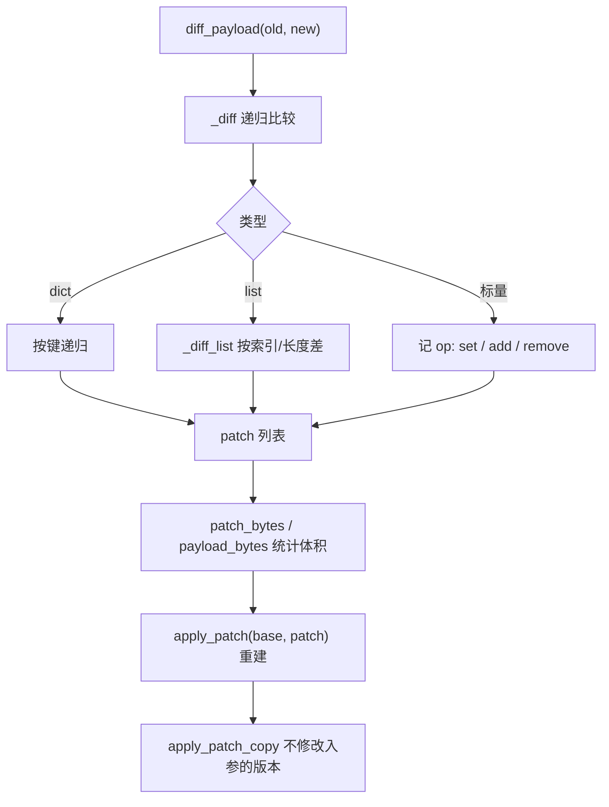

# 24 提示词系统与聊天流快照

## 范围

「系统提示词怎么拼出来」与「拼好的提示词怎么给人看」两件事：

* 提示词侧：`PromptStore` 的三层取值与默认提示词同步、`render_template` 的占位符/转义/空区块规则、
  `PromptBuilder` 的分区装配、`build_role_messages` 的角色消息构造、关键词反应注入；
* 观测侧：`ChatFlowRegistry`（面板「聊天流」数据源）与 `ContextRecorder`（完整提示词历史，纯内存 + 逐份 diff）。

不在这里：模型路由见 `05`、回复管线的调用时机见 `03`、面板接口见 `09b`、
计费与日志 sink 见 `23`（本图只引用 context_recorder 的内存语义）。

## 流程

## 时序

## 细节

### PromptStore 的三层取值与缓存签名

三层是「**包内默认 -> 用户覆盖 -> 内置兜底**」。`_file_signature`（`store.py:315`）决定要不要重读，
所以**改提示词文件后不必重启**，但要保证 mtime 真的变了（同秒内多次写可能漏更新）。
`enabled(key, default=True)`（`:425`）是分区的总开关：`enabled=false` 的分区在 `PromptBuilder` 侧
直接跳过（`builder.py:81 _section_enabled`）。

### 模板渲染：占位符、转义与空区块

三条容易踩的规则（`prompt/render.py`，全仓唯一实现，绕开它就会出现行为分叉）：

1. 占位符只认 `{name}` 形式，且名字必须是 `[A-Za-z_][A-Za-z0-9_]*`；
2. 想写**字面量**花括号必须写成 `{{` / `}}`，否则会被当占位符；
3. 只含空白的 XML 风格区块（如 `<群友信息>` 与 `</群友信息>` 之间只有换行）**会被删掉**，
   所以可选区块可以放心写在模板里，不需要在 Python 侧拼字符串。

### PromptBuilder：分区装配与自适应段

值得注意的两点：

* `_append_adaptive`（`builder.py:455`）是「自适应提示词」的唯一注入点，内容来自
  `_get_adaptive_prompt`（可选择走模型生成或读缓存）；
* `_group_profile_max_chars`（`:515`）与档案系统的 `max_chars=500` 是**两个不同的上限**：
  前者只为渲染长度服务（见 FINDINGS 07-2），改一个不会影响另一个。

### 角色消息构造与关键词反应

`role_messages.py:29 _user_message` / `:33 _role_for_message` / `:73 build_role_messages` 是**唯一**的角色转换实现；
`keyword_reaction.py` 负责「命中关键词时追加反应提示」，它的 `_normalize_depth`（`:149`）控制嵌套层数上限。
两者都在请求构造期同步执行，失败即当轮无这段（不重试）。

### ChatFlowRegistry：面板「聊天流」的数据源与有界策略

四个上限都在构造期夹紧（`flow_registry.py:71-74`）：`max_flows` / `max_messages` /
`max_message_chars`（下限 200）/ `max_prompt_chars`（下限 1000）。
**三处写入全部 try/except + debug 降级**（`:104/:127/:142`）—— 登记失败绝不影响回复。
`register_task_provider`（`:147`）是插件/子系统把「该流的后台任务」接进面板的入口（bootstrap 装配时注册）。

### ContextRecorder：纯内存 + 逐份 diff + 图片只留哈希

模块 docstring 写明三条性质，别再按「落盘实现」理解它：

1. **纯内存**：重启即清空，磁盘上没有 `ctx_*.json`；`legacy_dir` 只在「清空历史」时用来删旧文件；
2. **逐份 diff**：回复管线的 messages 逐轮追加，补丁极小，100 份常驻约 1–2 MB；
3. **图片脱敏**：`data:image/...;base64` 换成 sha256（与图库去重同口径），面板不搬 MB 级 base64。

`read_entry` / `read_latest` 返回的是**内部对象**，调用方只读；逐份重建时返回新对象可放心使用（docstring 约定）。
读写异常一律只记 debug（`prompt_diff` 的 apply_patch 失败同此）。

### 提示词 diff 的实现边界

这套 diff 是**为提示词场景定制**的：`_resolve`（`:229`）支持路径词元，
`json_safe`（`:248`）保证可序列化，`count_image_refs` 统计图片数（面板展示「本条含 N 张图」）。
它不是通用 JSON Patch（RFC 6902）实现，别拿外部工具生成的 patch 喂给它。

## 关键状态

| 状态 | 谁置位 | 谁清理 | 失败时停在哪 |
|---|---|---|---|
| PromptStore 缓存签名 | `_file_signature`（mtime/size） | 下次重载覆盖 | 同秒内二次写入可能不触发重载 |
| 分区开关 `enabled` | 提示词文件 | 文件改回 true | `enabled=false` 的分区在 builder 侧被跳过 |
| `ChatFlowState.active` | `set_active(True)` | `set_active(False)` 或淘汰 | 只影响面板展示，不影响回复 |
| 聊天流条数 | `_state` 新建时 | `_evict_if_needed` | 超限淘汰最旧流 |
| 提示词历史 | `ContextRecorder.record` | 超限淘汰最旧 + **重启清空** | 读写异常只记 debug |
| 后台任务 provider | `register_task_provider`（bootstrap） | 不清理（进程级） | provider 异常由取用方兜底 |

## 易错点

* **`render_template` 是全仓唯一实现**：任何自己写 `str.format` 的地方都会漏掉转义与空区块清理，
  表现是「模板里留着一个空标签」或「字面量花括号被吃掉」。
* **提示词历史不落盘**：面板看到的完整提示词重启即失；它和 `DebugRecorder` 的文件录制是**两条独立链路**
  （后者落盘、按保留期清理，见 `23-billing-stats.md`）。
* **聊天流登记三处都吞异常**：面板显示空白时先怀疑 `pipeline_key` 不一致或 `max_* ` 上限夹紧，
  而不是「回复管线坏了」。
* **两个 max_chars 不同源**：提示词渲染的群画像长度（`_group_profile_max_chars`）与档案系统
  `max_chars=500` 互不影响（FINDINGS 07-2），改配置前先确认改的是哪一个。
* **diff 不是标准 JSON Patch**：只服务提示词历史，`apply_patch` 只接受本仓库 `diff_payload` 的产物。
* **`sync_default_prompts` 只对齐内置模板**：用户覆盖文件不会被它改写，但把内置模板删了会同步回来。
